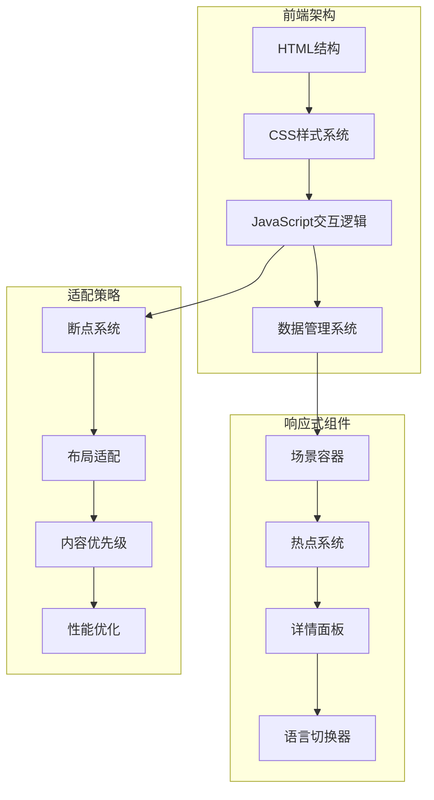
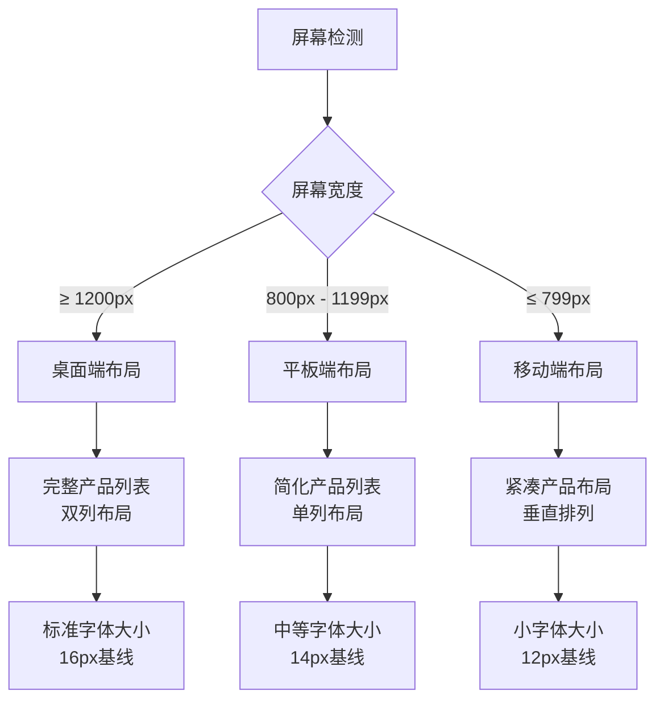
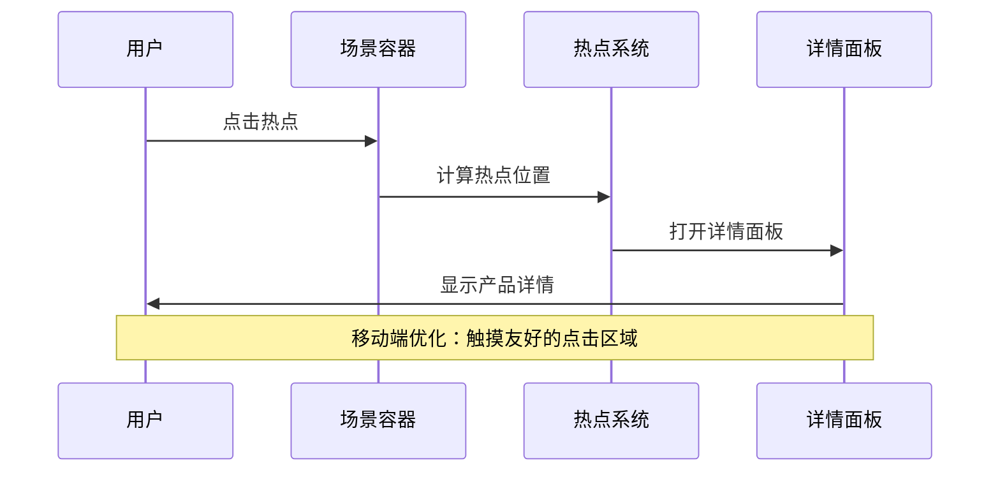
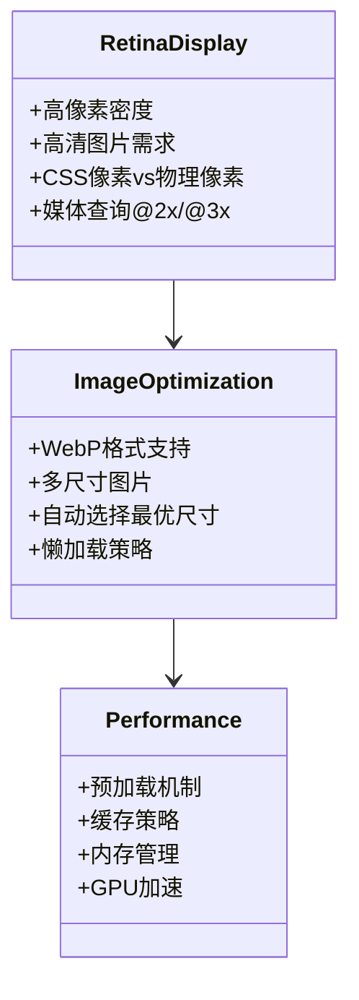
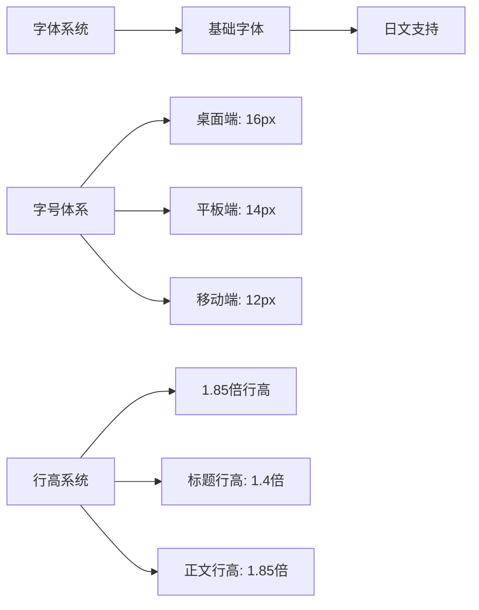
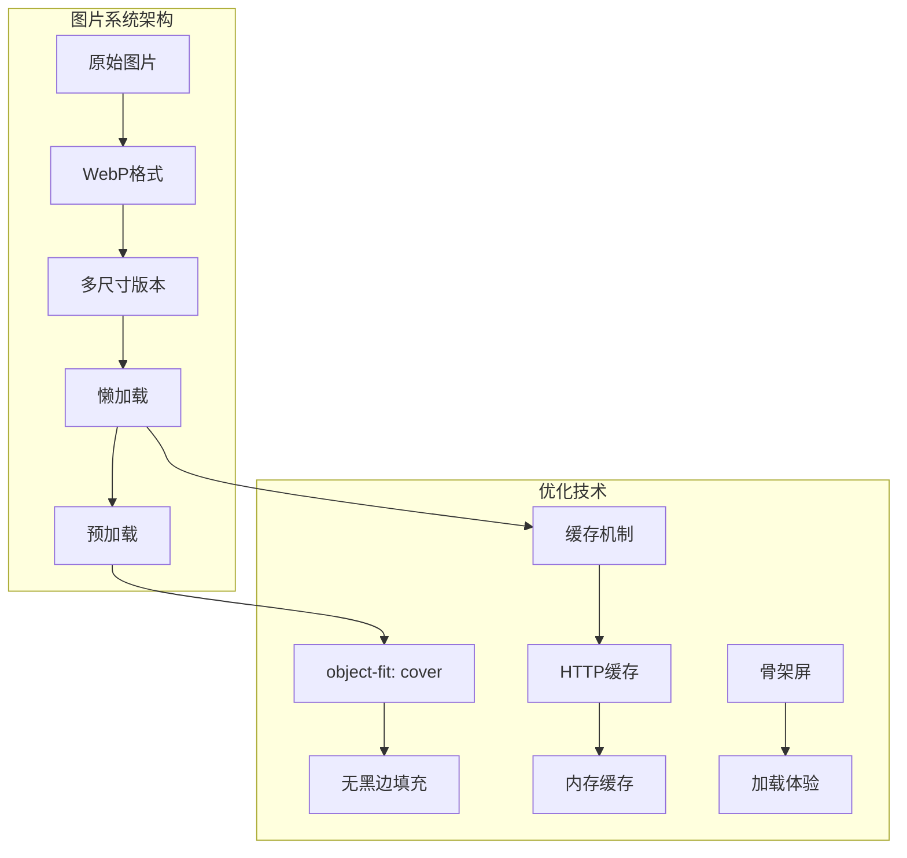
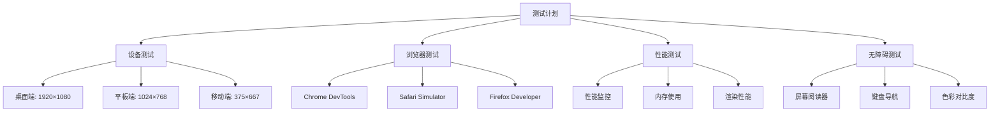

# 响应式设计系统

<cite>
**本文档引用的文件**
- [index.html](file://index.html)
- [css/style.css](file://css/style.css)
- [js/main.js](file://js/main.js)
- [manage.html](file://manage.html)
- [css/manage.css](file://css/manage.css)
- [js/manage.js](file://js/manage.js)
- [project_architecture.md](file://project_architecture.md)
- [mapping.json](file://mapping.json)
</cite>

## 目录
1. [项目概述](#项目概述)
2. [响应式架构设计](#响应式架构设计)
3. [断点设置与布局适配](#断点设置与布局适配)
4. [移动端适配方案](#移动端适配方案)
5. [高分辨率屏幕适配](#高分辨率屏幕适配)
6. [响应式字体系统](#响应式字体系统)
7. [响应式图片系统](#响应式图片系统)
8. [触摸友好交互设计](#触摸友好交互设计)
9. [测试方法与工具](#测试方法与工具)
10. [最佳实践建议](#最佳实践建议)

## 项目概述

数字标牌项目是一个面向广告商和装修公司的产品展示平台，通过场景化展示数字标牌产品在实际环境中的应用效果。项目采用纯原生JavaScript实现，无任何第三方框架依赖，支持中日文双语切换。

### 核心特性
- **数据驱动**：使用mapping.json集中管理场景、产品和多语言配置
- **响应式设计**：针对不同屏幕尺寸优化布局和交互
- **高性能**：图片预加载、骨架屏、错误处理等优化策略
- **可维护性**：模块化架构，清晰的代码组织

## 响应式架构设计

### 整体架构模式



**图表来源**
- [index.html:14-77](file://index.html#L14-L77)
- [css/style.css:25-30](file://css/style.css#L25-L30)

### 设计原则

1. **内容优先级**：热点信息 > 场景图片 > 产品详情
2. **渐进增强**：基础功能在所有设备上可用
3. **性能优先**：图片预加载和骨架屏优化
4. **无障碍访问**：完整的ARIA标签和键盘导航

**章节来源**
- [project_architecture.md:14-21](file://project_architecture.md#L14-L21)
- [css/style.css:13-22](file://css/style.css#L13-L22)

## 断点设置与布局适配

### 断点策略

项目采用基于内容的断点策略，而非固定的像素断点：



**图表来源**
- [css/style.css:480-498](file://css/style.css#L480-L498)
- [css/manage.css:93-97](file://css/manage.css#L93-L97)

### 布局适配机制

#### 场景容器适配
- **桌面端**：100vw × 100vh 全屏显示
- **平板端**：保持16:9比例，适应屏幕高度
- **移动端**：根据设备方向动态调整

#### 产品详情面板
- **桌面端**：980px宽度，85vh最大高度
- **平板端**：90vw宽度，70vh高度
- **移动端**：100vw宽度，90vh高度

**章节来源**
- [css/style.css:479-498](file://css/style.css#L479-L498)
- [css/manage.css:479-487](file://css/manage.css#L479-L487)

## 移动端适配方案

### 触摸交互优化



**图表来源**
- [js/main.js:750-755](file://js/main.js#L750-L755)
- [css/style.css:300-310](file://css/style.css#L300-L310)

### 移动端特定优化

#### 触摸目标尺寸
- **导航按钮**：52px × 72px，满足触控舒适度
- **热点标记**：60px × 60px，确保精确点击
- **指示器点**：9px × 9px，间距10px

#### 交互反馈
- **点击状态**：按钮按下时10%缩小，提供触觉反馈
- **悬停效果**：轻微放大和发光效果
- **过渡动画**：0.3秒缓动曲线，流畅自然

**章节来源**
- [css/style.css:194-237](file://css/style.css#L194-L237)
- [css/style.css:300-384](file://css/style.css#L300-L384)

## 高分辨率屏幕适配

### 视网膜显示优化



**图表来源**
- [js/main.js:257-327](file://js/main.js#L257-L327)
- [css/style.css:112-115](file://css/style.css#L112-L115)

### 高分辨率适配策略

#### 图片处理
- **object-fit: cover**：确保图片填充容器无黑边
- **预加载机制**：首屏完成后加载其他图片
- **缓存策略**：浏览器HTTP缓存 + 内存缓存

#### 性能优化
- **GPU加速**：使用transform和opacity属性
- **减少重绘**：批量DOM操作，requestAnimationFrame
- **内存管理**：及时清理事件监听器和DOM引用

**章节来源**
- [js/main.js:334-406](file://js/main.js#L334-L406)
- [css/style.css:93-96](file://css/style.css#L93-L96)

## 响应式字体系统

### 字体设计原则



**图表来源**
- [css/style.css:17-22](file://css/style.css#L17-L22)
- [css/style.css:706-711](file://css/style.css#L706-L711)

### 字体适配策略

#### 字体族选择
- **日文支持**：Hiragino Kaku Gothic ProN, Yu Gothic
- **西文支持**：Meiryo, Helvetica Neue, Arial
- **fallback机制**：sans-serif作为最终备选

#### 字号层级
- **标题**：18px，1.4倍行高
- **产品名称**：17px，700粗细
- **正文**：13px，1.85倍行高
- **说明文字**：12.5px，1.75倍行高

#### 无障碍考虑
- **对比度**：白色文字在深色背景上≥4.5:1
- **可读性**：最小12px字体，确保小屏幕可读
- **缩放支持**：支持浏览器字体大小调整

**章节来源**
- [css/style.css:678-698](file://css/style.css#L678-L698)
- [css/style.css:705-788](file://css/style.css#L705-L788)

## 响应式图片系统

### 图片优化策略



**图表来源**
- [js/main.js:257-327](file://js/main.js#L257-L327)
- [css/style.css:112-115](file://css/style.css#L112-L115)

### 图片适配机制

#### 场景图片
- **object-fit: cover**：确保100%容器覆盖
- **裁剪偏移**：计算实际绘制区域，保证热点精度
- **双层切换**：A/B层交叉淡入淡出，无黑屏

#### 产品图片
- **contain模式**：保持图片完整显示
- **圆角处理**：14px圆角，提升视觉质感
- **阴影效果**：内外阴影组合，增强层次感

#### 性能优化
- **预加载队列**：首屏完成后加载其他图片
- **缓存策略**：已预加载图片直接显示
- **错误处理**：图片加载失败时显示占位符

**章节来源**
- [js/main.js:480-595](file://js/main.js#L480-L595)
- [css/style.css:663-669](file://css/style.css#L663-L669)

## 触摸友好交互设计

### 交互元素优化

```mermaid
stateDiagram-v2
[*] --> Idle
Idle --> Hover : 鼠标悬停/手指接近
Hover --> Active : 点击/触摸
Active --> Hover : 按住状态
Hover --> Click : 点击释放
Click --> Disabled : 禁用状态
Disabled --> Idle : 启用状态
note right of Hover
10%放大
发光效果
0.3秒过渡
end note
note right of Active
5%缩小
按下反馈
0.2秒过渡
end note
```

**图表来源**
- [css/style.css:214-225](file://css/style.css#L214-L225)
- [css/style.css:376-384](file://css/style.css#L376-L384)

### 触摸交互特性

#### 点击区域优化
- **最小点击面积**：44px × 44px，符合WCAG 2.1标准
- **热点区域**：60px × 60px，确保精确点击
- **间距设计**：热点间至少10px间距

#### 触觉反馈
- **视觉反馈**：颜色变化、尺寸微调、阴影变化
- **动画过渡**：0.2-0.3秒缓动曲线，提供流畅体验
- **状态指示**：禁用、激活、选中等状态明确区分

#### 无障碍支持
- **键盘导航**：Tab键顺序，Enter键激活
- **屏幕阅读器**：完整的ARIA标签和描述
- **高对比度**：支持系统高对比度模式

**章节来源**
- [css/style.css:299-384](file://css/style.css#L299-L384)
- [index.html:40-67](file://index.html#L40-L67)

## 测试方法与工具

### 响应式测试策略



**图表来源**
- [project_architecture.md:23-25](file://project_architecture.md#L23-L25)
- [js/main.js:49-73](file://js/main.js#L49-L73)

### 推荐测试工具

#### 开发工具
- **Chrome DevTools**：响应式设计模式，网络面板，性能分析
- **Firefox Developer**：开发者工具，响应式设计工具
- **Safari Technology Preview**：最新Web标准支持

#### 在线测试
- **BrowserStack**：跨浏览器兼容性测试
- **CrossBrowserTesting**：实时浏览器测试
- **LambdaTest**：移动设备测试

#### 性能监控
- **Lighthouse**：性能、可访问性、SEO评分
- **WebPageTest**：页面加载性能分析
- **GTmetrix**：网站性能优化建议

**章节来源**
- [project_architecture.md:763-803](file://project_architecture.md#L763-L803)
- [js/main.js:421-442](file://js/main.js#L421-L442)

## 最佳实践建议

### 性能优化建议

1. **图片优化**
   - 使用WebP格式，压缩率更高
   - 实施懒加载，减少初始加载时间
   - 预加载关键资源，提升用户体验

2. **代码优化**
   - 使用requestAnimationFrame进行动画
   - 避免强制同步布局
   - 合理使用CSS变换和透明度

3. **内存管理**
   - 及时清理事件监听器
   - 合理使用闭包，避免内存泄漏
   - 及时销毁不需要的DOM元素

### 可访问性建议

1. **视觉设计**
   - 确保足够的色彩对比度
   - 提供多种高对比度模式
   - 支持用户自定义字体大小

2. **交互设计**
   - 支持键盘导航
   - 提供清晰的焦点指示
   - 确保所有功能可通过键盘操作

3. **内容组织**
   - 使用语义化HTML标签
   - 提供适当的ARIA属性
   - 确保内容结构清晰

### 维护性建议

1. **代码结构**
   - 模块化设计，职责单一
   - 清晰的命名约定
   - 完善的注释和文档

2. **测试策略**
   - 单元测试覆盖核心逻辑
   - 端到端测试关键流程
   - 定期性能回归测试

3. **部署策略**
   - 版本控制和分支管理
   - 自动化构建和部署
   - 监控和日志记录

**章节来源**
- [project_architecture.md:446-501](file://project_architecture.md#L446-L501)
- [css/style.css:832-863](file://css/style.css#L832-L863)