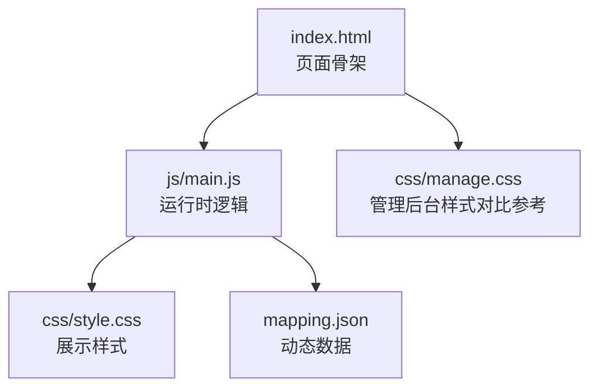
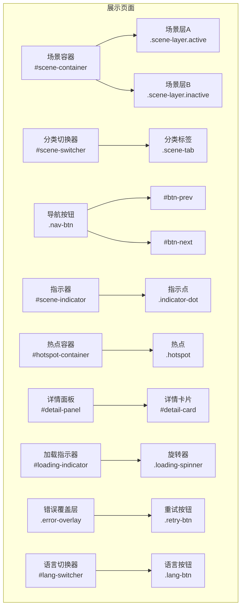
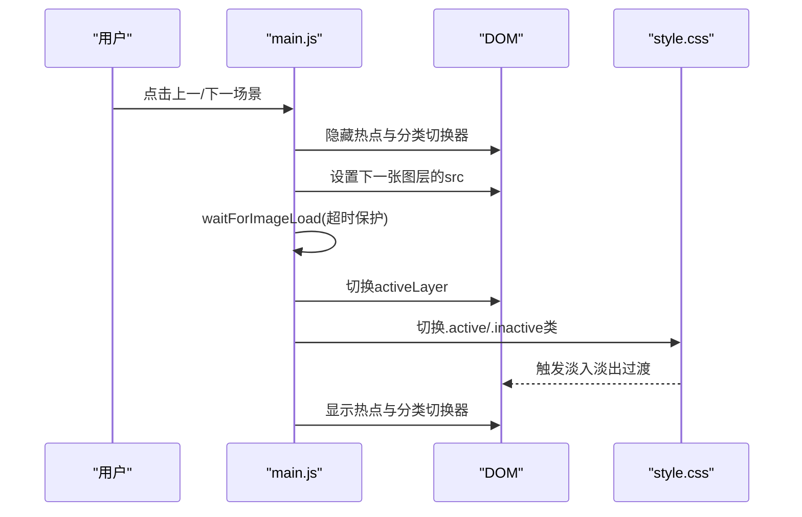
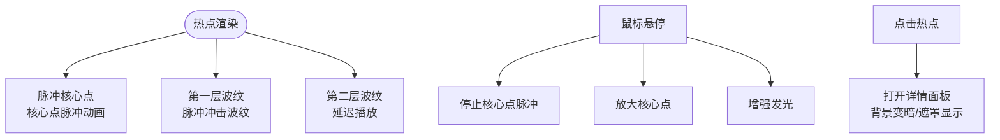
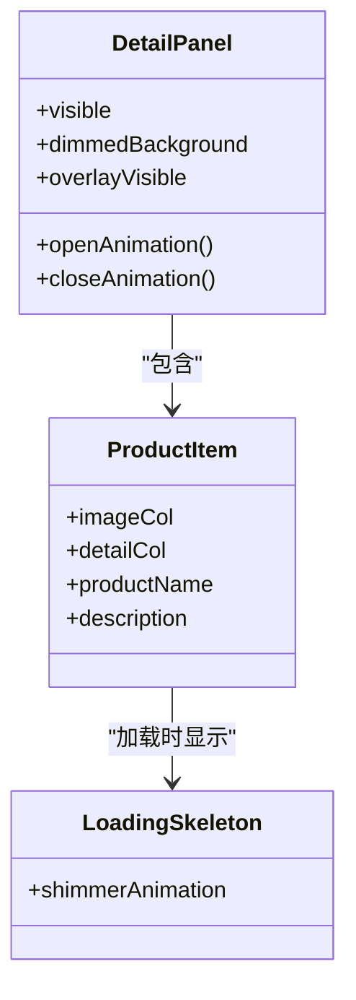
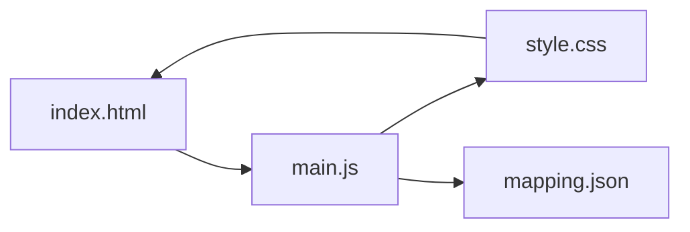

# 展示页面样式

<cite>
**本文引用的文件**
- [style.css](file://css/style.css)
- [index.html](file://index.html)
- [main.js](file://js/main.js)
- [mapping.json](file://mapping.json)
- [manage.css](file://css/manage.css)
</cite>

## 目录
1. [简介](#简介)
2. [项目结构](#项目结构)
3. [核心组件](#核心组件)
4. [架构总览](#架构总览)
5. [详细组件分析](#详细组件分析)
6. [依赖关系分析](#依赖关系分析)
7. [性能考量](#性能考量)
8. [故障排查指南](#故障排查指南)
9. [结论](#结论)
10. [附录](#附录)

## 简介
本文件面向数字标牌产品展示页面的样式系统，聚焦于整体架构与设计原则，包括毛玻璃效果、渐变背景与现代UI元素；场景切换动画（交叉淡入淡出）的实现原理与关键帧；热点交互系统的视觉设计（脉冲、波纹、hover状态）；响应式布局策略；CSS类命名规范与模块化组织；颜色系统与主题变量使用；以及样式调试与性能优化建议。目标是帮助开发者理解并高效扩展展示页面的视觉效果。

## 项目结构
- 样式文件：css/style.css（展示页面样式）、css/manage.css（管理后台样式）
- 页面入口：index.html（展示页面）
- 业务逻辑：js/main.js（数据加载、多语言、场景切换、热点渲染、面板动画等）
- 数据源：mapping.json（场景、热点、多语言文案）

图表来源
- [index.html:1-83](file://index.html#L1-L83)
- [main.js:1180-1284](file://js/main.js#L1180-L1284)
- [style.css:1-50](file://css/style.css#L1-L50)
- [mapping.json:1-232](file://mapping.json#L1-L232)

章节来源
- [index.html:1-83](file://index.html#L1-L83)
- [style.css:1-50](file://css/style.css#L1-L50)
- [main.js:1180-1284](file://js/main.js#L1180-L1284)
- [mapping.json:1-232](file://mapping.json#L1-L232)

## 核心组件
- 场景图像层：双层场景图层（A/B）实现交叉淡入淡出，配合过渡时隐藏热点与分类切换器，避免黑屏与错位。
- 场景分类切换器：顶部居中标签，采用毛玻璃与渐变背景，hover与active状态具备弹性与发光效果。
- 导航按钮：左右箭头按钮，毛玻璃与发光hover效果，按下缩放反馈。
- 场景指示器：底部圆点指示器，hover放大与发光，active高亮。
- 热点系统：脉冲核心点、两层波纹环、hover放大与发光，点击展开产品详情面板。
- 产品详情面板：半透明毛玻璃卡片，上部装饰条带渐变与闪烁动画，内部左图右文布局，滚动区域自定义滚动条。
- 加载与错误状态：图片加载旋转器、Markdown占位骨架、全屏错误覆盖层与重试按钮。
- 语言切换器：右上角毛玻璃按钮组，激活态主题蓝渐变强调。

章节来源
- [style.css:86-128](file://css/style.css#L86-L128)
- [style.css:133-188](file://css/style.css#L133-L188)
- [style.css:193-238](file://css/style.css#L193-L238)
- [style.css:243-282](file://css/style.css#L243-L282)
- [style.css:287-434](file://css/style.css#L287-L434)
- [style.css:458-525](file://css/style.css#L458-L525)
- [style.css:584-676](file://css/style.css#L584-L676)
- [style.css:791-864](file://css/style.css#L791-L864)
- [style.css:866-951](file://css/style.css#L866-L951)
- [style.css:35-81](file://css/style.css#L35-L81)

## 架构总览
展示页面样式系统围绕“双层场景图层 + 热点系统 + 详情面板”的交互闭环构建，配合毛玻璃、渐变与关键帧动画，形成统一的现代UI风格。JavaScript负责数据驱动与DOM操作，CSS负责视觉表现与动画控制。

图表来源
- [index.html:14-77](file://index.html#L14-L77)
- [style.css:86-128](file://css/style.css#L86-L128)
- [style.css:133-188](file://css/style.css#L133-L188)
- [style.css:193-238](file://css/style.css#L193-L238)
- [style.css:243-282](file://css/style.css#L243-L282)
- [style.css:287-434](file://css/style.css#L287-L434)
- [style.css:458-525](file://css/style.css#L458-L525)
- [style.css:791-864](file://css/style.css#L791-L864)
- [style.css:866-951](file://css/style.css#L866-L951)
- [style.css:35-81](file://css/style.css#L35-L81)

## 详细组件分析

### 场景切换动画系统（交叉淡入淡出）
- 实现原理
  - 使用两个场景图层（A/B）交替显示，通过CSS类切换实现active/inactive状态，配合过渡属性实现淡入淡出。
  - 切换前隐藏热点容器与分类切换器，避免过渡期间的视觉错位。
  - 使用图片加载等待与缓存策略，确保切换流畅且无黑屏。
- 关键点
  - 切换前先移除旧src再设置新src，重置complete属性，保证waitForImageLoad可靠等待。
  - activeLayer在CSS过渡前更新，确保热点重定位引用正确图层。
  - 超时保护与“实际上已加载”兜底，避免失败时渲染热点导致错位。
- 动画曲线
  - 场景容器与图层使用相同的贝塞尔曲线，保证视觉节奏一致。

图表来源
- [main.js:480-595](file://js/main.js#L480-L595)
- [style.css:86-128](file://css/style.css#L86-L128)

章节来源
- [main.js:480-595](file://js/main.js#L480-L595)
- [style.css:86-128](file://css/style.css#L86-L128)

### 热点交互系统（脉冲、波纹、hover）
- 视觉组成
  - 热点容器：绝对定位，z-index高于场景层，初始透明度0，出现时渐显。
  - 热点核心点：径向渐变中心点，配合脉冲关键帧实现呼吸感。
  - 波纹环：两层同心环，延迟播放，营造冲击扩散效果。
  - hover状态：停止脉冲，放大并增强发光，突出交互意图。
- 动画策略
  - 多热点出现时使用nth-child分散动画延迟，避免同步闪烁。
  - 波纹第二层延迟播放，形成优雅的重叠效果。
  - hover时禁用核心点脉冲，改为静态放大与发光，提升可读性。
- 交互流程
  - 点击热点：打开详情面板，背景变暗，遮罩显示，隐藏导航与指示器，面板居中弹出。

图表来源
- [style.css:287-434](file://css/style.css#L287-L434)
- [main.js:856-870](file://js/main.js#L856-L870)

章节来源
- [style.css:287-434](file://css/style.css#L287-L434)
- [main.js:856-870](file://js/main.js#L856-L870)

### 详情面板与产品列表（左图右文）
- 面板设计
  - 半透明毛玻璃卡片，多层阴影与边框，上部装饰条带使用渐变与闪烁动画。
  - 面板可见时采用弹性缩放进入，增强空间感。
- 列表布局
  - 左侧产品图列，右侧详情列，偶数项背景微弱差异，最后一项无下边框。
  - Markdown渲染区域支持列表、表格、强字等样式，表格hover高亮。
- 滚动与占位
  - 自定义滚动条，滚动thumb随hover变化。
  - Markdown加载时使用骨架占位，加载完成后替换为真实内容。

图表来源
- [style.css:458-525](file://css/style.css#L458-L525)
- [style.css:584-676](file://css/style.css#L584-L676)
- [style.css:791-864](file://css/style.css#L791-L864)

章节来源
- [style.css:458-525](file://css/style.css#L458-L525)
- [style.css:584-676](file://css/style.css#L584-L676)
- [style.css:791-864](file://css/style.css#L791-L864)

### 语言切换器与全局样式
- 语言切换器
  - 右上固定，毛玻璃背景，按钮hover与active态具备过渡与发光。
  - 激活态使用主题蓝渐变，强调当前语言。
- 全局样式
  - reset与基础字体、背景、滚动条等统一基线。
  - 无选择与禁止拖拽，提升交互一致性。

章节来源
- [style.css:35-81](file://css/style.css#L35-L81)
- [style.css:35-81](file://css/style.css#L35-L81)

### 错误状态与加载状态
- 错误覆盖层
  - 全屏毛玻璃背景，带动画警示图标与重试按钮，主题蓝强调。
- 加载状态
  - 图片加载旋转器与Markdown骨架占位，shimmer动画提升感知速度。
- 重试机制
  - Markdown加载失败时提供可点击重试，清除缓存后重新加载。

章节来源
- [style.css:866-951](file://css/style.css#L866-L951)
- [style.css:791-864](file://css/style.css#L791-L864)
- [main.js:421-461](file://js/main.js#L421-L461)

## 依赖关系分析
- HTML与样式
  - index.html声明场景容器、热点容器、导航按钮、指示器、详情面板、遮罩与加载指示器，均与style.css中的类名一一对应。
- JavaScript与样式
  - main.js通过类名切换（active/inactive/visible/hidden）与样式联动，实现动画与状态切换。
  - 热点位置计算与CSS定位结合，确保热点与场景图层匹配。
- 数据与样式
  - mapping.json提供场景、热点与多语言文案，样式通过类名承载视觉语义（如.active、.inactive、.visible）。

图表来源
- [index.html:14-77](file://index.html#L14-L77)
- [main.js:1180-1284](file://js/main.js#L1180-L1284)
- [style.css:1-50](file://css/style.css#L1-L50)
- [mapping.json:1-232](file://mapping.json#L1-L232)

章节来源
- [index.html:14-77](file://index.html#L14-L77)
- [main.js:1180-1284](file://js/main.js#L1180-L1284)
- [style.css:1-50](file://css/style.css#L1-L50)
- [mapping.json:1-232](file://mapping.json#L1-L232)

## 性能考量
- 图片加载与缓存
  - 预加载策略：首屏独占带宽，首图完全显示后再启动后台预加载，避免带宽争用导致首图超时。
  - 缓存命中：已预加载图片不显示加载指示器，减少不必要的DOM更新。
  - 加载等待：waitForImageLoad使用事件监听与超时保护，避免内存泄漏与无限等待。
- 动画与过渡
  - 使用transform与opacity过渡，尽量避免触发布局与重绘。
  - 关键帧动画（pulse、shimmer、spin）采用硬件加速友好的属性。
- 事件与重排
  - 窗口resize使用防抖（200ms），减少频繁重定位热点带来的性能损耗。
- 毛玻璃与滤镜
  - backdrop-filter在部分设备上可能影响性能，建议在低端设备上适当降低模糊强度或减少层级。

章节来源
- [main.js:257-327](file://js/main.js#L257-L327)
- [main.js:354-395](file://js/main.js#L354-L395)
- [main.js:1139-1148](file://js/main.js#L1139-L1148)
- [style.css:35-81](file://css/style.css#L35-L81)

## 故障排查指南
- 场景切换黑屏或闪烁
  - 检查是否先移除了旧src再设置新src，确保complete属性被重置。
  - 确认activeLayer在CSS过渡前已更新，热点重定位引用正确图层。
  - 检查图片加载超时与“实际上已加载”的兜底逻辑。
- 热点位置错位
  - 确认场景图片已完全加载（naturalWidth > 0），否则跳过计算或使用屏幕中央临时位置。
  - 窗口resize后调用重定位函数，确保热点跟随场景图层变化。
- 详情面板无法关闭或遮罩不消失
  - 检查面板可见状态与遮罩类名切换顺序，确保背景恢复与元素隐藏的时序正确。
- 加载指示器不消失
  - 确认加载完成后移除visible类，或在超时后根据actuallyLoaded状态处理。
- Markdown加载失败
  - 点击重试后清除缓存并重新加载，必要时检查网络与文件路径。

章节来源
- [main.js:509-520](file://js/main.js#L509-L520)
- [main.js:529-555](file://js/main.js#L529-L555)
- [main.js:774-817](file://js/main.js#L774-L817)
- [main.js:826-847](file://js/main.js#L826-L847)
- [main.js:992-1025](file://js/main.js#L992-L1025)
- [main.js:820-847](file://js/main.js#L820-L847)
- [main.js:421-461](file://js/main.js#L421-L461)

## 结论
该样式系统以“双层场景图层 + 热点系统 + 详情面板”为核心，结合毛玻璃、渐变与关键帧动画，构建了统一且现代的视觉语言。通过严格的图片加载与缓存策略、动画时序控制与事件防抖，实现了在复杂场景下的流畅体验。建议在后续扩展中遵循本文的命名规范与模块化组织原则，持续优化性能与可维护性。

## 附录

### CSS类命名规范与模块化组织
- 命名规范
  - 容器类：使用语义化ID（如#scene-container、#hotspot-container），子元素使用类名（如.scene-layer、.hotspot）。
  - 状态类：使用状态前缀（如.active、.inactive、.visible、.hidden）表达状态。
  - 组件类：使用功能前缀（如.nav-btn、.scene-tab、.indicator-dot）。
- 模块化组织
  - 将相关样式按功能域分段注释（如场景图像层、场景分类切换、导航按钮、指示器、热点、详情面板、加载与错误状态），便于维护与查找。
  - 保持单一职责：每个类只负责单一视觉或交互行为，避免过度耦合。

章节来源
- [style.css:86-128](file://css/style.css#L86-L128)
- [style.css:133-188](file://css/style.css#L133-L188)
- [style.css:193-238](file://css/style.css#L193-L238)
- [style.css:243-282](file://css/style.css#L243-L282)
- [style.css:287-434](file://css/style.css#L287-L434)
- [style.css:458-525](file://css/style.css#L458-L525)
- [style.css:791-864](file://css/style.css#L791-L864)
- [style.css:866-951](file://css/style.css#L866-L951)

### 颜色系统与主题变量使用指南
- 主题色
  - 主题蓝：用于激活态按钮、渐变强调、发光效果（如.active、.lang-btn.active、.hotspot-core hover）。
- 辅助色
  - 毛玻璃背景：rgba(0,0,0,0.x) + backdrop-filter blur，用于语言切换器、导航按钮、指示器、详情卡片。
- 状态色
  - 成功/错误：用于Toast与错误覆盖层的强调色；加载失败文本使用强调色并可点击重试。
- 使用建议
  - 优先使用渐变与半透明组合，增强层次感与现代感。
  - hover与active态保持一致的色彩体系，确保交互一致性。

章节来源
- [style.css:35-81](file://css/style.css#L35-L81)
- [style.css:75-80](file://css/style.css#L75-L80)
- [style.css:182-187](file://css/style.css#L182-L187)
- [style.css:215-221](file://css/style.css#L215-L221)
- [style.css:277-281](file://css/style.css#L277-L281)
- [style.css:376-384](file://css/style.css#L376-L384)
- [style.css:910-934](file://css/style.css#L910-L934)
- [style.css:937-951](file://css/style.css#L937-L951)

### 响应式布局策略
- 容器与定位
  - 场景容器与图层使用绝对定位与100%宽高，适配任意屏幕尺寸。
  - 热点容器与按钮使用绝对定位与translate居中，避免相对布局导致的溢出。
- 文本与排版
  - 使用相对单位与line-height，确保在不同字号下保持视觉平衡。
- 滚动与自适应
  - 详情面板内的滚动区域使用flex与max-height，避免内容溢出。
  - 自定义滚动条在Webkit内核下提供一致的视觉反馈。

章节来源
- [style.css:24-30](file://css/style.css#L24-L30)
- [style.css:287-434](file://css/style.css#L287-L434)
- [style.css:584-676](file://css/style.css#L584-L676)
- [style.css:597-613](file://css/style.css#L597-L613)

### 样式调试技巧与最佳实践
- 调试技巧
  - 使用浏览器开发者工具检查类名切换与z-index层级，确认热点与场景图层对齐。
  - 通过临时添加边框或背景色，快速定位布局问题。
  - 使用性能面板观察动画与重绘，识别潜在瓶颈。
- 最佳实践
  - 优先使用transform与opacity做动画，减少布局抖动。
  - 将高频动画的关键帧属性限定在较小范围内，避免大面积重绘。
  - 在低端设备上适度简化毛玻璃与阴影，确保流畅度。

章节来源
- [style.css:35-81](file://css/style.css#L35-L81)
- [style.css:86-128](file://css/style.css#L86-L128)
- [style.css:287-434](file://css/style.css#L287-L434)