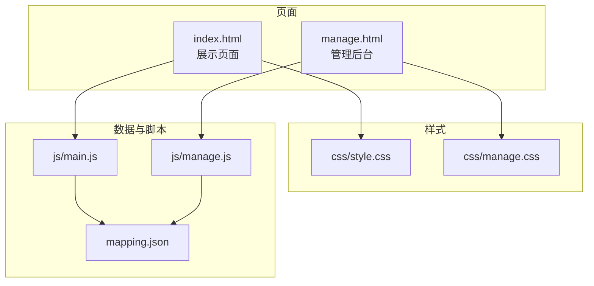
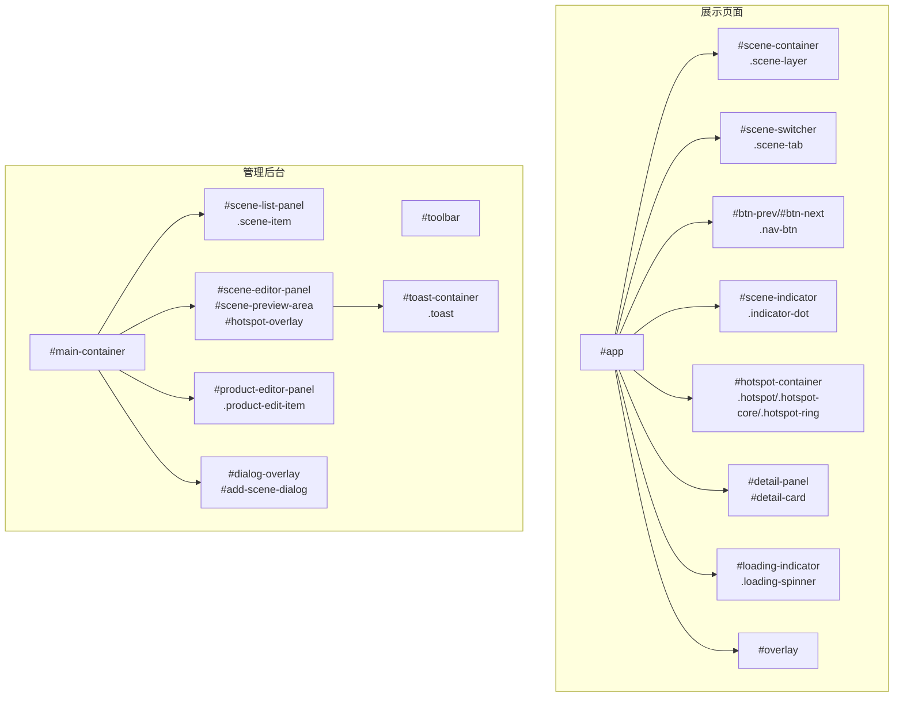
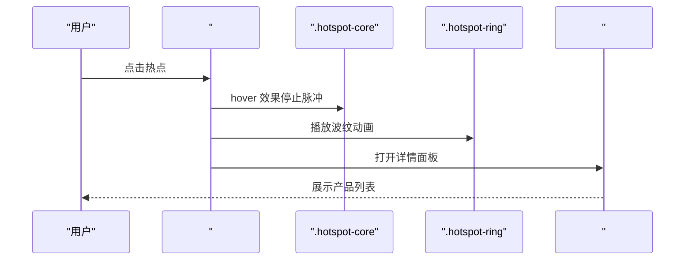
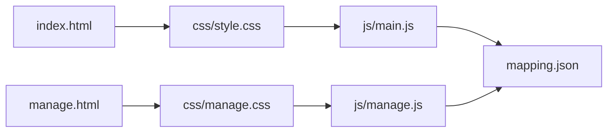

# 样式系统

<cite>
**本文档引用的文件**
- [style.css](file://css/style.css)
- [manage.css](file://css/manage.css)
- [index.html](file://index.html)
- [manage.html](file://manage.html)
- [mapping.json](file://mapping.json)
- [main.js](file://js/main.js)
- [manage.js](file://js/manage.js)
</cite>

## 目录
1. [简介](#简介)
2. [项目结构](#项目结构)
3. [核心组件](#核心组件)
4. [架构总览](#架构总览)
5. [详细组件分析](#详细组件分析)
6. [依赖关系分析](#依赖关系分析)
7. [性能考量](#性能考量)
8. [故障排查指南](#故障排查指南)
9. [结论](#结论)
10. [附录](#附录)

## 简介
本样式系统服务于数字标牌产品展示与管理后台两大页面，采用模块化、可复用的CSS架构，结合JavaScript运行时控制，实现响应式布局、流畅动画与良好的交互体验。系统强调：
- 展示页面（style.css）：沉浸式场景浏览、脉冲热点、交叉淡入淡出、骨架屏加载与错误状态提示。
- 管理后台（manage.css）：三栏布局、热点编辑、产品关联、Toast提示与对话框。

## 项目结构
- 样式文件
  - 展示页面样式：css/style.css
  - 管理后台样式：css/manage.css
- 页面入口
  - 展示页面：index.html
  - 管理页面：manage.html
- 数据与脚本
  - 数据源：mapping.json
  - 展示逻辑：js/main.js
  - 管理逻辑：js/manage.js

图表来源
- [index.html:1-83](file://index.html#L1-L83)
- [manage.html:1-113](file://manage.html#L1-L113)
- [style.css:1-20](file://css/style.css#L1-L20)
- [manage.css:1-25](file://css/manage.css#L1-L25)
- [main.js:1-50](file://js/main.js#L1-L50)
- [manage.js:1-35](file://js/manage.js#L1-L35)
- [mapping.json:1-30](file://mapping.json#L1-L30)

章节来源
- [index.html:1-83](file://index.html#L1-L83)
- [manage.html:1-113](file://manage.html#L1-L113)
- [style.css:1-20](file://css/style.css#L1-L20)
- [manage.css:1-25](file://css/manage.css#L1-L25)

## 核心组件
- 展示页面（style.css）
  - 全局重置与基础样式、毛玻璃与渐变背景、主题色系（主蓝）。
  - 场景图像层（双层交叉淡入淡出）、场景分类切换器、左右导航按钮、底部指示器。
  - 脉冲热点系统（核心点、波纹、hover效果、多热点延迟动画）。
  - 产品详情面板（卡片、返回按钮、滚动列表、Markdown渲染）。
  - 骨干屏加载（Skeleton UI）、加载指示器、错误状态与重试。
  - 提示文本与场景过渡控制。
- 管理后台（manage.css）
  - 顶部工具栏（标题、保存状态、保存按钮）。
  - 三栏布局：左栏场景列表、中栏场景编辑区（预览、热点叠加层、工具栏）、右栏产品关联编辑器。
  - 热点编辑（拖拽、选中高亮、删除）、产品字段编辑（名称、图片、描述文件）。
  - Toast提示、添加场景对话框、滚动条自定义。

章节来源
- [style.css:6-22](file://css/style.css#L6-L22)
- [style.css:86-127](file://css/style.css#L86-L127)
- [style.css:133-187](file://css/style.css#L133-L187)
- [style.css:193-237](file://css/style.css#L193-L237)
- [style.css:243-281](file://css/style.css#L243-L281)
- [style.css:287-433](file://css/style.css#L287-L433)
- [style.css:458-524](file://css/style.css#L458-L524)
- [style.css:585-788](file://css/style.css#L585-L788)
- [style.css:790-951](file://css/style.css#L790-L951)
- [style.css:952-997](file://css/style.css#L952-L997)
- [manage.css:6-21](file://css/manage.css#L6-L21)
- [manage.css:28-89](file://css/manage.css#L28-L89)
- [manage.css:90-118](file://css/manage.css#L90-L118)
- [manage.css:121-246](file://css/manage.css#L121-L246)
- [manage.css:248-475](file://css/manage.css#L248-L475)
- [manage.css:476-644](file://css/manage.css#L476-L644)
- [manage.css:646-706](file://css/manage.css#L646-L706)
- [manage.css:707-824](file://css/manage.css#L707-L824)

## 架构总览
样式系统遵循“页面-样式-脚本-数据”的分层架构：
- 页面负责结构与语义（HTML）。
- 样式负责视觉与交互（CSS）。
- 脚本负责动态行为与状态（JS）。
- 数据负责内容与配置（JSON）。

图表来源
- [index.html:14-76](file://index.html#L14-L76)
- [manage.html:10-80](file://manage.html#L10-L80)
- [style.css:24-30](file://css/style.css#L24-L30)
- [style.css:86-127](file://css/style.css#L86-L127)
- [style.css:133-187](file://css/style.css#L133-L187)
- [style.css:193-237](file://css/style.css#L193-L237)
- [style.css:243-281](file://css/style.css#L243-L281)
- [style.css:287-433](file://css/style.css#L287-L433)
- [style.css:458-524](file://css/style.css#L458-L524)
- [style.css:790-826](file://css/style.css#L790-L826)
- [style.css:440-455](file://css/style.css#L440-L455)
- [manage.html:19-80](file://manage.html#L19-L80)
- [manage.css:28-89](file://css/manage.css#L28-L89)
- [manage.css:90-118](file://css/manage.css#L90-L118)
- [manage.css:121-246](file://css/manage.css#L121-L246)
- [manage.css:248-475](file://css/manage.css#L248-L475)
- [manage.css:476-644](file://css/manage.css#L476-L644)
- [manage.css:646-706](file://css/manage.css#L646-L706)
- [manage.css:707-824](file://css/manage.css#L707-L824)

## 详细组件分析

### 展示页面样式（style.css）

#### 响应式布局与整体架构
- 全局重置与基础样式：统一盒模型、字体与颜色基线，禁用用户选择提升触控体验。
- 场景容器与双层图像：通过两个场景图层实现交叉淡入淡出，避免黑屏与闪烁。
- 毛玻璃与渐变：广泛使用 backdrop-filter 与线性渐变，营造现代感与层次感。
- 交互反馈：按钮 hover/active 状态、阴影与发光效果，增强可点击性。

章节来源
- [style.css:6-22](file://css/style.css#L6-L22)
- [style.css:24-30](file://css/style.css#L24-L30)
- [style.css:86-127](file://css/style.css#L86-L127)
- [style.css:193-237](file://css/style.css#L193-L237)

#### 场景分类切换器
- 顶部居中标签，支持 hover 浮起与 active 渐变强调。
- 可见性控制：切换时平滑显隐，避免遮挡内容。

章节来源
- [style.css:133-187](file://css/style.css#L133-L187)
- [index.html:33-34](file://index.html#L33-L34)

#### 导航按钮与指示器
- 左右导航按钮采用毛玻璃与发光，hover 放大与阴影增强。
- 底部圆点指示器，hover 放大与 active 发光，提升可发现性。

章节来源
- [style.css:193-237](file://css/style.css#L193-L237)
- [style.css:243-281](file://css/style.css#L243-L281)
- [index.html:39-54](file://index.html#L39-L54)

#### 脉冲热点系统
- 多热点支持：通过 nth-child 为多个热点分配延迟，形成错峰出现。
- 核心点：径向渐变与持续脉冲动画，hover 放大与发光。
- 波纹：两层同心圆，延迟播放，营造冲击波效果。
- 交互：点击热点打开产品详情面板，面板外点击关闭。

图表来源
- [style.css:287-433](file://css/style.css#L287-L433)
- [style.css:458-524](file://css/style.css#L458-L524)
- [index.html:36-37](file://index.html#L36-L37)

章节来源
- [style.css:287-433](file://css/style.css#L287-L433)
- [style.css:458-524](file://css/style.css#L458-L524)
- [index.html:36-37](file://index.html#L36-L37)

#### 产品详情面板
- 卡片：毛玻璃背景、圆角与多层阴影，上部装饰条带动画。
- 返回按钮：hover 位移与阴影，SVG 图标随 hover 偏移。
- 产品列表：左图右文布局，偶数行浅色背景，悬停阴影。
- Markdown 渲染：列表、表格、强调等样式，hover 高亮行。

章节来源
- [style.css:458-524](file://css/style.css#L458-L524)
- [style.css:529-582](file://css/style.css#L529-L582)
- [style.css:585-788](file://css/style.css#L585-L788)
- [index.html:56-76](file://index.html#L56-L76)

#### 骨干屏加载与加载指示器
- 骨干屏：线性渐变 + shimmer 动画，模拟真实内容加载。
- 加载指示器：旋转 spinner，蓝色边框与发光滤镜。
- Markdown 加载失败：可点击重试文本，支持缓存失效重载。

章节来源
- [style.css:790-826](file://css/style.css#L790-L826)
- [style.css:828-863](file://css/style.css#L828-L863)
- [style.css:936-950](file://css/style.css#L936-L950)

#### 错误状态与提示
- 全屏错误覆盖层：毛玻璃背景、动画图标、重试按钮。
- 提示文本：底部淡入淡出提示，引导用户操作。

章节来源
- [style.css:865-951](file://css/style.css#L865-L951)
- [style.css:952-974](file://css/style.css#L952-L974)

### 管理后台样式（manage.css）

#### 三栏布局
- 左栏：场景列表，自定义滚动条，hover 高亮与 active 边框。
- 中栏：场景编辑区，预览区域、热点叠加层、工具栏。
- 右栏：产品关联编辑器，字段编辑、删除按钮、添加产品。

章节来源
- [manage.css:90-118](file://css/manage.css#L90-L118)
- [manage.css:121-246](file://css/manage.css#L121-L246)
- [manage.css:248-475](file://css/manage.css#L248-L475)
- [manage.css:476-644](file://css/manage.css#L476-L644)

#### 热点编辑与交互
- 编辑器热点：带序号标记，hover 放大与阴影，选中红色脉冲。
- 拖拽：鼠标按下时提升层级，拖拽中实时更新百分比坐标。
- 工具栏：添加热点、删除选中热点、坐标信息显示。

章节来源
- [manage.css:341-427](file://css/manage.css#L341-L427)
- [manage.css:429-475](file://css/manage.css#L429-L475)
- [manage.html:50-64](file://manage.html#L50-L64)

#### 产品关联编辑器
- 产品编辑项：头像缩略图 + 字段区，hover 边框高亮。
- 字段：名称（日文/中文）、图片选择、描述文件选择。
- 删除按钮：悬浮显示，hover 变色。

章节来源
- [manage.css:476-644](file://css/manage.css#L476-L644)
- [manage.html:67-79](file://manage.html#L67-L79)

#### Toast 提示与对话框
- Toast：右上角弹出，成功/错误/信息三种类型，淡出动画。
- 添加场景对话框：遮罩层、表单字段、上传图片、确认/取消。

章节来源
- [manage.css:646-706](file://css/manage.css#L646-L706)
- [manage.css:707-824](file://css/manage.css#L707-L824)
- [manage.html:82-108](file://manage.html#L82-L108)

## 依赖关系分析
- 展示页面依赖
  - HTML 结构：场景容器、热点容器、面板、指示器、导航按钮、加载指示器、覆盖层。
  - JavaScript：渲染场景、渲染热点、面板开关、语言切换、事件绑定。
  - 数据：mapping.json 提供场景、热点、产品与多语言文案。
- 管理后台依赖
  - HTML 结构：三栏容器、场景列表、编辑区、热点叠加层、产品编辑器、Toast、对话框。
  - JavaScript：场景/热点/产品 CRUD、拖拽、上传、保存、提示。
  - 数据：mapping.json 与后端接口（/api/*）。

图表来源
- [index.html:1-83](file://index.html#L1-L83)
- [manage.html:1-113](file://manage.html#L1-L113)
- [style.css:1-20](file://css/style.css#L1-L20)
- [manage.css:1-25](file://css/manage.css#L1-L25)
- [main.js:1-50](file://js/main.js#L1-L50)
- [manage.js:1-35](file://js/manage.js#L1-L35)
- [mapping.json:1-30](file://mapping.json#L1-L30)

章节来源
- [index.html:1-83](file://index.html#L1-L83)
- [manage.html:1-113](file://manage.html#L1-L113)
- [style.css:1-20](file://css/style.css#L1-L20)
- [manage.css:1-25](file://css/manage.css#L1-L25)
- [main.js:1-50](file://js/main.js#L1-L50)
- [manage.js:1-35](file://js/manage.js#L1-L35)
- [mapping.json:1-30](file://mapping.json#L1-L30)

## 性能考量
- 图片加载策略
  - 预加载：一次性收集所有场景与产品图片路径，预加载至浏览器缓存，减少切换时延。
  - 首图独占带宽：首屏场景图片加载完成后才启动后台预加载，避免带宽竞争导致首图超时。
  - 加载等待：未缓存图片显示加载指示器，避免空白闪烁。
- 动画与过渡
  - 使用 CSS transition 与 transform，避免强制重排。
  - 场景切换采用双层交叉淡入淡出，配合防抖与状态锁，保证流畅度。
- 滚动与布局
  - 自定义滚动条，减少默认滚动条宽度影响。
  - 热点定位基于 object-fit: cover 的裁剪偏移计算，窗口变化时防抖重定位。

章节来源
- [main.js:257-327](file://js/main.js#L257-L327)
- [main.js:1197-1281](file://js/main.js#L1197-L1281)
- [main.js:480-595](file://js/main.js#L480-L595)
- [main.js:760-847](file://js/main.js#L760-L847)
- [manage.css:139-155](file://css/manage.css#L139-L155)
- [manage.css:495-507](file://css/manage.css#L495-L507)

## 故障排查指南
- 场景图片加载失败
  - 现象：场景黑屏或长时间加载。
  - 排查：检查图片路径是否存在；确认预加载是否成功；查看加载指示器是否显示。
  - 处理：等待超时后重试，或手动刷新页面。
- 热点位置不准确
  - 现象：热点与产品位置不对应。
  - 排查：确认图片已加载完成再渲染热点；窗口变化后是否重定位。
  - 处理：等待图片加载完成；触发 resize 或刷新页面。
- Markdown 加载失败
  - 现象：产品描述显示“加载失败”提示。
  - 排查：检查描述文件路径；网络状况。
  - 处理：点击提示文本重试；确认文件存在且可访问。
- 管理后台保存失败
  - 现象：保存状态显示错误。
  - 排查：检查后端接口 /api/save-mapping 是否可达；网络与权限。
  - 处理：重试保存；查看控制台错误信息。

章节来源
- [main.js:354-395](file://js/main.js#L354-L395)
- [main.js:480-595](file://js/main.js#L480-L595)
- [main.js:421-442](file://js/main.js#L421-L442)
- [manage.js:81-108](file://js/manage.js#L81-L108)
- [style.css:936-950](file://css/style.css#L936-L950)

## 结论
该样式系统通过清晰的模块划分与一致的视觉语言，实现了展示页面的沉浸式体验与管理后台的高效编辑能力。其重点在于：
- 展示页面：以场景为中心的视觉叙事，配合脉冲热点与交叉淡入淡出，提升信息传达效率。
- 管理后台：以三栏布局为核心，热点与产品编辑直观可控，配合 Toast 与对话框完善交互闭环。
- 性能与可靠性：预加载与首图独占带宽策略有效降低首屏延迟；骨架屏与错误状态提升可用性。

## 附录

### 主题色值系统与色彩搭配
- 主色调：主题蓝（#3b82f6 及其渐变变体），用于按钮、激活状态、装饰条带与热点核心。
- 辅助色：浅灰/深灰背景（#f5f7fa、#0a0a0a），用于页面背景与卡片背景。
- 状态色：成功（#22c55e）、错误（#ef4444）、信息（#3b82f6）用于状态提示与按钮强调。
- 文字色：高对比度白色（#ffffff）与中性灰（#1a1a2e、#444），确保可读性。

章节来源
- [style.css:76-80](file://css/style.css#L76-L80)
- [style.css:182-187](file://css/style.css#L182-L187)
- [style.css:482-491](file://css/style.css#L482-L491)
- [style.css:547-562](file://css/style.css#L547-L562)
- [style.css:910-934](file://css/style.css#L910-L934)
- [manage.css:70-88](file://css/manage.css#L70-L88)
- [manage.css:669-679](file://css/manage.css#L669-L679)
- [manage.css:649-679](file://css/manage.css#L649-L679)

### CSS 变量使用指南
- 建议在项目中引入 CSS 自定义属性（CSS 变量）以统一管理主题色、圆角半径、阴影参数与字体大小。
- 示例用途
  - 颜色变量：--color-primary、--color-success、--color-error、--color-bg、--color-text。
  - 半径变量：--radius-sm、--radius-md、--radius-lg。
  - 阴影变量：--shadow-sm、--shadow-md、--shadow-lg。
  - 动画曲线：--ease-in-out、--ease-out。
- 优势
  - 便于主题定制与品牌色替换。
  - 减少重复代码，提升维护效率。
  - 与现有渐变与 backdrop-filter 配合良好。

[本节为通用实践建议，不直接分析具体文件]

### 响应式设计与移动端适配
- 视口设置：页面均包含 viewport meta，确保移动端缩放与布局稳定。
- 布局策略
  - 展示页面：绝对定位与 transform 控制元素位置，适合大屏观看；移动端仍可正常交互。
  - 管理后台：三栏布局在桌面端最佳，移动端可通过折叠面板或纵向堆叠优化（建议）。
- 交互优化
  - 按钮与热点区域增大，便于触摸点击。
  - 滚动区域使用自定义滚动条，减少默认滚动条对布局的影响。

章节来源
- [index.html:4-6](file://index.html#L4-L6)
- [manage.html:4-6](file://manage.html#L4-L6)
- [style.css:193-237](file://css/style.css#L193-L237)
- [manage.css:139-155](file://css/manage.css#L139-L155)

### 样式调试与优化技巧
- 调试技巧
  - 使用浏览器开发者工具检查元素层级与 z-index，确保热点与面板正确叠加。
  - 通过伪类 :hover/:active 验证交互状态是否生效。
  - 使用 transform: translateZ(0) 或 will-change: transform 优化动画性能。
- 优化建议
  - 合理使用 backdrop-filter 与 filter，避免在低端设备上造成性能压力。
  - 将高频动画（如脉冲热点）尽量使用 transform 与 opacity，避免布局抖动。
  - 对长列表（产品列表）启用虚拟滚动（建议）以减少 DOM 节点数量。

[本节为通用实践建议，不直接分析具体文件]