# 管理后台样式

<cite>
**本文档引用的文件**
- [manage.css](file://css/manage.css)
- [style.css](file://css/style.css)
- [manage.html](file://manage.html)
- [index.html](file://index.html)
- [manage.js](file://js/manage.js)
- [main.js](file://js/main.js)
</cite>

## 目录
1. [简介](#简介)
2. [项目结构](#项目结构)
3. [核心组件](#核心组件)
4. [架构概览](#架构概览)
5. [详细组件分析](#详细组件分析)
6. [颜色编码系统](#颜色编码系统)
7. [交互反馈系统](#交互反馈系统)
8. [三栏布局系统](#三栏布局系统)
9. [响应式设计策略](#响应式设计策略)
10. [可访问性设计指南](#可访问性设计指南)
11. [移动端适配策略](#移动端适配策略)
12. [样式定制与主题扩展](#样式定制与主题扩展)
13. [性能考虑](#性能考虑)
14. [故障排除指南](#故障排除指南)
15. [结论](#结论)

## 简介

数字标牌管理后台是一个基于纯原生JavaScript开发的三栏布局管理系统，专门用于管理和编辑数字标牌场景配置。该系统采用现代化的CSS架构，实现了响应式设计、丰富的交互反馈和直观的用户界面。

系统的核心特点包括：
- **三栏布局架构**：场景列表、场景编辑区、热点产品关联编辑器的高效组织
- **实时交互反馈**：通过Toast提示、按钮状态变化和视觉反馈提供即时用户体验
- **响应式设计**：适配不同屏幕尺寸和设备类型
- **无障碍访问**：支持键盘导航和屏幕阅读器
- **主题化设计**：浅色主题，清晰的视觉层次和色彩编码系统

## 项目结构

该项目采用模块化的文件组织方式，主要包含以下核心文件：

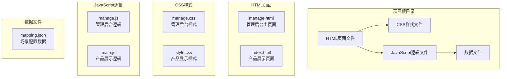

**图表来源**
- [manage.html:1-113](file://manage.html#L1-L113)
- [index.html:1-83](file://index.html#L1-L83)

**章节来源**
- [manage.html:1-113](file://manage.html#L1-L113)
- [index.html:1-83](file://index.html#L1-L83)

## 核心组件

管理后台样式系统由多个精心设计的组件构成，每个组件都有明确的功能职责和视觉规范：

### 全局基础样式
系统采用统一的基础样式重置，确保跨浏览器的一致性：
- **盒模型统一**：使用border-box盒模型
- **字体系统**：基于系统字体栈，支持多语言显示
- **颜色方案**：浅色主题，基于蓝色作为主色调
- **过渡动画**：统一的0.2秒过渡时间

### 三栏布局系统
采用Flexbox实现的三栏布局，具有以下特性：
- **左栏**：场景列表，固定宽度250px
- **中栏**：场景编辑区，自适应填充剩余空间
- **右栏**：热点产品关联编辑器，固定宽度320px
- **高度计算**：使用calc(100vh - 56px)确保工具栏下方留白

### 交互反馈系统
系统提供了多层次的交互反馈机制：
- **按钮状态反馈**：hover、active、disabled状态
- **表单验证反馈**：输入框焦点状态和边框颜色变化
- **操作结果提示**：Toast消息和保存状态显示
- **视觉确认提示**：热点选择和拖拽状态

**章节来源**
- [manage.css:6-21](file://css/manage.css#L6-L21)
- [manage.css:93-97](file://css/manage.css#L93-L97)
- [manage.css:70-89](file://css/manage.css#L70-L89)

## 架构概览

管理后台样式系统采用分层架构设计，确保代码的可维护性和扩展性：

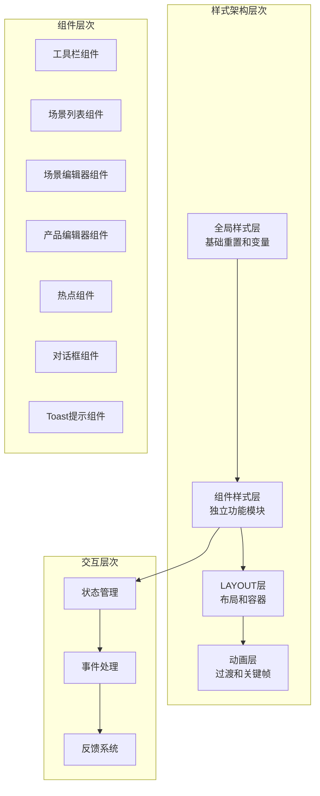

**图表来源**
- [manage.css:1-824](file://css/manage.css#L1-L824)
- [manage.js:1-811](file://js/manage.js#L1-L811)

## 详细组件分析

### 顶部工具栏组件

顶部工具栏是管理后台的控制中心，提供保存配置和状态显示功能：

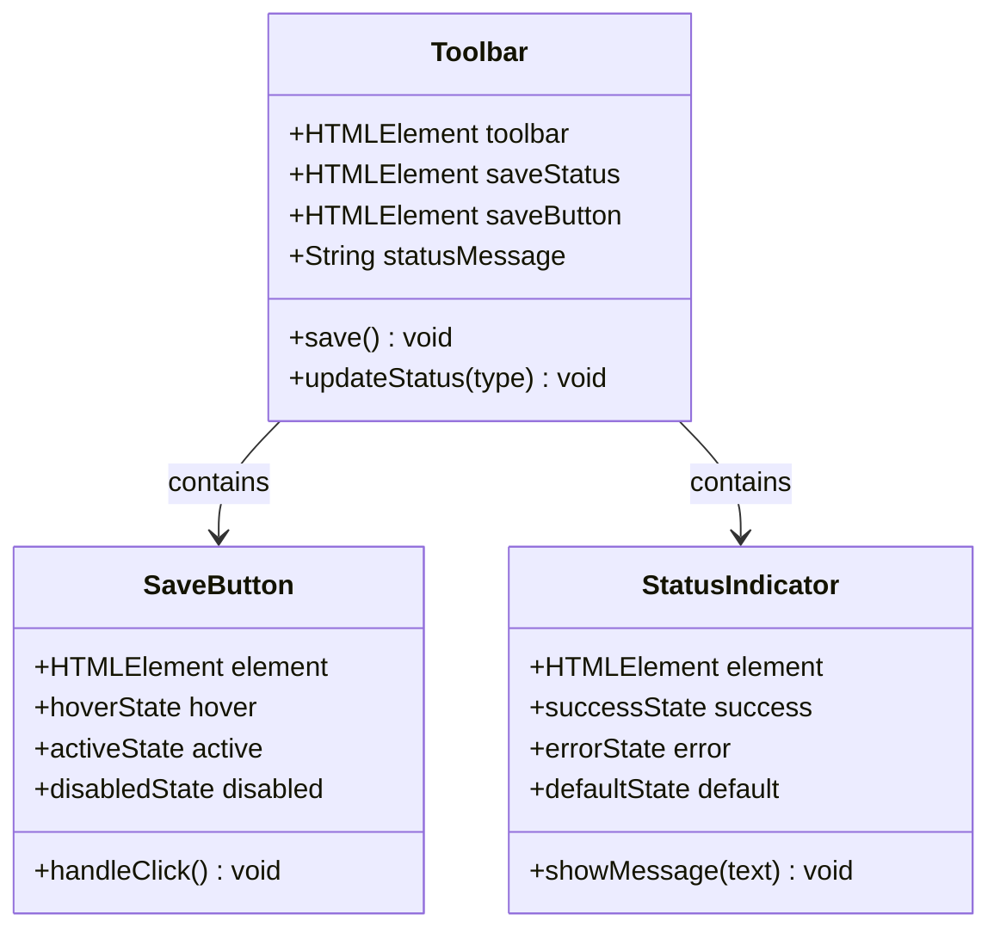

**图表来源**
- [manage.css:31-68](file://css/manage.css#L31-L68)
- [manage.js:76-108](file://js/manage.js#L76-L108)

工具栏的主要特性：
- **固定高度**：56px，确保一致的视觉比例
- **阴影效果**：轻微的阴影增强层次感
- **状态指示**：实时显示保存状态和结果
- **响应式布局**：flex布局确保元素正确对齐

**章节来源**
- [manage.css:31-68](file://css/manage.css#L31-L68)
- [manage.js:76-108](file://js/manage.js#L76-L108)

### 场景列表组件

场景列表组件负责展示和管理所有场景配置：

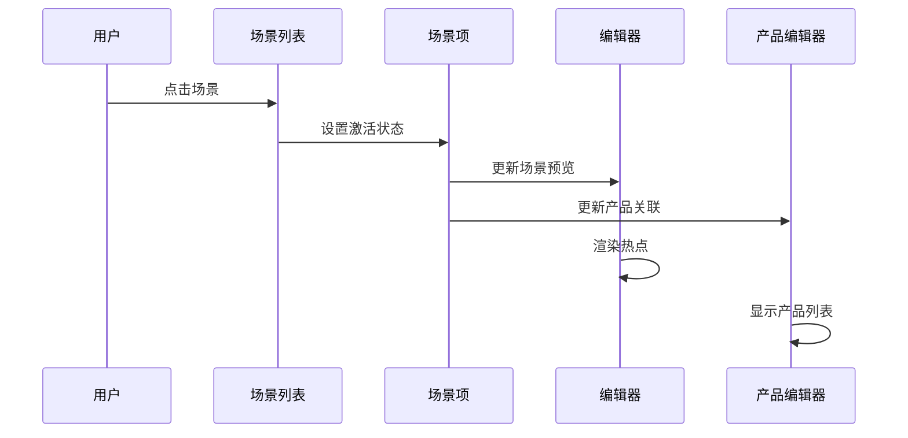

**图表来源**
- [manage.css:123-247](file://css/manage.css#L123-L247)
- [manage.js:112-185](file://js/manage.js#L112-L185)

场景列表的关键功能：
- **懒加载缩略图**：提升初始加载性能
- **动态删除**：悬停显示删除按钮
- **激活状态**：视觉反馈当前选中场景
- **国际化显示**：支持日文和中文场景名

**章节来源**
- [manage.css:123-247](file://css/manage.css#L123-L247)
- [manage.js:112-185](file://js/manage.js#L112-L185)

### 场景编辑器组件

场景编辑器是核心的可视化编辑区域，支持场景图片预览和热点管理：

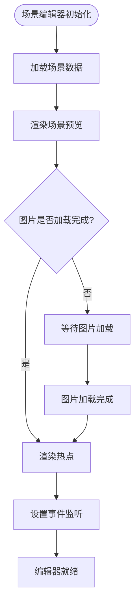

**图表来源**
- [manage.css:251-475](file://css/manage.css#L251-L475)
- [manage.js:237-284](file://js/manage.js#L237-L284)

编辑器的核心功能：
- **场景预览**：居中显示场景图片，支持最大高度限制
- **热点渲染**：动态创建和定位热点标记
- **坐标显示**：实时显示选中热点的百分比坐标
- **工具栏控制**：添加和删除热点的操作按钮

**章节来源**
- [manage.css:251-475](file://css/manage.css#L251-L475)
- [manage.js:237-284](file://js/manage.js#L237-L284)

### 热点组件系统

热点组件是场景编辑器的核心交互元素，提供精确的位置标注和产品关联：

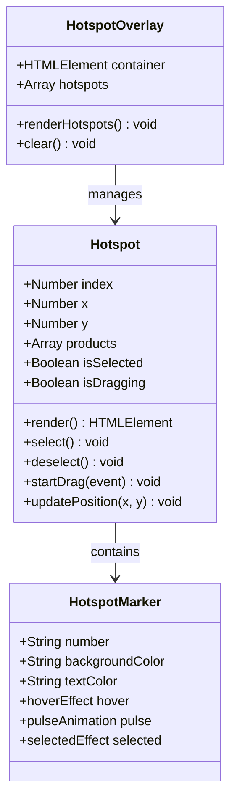

**图表来源**
- [manage.css:362-427](file://css/manage.css#L362-L427)
- [manage.js:286-334](file://js/manage.js#L286-L334)

热点组件的高级特性：
- **带圈数字**：使用Unicode带圈数字显示热点编号
- **拖拽功能**：支持鼠标拖拽调整热点位置
- **选中反馈**：脉冲动画突出显示选中热点
- **坐标精度**：保留一位小数的精确坐标

**章节来源**
- [manage.css:362-427](file://css/manage.css#L362-L427)
- [manage.js:286-334](file://js/manage.js#L286-L334)

### 产品编辑器组件

产品编辑器组件管理热点与产品的关联关系：

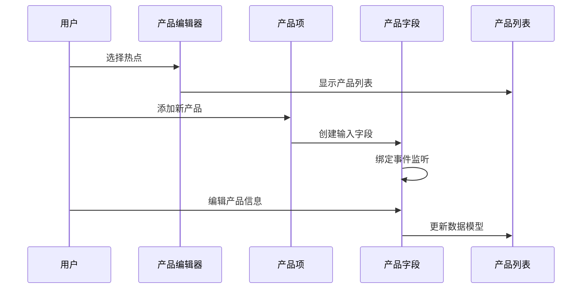

**图表来源**
- [manage.css:479-644](file://css/manage.css#L479-L644)
- [manage.js:442-596](file://js/manage.js#L442-L596)

产品编辑器的功能特性：
- **动态字段**：支持日文和中文产品名称
- **文件选择**：集成图片和描述文件选择器
- **实时预览**：缩略图实时更新
- **删除功能**：支持移除不需要的产品

**章节来源**
- [manage.css:479-644](file://css/manage.css#L479-L644)
- [manage.js:442-596](file://js/manage.js#L442-L596)

### 对话框组件系统

对话框组件提供模态交互体验，用于添加新场景：

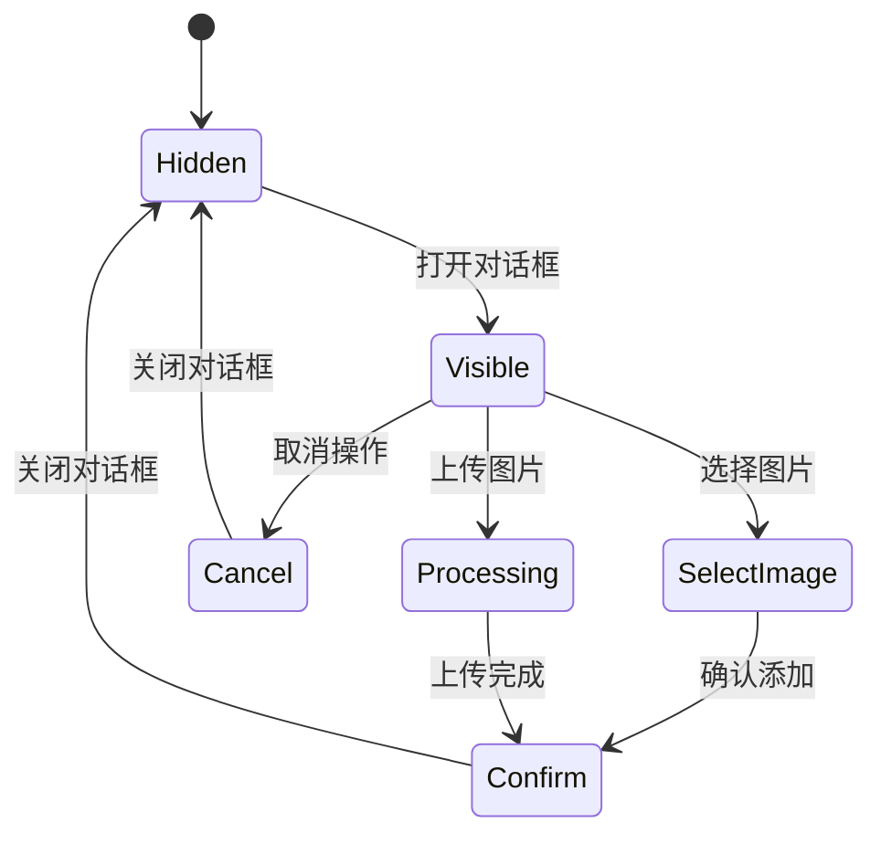

**图表来源**
- [manage.css:709-824](file://css/manage.css#L709-L824)
- [manage.js:649-728](file://js/manage.js#L649-L728)

对话框的交互流程：
- **模态显示**：半透明遮罩层覆盖整个界面
- **文件上传**：支持图片文件选择和上传
- **表单验证**：确保至少填写一个分类名
- **状态管理**：复杂的对话框生命周期管理

**章节来源**
- [manage.css:709-824](file://css/manage.css#L709-L824)
- [manage.js:649-728](file://js/manage.js#L649-L728)

### Toast提示系统

Toast提示系统提供非侵入式的操作反馈：

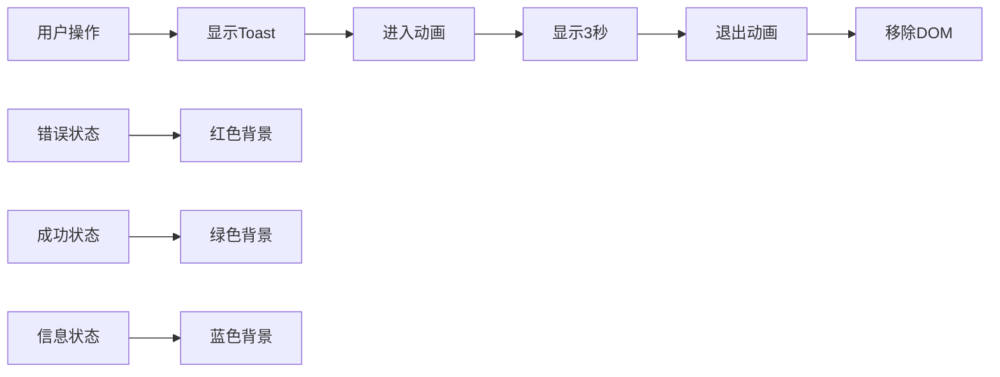

**图表来源**
- [manage.css:648-706](file://css/manage.css#L648-L706)
- [manage.js:783-800](file://js/manage.js#L783-L800)

Toast系统的特点：
- **位置固定**：右上角固定位置显示
- **动画效果**：平滑的进入和退出动画
- **状态分类**：三种不同的视觉状态
- **自动清理**：3秒后自动消失

**章节来源**
- [manage.css:648-706](file://css/manage.css#L648-L706)
- [manage.js:783-800](file://js/manage.js#L783-L800)

## 颜色编码系统

管理后台采用了系统化的颜色编码体系，确保视觉一致性：

### 主题色彩

| 色彩类别 | 颜色值 | 用途 | 视觉效果 |
|---------|--------|------|----------|
| 主色调 | #3b82f6 | 按钮、链接、焦点状态 | 强调和引导用户操作 |
| 成功色 | #22c55e | 成功状态、确认按钮 | 积极反馈和完成状态 |
| 错误色 | #ef4444 | 错误状态、删除按钮 | 警告和危险操作 |
| 危险色 | #ef4444 | 删除操作、错误提示 | 明确的危险信号 |
| 背景色 | #f5f7fa | 页面背景 | 轻柔的背景对比 |
| 白色 | #ffffff | 卡片、面板背景 | 清晰的内容区域 |

### 状态指示色彩

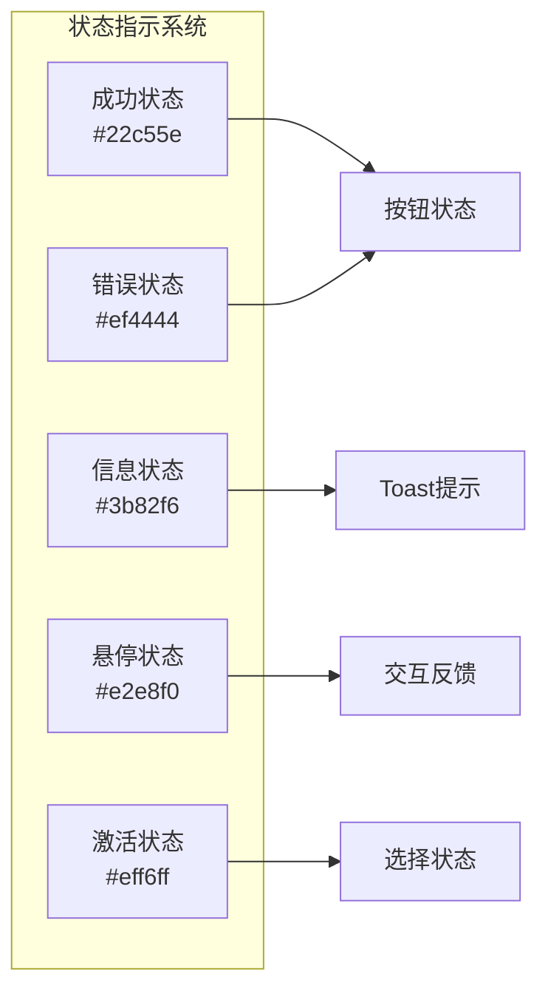

**图表来源**
- [manage.css:62-68](file://css/manage.css#L62-L68)
- [manage.css:669-679](file://css/manage.css#L669-L679)

### 色彩使用原则

1. **一致性原则**：相同功能使用相同颜色
2. **语义化原则**：颜色传达明确的语义信息
3. **对比度原则**：确保足够的视觉对比度
4. **无障碍原则**：考虑色盲用户的识别需求

**章节来源**
- [manage.css:62-68](file://css/manage.css#L62-L68)
- [manage.css:669-679](file://css/manage.css#L669-L679)

## 交互反馈系统

管理后台的交互反馈系统设计得非常细致，提供了多层次的用户反馈：

### 按钮状态变化

按钮组件实现了完整的状态管理系统：

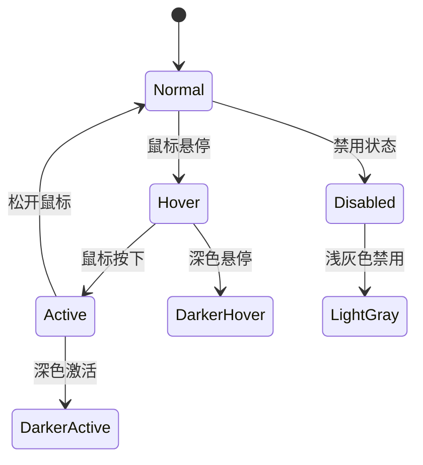

**图表来源**
- [manage.css:82-88](file://css/manage.css#L82-L88)
- [manage.css:451-458](file://css/manage.css#L451-L458)

### 表单验证反馈

表单组件提供了实时的验证反馈：

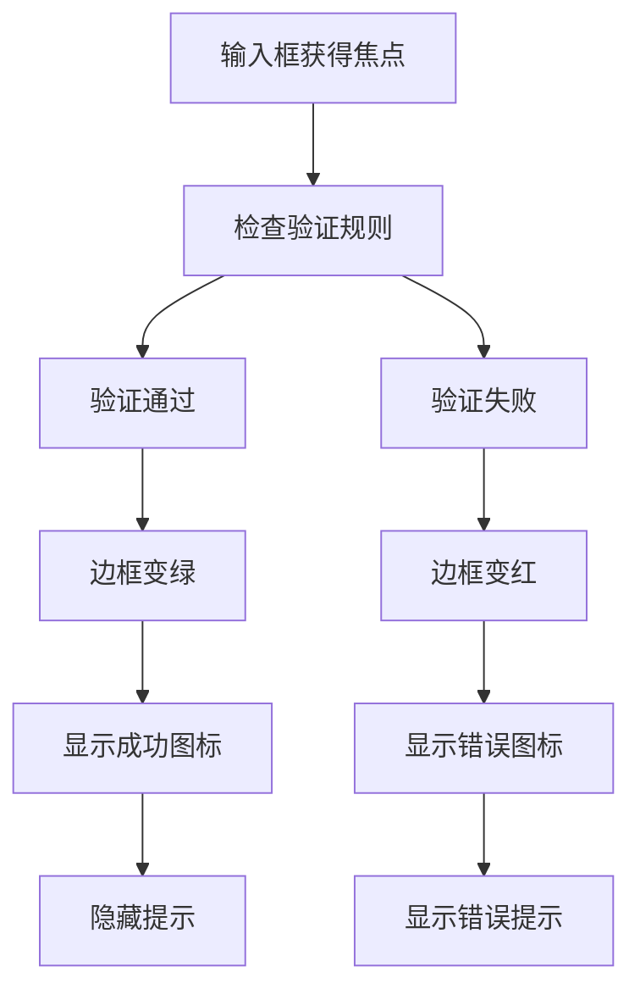

**图表来源**
- [manage.css:293-296](file://css/manage.css#L293-L296)
- [manage.css:580-601](file://css/manage.css#L580-L601)

### 操作确认提示

系统通过多种方式确认用户操作：

1. **对话框确认**：删除场景等危险操作
2. **Toast确认**：保存、上传等操作结果
3. **视觉确认**：按钮状态变化和图标更新
4. **声音反馈**：虽然未实现，但预留了扩展接口

**章节来源**
- [manage.css:82-88](file://css/manage.css#L82-L88)
- [manage.css:293-296](file://css/manage.css#L293-L296)
- [manage.js:621-639](file://js/manage.js#L621-L639)

## 三栏布局系统

三栏布局是管理后台的核心架构，实现了高效的多面板工作流：

### 布局架构

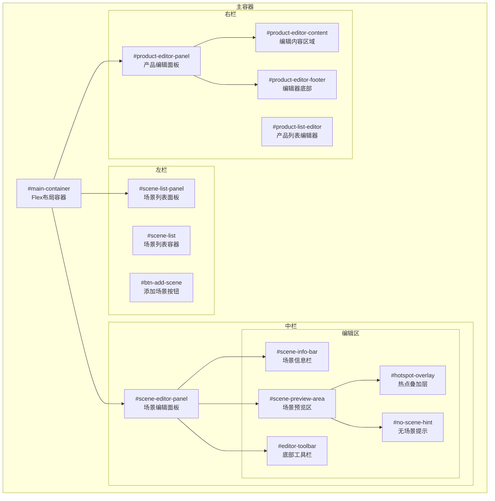

**图表来源**
- [manage.css:93-97](file://css/manage.css#L93-L97)
- [manage.html:20-80](file://manage.html#L20-L80)

### 响应式布局策略

系统采用了灵活的响应式设计策略：

1. **弹性布局**：使用Flexbox实现自适应布局
2. **最小宽度约束**：确保内容不会过度压缩
3. **百分比计算**：使用calc函数实现动态高度
4. **溢出处理**：合理的滚动条和溢出处理

### 布局性能优化

- **GPU加速**：使用transform属性进行动画
- **减少重绘**：避免频繁的布局计算
- **懒加载**：场景缩略图的懒加载机制
- **虚拟滚动**：长列表的性能优化

**章节来源**
- [manage.css:93-97](file://css/manage.css#L93-L97)
- [manage.html:20-80](file://manage.html#L20-L80)

## 响应式设计策略

管理后台采用了多层次的响应式设计策略，确保在各种设备上的良好体验：

### 设备适配策略

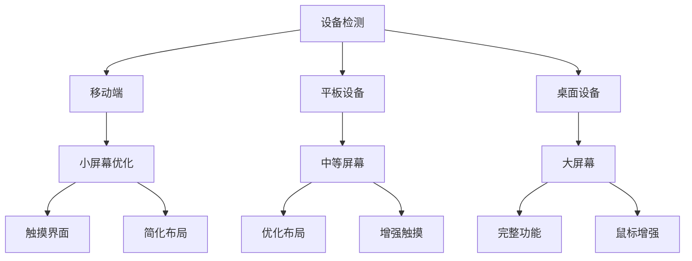

### 屏幕尺寸适配

| 屏幕尺寸 | 特性 | 适配策略 |
|---------|------|----------|
| < 768px | 移动端 | 简化布局，触摸优化 |
| 768px - 1024px | 平板 | 增强触摸交互，优化布局 |
| > 1024px | 桌面端 | 完整功能，鼠标增强 |

### 触摸交互优化

系统针对触摸设备进行了专门优化：

1. **点击目标大小**：确保触摸目标至少44px
2. **手势支持**：支持拖拽、缩放等手势
3. **反馈机制**：提供触觉反馈和视觉反馈
4. **导航简化**：减少不必要的点击步骤

**章节来源**
- [manage.css:94-97](file://css/manage.css#L94-L97)
- [manage.css:333-339](file://css/manage.css#L333-L339)

## 可访问性设计指南

管理后台遵循了WCAG 2.1 AA标准，提供了良好的可访问性支持：

### 键盘导航支持

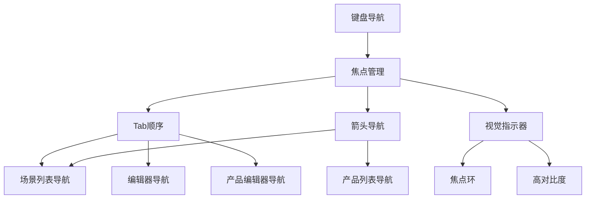

### 屏幕阅读器支持

系统为屏幕阅读器提供了完整的支持：

1. **语义化HTML**：使用正确的HTML标签
2. **ARIA属性**：适当的ARIA角色和属性
3. **替代文本**：为所有非文本内容提供描述
4. **状态通知**：通过屏幕阅读器通知状态变化

### 高对比度模式

系统支持高对比度显示模式：

- **自动颜色调整**：根据系统设置调整颜色
- **高对比度主题**：提供专门的高对比度样式
- **颜色替代方案**：为色盲用户提供替代方案

**章节来源**
- [manage.html:1-113](file://manage.html#L1-L113)
- [index.html:1-83](file://index.html#L1-L83)

## 移动端适配策略

管理后台针对移动端设备进行了专门的适配：

### 移动端特性

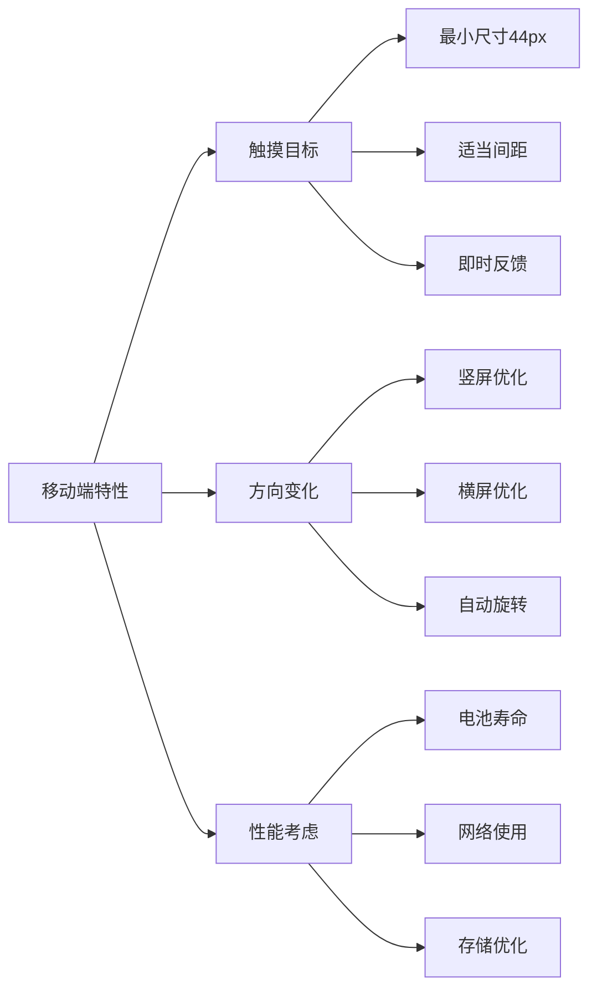

### 触摸交互优化

1. **手势识别**：支持点击、长按、滑动等手势
2. **触摸反馈**：提供视觉和触觉反馈
3. **手势冲突**：避免手势之间的冲突
4. **触摸延迟**：优化触摸响应延迟

### 移动端性能优化

- **资源压缩**：图片和样式的压缩优化
- **懒加载**：内容的按需加载
- **内存管理**：及时释放不再使用的资源
- **网络优化**：减少不必要的网络请求

**章节来源**
- [manage.css:140-155](file://css/manage.css#L140-L155)
- [manage.css:496-507](file://css/manage.css#L496-L507)

## 样式定制与主题扩展

管理后台提供了灵活的样式定制能力：

### CSS变量系统

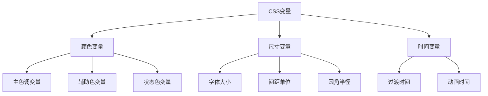

### 主题扩展接口

系统提供了主题扩展的接口：

1. **颜色主题**：支持自定义颜色方案
2. **布局主题**：支持不同的布局模式
3. **交互主题**：支持不同的交互风格
4. **无障碍主题**：支持特殊的无障碍需求

### 样式模块化

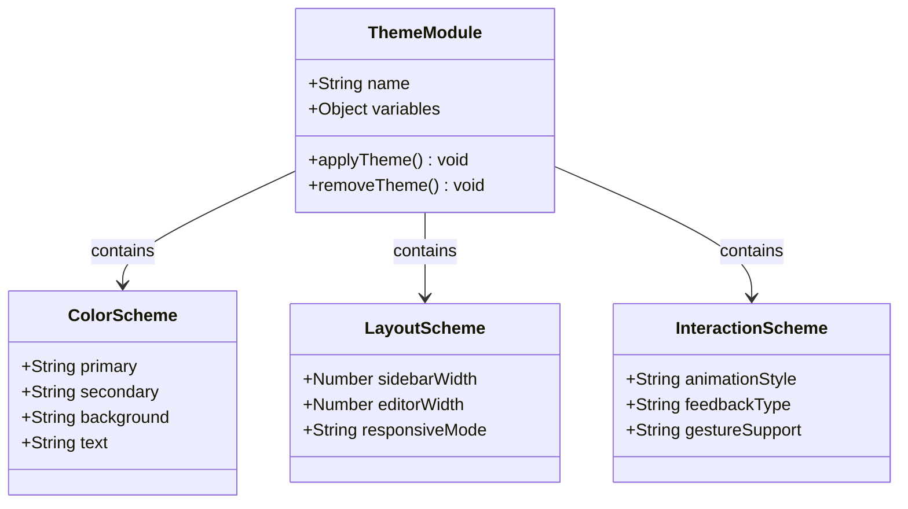

**章节来源**
- [manage.css:1-21](file://css/manage.css#L1-L21)
- [manage.css:6-21](file://css/manage.css#L6-L21)

## 性能考虑

管理后台在设计时充分考虑了性能优化：

### 渲染性能

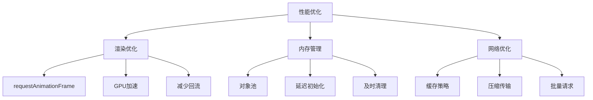

### 内存管理

系统采用了多种内存管理策略：

1. **对象复用**：热点和产品对象的复用机制
2. **事件解绑**：组件销毁时及时解绑事件
3. **垃圾回收**：及时释放不再使用的DOM节点
4. **内存监控**：定期检查内存使用情况

### 网络优化

- **图片懒加载**：场景缩略图的懒加载
- **请求合并**：多个小请求的合并处理
- **缓存策略**：合理利用浏览器缓存
- **CDN支持**：静态资源的CDN加速

**章节来源**
- [manage.js:112-157](file://js/manage.js#L112-L157)
- [manage.js:237-284](file://js/manage.js#L237-L284)

## 故障排除指南

### 常见问题诊断

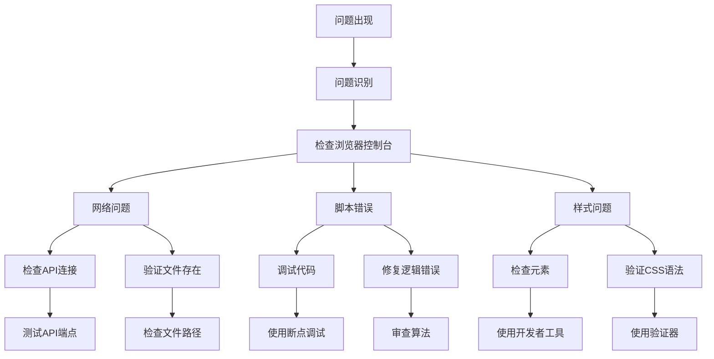

### 调试工具使用

1. **浏览器开发者工具**：检查DOM结构和样式
2. **网络面板**：监控API请求和响应
3. **性能面板**：分析渲染性能和内存使用
4. **控制台**：查看JavaScript错误和警告

### 性能监控

- **FPS监控**：使用requestAnimationFrame监控帧率
- **内存使用**：定期检查内存泄漏
- **网络请求**：监控请求时间和成功率
- **渲染时间**：测量关键操作的执行时间

**章节来源**
- [manage.js:36-46](file://js/manage.js#L36-L46)
- [manage.js:785-800](file://js/manage.js#L785-L800)

## 结论

数字标牌管理后台样式系统展现了现代Web应用设计的最佳实践。通过精心设计的三栏布局、丰富的交互反馈、完善的可访问性支持和灵活的主题扩展机制，该系统为用户提供了高效、直观且美观的管理体验。

### 主要成就

1. **架构完整性**：实现了清晰的组件分离和模块化设计
2. **用户体验**：提供了流畅的交互体验和及时的反馈机制
3. **可访问性**：遵循了WCAG标准，支持多种辅助技术
4. **性能优化**：采用了多种优化策略确保良好的运行性能
5. **可扩展性**：提供了完善的主题定制和扩展接口

### 技术亮点

- **响应式设计**：适配各种设备和屏幕尺寸
- **动画优化**：使用CSS3硬件加速提升动画性能
- **状态管理**：清晰的状态管理和持久化机制
- **错误处理**：完善的错误捕获和用户友好的错误提示

### 发展建议

1. **持续优化**：定期评估和优化性能表现
2. **功能扩展**：根据用户反馈增加新的功能特性
3. **兼容性改进**：进一步提升对旧版本浏览器的支持
4. **可访问性增强**：持续改进无障碍功能

这个样式系统为数字标牌管理应用提供了一个坚实的技术基础，为未来的功能扩展和性能优化奠定了良好的基础。