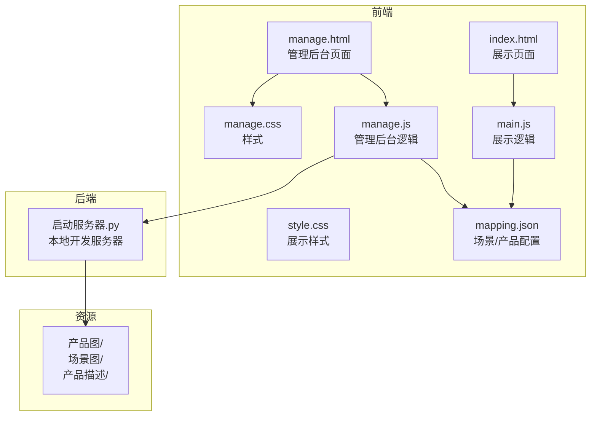
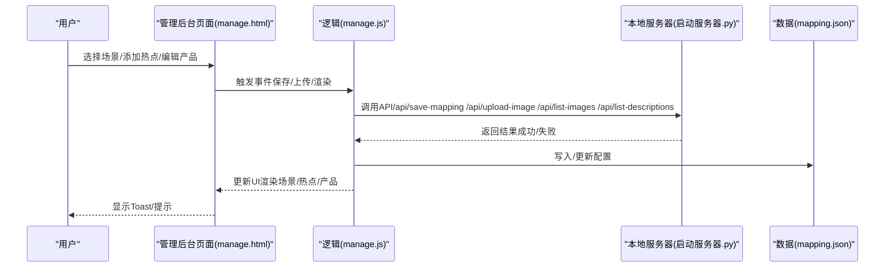
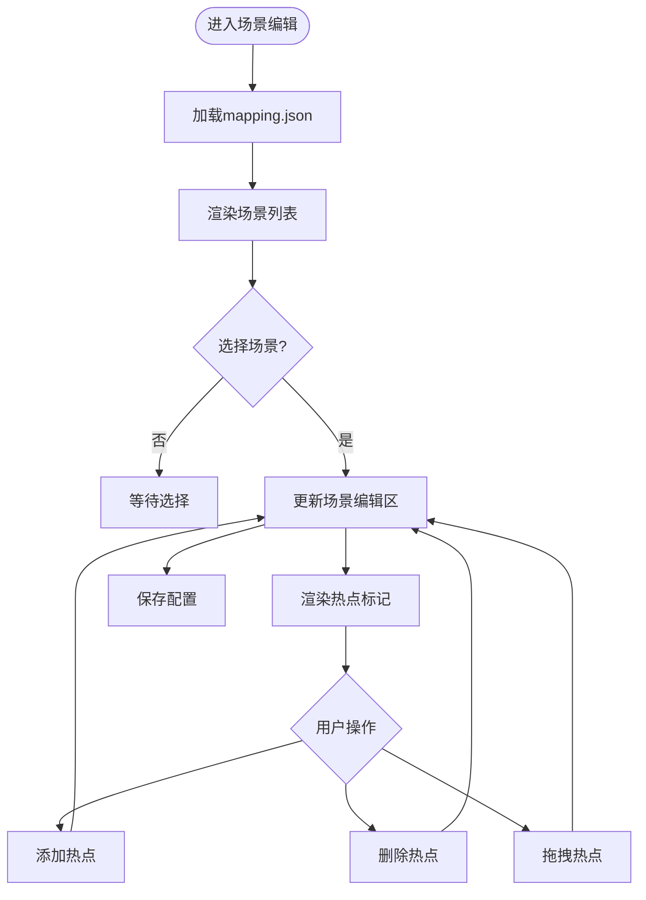
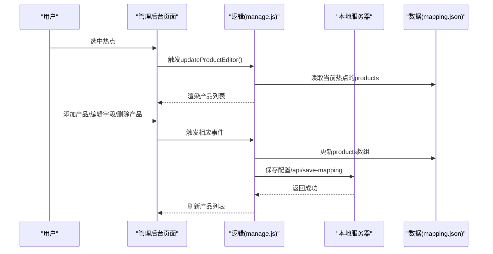
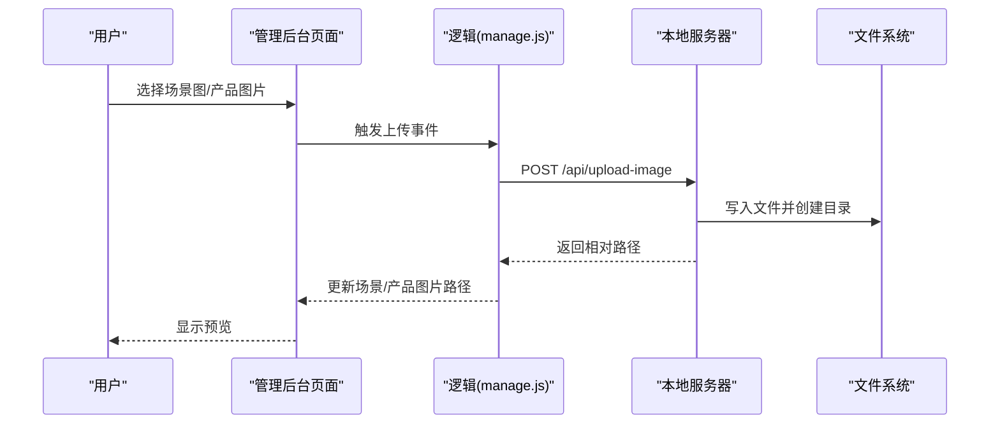
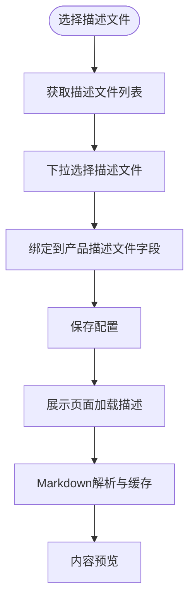
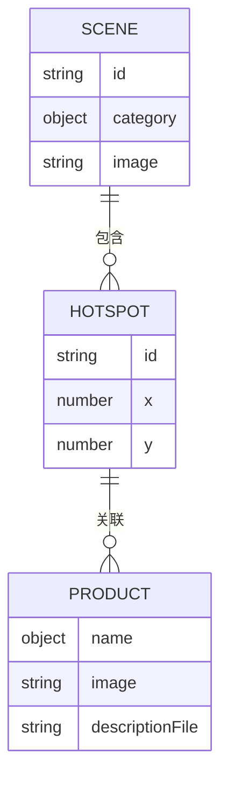
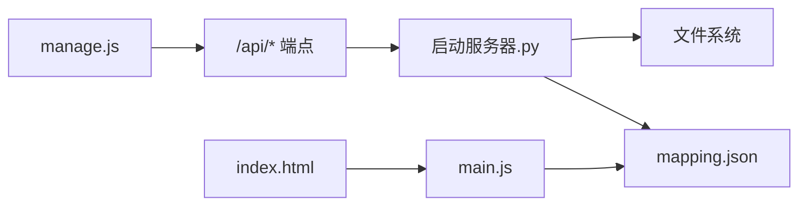

# 产品关联管理

<cite>
**本文引用的文件**
- [manage.html](file://manage.html)
- [manage.js](file://js/manage.js)
- [manage.css](file://css/manage.css)
- [mapping.json](file://mapping.json)
- [project_architecture.md](file://project_architecture.md)
- [启动服务器.py](file://启动服务器.py)
- [室内双面吊装标牌.md](file://产品描述/室内双面吊装标牌.md)
- [电子水牌.md](file://产品描述/电子水牌.md)
- [自助点单机1.md](file://产品描述/自助点单机1.md)
</cite>

## 目录
1. [简介](#简介)
2. [项目结构](#项目结构)
3. [核心组件](#核心组件)
4. [架构总览](#架构总览)
5. [详细组件分析](#详细组件分析)
6. [依赖关系分析](#依赖关系分析)
7. [性能考虑](#性能考虑)
8. [故障排除指南](#故障排除指南)
9. [结论](#结论)
10. [附录](#附录)

## 简介
本文件围绕“产品关联管理”主题，系统梳理数字标牌项目的管理后台能力，重点覆盖以下方面：
- 产品信息的编辑与管理：产品名称（日文/中文）、产品图片、产品描述文件的关联设置
- 产品列表的显示与编辑：产品信息的增删改查
- 产品图片的选择与上传：格式、尺寸与预览
- 产品描述文件的关联与预览：Markdown文件选择与内容呈现
- 产品与热点的绑定关系：一对一与一对多模式
- 数据验证机制：必填字段与格式校验
- 性能优化建议：图片懒加载与缓存策略
- 故障排除：图片加载失败、描述文件无法显示等问题

## 项目结构
项目采用前后端分离的静态资源组织方式，管理后台通过本地开发服务器提供API端点，数据以JSON配置文件形式持久化。

图表来源
- [manage.html:1-113](file://manage.html#L1-L113)
- [manage.js:17-31](file://js/manage.js#L17-L31)
- [启动服务器.py:25-98](file://启动服务器.py#L25-L98)
- [mapping.json:1-232](file://mapping.json#L1-L232)

章节来源
- [project_architecture.md:43-108](file://project_architecture.md#L43-L108)
- [启动服务器.py:25-98](file://启动服务器.py#L25-L98)

## 核心组件
- 管理后台页面（manage.html）：提供三栏布局（场景列表/场景编辑/产品编辑），支持场景、热点、产品信息的可视化编辑与保存。
- 管理后台逻辑（manage.js）：负责数据加载、场景与热点渲染、产品编辑、图片上传、保存配置等。
- 样式（manage.css）：定义三栏布局、热点标记、产品编辑项、对话框与提示等UI。
- 配置数据（mapping.json）：集中存储场景、热点、产品及其多语言信息。
- 本地开发服务器（启动服务器.py）：提供API端点，支持图片上传、配置保存、文件列表查询。

章节来源
- [manage.html:1-113](file://manage.html#L1-L113)
- [manage.js:17-31](file://js/manage.js#L17-L31)
- [manage.css:93-118](file://css/manage.css#L93-L118)
- [mapping.json:1-232](file://mapping.json#L1-L232)
- [启动服务器.py:75-98](file://启动服务器.py#L75-L98)

## 架构总览
管理后台采用“三栏布局 + 可视化编辑 + API持久化”的架构。用户通过左侧场景列表选择场景，中间区域显示场景图与热点，右侧区域编辑热点关联的产品信息。所有更改通过API保存至mapping.json。

图表来源
- [manage.js:81-108](file://js/manage.js#L81-L108)
- [启动服务器.py:75-98](file://启动服务器.py#L75-L98)
- [启动服务器.py:101-127](file://启动服务器.py#L101-L127)
- [启动服务器.py:129-202](file://启动服务器.py#L129-L202)
- [启动服务器.py:204-251](file://启动服务器.py#L204-L251)

## 详细组件分析

### 1) 场景与热点管理
- 场景列表渲染：根据mapping.json生成场景项，支持缩略图、分类名、删除按钮。
- 场景编辑区：支持日文/中文分类名输入、场景图更换、热点添加/删除、热点拖拽定位。
- 热点渲染：在场景图上绘制带序号的热点标记，支持选中态与拖拽态样式。

图表来源
- [manage.js:112-185](file://js/manage.js#L112-L185)
- [manage.js:237-284](file://js/manage.js#L237-L284)
- [manage.js:349-385](file://js/manage.js#L349-L385)
- [manage.js:389-438](file://js/manage.js#L389-L438)

章节来源
- [manage.html:21-80](file://manage.html#L21-L80)
- [manage.js:112-185](file://js/manage.js#L112-L185)
- [manage.js:237-284](file://js/manage.js#L237-L284)
- [manage.js:349-385](file://js/manage.js#L349-L385)
- [manage.js:389-438](file://js/manage.js#L389-L438)

### 2) 产品列表的显示与编辑
- 产品编辑器：当选中热点时显示右栏编辑器，支持添加/删除产品、编辑产品名称（日文/中文）、选择产品图片与描述文件。
- 产品项结构：包含缩略图、名称字段、图片选择器、描述文件选择器、删除按钮。
- 产品列表渲染：遍历热点的products数组，逐项创建编辑项。

图表来源
- [manage.js:442-465](file://js/manage.js#L442-L465)
- [manage.js:467-541](file://js/manage.js#L467-L541)
- [manage.js:598-617](file://js/manage.js#L598-L617)
- [manage.js:81-108](file://js/manage.js#L81-L108)

章节来源
- [manage.html:67-79](file://manage.html#L67-L79)
- [manage.js:442-465](file://js/manage.js#L442-L465)
- [manage.js:467-541](file://js/manage.js#L467-L541)
- [manage.js:598-617](file://js/manage.js#L598-L617)

### 3) 产品图片的选择与上传
- 图片列表获取：通过GET /api/list-images返回场景图与产品图的可用文件列表。
- 图片上传：POST /api/upload-image，支持type=scene或type=product，自动创建目录并返回相对路径。
- 图片预览：场景图与产品缩略图均使用懒加载与错误回退，提升体验。

图表来源
- [manage.js:48-72](file://js/manage.js#L48-L72)
- [manage.js:762-781](file://js/manage.js#L762-L781)
- [启动服务器.py:129-202](file://启动服务器.py#L129-L202)
- [启动服务器.py:204-236](file://启动服务器.py#L204-L236)

章节来源
- [manage.js:48-72](file://js/manage.js#L48-L72)
- [manage.js:762-781](file://js/manage.js#L762-L781)
- [启动服务器.py:129-202](file://启动服务器.py#L129-L202)
- [启动服务器.py:204-236](file://启动服务器.py#L204-L236)

### 4) 产品描述文件的关联与预览
- 描述文件列表：GET /api/list-descriptions返回产品描述文件列表。
- 关联设置：在产品编辑项中通过下拉选择器关联描述文件路径。
- 预览机制：展示页面通过Markdown解析与缓存实现描述内容的加载与重试。

图表来源
- [manage.js:61-72](file://js/manage.js#L61-L72)
- [manage.js:519-522](file://js/manage.js#L519-L522)
- [启动服务器.py:238-251](file://启动服务器.py#L238-L251)
- [项目架构文档:642-648](file://project_architecture.md#L642-L648)

章节来源
- [manage.js:61-72](file://js/manage.js#L61-L72)
- [manage.js:519-522](file://js/manage.js#L519-L522)
- [启动服务器.py:238-251](file://启动服务器.py#L238-L251)
- [项目架构文档:642-648](file://project_architecture.md#L642-L648)

### 5) 产品与热点的绑定关系
- 绑定模型：一个热点可关联多个产品（一对多），产品包含名称、图片与描述文件。
- 数据结构：mapping.json中hotspots数组的每个元素包含products数组，形成层次化关联。
- 编辑行为：添加/删除产品、修改产品字段均实时反映在数据结构中。

图表来源
- [mapping.json:3-204](file://mapping.json#L3-L204)
- [manage.js:467-541](file://js/manage.js#L467-L541)

章节来源
- [mapping.json:3-204](file://mapping.json#L3-L204)
- [manage.js:467-541](file://js/manage.js#L467-L541)

### 6) 数据验证机制
- 必填字段检查：添加场景对话框要求至少填写一个分类名（日文或中文）。
- 格式验证：图片上传接口对Content-Type进行校验，type参数必须为scene或product；上传场景图时需提供category参数。
- 错误处理：统一通过Toast提示与API错误响应返回，便于用户感知问题。

章节来源
- [manage.js:695-698](file://js/manage.js#L695-L698)
- [启动服务器.py:132-182](file://启动服务器.py#L132-L182)
- [启动服务器.py:101-127](file://启动服务器.py#L101-L127)

## 依赖关系分析
- 前端依赖：管理后台依赖本地开发服务器提供的API端点；展示页面依赖mapping.json与Markdown解析。
- 后端依赖：启动服务器.py提供静态文件服务与API路由，负责文件系统读写与JSON持久化。
- 数据依赖：mapping.json作为单一数据源，管理后台与展示页面均依赖其结构与内容。

图表来源
- [manage.js:81-108](file://js/manage.js#L81-L108)
- [启动服务器.py:75-98](file://启动服务器.py#L75-L98)
- [启动服务器.py:101-127](file://启动服务器.py#L101-L127)
- [启动服务器.py:129-202](file://启动服务器.py#L129-L202)
- [启动服务器.py:204-251](file://启动服务器.py#L204-L251)

章节来源
- [manage.js:81-108](file://js/manage.js#L81-L108)
- [启动服务器.py:75-98](file://启动服务器.py#L75-L98)
- [启动服务器.py:101-127](file://启动服务器.py#L101-L127)
- [启动服务器.py:129-202](file://启动服务器.py#L129-L202)
- [启动服务器.py:204-251](file://启动服务器.py#L204-L251)

## 性能考虑
- 图片懒加载：场景缩略图与产品缩略图均设置loading="lazy"，减少初始渲染压力。
- 图片错误回退：图片加载失败时使用占位背景，避免空白与布局抖动。
- 预加载策略：展示页面采用首屏优先加载与后续预加载相结合的方式，管理后台通过API批量获取文件列表，减少多次请求。
- 缓存策略：展示页面对Markdown描述进行缓存，避免重复请求；管理后台可复用图片/描述文件列表，降低网络开销。
- 服务器端优化：本地开发服务器在静态文件服务基础上增加CORS支持与错误响应，保证开发体验。

章节来源
- [manage.js:127-129](file://js/manage.js#L127-L129)
- [manage.js:490-492](file://js/manage.js#L490-L492)
- [项目架构文档:642-648](file://project_architecture.md#L642-L648)

## 故障排除指南
- 图片加载失败
  - 现象：场景图或产品缩略图显示空白或占位背景。
  - 排查：确认图片路径正确、文件存在；检查本地服务器是否正常运行；查看浏览器控制台网络请求。
  - 处理：重新上传图片或修正路径；刷新页面后重试。
- 描述文件无法显示
  - 现象：产品详情中描述内容为空或显示加载失败提示。
  - 排查：确认描述文件存在于产品描述目录；检查文件扩展名为.md；查看Markdown解析是否可用。
  - 处理：重新选择描述文件或修复文件内容；点击失败提示进行重试。
- 保存配置失败
  - 现象：点击保存后状态显示失败。
  - 排查：检查请求体是否为有效JSON；确认本地服务器端口与路由正确。
  - 处理：修正JSON格式后重试；重启本地服务器。
- 图片上传失败
  - 现象：上传后返回错误或路径为空。
  - 排查：确认Content-Type为multipart/form-data；type与category参数是否正确；目标目录权限。
  - 处理：修正表单参数与类型；确保目录存在且可写。

章节来源
- [manage.js:41-46](file://js/manage.js#L41-L46)
- [manage.js:776-781](file://js/manage.js#L776-L781)
- [启动服务器.py:101-127](file://启动服务器.py#L101-L127)
- [启动服务器.py:129-202](file://启动服务器.py#L129-L202)
- [启动服务器.py:238-251](file://启动服务器.py#L238-L251)

## 结论
本项目通过管理后台实现了对场景、热点与产品信息的可视化管理，结合本地开发服务器提供的API端点，形成了完整的“编辑-保存-预览”闭环。产品关联管理支持一对一与一对多模式，具备良好的扩展性与可维护性。通过合理的数据结构、错误处理与性能优化策略，能够满足日常运营与内容更新需求。

## 附录
- 示例Markdown描述文件：室内双面吊装标牌.md、电子水牌.md、自助点单机1.md，展示了产品特性与规格的Markdown格式。
- 本地开发服务器：提供API端点与静态文件服务，支持图片上传、配置保存与文件列表查询。

章节来源
- [室内双面吊装标牌.md:1-13](file://产品描述/室内双面吊装标牌.md#L1-L13)
- [电子水牌.md:1-10](file://产品描述/电子水牌.md#L1-L10)
- [自助点单机1.md:1-11](file://产品描述/自助点单机1.md#L1-L11)
- [启动服务器.py:266-298](file://启动服务器.py#L266-L298)