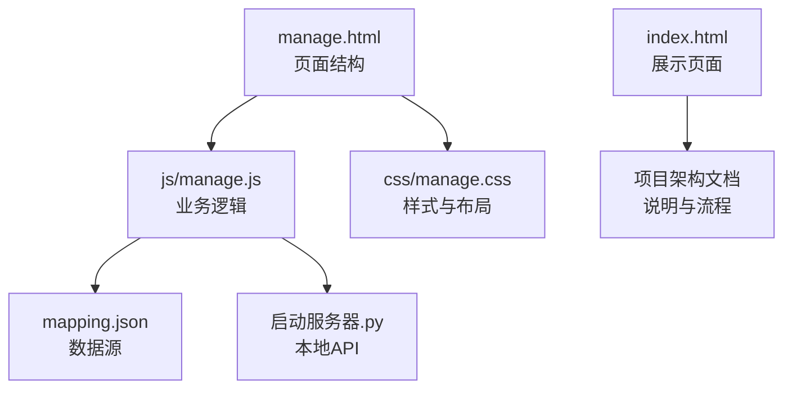
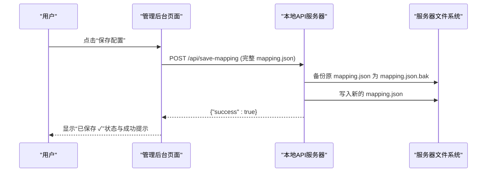
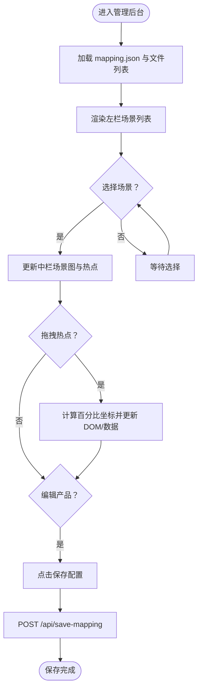
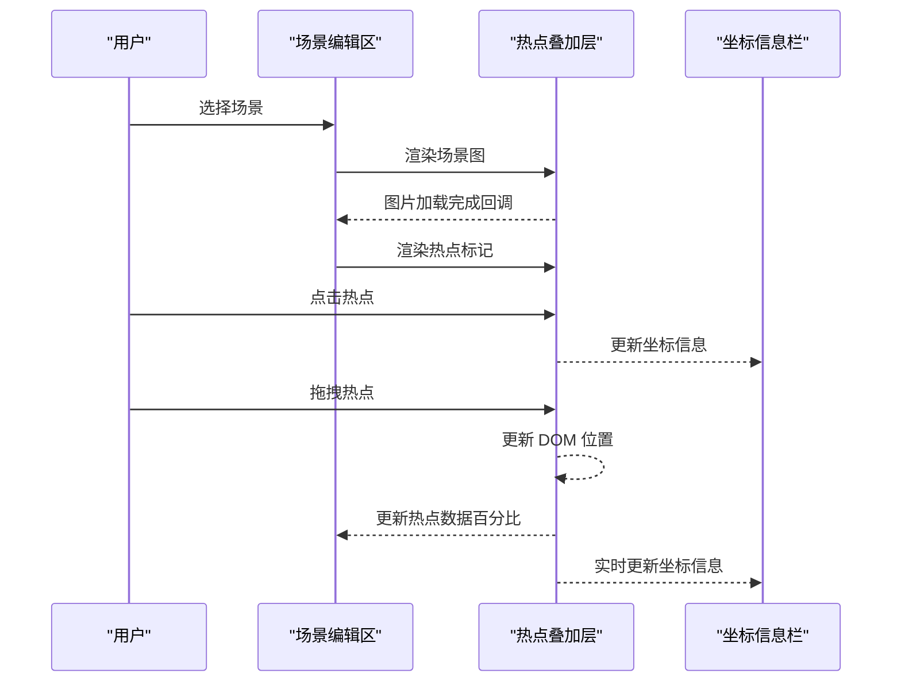
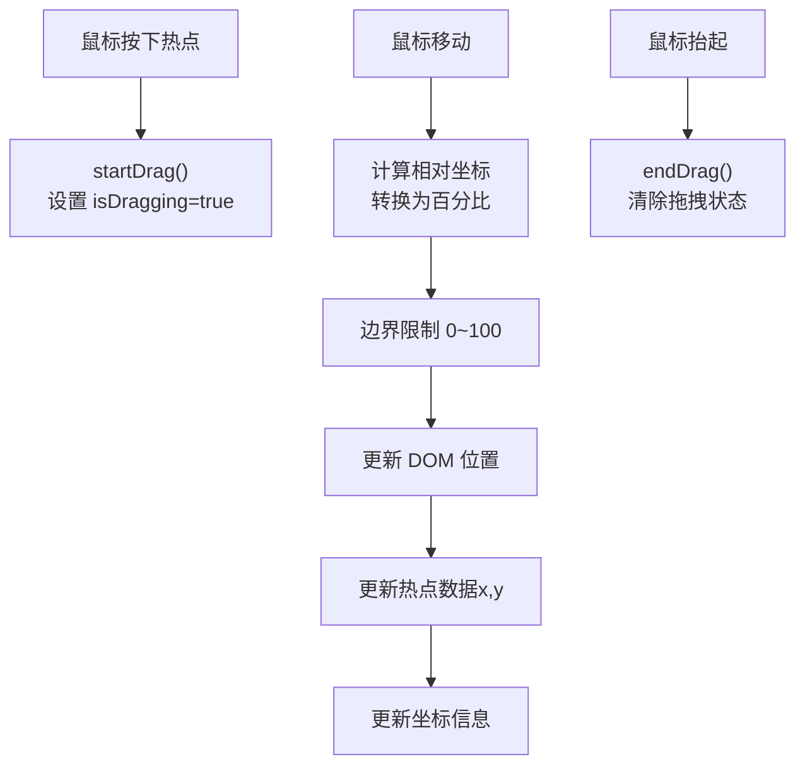
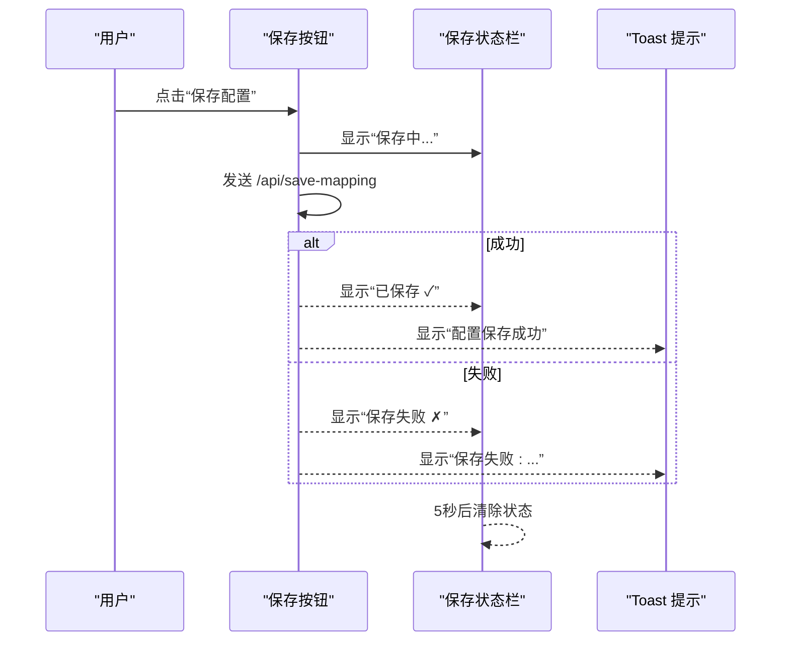
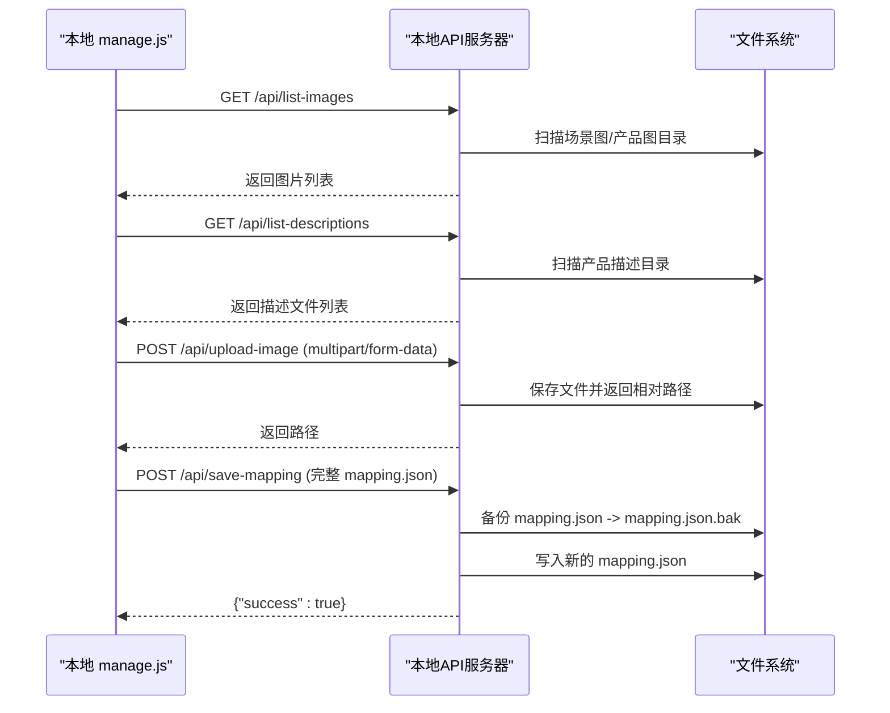
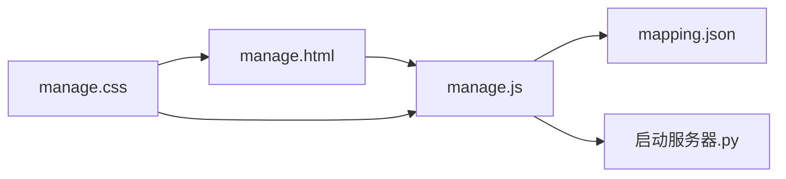

# 可视化编辑体验

<cite>
**本文引用的文件**
- [manage.html](file://manage.html)
- [manage.js](file://js/manage.js)
- [manage.css](file://css/manage.css)
- [index.html](file://index.html)
- [mapping.json](file://mapping.json)
- [project_architecture.md](file://project_architecture.md)
- [启动服务器.py](file://启动服务器.py)
</cite>

## 目录
1. [简介](#简介)
2. [项目结构](#项目结构)
3. [核心组件](#核心组件)
4. [架构总览](#架构总览)
5. [详细组件分析](#详细组件分析)
6. [依赖关系分析](#依赖关系分析)
7. [性能考量](#性能考量)
8. [故障排查指南](#故障排查指南)
9. [结论](#结论)
10. [附录](#附录)

## 简介
本文件聚焦“可视化编辑体验”，围绕管理后台的三栏布局设计、响应式布局实现、实时预览机制、拖拽交互、用户界面交互设计、数据同步机制、用户体验优化策略以及无障碍访问支持进行系统化说明。文档以仓库现有代码为基础，结合项目架构文档与本地开发服务器实现，帮助读者快速理解并高效使用可视化编辑功能。

## 项目结构
管理后台采用“三栏布局”：左栏场景列表、中栏场景编辑区（场景图+热点叠加层）、右栏热点产品关联编辑器。整体布局通过 CSS Flexbox 实现，配合媒体查询与弹性单位，确保在不同设备上的良好适配。

图表来源
- [manage.html:1-113](file://manage.html#L1-L113)
- [manage.js:17-31](file://js/manage.js#L17-L31)
- [manage.css:93-97](file://css/manage.css#L93-L97)
- [project_architecture.md:712-761](file://project_architecture.md#L712-L761)

章节来源
- [manage.html:1-113](file://manage.html#L1-L113)
- [manage.css:93-97](file://css/manage.css#L93-L97)
- [project_architecture.md:712-761](file://project_architecture.md#L712-L761)

## 核心组件
- 三栏布局容器与面板
  - 左栏：场景列表面板，支持场景缩略图、分类名、删除按钮与“+ 添加场景”入口。
  - 中栏：场景编辑面板，包含场景信息编辑栏（分类名输入、更换场景图）、场景大图预览区（含热点叠加层）、底部工具栏（添加/删除热点、坐标信息）。
  - 右栏：热点产品关联编辑器，支持产品名称（日/中）、产品图片选择、描述文件选择、添加/删除产品。
- 实时预览与热点渲染
  - 选中场景后，中栏加载场景图并在其上渲染热点标记；热点位置以百分比坐标存储，拖拽时实时更新 DOM 与数据。
- 拖拽交互
  - 鼠标按下开始拖拽，移动时计算容器相对坐标并转换为百分比，限制边界，更新热点位置与坐标信息。
- 数据同步
  - 本地状态与远程保存：本地状态在内存中维护，保存时通过 API 将完整 mapping.json 发送到服务器，服务器先备份再写入。
- 用户体验与提示
  - Toast 提示、保存状态反馈、对话框确认、删除确认、加载状态指示等。
- 无障碍支持
  - 展示页面具备键盘导航与屏幕阅读器友好结构；管理后台在热点标记与按钮上提供 aria-label 与可访问性语义。

章节来源
- [manage.html:19-80](file://manage.html#L19-L80)
- [manage.js:187-265](file://js/manage.js#L187-L265)
- [manage.css:341-474](file://css/manage.css#L341-L474)
- [project_architecture.md:745-760](file://project_architecture.md#L745-L760)

## 架构总览
管理后台的可视化编辑由“页面结构 + 样式布局 + 交互逻辑 + 数据持久化 + 本地服务器 API”构成。核心流程如下：
- 初始化：加载 mapping.json、图片与描述文件列表，渲染场景列表。
- 选择场景：更新中栏场景图与热点叠加层，右栏显示对应热点的产品编辑器。
- 拖拽热点：计算百分比坐标，实时更新 DOM 与数据，同时更新坐标信息。
- 编辑产品：在右栏直接修改产品名称、图片与描述文件。
- 保存配置：将完整 mapping.json 通过 API 保存，服务器先备份再写入。

图表来源
- [manage.js:81-108](file://js/manage.js#L81-L108)
- [启动服务器.py:101-127](file://启动服务器.py#L101-L127)

章节来源
- [manage.js:81-108](file://js/manage.js#L81-L108)
- [启动服务器.py:101-127](file://启动服务器.py#L101-L127)

## 详细组件分析

### 三栏布局与响应式设计
- 布局容器
  - 主容器使用 Flex 布局，高度为视口高度减去顶部工具栏高度，左栏宽度固定，中栏与右栏自适应。
- 左栏场景列表
  - 场景项包含缩略图、分类名与删除按钮，悬停显示删除按钮；活动项高亮。
- 中栏场景编辑区
  - 信息编辑栏：分类名输入框（日/中）、更换场景图按钮与隐藏文件输入。
  - 预览区：场景图容器，热点叠加层绝对定位，无场景时显示提示。
  - 底部工具栏：添加/删除热点与坐标信息显示。
- 右栏产品编辑器
  - 无热点时显示提示；有热点时显示产品列表，支持产品名称（日/中）、图片选择、描述文件选择与删除。
- 响应式特性
  - 使用百分比宽度与弹性单位，配合媒体查询与滚动条样式，保证在小屏设备上的可读性与可用性。

图表来源
- [manage.html:19-80](file://manage.html#L19-L80)
- [manage.js:187-265](file://js/manage.js#L187-L265)
- [manage.css:341-474](file://css/manage.css#L341-L474)

章节来源
- [manage.html:19-80](file://manage.html#L19-L80)
- [manage.css:93-474](file://css/manage.css#L93-L474)

### 实时预览与热点动态更新
- 场景图加载与预览
  - 选中场景后，中栏根据场景图路径加载图片；图片加载完成后渲染热点。
- 热点叠加层
  - 热点以绝对定位的标记元素叠加在场景图上，标记包含序号与动画效果；选中热点时显示脉冲动画。
- 坐标信息
  - 选中热点后，底部工具栏显示热点序号与百分比坐标，拖拽过程中实时更新。

图表来源
- [manage.js:237-265](file://js/manage.js#L237-L265)
- [manage.js:272-284](file://js/manage.js#L272-L284)
- [manage.js:336-347](file://js/manage.js#L336-L347)

章节来源
- [manage.js:237-265](file://js/manage.js#L237-L265)
- [manage.js:272-284](file://js/manage.js#L272-L284)
- [manage.js:336-347](file://js/manage.js#L336-L347)

### 拖拽操作机制
- 事件绑定
  - 鼠标按下：开始拖拽，设置拖拽状态与目标热点元素。
  - 鼠标移动：计算容器相对坐标，转换为百分比，限制边界，更新热点 DOM 位置与数据。
  - 鼠标抬起：结束拖拽，移除拖拽样式。
- 坐标计算
  - 通过容器边界矩形计算鼠标相对位置，转换为百分比坐标，四舍五入到一位小数，确保数据精度与显示一致。
- 视觉反馈
  - 拖拽中热点提升层级并放大，选中态与拖拽态样式区分，增强交互感知。

图表来源
- [manage.js:389-438](file://js/manage.js#L389-L438)

章节来源
- [manage.js:389-438](file://js/manage.js#L389-L438)

### 用户界面交互设计
- 按钮状态管理
  - 保存按钮：点击后显示“保存中…”状态，成功显示“已保存 ✓”，失败显示“保存失败 ✗”，5 秒后自动清除状态。
  - 删除按钮：删除场景/热点时触发确认对话框，确认后执行删除并更新界面。
- 提示信息显示
  - Toast 提示：成功、错误、信息三类，自动淡出；保存状态栏：成功/失败颜色提示。
- 错误处理
  - 数据加载失败：显示错误提示并回退默认数据；图片上传失败：提示错误并阻止后续流程。
- 确认与撤销
  - 删除操作采用 confirm 确认；保存后服务器自动备份，可视为“撤销”的基础（需手动恢复备份）。

图表来源
- [manage.js:81-108](file://js/manage.js#L81-L108)
- [manage.js:783-803](file://js/manage.js#L783-L803)

章节来源
- [manage.js:76-108](file://js/manage.js#L76-L108)
- [manage.js:783-803](file://js/manage.js#L783-L803)

### 数据同步机制
- 本地状态
  - mappingData：内存中的完整数据副本；currentSceneIndex/selectedHotspotIndex：当前选中场景与热点索引；拖拽状态：isDragging/dragHotspotEl/dragHotspotIndex。
- 远程保存
  - 保存时将完整 mapping.json 作为请求体发送至 /api/save-mapping；服务器先备份原文件为 mapping.json.bak，再写入新数据。
- 文件列表同步
  - 启动时加载图片与描述文件列表，添加场景时可选择图片并上传，上传成功后刷新列表。

图表来源
- [manage.js:35-72](file://js/manage.js#L35-L72)
- [manage.js:760-781](file://js/manage.js#L760-L781)
- [启动服务器.py:204-251](file://启动服务器.py#L204-L251)
- [启动服务器.py:129-202](file://启动服务器.py#L129-L202)

章节来源
- [manage.js:35-72](file://js/manage.js#L35-L72)
- [manage.js:760-781](file://js/manage.js#L760-L781)
- [启动服务器.py:204-251](file://启动服务器.py#L204-L251)
- [启动服务器.py:129-202](file://启动服务器.py#L129-L202)

### 用户体验优化策略
- 加载状态指示
  - 场景图加载时显示旋转指示器，避免空白等待；Toast 提示在关键操作后短暂显示，便于用户感知。
- 操作确认
  - 删除场景/热点与添加场景对话框均提供确认步骤，降低误操作风险。
- 实时反馈
  - 拖拽热点时坐标实时更新，热点选中态与拖拽态视觉差异明显，提升交互信心。
- 自动化流程
  - 添加场景后自动刷新列表并选中新场景，减少额外操作。

章节来源
- [index.html:28-31](file://index.html#L28-L31)
- [manage.js:619-647](file://js/manage.js#L619-L647)
- [manage.js:689-728](file://js/manage.js#L689-L728)

### 无障碍访问支持
- 展示页面
  - 提供语言切换器与键盘导航支持，按钮具备 aria-label，详情弹窗具备可访问性语义。
- 管理后台
  - 热点标记具备可聚焦性与可访问性语义；按钮与输入框具备清晰的标签与状态提示；对话框具备遮罩层与焦点管理。

章节来源
- [index.html:16-54](file://index.html#L16-L54)
- [manage.html:36-64](file://manage.html#L36-L64)

### 界面定制化与扩展方案
- 主题切换
  - 当前为浅色主题，可通过扩展 CSS 变量与主题类名实现深色模式或其他主题。
- 布局调整
  - 三栏布局基于 Flex，可通过媒体查询与断点调整列宽或在窄屏时折叠面板。
- 功能扩展
  - 可在现有事件体系上扩展更多编辑能力（如热点尺寸、形状、动画等），保持与数据模型的一致性。

章节来源
- [manage.css:31-97](file://css/manage.css#L31-L97)
- [project_architecture.md:398-442](file://project_architecture.md#L398-L442)

## 依赖关系分析
- 页面结构依赖交互逻辑
  - manage.html 的 DOM 结构由 manage.js 动态渲染与事件绑定驱动。
- 交互逻辑依赖数据源
  - manage.js 通过 fetch 加载 mapping.json，并与本地状态同步。
- 样式依赖布局与交互
  - manage.css 定义三栏布局、面板样式、热点标记与动画，支撑可视化编辑体验。
- 本地服务器依赖
  - 启动服务器.py 提供 API 端点，支持保存配置、上传图片与文件列表查询。

图表来源
- [manage.html:1-113](file://manage.html#L1-L113)
- [manage.js:17-31](file://js/manage.js#L17-L31)
- [manage.css:1-21](file://css/manage.css#L1-L21)
- [启动服务器.py:25-98](file://启动服务器.py#L25-L98)

章节来源
- [manage.html:1-113](file://manage.html#L1-L113)
- [manage.js:17-31](file://js/manage.js#L17-L31)
- [manage.css:1-21](file://css/manage.css#L1-L21)
- [启动服务器.py:25-98](file://启动服务器.py#L25-L98)

## 性能考量
- 图片加载与预览
  - 场景图采用懒加载与加载完成回调，避免阻塞渲染；热点叠加层使用绝对定位，减少重排。
- 拖拽性能
  - 拖拽过程仅更新 DOM 位置与数据，避免复杂计算；百分比坐标限制边界，减少溢出判断。
- 数据同步
  - 保存时传输完整 mapping.json，建议在大规模场景下考虑增量更新策略以降低网络负载。
- 本地服务器
  - API 端点采用简单 JSON 读写与文件系统操作，满足本地开发需求；生产环境建议使用更健壮的后端服务。

## 故障排查指南
- 数据加载失败
  - 现象：页面提示数据加载失败并回退默认数据。
  - 排查：检查 mapping.json 是否存在、格式是否正确；确认本地服务器是否正常运行。
- 图片上传失败
  - 现象：上传对话框提示失败。
  - 排查：确认上传接口返回、服务器目录权限、文件类型与大小限制。
- 保存失败
  - 现象：保存状态栏显示“保存失败 ✗”。
  - 排查：检查 /api/save-mapping 请求体、服务器备份与写入权限；查看浏览器网络面板与控制台错误。
- 热点拖拽异常
  - 现象：热点无法拖拽或坐标异常。
  - 排查：确认容器尺寸变化后是否重新渲染热点；检查边界限制逻辑与百分比计算精度。

章节来源
- [manage.js:35-46](file://js/manage.js#L35-L46)
- [manage.js:760-781](file://js/manage.js#L760-L781)
- [manage.js:81-108](file://js/manage.js#L81-L108)
- [manage.js:389-438](file://js/manage.js#L389-L438)

## 结论
本可视化编辑体验以“三栏布局 + 实时预览 + 拖拽交互 + 数据同步 + 本地 API”为核心，实现了从场景到热点再到产品的完整可视化编辑闭环。通过 Toast 提示、保存状态栏与确认对话框，提升了操作的可控性与安全性；通过百分比坐标与绝对定位，确保了热点位置的精确与稳定。未来可在主题扩展、布局自适应与增量保存等方面进一步优化，以满足更复杂的业务场景。

## 附录
- 在线预览与管理后台
  - 展示页面：http://localhost:8082/index.html
  - 管理后台：http://localhost:8082/manage.html
- API 端点
  - POST /api/save-mapping：保存 mapping.json（自动备份）
  - POST /api/upload-image：上传图片到指定目录
  - GET /api/list-images：获取图片文件列表
  - GET /api/list-descriptions：获取产品描述文件列表

章节来源
- [project_architecture.md:23-25](file://project_architecture.md#L23-L25)
- [启动服务器.py:270-281](file://启动服务器.py#L270-L281)