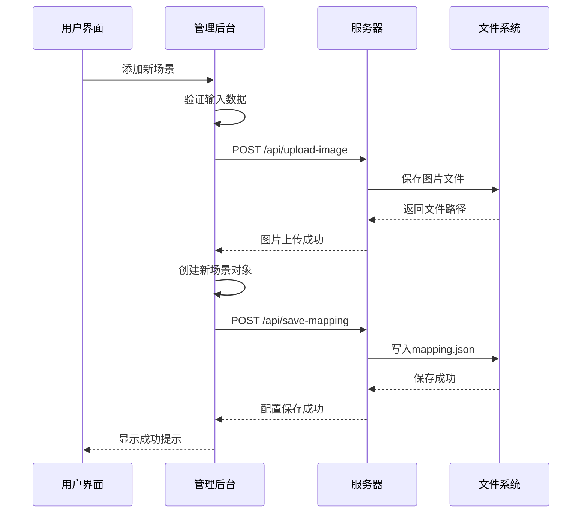
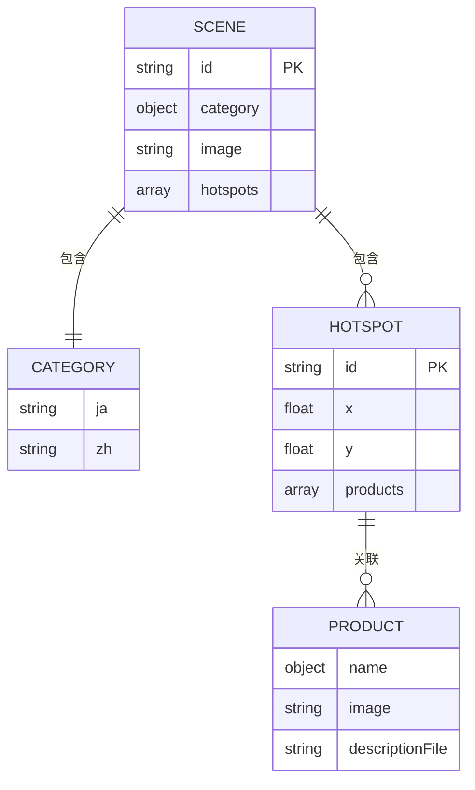
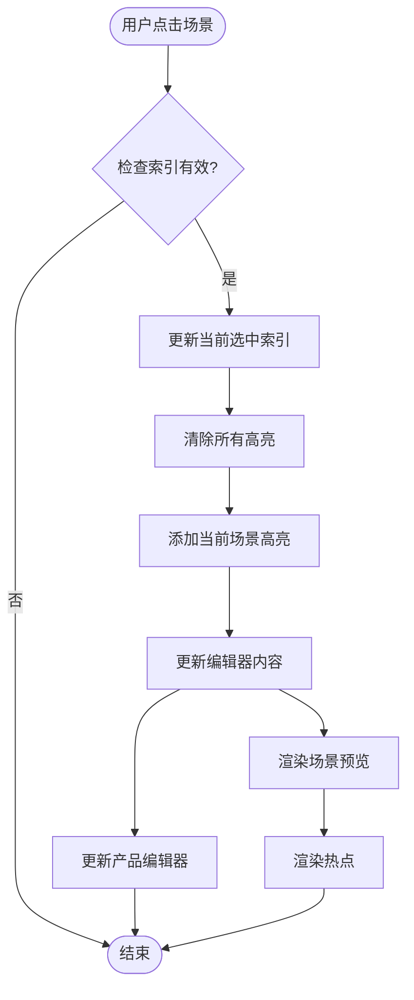
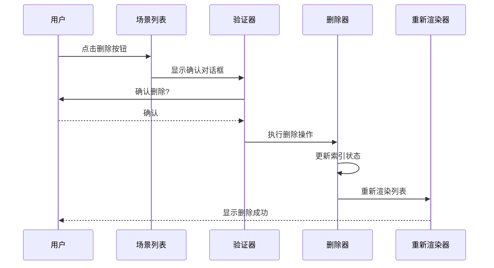
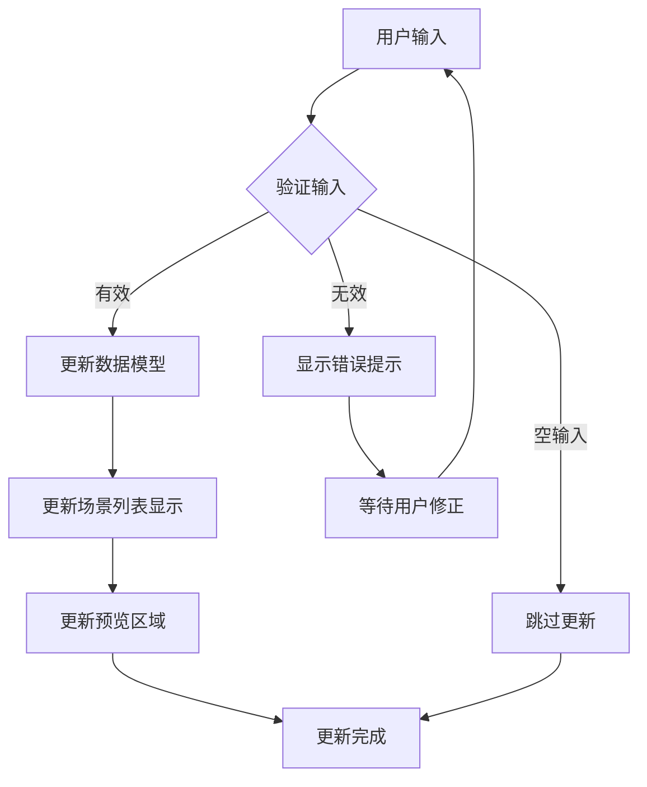
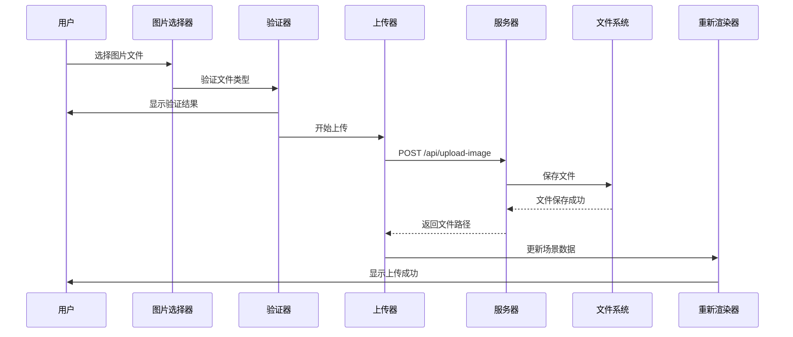
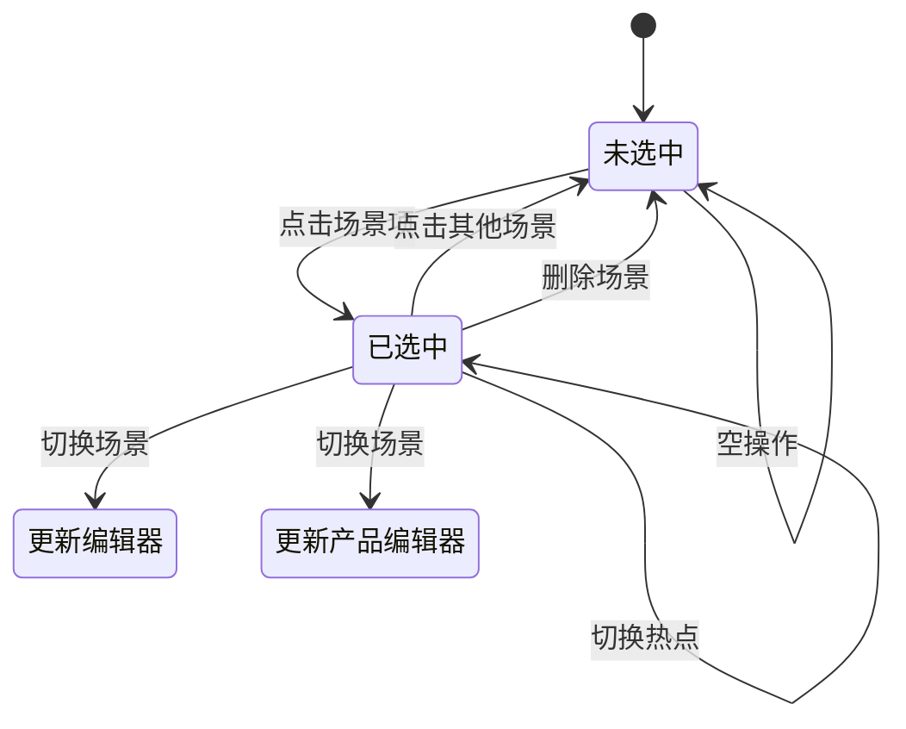
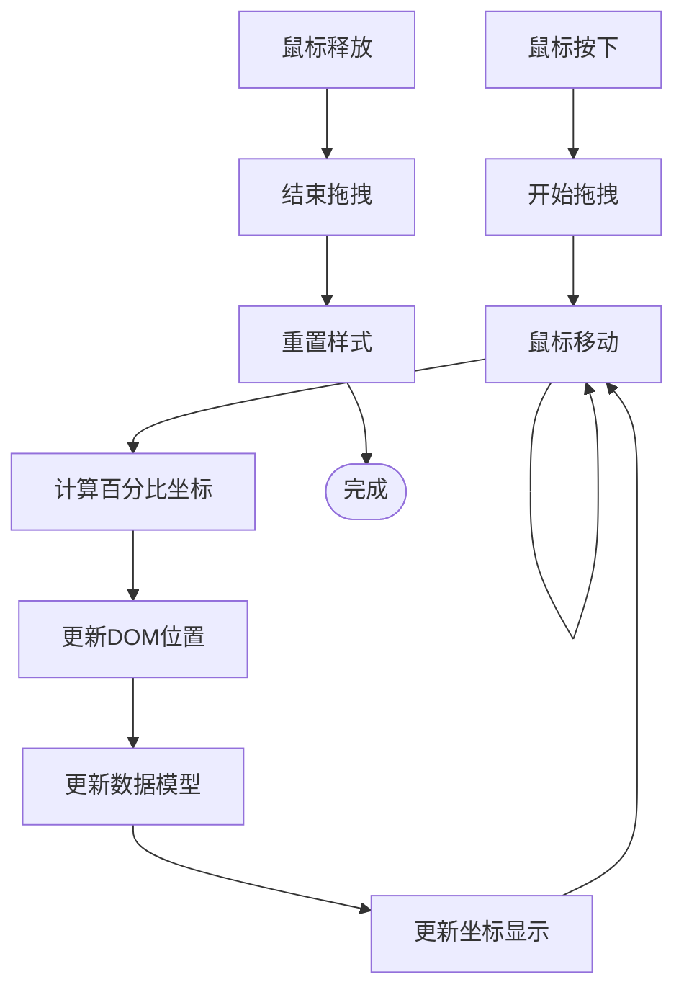

# 场景管理功能

<cite>
**本文档引用的文件**
- [manage.html](file://manage.html)
- [js/manage.js](file://js/manage.js)
- [mapping.json](file://mapping.json)
- [css/manage.css](file://css/manage.css)
- [启动服务器.py](file://启动服务器.py)
- [index.html](file://index.html)
- [js/main.js](file://js/main.js)
- [css/style.css](file://css/style.css)
</cite>

## 目录
1. [简介](#简介)
2. [项目结构](#项目结构)
3. [核心组件](#核心组件)
4. [架构概览](#架构概览)
5. [详细组件分析](#详细组件分析)
6. [依赖关系分析](#依赖关系分析)
7. [性能考虑](#性能考虑)
8. [故障排除指南](#故障排除指南)
9. [结论](#结论)

## 简介

场景管理功能是数字标牌管理系统的核心模块，负责场景列表的显示和管理、场景信息编辑、场景图上传和更换、场景选择和切换等完整功能。该系统采用纯原生JavaScript实现，无任何外部依赖，提供了直观的三栏布局界面，支持实时数据编辑和保存。

## 项目结构

该项目采用清晰的模块化组织结构，主要包含以下核心部分：

```mermaid
graph TB
subgraph "前端界面层"
A[manage.html] --> B[js/manage.js]
C[index.html] --> D[js/main.js]
end
subgraph "样式层"
E[css/manage.css] --> A
F[css/style.css] --> C
end
subgraph "数据层"
G[mapping.json] --> B
G --> D
end
subgraph "服务器层"
H[启动服务器.py] --> I[API端点]
I --> J[/api/save-mapping]
I --> K[/api/upload-image]
I --> L[/api/list-images]
I --> M[/api/list-descriptions]
end
B --> H
D --> H
```

**图表来源**
- [manage.html:1-113](file://manage.html#L1-L113)
- [js/manage.js:1-811](file://js/manage.js#L1-L811)
- [启动服务器.py:25-252](file://启动服务器.py#L25-L252)

**章节来源**
- [manage.html:1-113](file://manage.html#L1-L113)
- [js/manage.js:18-31](file://js/manage.js#L18-L31)
- [启动服务器.py:25-252](file://启动服务器.py#L25-L252)

## 核心组件

场景管理功能由三个主要组件构成：

### 1. 场景列表面板
- **职责**：显示所有场景的缩略图和分类名称
- **功能**：场景选择、删除、排序
- **交互**：点击切换场景，悬停显示删除按钮

### 2. 场景编辑面板
- **职责**：编辑场景基本信息和热点
- **功能**：日文和中文分类名编辑、场景图更换、热点添加删除
- **特性**：实时数据同步、拖拽热点位置

### 3. 热点产品关联编辑器
- **职责**：管理热点与产品的关联关系
- **功能**：产品信息编辑、图片选择、描述文件关联
- **特性**：多产品支持、实时预览

**章节来源**
- [manage.html:21-79](file://manage.html#L21-L79)
- [js/manage.js:112-185](file://js/manage.js#L112-L185)
- [js/manage.js:440-465](file://js/manage.js#L440-L465)

## 架构概览

系统采用前后端分离的架构设计，前端负责用户界面和交互逻辑，后端提供RESTful API服务。



**图表来源**
- [js/manage.js:690-728](file://js/manage.js#L690-L728)
- [启动服务器.py:129-202](file://启动服务器.py#L129-L202)

系统架构特点：
- **纯前端应用**：无外部JavaScript库依赖
- **实时数据同步**：输入变更即时反映到界面
- **文件上传处理**：支持图片文件的上传和管理
- **配置持久化**：通过API接口保存到服务器

**章节来源**
- [js/manage.js:76-108](file://js/manage.js#L76-L108)
- [启动服务器.py:75-97](file://启动服务器.py#L75-L97)

## 详细组件分析

### 场景列表管理

场景列表是用户管理场景的主要界面，采用响应式设计，支持多种交互操作。

#### 数据结构设计



**图表来源**
- [mapping.json:3-204](file://mapping.json#L3-L204)

#### 场景选择逻辑



**图表来源**
- [js/manage.js:170-185](file://js/manage.js#L170-L185)
- [js/manage.js:237-265](file://js/manage.js#L237-L265)

#### 场景删除流程



**图表来源**
- [js/manage.js:621-639](file://js/manage.js#L621-L639)

**章节来源**
- [js/manage.js:112-185](file://js/manage.js#L112-L185)
- [js/manage.js:621-639](file://js/manage.js#L621-L639)

### 场景信息编辑功能

场景信息编辑功能支持日文和中文分类名的实时编辑，提供直观的输入体验。

#### 输入验证机制



**图表来源**
- [js/manage.js:190-203](file://js/manage.js#L190-L203)

#### 实时更新机制

场景信息的实时更新通过事件监听器实现，确保用户输入能够即时反映到界面各个部分：

- **分类名输入**：日文和中文输入框分别监听输入事件
- **场景列表同步**：自动更新场景列表中的显示名称
- **预览区域更新**：即时更新场景预览图的标题信息

**章节来源**
- [js/manage.js:190-203](file://js/manage.js#L190-L203)
- [js/manage.js:159-168](file://js/manage.js#L159-L168)

### 场景图上传和更换机制

场景图管理功能提供了完整的图片上传、验证和替换流程。

#### 文件上传流程



**图表来源**
- [js/manage.js:210-221](file://js/manage.js#L210-L221)
- [启动服务器.py:129-202](file://启动服务器.py#L129-L202)

#### 文件类型和大小限制

系统实现了严格的文件验证机制：

- **文件类型限制**：支持WebP、JPG、PNG格式
- **文件大小检查**：通过服务器端验证确保文件大小合理
- **路径安全性**：自动过滤危险字符，防止路径遍历攻击

**章节来源**
- [启动服务器.py:21-22](file://启动服务器.py#L21-L22)
- [js/manage.js:762-781](file://js/manage.js#L762-L781)

### 场景选择和切换交互逻辑

场景选择功能提供了流畅的用户体验，包括视觉反馈和状态同步。

#### 选中状态管理



**图表来源**
- [js/manage.js:170-185](file://js/manage.js#L170-L185)

#### 视觉反馈设计

系统提供了多层次的视觉反馈：

- **场景列表高亮**：选中场景显示蓝色边框和背景
- **热点选中效果**：红色脉冲动画突出显示
- **拖拽状态指示**：拖拽时热点放大并改变阴影效果
- **操作状态提示**：保存状态显示成功/失败状态

**章节来源**
- [css/manage.css:174-177](file://css/manage.css#L174-L177)
- [css/manage.css:402-408](file://css/manage.css#L402-L408)
- [css/manage.css:420-427](file://css/manage.css#L420-L427)

### 热点管理功能

热点管理是场景编辑的核心功能，支持热点的创建、编辑和删除。

#### 热点拖拽系统



**图表来源**
- [js/manage.js:389-438](file://js/manage.js#L389-L438)

#### 热点产品关联

每个热点可以关联多个产品，支持复杂的产品展示需求：

- **多产品支持**：单个热点可关联多个产品
- **产品信息编辑**：支持产品名称、图片、描述文件的编辑
- **实时预览**：产品信息变更即时反映到界面

**章节来源**
- [js/manage.js:440-541](file://js/manage.js#L440-L541)
- [js/manage.js:389-438](file://js/manage.js#L389-L438)

## 依赖关系分析

场景管理功能的依赖关系体现了清晰的模块化设计：

```mermaid
graph TB
subgraph "管理后台模块"
A[manage.html] --> B[js/manage.js]
B --> C[css/manage.css]
B --> D[mapping.json]
end
subgraph "服务器模块"
E[启动服务器.py] --> F[API端点]
F --> G[/api/save-mapping]
F --> H[/api/upload-image]
F --> I[/api/list-images]
F --> J[/api/list-descriptions]
end
subgraph "展示模块"
K[index.html] --> L[js/main.js]
L --> D
L --> C
end
B --> E
L --> E
D --> E
```

**图表来源**
- [js/manage.js:18-31](file://js/manage.js#L18-L31)
- [启动服务器.py:25-252](file://启动服务器.py#L25-L252)

**章节来源**
- [js/manage.js:18-31](file://js/manage.js#L18-L31)
- [启动服务器.py:25-252](file://启动服务器.py#L25-L252)

## 性能考虑

场景管理功能在设计时充分考虑了性能优化：

### 图片加载优化
- **懒加载机制**：场景缩略图使用懒加载减少初始加载时间
- **预加载策略**：场景图片和产品图片统一预加载到浏览器缓存
- **缓存利用**：已预加载的图片直接从缓存显示，避免重复下载

### 数据处理优化
- **增量更新**：只更新受影响的DOM元素，避免全量重绘
- **事件委托**：使用事件委托减少事件监听器数量
- **防抖处理**：窗口调整事件使用防抖避免频繁重绘

### 内存管理
- **及时清理**：对话框关闭时清理相关DOM元素
- **资源释放**：上传完成后清理文件输入控件
- **状态管理**：使用单一数据源避免数据冗余

## 故障排除指南

### 常见问题及解决方案

#### 文件上传失败
**问题现象**：图片上传后显示失败提示
**可能原因**：
- 文件格式不支持（仅支持WebP、JPG、PNG）
- 服务器权限问题
- 网络连接中断

**解决步骤**：
1. 检查文件格式是否为WebP、JPG或PNG
2. 确认服务器进程正常运行
3. 检查网络连接稳定性
4. 查看浏览器控制台错误信息

#### 场景无法显示
**问题现象**：场景列表为空或场景图不显示
**可能原因**：
- mapping.json文件损坏
- 场景图片路径错误
- 服务器未正确启动

**解决步骤**：
1. 检查mapping.json文件格式是否正确
2. 验证场景图片路径是否存在
3. 重启服务器进程
4. 清除浏览器缓存后重试

#### 热点拖拽异常
**问题现象**：热点拖拽位置不准确或无法拖拽
**可能原因**：
- 图片尚未完全加载
- 浏览器兼容性问题
- DOM结构被意外修改

**解决步骤**：
1. 确保场景图片完全加载后再进行拖拽
2. 尝试刷新页面重新加载
3. 检查是否有其他JavaScript错误影响
4. 在不同浏览器中测试

#### 数据保存失败
**问题现象**：点击保存后状态显示失败
**可能原因**：
- 服务器未启动或端口被占用
- 网络连接问题
- 权限不足

**解决步骤**：
1. 确认服务器进程正在运行
2. 检查端口8082是否被其他程序占用
3. 验证网络连接正常
4. 检查服务器日志获取详细错误信息

**章节来源**
- [js/manage.js:783-803](file://js/manage.js#L783-L803)
- [启动服务器.py:254-263](file://启动服务器.py#L254-L263)

## 结论

场景管理功能是一个设计精良、功能完整的管理系统。它通过清晰的架构设计、直观的用户界面和完善的错误处理机制，为用户提供了一个高效、可靠的场景管理解决方案。

### 主要优势
- **纯原生实现**：无外部依赖，部署简单
- **实时交互**：所有操作都提供即时反馈
- **数据持久化**：通过API接口确保数据安全存储
- **扩展性强**：模块化设计便于功能扩展

### 技术亮点
- **响应式设计**：适应不同屏幕尺寸
- **性能优化**：图片预加载和懒加载策略
- **用户体验**：流畅的动画和视觉反馈
- **错误处理**：完善的错误提示和恢复机制

该系统为数字标牌产品的场景管理提供了坚实的技术基础，能够满足各种规模的应用需求。