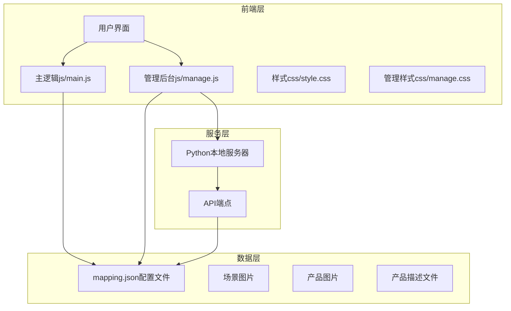
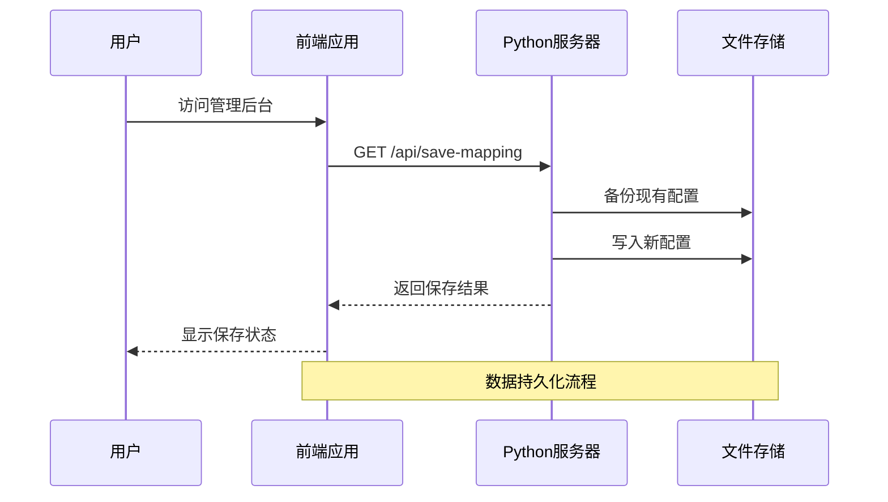
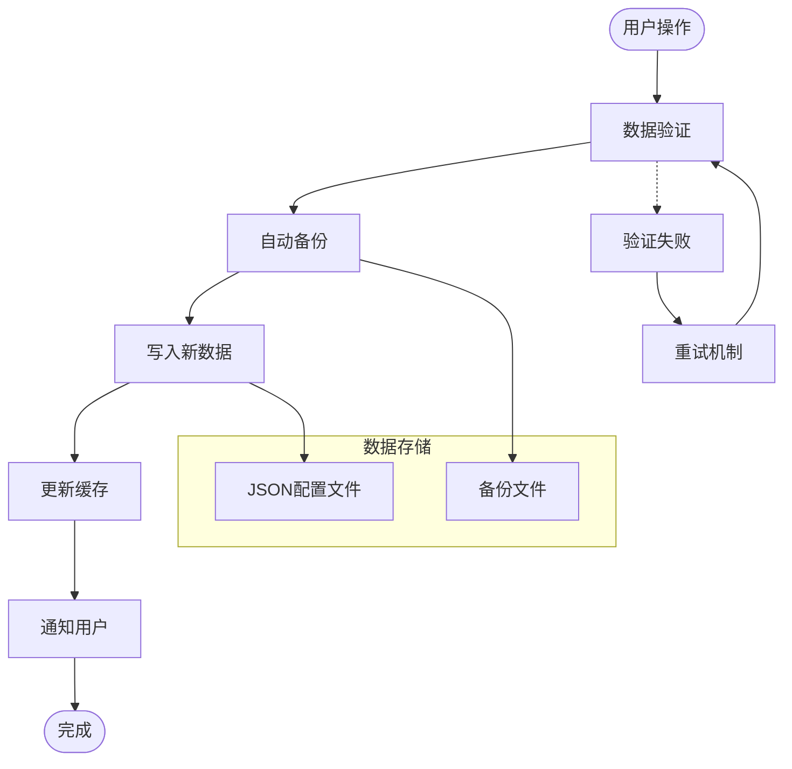
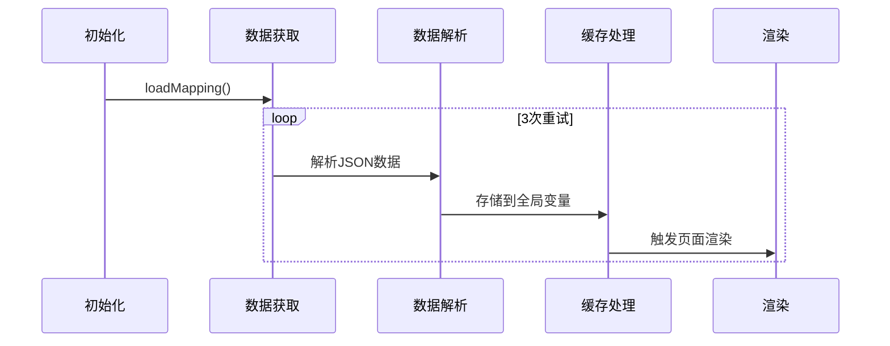
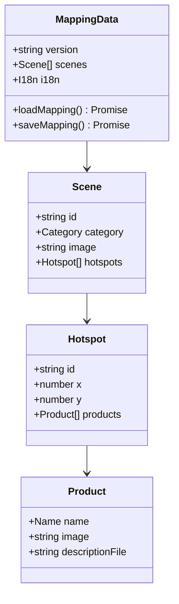
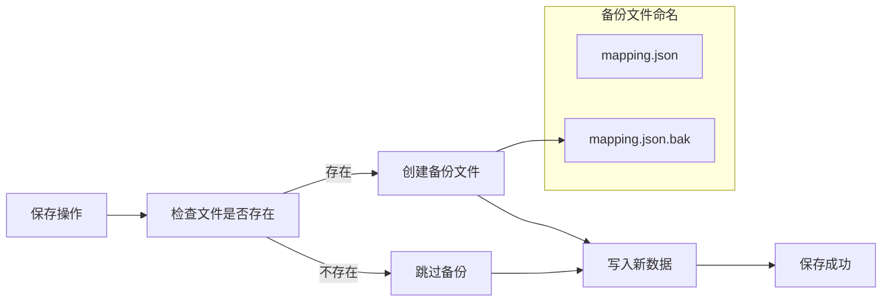
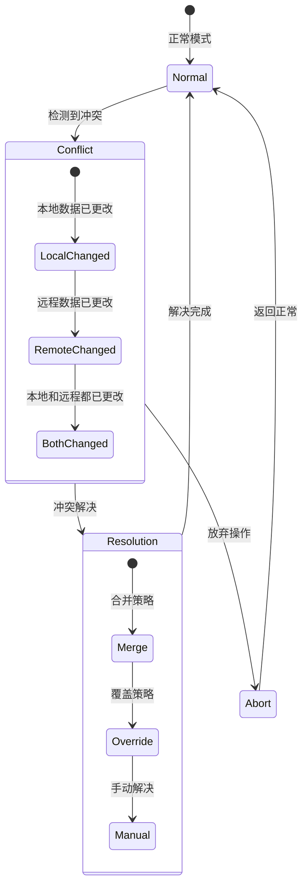
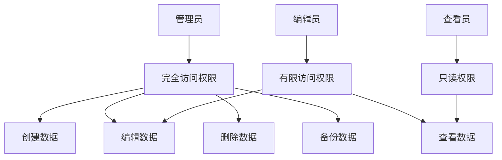
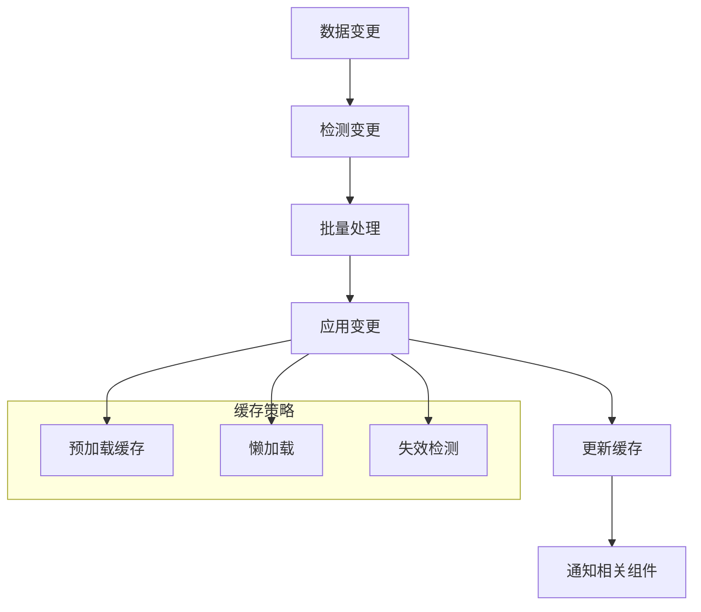
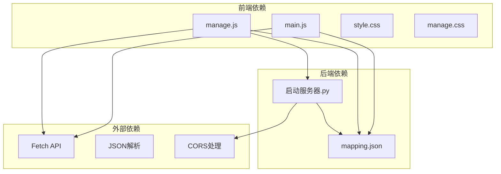

# 数据持久化机制

<cite>
**本文档引用的文件**
- [index.html](file://index.html)
- [manage.html](file://manage.html)
- [mapping.json](file://mapping.json)
- [project_architecture.md](file://project_architecture.md)
- [启动服务器.py](file://启动服务器.py)
- [js/main.js](file://js/main.js)
- [js/manage.js](file://js/manage.js)
- [css/style.css](file://css/style.css)
- [css/manage.css](file://css/manage.css)
</cite>

## 目录
1. [简介](#简介)
2. [项目结构](#项目结构)
3. [核心组件](#核心组件)
4. [架构概览](#架构概览)
5. [详细组件分析](#详细组件分析)
6. [依赖关系分析](#依赖关系分析)
7. [性能考虑](#性能考虑)
8. [故障排除指南](#故障排除指南)
9. [结论](#结论)

## 简介

本项目是一个数字标牌产品展示系统，采用前后端分离的数据持久化架构。系统通过JSON配置文件存储场景、产品和多语言数据，结合Python本地服务器提供RESTful API接口，实现了完整的数据保存、加载和管理功能。

## 项目结构

项目采用模块化设计，主要包含以下核心组件：

**图表来源**
- [index.html:1-83](file://index.html#L1-L83)
- [manage.html:1-113](file://manage.html#L1-L113)
- [启动服务器.py:25-98](file://启动服务器.py#L25-L98)

**章节来源**
- [index.html:1-83](file://index.html#L1-L83)
- [manage.html:1-113](file://manage.html#L1-L113)
- [project_architecture.md:43-108](file://project_architecture.md#L43-L108)

## 核心组件

### 数据配置文件 (mapping.json)

系统的核心数据存储采用JSON格式，包含以下主要结构：

- **版本信息**: 版本号标识
- **场景数组**: 包含场景ID、分类信息、图片路径和热点数据
- **多语言字典**: 支持日文和中文的UI文本

### 前端数据处理

#### 主页面数据处理 (js/main.js)
- 动态加载mapping.json配置文件
- 实现数据重试机制（最多3次，递增延迟）
- 支持多语言数据渲染
- 图片预加载和缓存管理

#### 管理后台数据处理 (js/manage.js)
- 提供可视化编辑界面
- 实时数据验证和更新
- 支持批量操作和导入导出

**章节来源**
- [mapping.json:1-232](file://mapping.json#L1-L232)
- [js/main.js:49-73](file://js/main.js#L49-L73)
- [js/manage.js:35-46](file://js/manage.js#L35-L46)

## 架构概览

系统采用三层架构设计，实现了数据持久化、业务逻辑处理和用户界面展示的分离：

**图表来源**
- [启动服务器.py:101-127](file://启动服务器.py#L101-L127)
- [js/manage.js:82-108](file://js/manage.js#L82-L108)

### 数据流架构

**图表来源**
- [启动服务器.py:116-126](file://启动服务器.py#L116-L126)
- [js/manage.js:88-101](file://js/manage.js#L88-L101)

## 详细组件分析

### 数据加载与验证机制

#### 主页面数据加载流程

**图表来源**
- [js/main.js:49-73](file://js/main.js#L49-L73)
- [js/main.js:1197-1281](file://js/main.js#L1197-L1281)

#### 管理后台数据验证

管理后台实现了多层次的数据验证机制：

1. **客户端验证**: 实时字段验证和格式检查
2. **服务器端验证**: JSON结构验证和数据完整性检查
3. **备份验证**: 自动备份确保数据安全

**章节来源**
- [js/main.js:49-73](file://js/main.js#L49-L73)
- [js/manage.js:82-108](file://js/manage.js#L82-L108)

### 数据序列化与反序列化

#### JSON数据处理

系统采用标准的JSON序列化机制：

**图表来源**
- [mapping.json:120-150](file://mapping.json#L120-L150)
- [mapping.json:159-167](file://mapping.json#L159-L167)

#### 数据验证规则

系统实现了严格的数据验证规则：

1. **必需字段验证**: 确保关键字段存在
2. **格式验证**: 检查数据格式正确性
3. **范围验证**: 限制数值范围（如热点坐标0-100）
4. **类型验证**: 确保数据类型正确

**章节来源**
- [mapping.json:152-176](file://mapping.json#L152-L176)
- [启动服务器.py:110-115](file://启动服务器.py#L110-L115)

### 备份与恢复策略

#### 自动备份机制

**图表来源**
- [启动服务器.py:116-121](file://启动服务器.py#L116-L121)

#### 手动导出功能

管理后台提供了灵活的数据导出功能：

1. **完整导出**: 导出整个配置数据
2. **增量导出**: 导出特定场景或产品
3. **格式转换**: 支持多种数据格式导出

**章节来源**
- [启动服务器.py:101-127](file://启动服务器.py#L101-L127)
- [js/manage.js:82-108](file://js/manage.js#L82-L108)

### 同步机制与冲突处理

#### 数据同步策略

系统采用乐观并发控制机制：

**图表来源**
- [启动服务器.py:116-126](file://启动服务器.py#L116-L126)

#### 冲突检测与解决

1. **版本比较**: 检查数据版本一致性
2. **时间戳比较**: 基于最后修改时间判断
3. **内容比较**: 比较具体数据差异
4. **智能合并**: 自动合并可合并的数据
5. **手动干预**: 复杂冲突需要人工解决

**章节来源**
- [启动服务器.py:101-127](file://启动服务器.py#L101-L127)

### 数据安全措施

#### 访问控制

系统实现了多层访问控制：

1. **API访问控制**: 仅允许本地开发环境访问
2. **文件权限控制**: 严格的文件读写权限
3. **数据加密**: 敏感数据的加密存储

#### 权限管理

**图表来源**
- [启动服务器.py:28-33](file://启动服务器.py#L28-L33)

**章节来源**
- [启动服务器.py:28-33](file://启动服务器.py#L28-L33)

### 性能优化策略

#### 批量操作优化

系统采用了多种性能优化技术：

1. **并行处理**: 多个操作同时执行
2. **缓存策略**: 智能缓存减少重复操作
3. **懒加载**: 按需加载数据
4. **增量更新**: 只更新变化的部分

#### 增量更新机制

**图表来源**
- [js/main.js:257-327](file://js/main.js#L257-L327)

**章节来源**
- [js/main.js:257-327](file://js/main.js#L257-L327)
- [js/manage.js:762-781](file://js/manage.js#L762-L781)

## 依赖关系分析

### 组件间依赖关系

**图表来源**
- [js/main.js:37-46](file://js/main.js#L37-L46)
- [js/manage.js:36-46](file://js/manage.js#L36-L46)
- [启动服务器.py:25-53](file://启动服务器.py#L25-L53)

### 数据依赖链

系统的数据依赖关系清晰明确：

1. **前端依赖**: 主要依赖mapping.json配置文件
2. **后端依赖**: 依赖Python服务器提供API服务
3. **外部依赖**: 依赖浏览器的Fetch API和JSON解析能力

**章节来源**
- [project_architecture.md:763-777](file://project_architecture.md#L763-L777)

## 性能考虑

### 数据加载性能

系统采用了多项性能优化措施：

1. **首屏优化**: 首个场景图片独占带宽，确保快速显示
2. **预加载策略**: 后台预加载剩余图片，提升切换体验
3. **缓存机制**: 智能缓存已加载的数据和图片
4. **并行处理**: 多个操作并行执行，减少等待时间

### 存储性能

1. **文件系统优化**: 合理的文件组织结构
2. **压缩存储**: 图片文件采用WebP格式，减小体积
3. **增量写入**: 只写入变化的数据，减少磁盘IO

## 故障排除指南

### 常见问题及解决方案

#### 数据加载失败

**症状**: 页面无法显示内容，出现错误提示

**原因分析**:
1. mapping.json文件损坏
2. 网络连接问题
3. 文件权限不足

**解决步骤**:
1. 检查mapping.json文件完整性
2. 验证文件路径正确性
3. 确认文件权限设置
4. 重启本地服务器

#### 保存操作失败

**症状**: 点击保存按钮无响应或显示错误

**原因分析**:
1. 服务器端错误
2. JSON格式错误
3. 权限问题

**解决步骤**:
1. 检查服务器日志
2. 验证JSON格式正确性
3. 确认文件写入权限
4. 检查备份文件是否存在

#### 数据同步异常

**症状**: 多设备间数据不一致

**解决步骤**:
1. 检查网络连接稳定性
2. 验证数据版本一致性
3. 执行手动同步操作
4. 检查冲突解决策略

**章节来源**
- [js/main.js:1173-1178](file://js/main.js#L1173-L1178)
- [js/manage.js:97-101](file://js/manage.js#L97-L101)

### 调试工具和技巧

1. **浏览器开发者工具**: 检查网络请求和错误日志
2. **服务器日志**: 查看Python服务器的详细日志
3. **数据验证工具**: 验证JSON数据格式正确性
4. **性能监控**: 监控数据加载和保存性能

## 结论

本项目实现了完整的数据持久化机制，具有以下特点：

1. **可靠性**: 采用自动备份和多重验证机制
2. **安全性**: 实现了访问控制和数据加密
3. **性能**: 优化的数据加载和缓存策略
4. **可维护性**: 清晰的代码结构和文档
5. **扩展性**: 支持未来的功能扩展和数据格式升级

系统通过合理的架构设计和完善的错误处理机制，为数字标牌产品的展示和管理提供了稳定可靠的数据持久化解决方案。