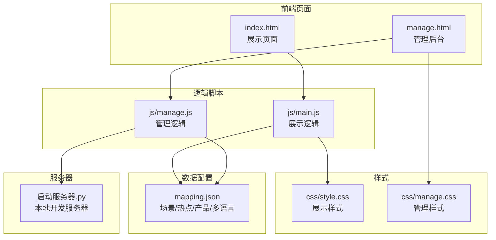
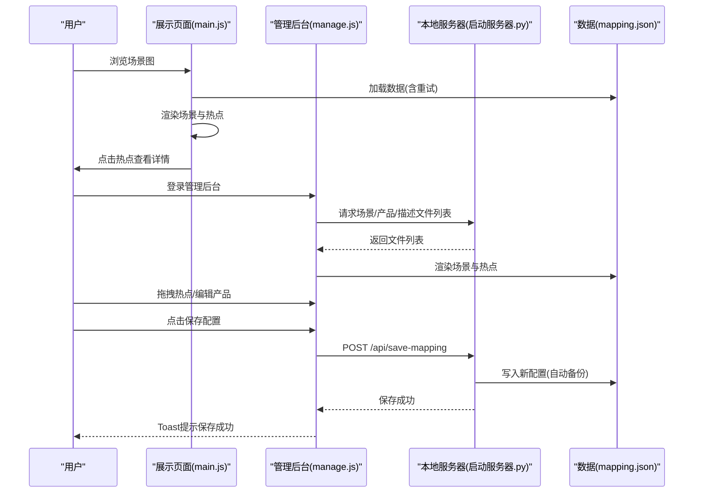
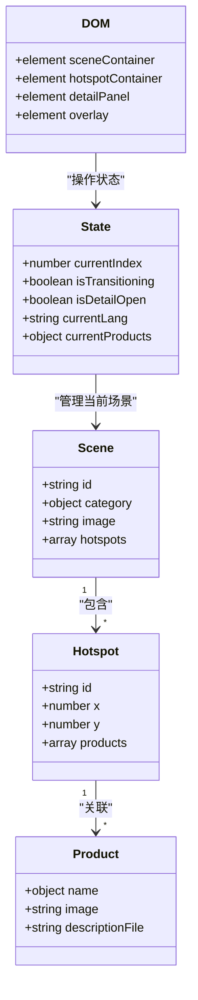
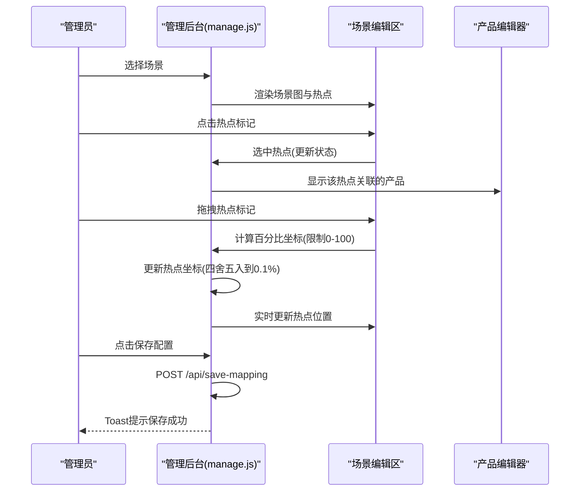
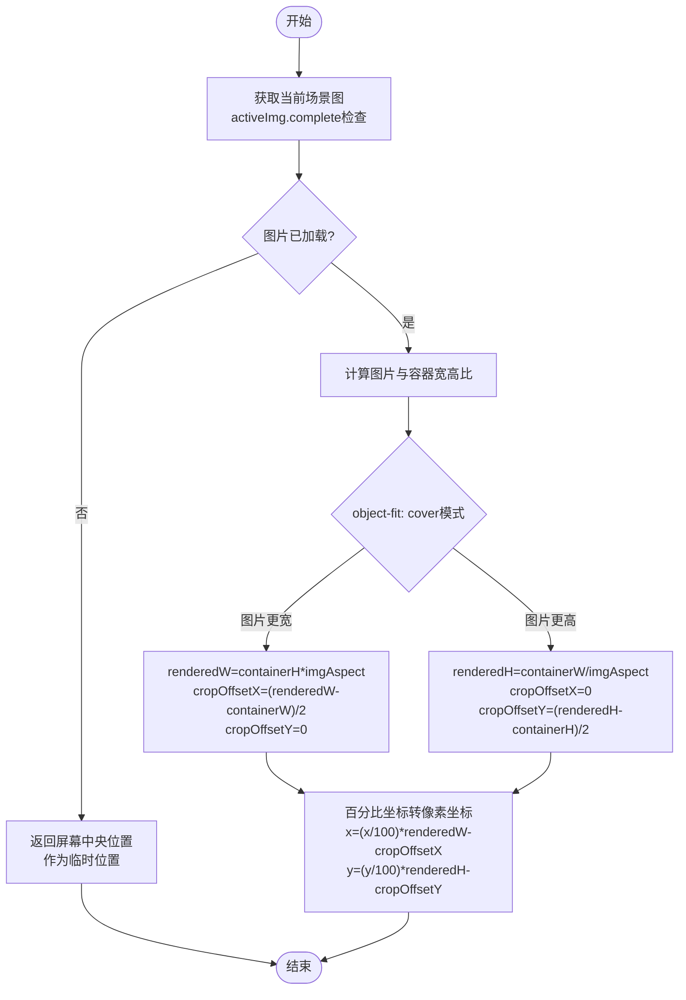
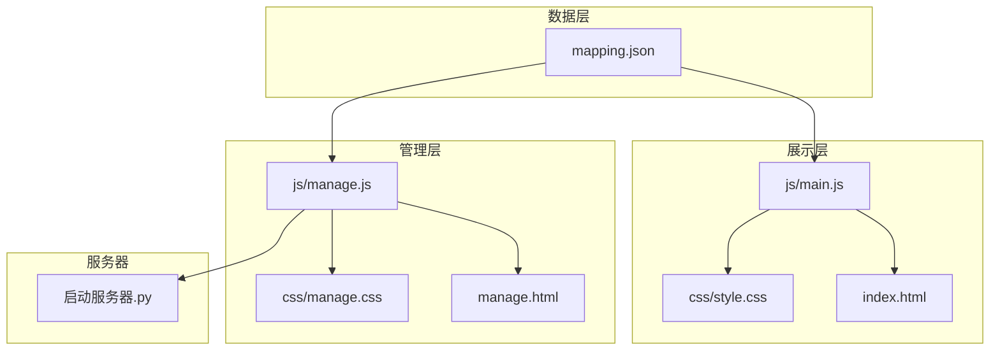

# 热点编辑系统

<cite>
**本文档引用的文件**
- [index.html](file://index.html)
- [manage.html](file://manage.html)
- [mapping.json](file://mapping.json)
- [js/main.js](file://js/main.js)
- [js/manage.js](file://js/manage.js)
- [css/style.css](file://css/style.css)
- [css/manage.css](file://css/manage.css)
- [project_architecture.md](file://project_architecture.md)
- [启动服务器.py](file://启动服务器.py)
</cite>

## 目录
1. [简介](#简介)
2. [项目结构](#项目结构)
3. [核心组件](#核心组件)
4. [架构总览](#架构总览)
5. [详细组件分析](#详细组件分析)
6. [依赖关系分析](#依赖关系分析)
7. [性能考量](#性能考量)
8. [故障排除指南](#故障排除指南)
9. [结论](#结论)

## 简介
本系统是一个基于浏览器的数字标牌产品展示与管理平台，包含两个主要页面：
- 展示页面：用户浏览场景图，点击热点查看产品详情
- 管理后台：可视化编辑场景、热点坐标与产品关联

系统采用纯原生 JavaScript（无框架），通过 mapping.json 配置数据，支持中日双语切换，并提供完善的热点编辑体验，包括热点创建、拖拽、删除、坐标调整与产品关联管理。

## 项目结构
项目采用前后端分离的数据驱动架构，核心文件组织如下：
- 前端页面：index.html（展示）、manage.html（管理）
- 样式：css/style.css（展示样式）、css/manage.css（管理样式）
- 逻辑：js/main.js（展示逻辑）、js/manage.js（管理逻辑）
- 数据：mapping.json（场景、热点、产品、多语言配置）
- 服务器：启动服务器.py（本地开发服务器，提供 API）

**图表来源**
- [index.html:1-83](file://index.html#L1-L83)
- [manage.html:1-113](file://manage.html#L1-L113)
- [mapping.json:1-232](file://mapping.json#L1-L232)
- [js/main.js:1-1284](file://js/main.js#L1-L1284)
- [js/manage.js:1-811](file://js/manage.js#L1-L811)
- [css/style.css:1-997](file://css/style.css#L1-L997)
- [css/manage.css:1-824](file://css/manage.css#L1-L824)
- [启动服务器.py](file://启动服务器.py)

**章节来源**
- [project_architecture.md:43-108](file://project_architecture.md#L43-L108)

## 核心组件
系统围绕“热点”这一核心概念构建，包含以下关键组件：

- 数据层（mapping.json）
  - 场景：包含分类名、场景图路径、热点数组
  - 热点：包含唯一ID、百分比坐标(x,y)、关联产品数组
  - 产品：包含多语言名称、产品图片路径、描述文件路径
  - 多语言：支持日文(ja)与中文(zh)的UI文本与名称

- 展示层（index.html + js/main.js）
  - 场景渲染：双层图片交叉淡入淡出，支持首屏独占带宽策略
  - 热点渲染：脉冲热点，支持多热点同时显示
  - 详情面板：左图右文布局，Markdown渲染，支持并行加载与错误重试
  - 交互：左右切换、分类切换、语言切换、键盘快捷键

- 管理层（manage.html + js/manage.js）
  - 场景管理：场景列表、添加/删除场景、分类名编辑、场景图更换
  - 热点编辑：添加/删除热点、拖拽调整坐标、实时坐标显示
  - 产品关联：为热点添加多个产品，编辑产品名称、图片、描述文件
  - 数据持久化：保存配置到服务器，提供图片上传与文件列表

**章节来源**
- [mapping.json:1-232](file://mapping.json#L1-L232)
- [js/main.js:37-73](file://js/main.js#L37-L73)
- [js/manage.js:6-16](file://js/manage.js#L6-L16)

## 架构总览
系统采用“数据驱动 + 可视化编辑”的双轨架构：
- 数据驱动：前端通过 fetch 动态加载 mapping.json，实现数据与逻辑分离
- 可视化编辑：管理后台提供三栏布局，左栏场景列表、中栏场景编辑区、右栏产品编辑器
- 服务器集成：本地开发服务器提供 API 端点，支持保存配置、上传图片、列出文件

**图表来源**
- [js/main.js:49-73](file://js/main.js#L49-L73)
- [js/manage.js:35-46](file://js/manage.js#L35-L46)
- [启动服务器.py](file://启动服务器.py)

**章节来源**
- [project_architecture.md:763-803](file://project_architecture.md#L763-L803)

## 详细组件分析

### 展示页面（热点可视化）
展示页面负责向用户提供流畅的场景浏览体验，热点作为交互入口，详情面板承载产品信息。

**图表来源**
- [mapping.json:130-167](file://mapping.json#L130-L167)
- [js/main.js:195-204](file://js/main.js#L195-L204)
- [js/main.js:169-188](file://js/main.js#L169-L188)

- 热点渲染与交互
  - 渲染：根据百分比坐标计算像素位置，支持 object-fit: cover 的裁剪偏移
  - 交互：点击热点弹出详情面板，支持键盘关闭、遮罩点击关闭
  - 多热点：支持单场景多热点，每个热点独立定位与动画

- 场景切换与预加载
  - 双层图片：scene-image-a 与 scene-image-b 交替，实现无黑屏交叉淡入淡出
  - 预加载：首屏独占带宽策略，首屏显示后再启动后台预加载
  - 响应式：窗口大小变化时重新定位热点

- 详情面板
  - 左图右文：产品图片 + Markdown描述
  - 并行加载：产品描述并行加载，大幅提升加载速度
  - 错误重试：加载失败时显示可点击重试提示

**章节来源**
- [js/main.js:716-759](file://js/main.js#L716-L759)
- [js/main.js:774-817](file://js/main.js#L774-L817)
- [js/main.js:826-847](file://js/main.js#L826-L847)
- [js/main.js:888-956](file://js/main.js#L888-L956)
- [css/style.css:287-434](file://css/style.css#L287-L434)

### 管理后台（热点编辑）
管理后台提供可视化的热点编辑体验，支持热点的创建、拖拽、删除与坐标调整。

**图表来源**
- [js/manage.js:320-334](file://js/manage.js#L320-L334)
- [js/manage.js:389-438](file://js/manage.js#L389-L438)
- [js/manage.js:82-108](file://js/manage.js#L82-L108)

- 热点拖拽系统
  - 开始拖拽：mousedown 标记 isDragging，添加 dragging 类
  - 拖拽中：mousemove 计算鼠标相对容器的百分比坐标，限制在0-100范围内
  - 结束拖拽：mouseup 清理拖拽状态，更新热点数据与坐标显示
  - 精度控制：坐标四舍五入到0.1%，保证数值稳定性

- 热点选择与状态管理
  - 选中高亮：.editor-hotspot.selected 添加红色脉冲动画
  - 实时坐标：#hotspot-coord-info 显示当前热点坐标
  - 批量操作：支持添加/删除热点，删除热点时连带删除其产品

- 产品关联编辑
  - 名称编辑：支持日文与中文名称分别编辑
  - 图片选择：下拉选择可用图片文件，支持懒加载占位
  - 描述文件：下拉选择可用的 Markdown 描述文件
  - 批量添加：支持为热点添加多个产品

**章节来源**
- [js/manage.js:389-438](file://js/manage.js#L389-L438)
- [js/manage.js:320-334](file://js/manage.js#L320-L334)
- [js/manage.js:442-476](file://js/manage.js#L442-L476)
- [js/manage.js:478-541](file://js/manage.js#L478-L541)
- [css/manage.css:363-427](file://css/manage.css#L363-L427)

### 坐标系统与精度控制
系统采用百分比坐标系，确保热点在不同分辨率与设备上的位置一致性。

**图表来源**
- [js/main.js:774-817](file://js/main.js#L774-L817)
- [js/manage.js:405-422](file://js/manage.js#L405-L422)

- 百分比坐标系
  - 坐标范围：0-100，0表示最左/最上，100表示最右/最下
  - 转换公式：考虑 object-fit: cover 的裁剪偏移，确保热点与图片位置精确对齐
  - 精度控制：拖拽时四舍五入到0.1%，存储时保留一位小数

- 精度与稳定性
  - 图片加载验证：未加载完成时跳过计算，避免错误位置
  - 窗口变化处理：resize 事件触发重新定位，防抖200ms
  - 数据持久化：保存时确保坐标在有效范围内

**章节来源**
- [js/main.js:774-817](file://js/main.js#L774-L817)
- [js/manage.js:405-422](file://js/manage.js#L405-L422)

### 多语言与国际化
系统支持中日双语，UI文本、场景分类名、产品名称均采用多语言配置。

- 多语言引擎
  - t(key)：从 mappingData.i18n[currentLang] 获取翻译文本
  - getText(obj)：从多语言对象获取当前语言的值，支持回退逻辑
  - switchLanguage(lang)：切换语言并刷新所有UI文本与分类标签

- 界面元素
  - 展示页面：页面标题、提示文字、导航按钮、详情面板标题
  - 管理后台：工具栏、场景列表、编辑器标签、对话框内容

**章节来源**
- [js/main.js:87-106](file://js/main.js#L87-L106)
- [js/main.js:119-162](file://js/main.js#L119-L162)
- [mapping.json:205-231](file://mapping.json#L205-L231)

## 依赖关系分析
系统各模块之间的依赖关系清晰，遵循单一职责原则：

**图表来源**
- [js/main.js:1-1284](file://js/main.js#L1-L1284)
- [js/manage.js:1-811](file://js/manage.js#L1-L811)
- [启动服务器.py](file://启动服务器.py)

- 模块耦合
  - 展示层与管理层均依赖 mapping.json，但互不直接通信
  - 管理层通过服务器API与数据层交互，避免直接文件操作
  - 样式层与逻辑层解耦，通过类名约定进行交互

- 外部依赖
  - marked.js：Markdown解析（CDN引入）
  - 本地服务器：提供API端点与静态资源服务

**章节来源**
- [project_architecture.md:29-40](file://project_architecture.md#L29-L40)

## 性能考量
系统在性能方面采取了多项优化措施：

- 图片加载优化
  - 首屏独占带宽：首屏图片加载完成后才启动后台预加载
  - 预加载缓存：Image对象缓存，避免重复下载
  - 加载等待：waitForImageLoad 提供超时保护与完成检测

- 渲染性能
  - requestAnimationFrame：热点渲染与场景切换使用微任务调度
  - 交叉淡入淡出：双层图片切换，无黑屏过渡
  - 防抖处理：窗口resize事件防抖200ms，减少重排重绘

- 数据加载
  - mapping.json加载重试：最多3次，递增延迟500/1000/2000ms
  - Markdown并行加载：产品描述并行加载，提升整体响应速度
  - 缓存机制：descriptionCache避免重复请求

- 用户体验
  - 加载指示器：图片加载中显示旋转动画
  - 骨架屏：产品描述加载占位符，提升感知速度
  - 错误可重试：加载失败时提供点击重试功能

**章节来源**
- [js/main.js:257-327](file://js/main.js#L257-L327)
- [js/main.js:354-395](file://js/main.js#L354-L395)
- [js/main.js:421-442](file://js/main.js#L421-L442)
- [js/main.js:1197-1281](file://js/main.js#L1197-L1281)

## 故障排除指南
针对热点编辑过程中的常见问题，提供以下排查步骤：

- 坐标不准确
  - 检查场景图是否加载完成：calcHotspotPixelPosition会在图片未加载时返回屏幕中央位置
  - 验证百分比坐标范围：拖拽时坐标被限制在0-100之间
  - 窗口变化：resize事件会触发重新定位，确保热点位置正确

- 热点无法拖拽
  - 检查是否正确选中热点：只有选中的热点才能拖拽
  - 确认拖拽事件绑定：mousedown触发startDrag，mousemove触发onDrag
  - 验证容器尺寸：拖拽基于#scene-image-container的getBoundingClientRect()

- 保存失败
  - 检查服务器状态：确认本地服务器正常运行（默认端口8082）
  - 验证请求格式：POST /api/save-mapping需要完整的JSON数据
  - 查看响应状态：保存成功后Toast提示"已保存 ✓"

- 图片加载问题
  - 检查图片路径：确保场景图与产品图片路径正确
  - 验证服务器API：/api/list-images与/api/upload-image是否可用
  - 清理缓存：图片上传后刷新可用图片列表

- 详情面板显示异常
  - 检查Markdown文件：确认描述文件存在且格式正确
  - 验证marked.js：确保CDN加载成功
  - 网络问题：加载失败时可点击重试

**章节来源**
- [js/main.js:774-786](file://js/main.js#L774-L786)
- [js/manage.js:389-438](file://js/manage.js#L389-L438)
- [js/manage.js:82-108](file://js/manage.js#L82-L108)
- [启动服务器.py](file://启动服务器.py)

## 结论
热点编辑系统通过数据驱动与可视化编辑相结合的方式，提供了完整、稳定的场景热点管理解决方案。系统具备以下优势：
- 数据与逻辑分离：mapping.json集中管理，便于维护与扩展
- 可视化编辑：直观的拖拽操作与实时反馈，降低使用门槛
- 性能优化：多语言、图片预加载、并行加载等机制确保流畅体验
- 错误处理：完善的重试与降级机制，提升系统可靠性

建议后续优化方向：
- 增加撤销/重做功能，支持热点编辑的回滚
- 批量热点操作：支持复制、粘贴、批量删除等高级功能
- 热点模板：提供常用热点位置的预设模板
- 数据校验：增加热点坐标有效性检查与冲突检测