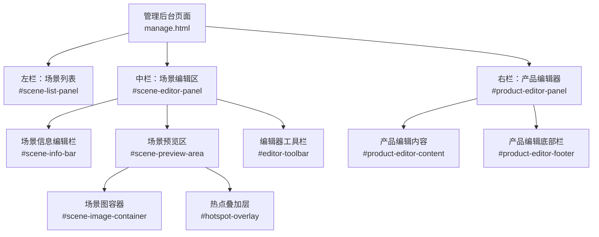
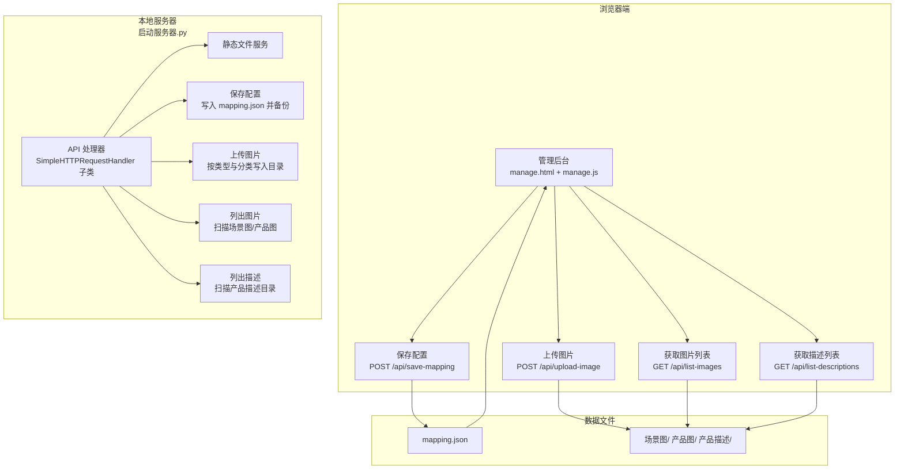
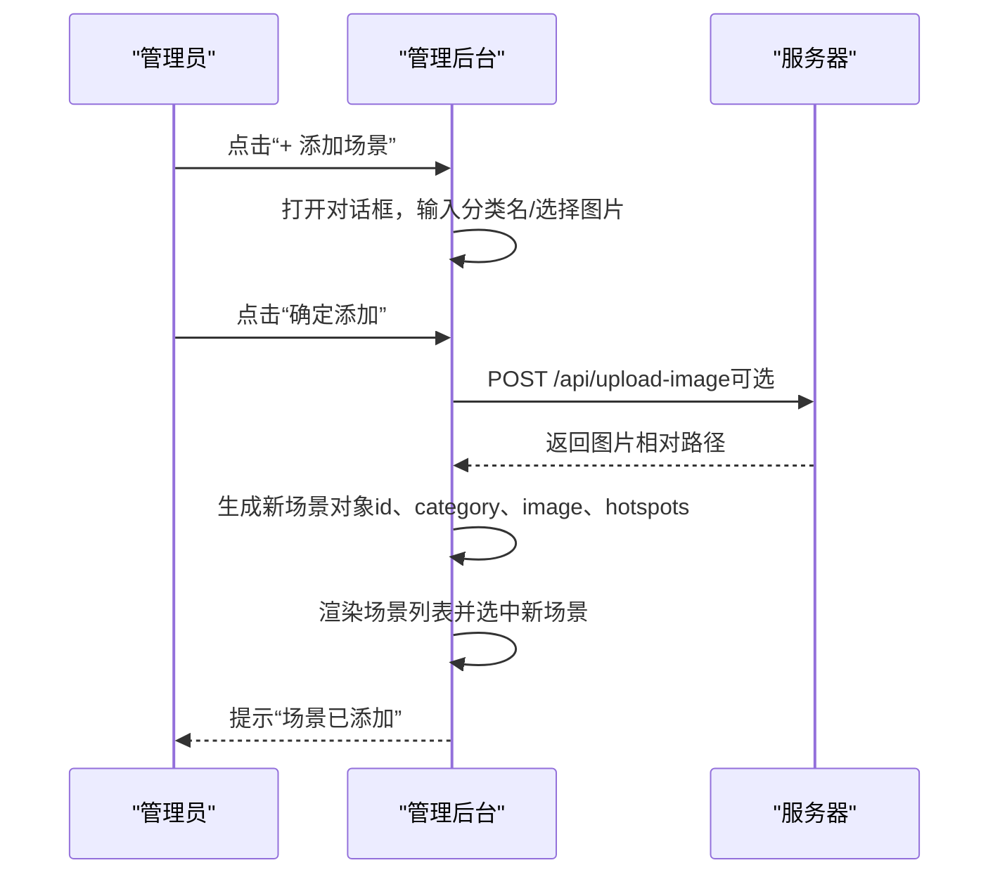
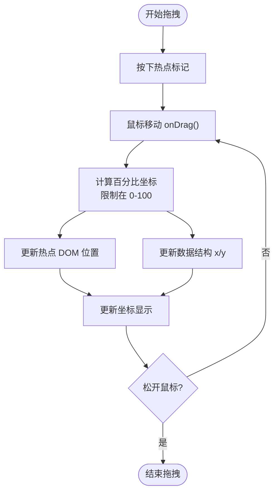
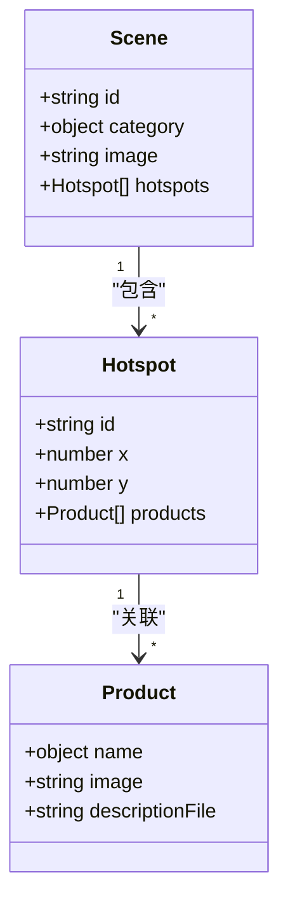
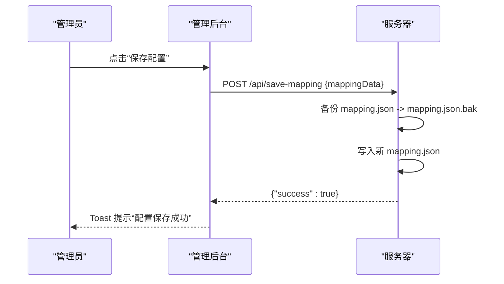
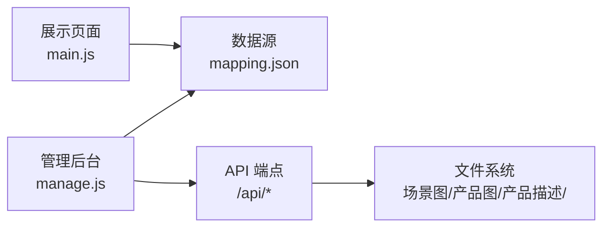

# 管理后台功能

<cite>
**本文引用的文件**
- [manage.html](file://manage.html)
- [manage.js](file://js/manage.js)
- [manage.css](file://css/manage.css)
- [main.js](file://js/main.js)
- [mapping.json](file://mapping.json)
- [project_architecture.md](file://project_architecture.md)
- [启动服务器.py](file://启动服务器.py)
</cite>

## 目录
1. [简介](#简介)
2. [项目结构](#项目结构)
3. [核心组件](#核心组件)
4. [架构总览](#架构总览)
5. [详细组件分析](#详细组件分析)
6. [依赖关系分析](#依赖关系分析)
7. [性能考量](#性能考量)
8. [故障排除指南](#故障排除指南)
9. [结论](#结论)
10. [附录](#附录)

## 简介
本文件面向数字标牌产品展示项目的管理后台，系统性阐述“管理后台”的页面结构、三栏布局设计、场景管理、热点编辑、产品关联管理、可视化编辑体验、数据持久化与备份恢复、版本策略、用户操作指南与最佳实践，以及常见问题排查方法。目标是帮助管理员高效维护产品配置，同时为开发者提供清晰的技术参考。

## 项目结构
管理后台位于独立页面，采用三栏布局：
- 左栏：场景列表，支持添加/删除场景、切换场景、实时显示缩略图与分类名
- 中栏：场景编辑区，支持场景图更换、热点添加/删除、热点拖拽定位、坐标实时显示
- 右栏：热点产品关联编辑器，支持产品名称（日/中）、图片、描述文件的编辑与增删

图表来源
- [manage.html:19-80](file://manage.html#L19-L80)

章节来源
- [manage.html:1-113](file://manage.html#L1-L113)
- [manage.css:93-118](file://css/manage.css#L93-L118)

## 核心组件
- 三栏布局与样式：通过 CSS 控制面板宽度、滚动条、工具栏与面板头部/底部样式
- 场景列表渲染与交互：渲染缩略图、分类名、删除按钮；点击切换当前场景
- 场景编辑区：分类名输入（日/中）、场景图更换、热点添加/删除、坐标显示
- 热点系统：创建热点标记、拖拽定位、选中态高亮、坐标更新
- 产品编辑器：产品项头部（缩略图+名称字段）、图片/描述文件选择、删除产品、添加产品
- 保存与提示：保存按钮触发保存 API，Toast 提示状态与结果
- 对话框：添加场景对话框，支持分类名输入与图片上传

章节来源
- [manage.js:110-185](file://js/manage.js#L110-L185)
- [manage.js:187-265](file://js/manage.js#L187-L265)
- [manage.js:267-385](file://js/manage.js#L267-L385)
- [manage.js:440-617](file://js/manage.js#L440-L617)
- [manage.js:783-803](file://js/manage.js#L783-L803)
- [manage.html:85-108](file://manage.html#L85-L108)

## 架构总览
管理后台与展示页面共享同一数据源 mapping.json，管理后台负责可视化编辑与保存，展示页面负责渲染与交互。本地开发服务器提供 API 端点，支持保存配置、上传图片、列出图片与描述文件。

图表来源
- [manage.js:81-108](file://js/manage.js#L81-L108)
- [manage.js:48-72](file://js/manage.js#L48-L72)
- [manage.js:762-781](file://js/manage.js#L762-L781)
- [启动服务器.py:25-98](file://启动服务器.py#L25-L98)
- [启动服务器.py:101-127](file://启动服务器.py#L101-L127)
- [启动服务器.py:129-202](file://启动服务器.py#L129-L202)
- [启动服务器.py:204-251](file://启动服务器.py#L204-L251)

章节来源
- [project_architecture.md:763-777](file://project_architecture.md#L763-L777)
- [启动服务器.py:1-298](file://启动服务器.py#L1-L298)

## 详细组件分析

### 场景管理
- 添加场景
  - 点击“+ 添加场景”打开对话框，输入日/中分类名，可选择场景图上传，确认后生成新场景并自动选中
  - 上传成功后刷新图片列表，保证下拉选择可用
- 删除场景
  - 在场景项悬停显示的“×”按钮，点击后确认删除，调整当前选中索引，更新列表与编辑区
- 切换场景
  - 点击场景项高亮显示，更新中栏场景图与热点，更新右栏产品编辑器
- 场景图更换
  - 点击“更换场景图”，选择本地图片，上传成功后更新当前场景 image 字段，刷新预览与列表缩略图

图表来源
- [manage.js:649-728](file://js/manage.js#L649-L728)
- [manage.js:762-781](file://js/manage.js#L762-L781)

章节来源
- [manage.js:619-647](file://js/manage.js#L619-L647)
- [manage.js:649-728](file://js/manage.js#L649-L728)
- [manage.js:205-221](file://js/manage.js#L205-L221)

### 热点编辑系统
- 创建热点
  - 点击“添加热点”，在当前场景 hotspots 中追加新热点，初始坐标为 (50,50)，并选中该热点
- 拖拽热点
  - 鼠标按下热点标记开始拖拽，实时计算百分比坐标并更新 DOM 位置，同时更新数据结构中的 x/y
  - 拖拽结束释放鼠标，恢复正常层级
- 删除热点
  - 选中热点后点击“删除选中热点”，从场景 hotspots 中移除，清空坐标信息与产品编辑器
- 坐标显示
  - 选中热点后，底部工具栏显示热点序号与当前坐标百分比，随拖拽实时更新

图表来源
- [manage.js:387-438](file://js/manage.js#L387-L438)
- [manage.js:336-347](file://js/manage.js#L336-L347)

章节来源
- [manage.js:349-385](file://js/manage.js#L349-L385)
- [manage.js:387-438](file://js/manage.js#L387-L438)
- [manage.js:336-347](file://js/manage.js#L336-L347)

### 产品关联管理
- 选中热点后，右栏显示“热点 N 关联产品”，否则显示“请先在场景图中选择一个热点”
- 产品编辑项包含：
  - 头部：产品缩略图 + 名称（日/中）字段
  - 图片选择：下拉选择器，选项来自服务器列出的图片列表
  - 描述文件选择：下拉选择器，选项来自服务器列出的描述文件列表
  - 删除按钮：从热点 products 中移除该产品
- 添加产品
  - 点击“+ 添加产品到此热点”，向当前热点 products 追加空产品对象，自动滚动到底部便于编辑

图表来源
- [mapping.json:120-150](file://mapping.json#L120-L150)

章节来源
- [manage.js:440-465](file://js/manage.js#L440-L465)
- [manage.js:467-541](file://js/manage.js#L467-L541)
- [manage.js:598-617](file://js/manage.js#L598-L617)

### 可视化编辑体验
- 实时预览
  - 场景图加载完成后渲染热点；图片加载失败/超时则不渲染热点，避免黑屏上出现孤立热点
- 拖拽操作
  - 热点拖拽采用百分比坐标，拖拽态提升层级并放大，选中态有红色脉冲动画
- 即时反馈
  - Toast 提示保存状态（成功/失败/信息），保存按钮状态随请求过程变化
  - 窗口大小改变时自动重新渲染热点，保证坐标与图片一致

章节来源
- [manage.js:237-265](file://js/manage.js#L237-L265)
- [manage.js:387-438](file://js/manage.js#L387-L438)
- [manage.js:783-803](file://js/manage.js#L783-L803)
- [manage.js:805-811](file://js/manage.js#L805-L811)

### 数据持久化机制
- 配置保存
  - 点击“保存配置”后，管理后台将当前 mappingData 通过 POST /api/save-mapping 发送至服务器
  - 服务器先备份 mapping.json 为 mapping.json.bak，再写入新数据
- 备份与恢复
  - 服务器端自动备份，若写入失败可保留旧备份文件
- 版本管理策略
  - mapping.json 包含 version 字段，建议在升级时检查版本并迁移数据结构
- 图片与描述文件
  - 图片上传按类型（场景/产品）与分类写入对应目录，返回相对路径供 mapping.json 使用
  - 图片与描述文件列表通过 API 动态提供，确保编辑器下拉项与实际资源一致

图表来源
- [manage.js:81-108](file://js/manage.js#L81-L108)
- [启动服务器.py:101-127](file://启动服务器.py#L101-L127)

章节来源
- [manage.js:81-108](file://js/manage.js#L81-L108)
- [启动服务器.py:101-127](file://启动服务器.py#L101-L127)

## 依赖关系分析
- 管理后台依赖 mapping.json 提供场景与产品数据
- 管理后台通过本地服务器 API 获取图片与描述文件列表，上传图片并保存配置
- 展示页面依赖 mapping.json 渲染场景与产品详情，二者共享同一数据源

图表来源
- [manage.js:35-72](file://js/manage.js#L35-L72)
- [启动服务器.py:204-251](file://启动服务器.py#L204-L251)
- [project_architecture.md:112-126](file://project_architecture.md#L112-L126)

章节来源
- [project_architecture.md:112-126](file://project_architecture.md#L112-L126)
- [project_architecture.md:763-777](file://project_architecture.md#L763-L777)

## 性能考量
- 图片加载优化
  - 管理后台在场景图加载完成后渲染热点，避免图片未就绪导致的坐标错位
  - 窗口 resize 时重新渲染热点，保证多分辨率下的定位一致性
- 交互流畅性
  - 热点拖拽采用百分比坐标，拖拽态提升层级并放大，视觉反馈明确
  - Toast 提示自动消失，避免阻塞操作
- 数据加载
  - 图片与描述文件列表通过 API 动态获取，减少前端硬编码，便于维护

章节来源
- [manage.js:237-265](file://js/manage.js#L237-L265)
- [manage.js:805-811](file://js/manage.js#L805-L811)
- [manage.js:48-72](file://js/manage.js#L48-L72)

## 故障排除指南
- 无法加载 mapping.json
  - 现象：页面提示数据加载失败
  - 处理：检查 mapping.json 是否存在且格式正确；确认本地服务器已启动并监听端口
- 保存配置失败
  - 现象：保存状态显示失败
  - 处理：确认服务器端 /api/save-mapping 可用；检查 mapping.json 权限；查看浏览器网络面板与服务器日志
- 图片上传失败
  - 现象：上传后提示失败或未出现在下拉列表
  - 处理：确认上传接口 /api/upload-image 可用；检查文件类型与目录权限；确认返回的相对路径有效
- 热点拖拽无效或坐标异常
  - 现象：拖拽后热点不移动或坐标不更新
  - 处理：确保场景图已加载完成；检查全局拖拽事件绑定；确认百分比坐标未越界
- 产品编辑器无内容
  - 现象：右栏显示“请先在场景图中选择一个热点”
  - 处理：在场景图上点击热点进行选择；确认热点已添加且未被删除

章节来源
- [manage.js:35-46](file://js/manage.js#L35-L46)
- [manage.js:81-108](file://js/manage.js#L81-L108)
- [manage.js:762-781](file://js/manage.js#L762-L781)
- [启动服务器.py:101-127](file://启动服务器.py#L101-L127)

## 结论
管理后台以三栏布局清晰划分场景管理、热点编辑与产品关联编辑三大职责，结合可视化拖拽与实时预览，显著降低维护成本。通过本地服务器 API 实现配置保存、图片上传与资源列表获取，形成完整闭环。建议在日常维护中遵循“先预览后保存”的流程，定期备份 mapping.json，确保数据安全与版本可控。

## 附录

### 用户操作指南与最佳实践
- 场景管理
  - 建议先统一命名分类（日/中），再批量添加场景图，减少后续维护工作量
  - 场景图尽量使用高分辨率，保证热点定位精度
- 热点编辑
  - 热点坐标建议以 1% 精度微调，拖拽时关注坐标显示
  - 同一场景可设置多个热点，分别指向不同产品
- 产品关联
  - 产品图片与描述文件建议与产品名称保持一致，便于识别
  - 一个热点可关联多个产品，适合展示套餐或组合产品
- 保存与发布
  - 修改完成后务必点击“保存配置”，并确认保存状态
  - 保存后可在展示页面验证效果，确保图片与描述加载正常

### 数据模型与字段说明
- mapping.json
  - version：版本号
  - scenes：场景数组，每项包含 id、category、image、hotspots
  - i18n：多语言字典
- 场景对象
  - id：场景唯一标识（scene_NNN）
  - category：多语言分类名（ja/zh）
  - image：场景图路径
  - hotspots：热点数组
- 热点对象
  - id：热点唯一标识（hs_NNN）
  - x/y：百分比坐标
  - products：产品数组
- 产品对象
  - name：多语言名称（ja/zh）
  - image：产品图片路径
  - descriptionFile：产品描述文件路径

章节来源
- [mapping.json:1-232](file://mapping.json#L1-L232)
- [project_architecture.md:118-176](file://project_architecture.md#L118-L176)