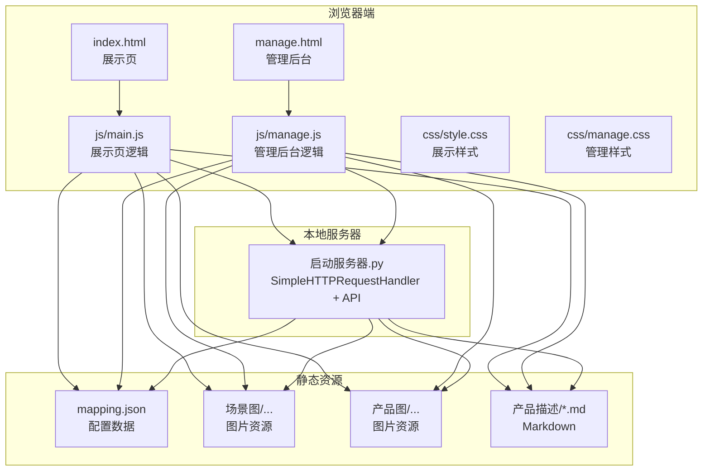
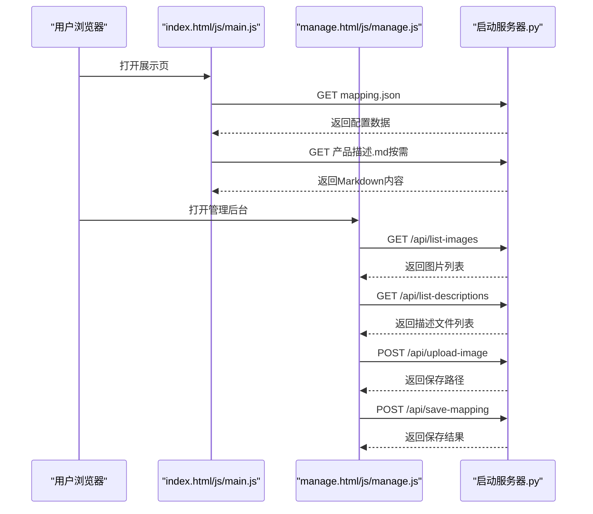
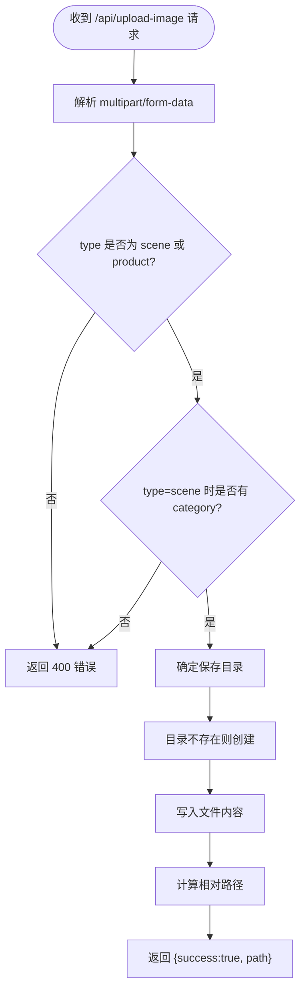
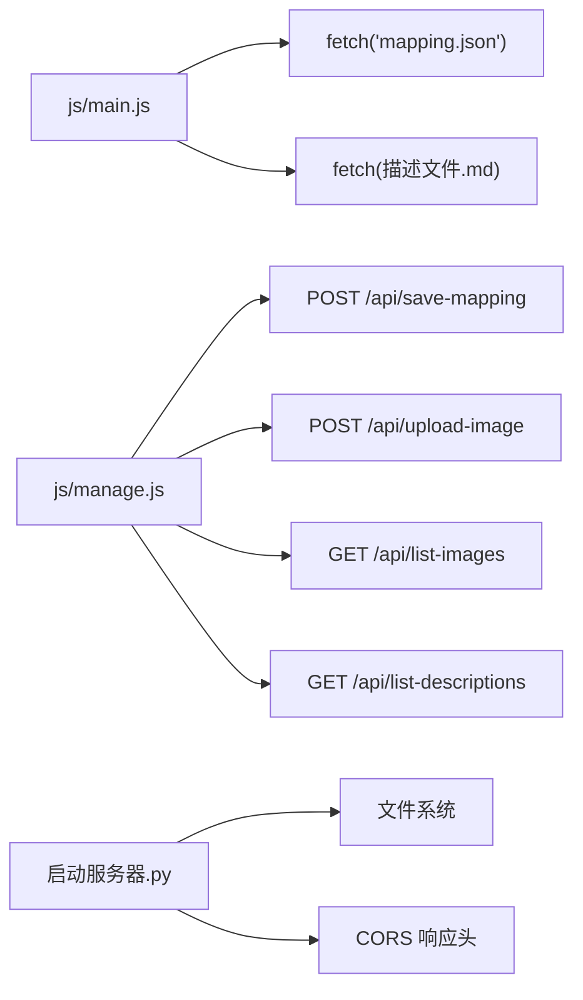

# 安全配置

<cite>
**本文引用的文件**
- [index.html](file://index.html)
- [manage.html](file://manage.html)
- [js/main.js](file://js/main.js)
- [js/manage.js](file://js/manage.js)
- [启动服务器.py](file://启动服务器.py)
- [project_architecture.md](file://project_architecture.md)
- [mapping.json](file://mapping.json)
- [css/style.css](file://css/style.css)
- [css/manage.css](file://css/manage.css)
</cite>

## 目录
1. [简介](#简介)
2. [项目结构](#项目结构)
3. [核心组件](#核心组件)
4. [架构总览](#架构总览)
5. [详细组件分析](#详细组件分析)
6. [依赖分析](#依赖分析)
7. [性能考量](#性能考量)
8. [故障排查指南](#故障排查指南)
9. [结论](#结论)
10. [附录](#附录)

## 简介
本指南面向“数字标牌产品展示项目”的安全配置，结合项目现有前端与本地开发服务器实现，给出可落地的安全建议与最佳实践。重点覆盖：
- CORS 配置与跨域访问控制
- API 端点安全机制（参数校验、JSON 安全解析、文件上传安全）
- 防火墙与网络访问控制建议
- HTTPS 配置方法与证书管理
- 数据安全与隐私保护（敏感数据、文件权限、备份传输）
- 访问控制（基本认证、API 密钥、权限模型）
- 日志与监控策略

## 项目结构
项目采用纯前端 + 本地开发服务器模式：
- 前端页面：index.html（展示页）、manage.html（管理后台）
- 交互逻辑：js/main.js（展示页）、js/manage.js（管理后台）
- 配置数据：mapping.json（场景/产品/多语言）
- 样式：css/style.css（展示页）、css/manage.css（管理后台）
- 本地服务器：启动服务器.py（内置 HTTP 服务器 + 4 个 API）

图表来源
- [启动服务器.py:25-252](file://启动服务器.py#L25-L252)
- [project_architecture.md:43-108](file://project_architecture.md#L43-L108)

章节来源
- [project_architecture.md:23-26](file://project_architecture.md#L23-L26)
- [启动服务器.py:25-252](file://启动服务器.py#L25-L252)

## 核心组件
- 展示页（index.html + js/main.js）
  - 动态加载 mapping.json，支持多语言与热点交互
  - 通过 fetch 加载 Markdown 描述，具备重试与失败提示
- 管理后台（manage.html + js/manage.js）
  - 通过 /api/save-mapping、/api/upload-image、/api/list-images、/api/list-descriptions 与本地服务器交互
- 本地开发服务器（启动服务器.py）
  - 基于 SimpleHTTPRequestHandler 扩展，提供静态文件服务与 4 个 API 端点
  - 默认启用 CORS（允许本地开发跨域）

章节来源
- [js/main.js:49-73](file://js/main.js#L49-L73)
- [js/manage.js:35-46](file://js/manage.js#L35-L46)
- [启动服务器.py:25-53](file://启动服务器.py#L25-L53)

## 架构总览
前端通过 fetch 与本地服务器 API 通信，管理后台负责可视化编辑与持久化。

图表来源
- [js/main.js:49-73](file://js/main.js#L49-L73)
- [js/manage.js:35-108](file://js/manage.js#L35-L108)
- [启动服务器.py:75-97](file://启动服务器.py#L75-L97)

## 详细组件分析

### CORS 配置与跨域访问控制
现状
- 本地开发服务器在处理 /api/* 请求时统一设置 CORS 响应头，允许任意来源（*）、GET/POST/OPTIONS、Content-Type 头
- 该策略便于本地开发调试，但不适合生产环境

安全建议
- 生产环境应明确设置 Access-Control-Allow-Origin 为受信域名列表，避免通配符 *
- 严格限定 Allow-Methods 与 Allow-Headers，仅开放必要接口
- 对复杂请求（带凭据或自定义头）启用预检（OPTIONS）并进行细粒度校验
- 为管理后台单独设置更严格的 CORS 规则，避免被恶意站点滥用

章节来源
- [启动服务器.py:28-33](file://启动服务器.py#L28-L33)
- [启动服务器.py:48-53](file://启动服务器.py#L48-L53)

### API 端点安全机制
现有实现
- /api/save-mapping：接收完整 mapping.json，先备份再写入
- /api/upload-image：解析 multipart/form-data，根据 type 决定保存目录，支持 scene/product 类型
- /api/list-images：扫描场景图与产品图目录，返回相对路径列表
- /api/list-descriptions：扫描产品描述目录，返回文件列表

安全加固建议
- 参数验证
  - 校验 Content-Type 是否为 multipart/form-data；缺失或错误返回 400
  - 校验 type 参数为 scene 或 product；缺失或非法返回 400
  - 上传场景图时强制要求 category 参数；缺失返回 400
- JSON 安全解析
  - 严格解析请求体，捕获 JSONDecodeError 并返回 400
  - 限制请求体大小，防止内存压力
- 文件上传安全
  - 仅允许白名单扩展名（.webp/.jpg/.png），拒绝其他类型
  - 限制文件大小（如 10MB），超过阈值拒绝
  - 生成随机文件名或规范化文件名，避免路径穿越
  - 保存至独立目录，禁止执行权限，限制访问范围
- 响应安全
  - 统一返回 JSON，包含 success 字段与错误信息
  - 对敏感路径与内部错误信息进行脱敏

图表来源
- [启动服务器.py:129-202](file://启动服务器.py#L129-L202)

章节来源
- [启动服务器.py:75-97](file://启动服务器.py#L75-L97)
- [启动服务器.py:101-127](file://启动服务器.py#L101-L127)
- [启动服务器.py:129-202](file://启动服务器.py#L129-L202)
- [启动服务器.py:204-251](file://启动服务器.py#L204-L251)

### 防火墙与网络访问控制
- 端口访问控制
  - 本地开发默认端口 8082，若暴露公网，建议改为更高范围端口并限制来源
- IP 白名单
  - 仅允许受信 IP 访问 /api/* 端点，其他来源一律拒绝
- DDoS 防护
  - 限制每 IP 每分钟请求数（如 60 次/分钟）
  - 限制单请求体大小与并发连接数
  - 使用反向代理（如 Nginx/Tengine）开启限流与健康检查
- 网络隔离
  - 将静态资源与 API 服务置于不同子域，减少 CSRF 风险
  - 对管理后台单独域名部署，启用 HSTS 与安全响应头

[本节为通用建议，不直接分析具体文件]

### HTTPS 配置与证书管理
- 证书申请
  - 使用 Let’s Encrypt（acme.sh 或 certbot）自动化申请免费证书
  - 选择域名与子域（如 api.example.com、manage.example.com）
- 安装与自动续期
  - Nginx/Tengine 配置 HTTPS 监听与证书路径
  - 设置定时任务（crontab）自动续期并重载服务
- 强制 HTTPS
  - 301 重定向 HTTP 至 HTTPS
  - 启用 HSTS（如 max-age=31536000）
  - 配置安全 TLS 参数（禁用弱密码套件，启用 OCSP Stapling）

[本节为通用建议，不直接分析具体文件]

### 数据安全与隐私保护
- 敏感数据加密存储
  - 服务器端对数据库或配置文件进行加密存储（如 AES-256）
  - 传输中使用 HTTPS，避免明文泄露
- 文件权限与访问控制
  - 上传目录仅授予写权限，移除执行权限
  - 静态资源目录仅读权限，禁止脚本执行
- 备份与传输安全
  - 备份文件加密存储，限制访问
  - 通过 SFTP/SCP 或加密通道传输备份
- 日志与审计
  - 记录 API 访问、文件上传、配置变更等关键事件
  - 定期轮转日志，保留期限符合合规要求

[本节为通用建议，不直接分析具体文件]

### 访问控制与权限管理
- 基本认证
  - 对管理后台启用 HTTP Basic Auth，用户名与密码定期轮换
- API 密钥管理
  - 为 /api/save-mapping 与 /api/upload-image 设置 API Key
  - 密钥存储于环境变量或密钥管理服务，不在代码中硬编码
- 权限模型
  - 管理后台仅允许管理员访问
  - 区分“只读”与“写入”权限，最小授权原则
- 会话与令牌
  - 若引入登录，使用短期 JWT 并限制刷新频率
  - 登出后使令牌失效，服务端维护黑名单

[本节为通用建议，不直接分析具体文件]

### 日志记录与监控
- 访问日志
  - 记录请求时间、IP、方法、路径、状态码、User-Agent
  - 分离静态资源与 API 日志，便于分析
- 错误日志
  - 记录 5xx 错误、JSON 解析失败、文件写入异常
  - 包含堆栈信息与上下文参数（脱敏处理）
- 安全事件日志
  - 记录 CORS 配置异常、未授权访问、暴力破解尝试
  - 集成 SIEM/SOAR 进行告警与联动处置
- 监控指标
  - QPS、错误率、响应时间、磁盘与内存占用
  - 对异常波动设置阈值告警

[本节为通用建议，不直接分析具体文件]

## 依赖分析
前端与服务器之间的依赖关系如下：

图表来源
- [js/main.js:49-73](file://js/main.js#L49-L73)
- [js/manage.js:35-108](file://js/manage.js#L35-L108)
- [启动服务器.py:75-97](file://启动服务器.py#L75-L97)
- [启动服务器.py:25-33](file://启动服务器.py#L25-L33)

章节来源
- [js/main.js:49-73](file://js/main.js#L49-L73)
- [js/manage.js:35-108](file://js/manage.js#L35-L108)
- [启动服务器.py:25-53](file://启动服务器.py#L25-L53)

## 性能考量
- 图片加载优化
  - 预加载与缓存策略已在前端实现，建议配合 CDN 与 HTTP/2
- API 响应优化
  - 对 /api/list-images 与 /api/list-descriptions 增加缓存头（ETag/Last-Modified）
- 服务器性能
  - 使用多进程或多线程服务器或反向代理提升吞吐
  - 对大文件上传启用分块传输与断点续传（如需）

[本节为通用建议，不直接分析具体文件]

## 故障排查指南
常见问题与处理步骤
- mapping.json 加载失败
  - 检查 CORS 配置与网络连通性
  - 查看浏览器开发者工具 Network 面板与 Console
- Markdown 描述加载失败
  - 确认文件路径与权限
  - 查看前端错误提示与重试机制
- 管理后台保存失败
  - 检查 /api/save-mapping 返回的错误信息
  - 确认服务器磁盘空间与写权限
- 图片上传失败
  - 检查 /api/upload-image 的 Content-Type 与参数
  - 查看服务器端错误日志

章节来源
- [js/main.js:421-442](file://js/main.js#L421-L442)
- [js/manage.js:82-108](file://js/manage.js#L82-L108)
- [启动服务器.py:101-127](file://启动服务器.py#L101-L127)
- [启动服务器.py:129-202](file://启动服务器.py#L129-L202)

## 结论
本项目以纯前端与本地服务器为基础，具备良好的可维护性。为满足生产环境的安全要求，建议：
- 明确 CORS 策略，限制来源与方法
- 强化 API 参数校验与文件上传安全
- 部署 HTTPS 并启用 HSTS
- 实施访问控制与密钥管理
- 建立完善的日志与监控体系

[本节为总结性内容，不直接分析具体文件]

## 附录
- 项目在线预览地址（本地开发）
  - 展示页：http://localhost:8082/index.html
  - 管理后台：http://localhost:8082/manage.html
- API 端点清单
  - POST /api/save-mapping：保存 mapping.json（自动备份）
  - POST /api/upload-image：上传图片（multipart/form-data）
  - GET /api/list-images：返回图片列表
  - GET /api/list-descriptions：返回描述文件列表

章节来源
- [project_architecture.md:23-26](file://project_architecture.md#L23-L26)
- [project_architecture.md:769-777](file://project_architecture.md#L769-L777)