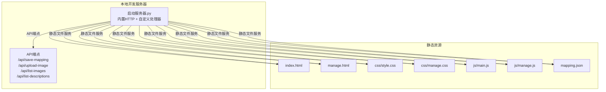
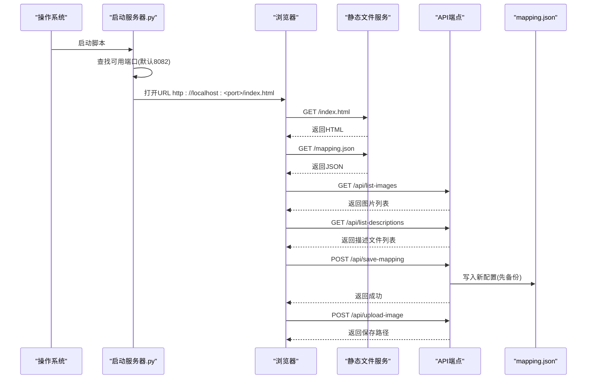
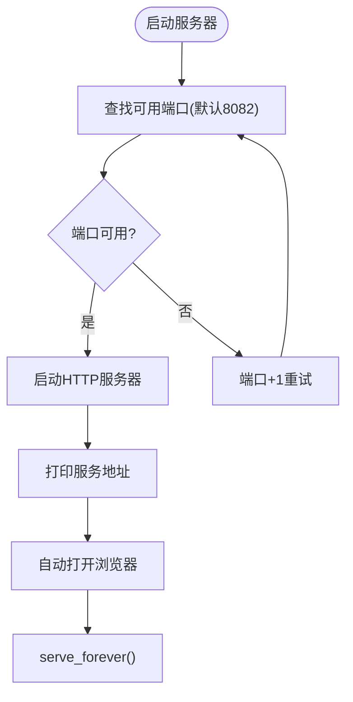
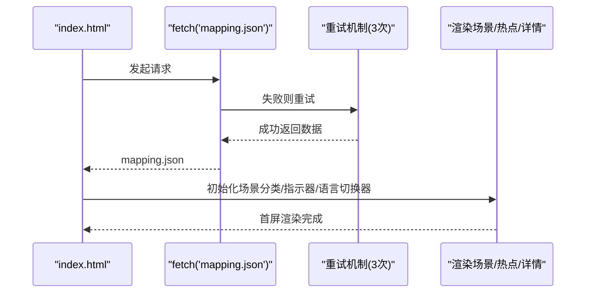
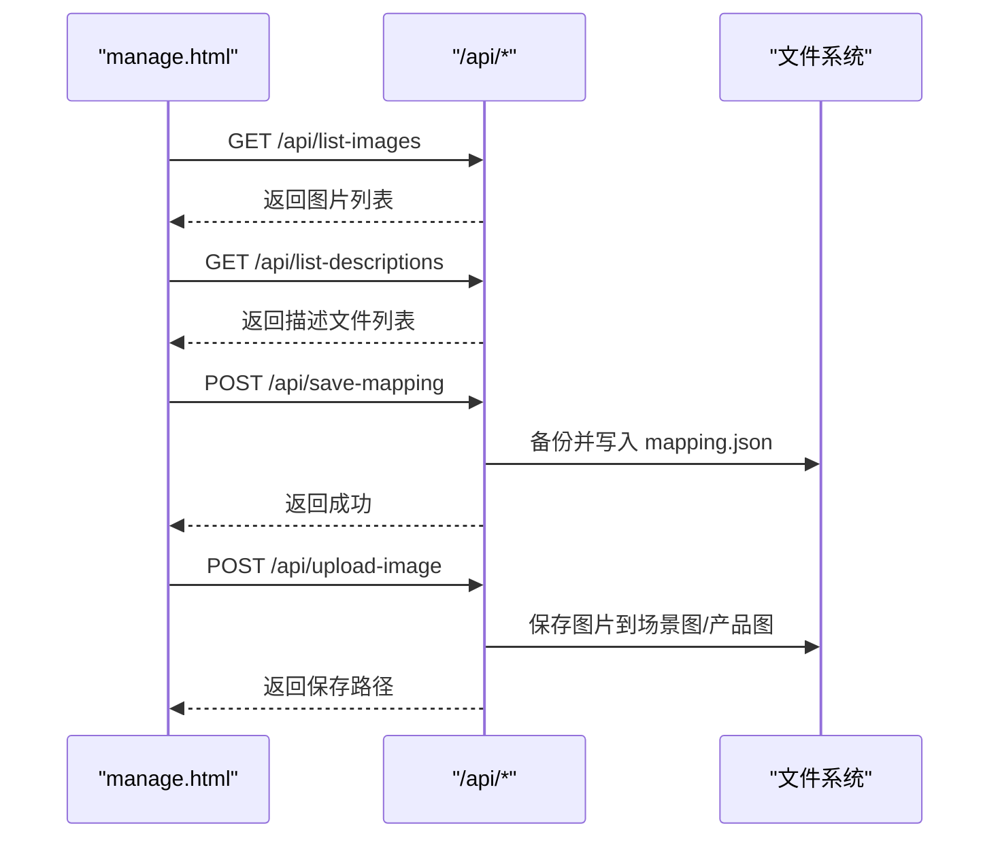
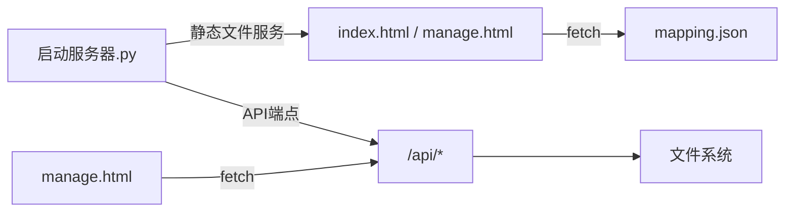

# 本地部署

<cite>
**本文引用的文件**
- [启动服务器.py](file://启动服务器.py)
- [index.html](file://index.html)
- [manage.html](file://manage.html)
- [mapping.json](file://mapping.json)
- [project_architecture.md](file://project_architecture.md)
- [js/main.js](file://js/main.js)
- [js/manage.js](file://js/manage.js)
- [css/style.css](file://css/style.css)
- [css/manage.css](file://css/manage.css)
</cite>

## 目录
1. [简介](#简介)
2. [项目结构](#项目结构)
3. [核心组件](#核心组件)
4. [架构总览](#架构总览)
5. [详细组件分析](#详细组件分析)
6. [依赖分析](#依赖分析)
7. [性能考虑](#性能考虑)
8. [故障排查指南](#故障排查指南)
9. [结论](#结论)
10. [附录](#附录)

## 简介
本指南面向需要在本地快速启动并体验“数字标牌产品展示页面”的用户，提供三种本地部署方式：
- 双击启动脚本（最简方式）
- 命令行启动方法
- 手动配置选项

同时，文档深入解释启动脚本的工作原理（端口自动检测、静态文件服务、API 端点配置、浏览器自动打开与访问 URL 生成规则），并给出常见问题的解决方案（端口占用、权限问题、路径错误）。最后覆盖在 Windows、macOS、Linux 上的部署差异，以及开发模式下的热重载与调试建议。

## 项目结构
项目采用“静态资源 + 本地开发服务器 + API 端点”的轻量架构，核心文件组织如下：
- 启动服务器：Python 内置 HTTP 服务器 + 自定义请求处理器，提供静态文件服务与四个 API 端点
- 前端页面：index.html（展示页）、manage.html（管理后台）
- 数据配置：mapping.json（场景/产品/多语言配置）
- 样式与脚本：css/ 与 js/ 下的样式与逻辑文件

图表来源
- [启动服务器.py:25-252](file://启动服务器.py#L25-L252)
- [index.html:1-83](file://index.html#L1-L83)
- [manage.html:1-113](file://manage.html#L1-L113)
- [mapping.json:1-232](file://mapping.json#L1-L232)
- [css/style.css:1-200](file://css/style.css#L1-L200)
- [css/manage.css:1-200](file://css/manage.css#L1-L200)
- [js/main.js:1-200](file://js/main.js#L1-L200)
- [js/manage.js:1-200](file://js/manage.js#L1-L200)

章节来源
- [project_architecture.md:43-108](file://project_architecture.md#L43-L108)

## 核心组件
- 启动服务器.py：内置 HTTP 服务器 + 自定义请求处理器，提供静态文件服务与四个 API 端点
- index.html：展示页面，加载 mapping.json，渲染场景、热点与产品详情
- manage.html：管理后台，可视化编辑场景、热点与产品配置，通过 API 与服务器交互
- mapping.json：场景/产品/多语言配置数据源
- 样式与脚本：分别负责页面视觉与交互逻辑

章节来源
- [启动服务器.py:25-252](file://启动服务器.py#L25-L252)
- [index.html:1-83](file://index.html#L1-L83)
- [manage.html:1-113](file://manage.html#L1-L113)
- [mapping.json:1-232](file://mapping.json#L1-L232)
- [css/style.css:1-200](file://css/style.css#L1-L200)
- [css/manage.css:1-200](file://css/manage.css#L1-L200)
- [js/main.js:1-200](file://js/main.js#L1-L200)
- [js/manage.js:1-200](file://js/manage.js#L1-L200)

## 架构总览
本地部署的核心流程：
- 启动服务器.py 启动内置 HTTP 服务器，监听端口（默认 8082，自动检测可用端口）
- 浏览器自动打开访问地址（http://localhost:<port>/index.html）
- 展示页 index.html 通过 fetch 加载 mapping.json，渲染场景与产品详情
- 管理后台 manage.html 通过 /api/* 端点与服务器交互，实现保存配置、上传图片、列出文件等功能

图表来源
- [启动服务器.py:266-295](file://启动服务器.py#L266-L295)
- [index.html:1-83](file://index.html#L1-L83)
- [manage.html:1-113](file://manage.html#L1-L113)
- [mapping.json:1-232](file://mapping.json#L1-L232)
- [js/main.js:49-73](file://js/main.js#L49-L73)
- [js/manage.js:35-72](file://js/manage.js#L35-L72)

## 详细组件分析

### 启动服务器.py（本地开发服务器）
- 端口与自动检测：从默认端口开始逐个尝试，直到找到可用端口
- 静态文件服务：继承自内置 HTTP 服务器，提供 index.html、manage.html、CSS、JS、JSON 等静态资源
- API 端点：
  - GET /api/list-images：扫描场景图与产品图目录，返回图片列表
  - GET /api/list-descriptions：返回产品描述文件列表
  - POST /api/save-mapping：接收完整 mapping.json，先备份再写入
  - POST /api/upload-image：解析 multipart/form-data，保存图片到指定目录（场景图/分类 或 产品图）
- CORS：统一设置允许跨域，便于本地开发
- 浏览器自动打开：打印服务地址并自动打开浏览器访问首页

图表来源
- [启动服务器.py:254-295](file://启动服务器.py#L254-L295)

章节来源
- [启动服务器.py:17-263](file://启动服务器.py#L17-L263)
- [启动服务器.py:266-295](file://启动服务器.py#L266-L295)

### 展示页面 index.html 与数据加载
- 页面结构：包含语言切换器、场景图容器、热点容器、导航按钮、详情弹窗等
- 数据加载：通过 fetch 加载 mapping.json，含重试机制（最多3次，递增延迟）
- 多语言：通过 mappingData.i18n 切换日文/中文，动态更新页面标题与提示文字
- 图片预加载：预加载所有场景图、热点图与产品图，提升切换流畅度

图表来源
- [index.html:1-83](file://index.html#L1-L83)
- [js/main.js:49-73](file://js/main.js#L49-L73)
- [js/main.js:119-162](file://js/main.js#L119-L162)

章节来源
- [index.html:1-83](file://index.html#L1-L83)
- [js/main.js:1-200](file://js/main.js#L1-L200)

### 管理后台 manage.html 与 API 交互
- 页面结构：三栏布局（场景列表、场景编辑区、产品编辑器）
- 数据加载：通过 /api/list-images 与 /api/list-descriptions 获取可用文件列表
- 保存配置：点击保存按钮，POST /api/save-mapping，服务器先备份再写入
- 图片上传：选择文件后 POST /api/upload-image，返回保存路径
- 交互流程：选中场景 → 拖拽热点 → 编辑产品 → 保存配置

图表来源
- [manage.html:1-113](file://manage.html#L1-L113)
- [js/manage.js:35-108](file://js/manage.js#L35-L108)
- [启动服务器.py:101-202](file://启动服务器.py#L101-L202)

章节来源
- [manage.html:1-113](file://manage.html#L1-L113)
- [js/manage.js:1-200](file://js/manage.js#L1-L200)
- [启动服务器.py:75-202](file://启动服务器.py#L75-L202)

## 依赖分析
- 启动服务器.py 依赖 Python 标准库（http.server、socketserver、webbrowser、os、sys、json、shutil、cgi、urllib.parse）
- 展示页与管理后台依赖静态资源（HTML/CSS/JS）与 mapping.json
- API 端点依赖文件系统读写与目录结构（场景图/、产品图/、产品描述/）

图表来源
- [启动服务器.py:25-252](file://启动服务器.py#L25-L252)
- [index.html:1-83](file://index.html#L1-L83)
- [manage.html:1-113](file://manage.html#L1-L113)
- [mapping.json:1-232](file://mapping.json#L1-L232)

章节来源
- [启动服务器.py:7-16](file://启动服务器.py#L7-L16)
- [project_architecture.md:29-39](file://project_architecture.md#L29-L39)

## 性能考虑
- 图片预加载：在首屏加载完成后启动全量图片预加载，避免慢网环境下首屏长时间空白
- 交叉淡入淡出：双层图片切换，消除切换黑屏，提升视觉连续性
- 骨架屏与错误重试：详情加载失败时提供可点击重试提示，改善用户体验
- 本地开发服务器：内置 HTTP 服务器，无需额外依赖，启动即用

章节来源
- [js/main.js:49-73](file://js/main.js#L49-L73)
- [js/main.js:238-407](file://js/main.js#L238-L407)
- [css/style.css:344-352](file://css/style.css#L344-L352)

## 故障排查指南
- 端口占用
  - 现象：启动后提示端口被占用
  - 处理：关闭占用端口的进程，或等待服务器自动检测下一个可用端口
  - 参考：端口自动检测逻辑
- 权限问题
  - 现象：无法写入 mapping.json 或上传图片失败
  - 处理：确保项目目录具有读写权限；在 macOS/Linux 上使用合适的用户权限
- 路径错误
  - 现象：静态资源 404 或 API 404
  - 处理：确认项目根目录正确，静态资源路径与目录结构一致
- 端口范围限制
  - 现象：自动检测未找到可用端口
  - 处理：检查防火墙或安全软件限制；必要时手动指定端口（需修改脚本）
- 浏览器无法打开
  - 现象：启动后未自动打开浏览器
  - 处理：手动访问 http://localhost:<port>/index.html；检查系统默认浏览器设置

章节来源
- [启动服务器.py:254-263](file://启动服务器.py#L254-L263)
- [启动服务器.py:286-287](file://启动服务器.py#L286-L287)

## 结论
本项目通过“启动服务器.py + 静态资源 + API 端点”的组合，实现了零依赖、易部署的本地开发体验。推荐优先使用双击启动脚本的方式快速体验；若需更灵活的控制，可使用命令行启动或手动配置。遇到问题时，可依据本指南的故障排查步骤逐一排除。

## 附录

### 本地部署方式一览
- 双击启动脚本（Windows）
  - 双击启动服务器.py，自动检测端口并打开浏览器访问首页
- 命令行启动（macOS/Linux）
  - 在终端中执行 python3 启动服务器.py，或根据系统情况使用 python
- 手动配置选项
  - 修改默认端口常量（需谨慎），或在启动后根据提示访问对应 URL

章节来源
- [启动服务器.py:266-295](file://启动服务器.py#L266-L295)

### 访问 URL 生成规则
- 默认访问地址：http://localhost:<port>/index.html
- 管理后台地址：http://localhost:<port>/manage.html
- 端口来源：默认 8082，自动检测可用端口

章节来源
- [启动服务器.py:271](file://启动服务器.py#L271)
- [project_architecture.md:23-25](file://project_architecture.md#L23-L25)

### API 端点一览
- GET /api/list-images：返回场景图与产品图列表
- GET /api/list-descriptions：返回产品描述文件列表
- POST /api/save-mapping：保存 mapping.json（先备份）
- POST /api/upload-image：上传图片到场景图/产品图目录

章节来源
- [启动服务器.py:75-202](file://启动服务器.py#L75-L202)
- [project_architecture.md:769-776](file://project_architecture.md#L769-L776)

### 开发模式与调试建议
- 热重载：内置 HTTP 服务器不提供热重载，建议在修改静态资源后手动刷新浏览器
- 调试：利用浏览器开发者工具查看网络请求、控制台输出与 DOM 结构；在 manage.html 中可通过 Toast 提示确认保存与上传结果
- 数据校验：修改 mapping.json 后，可在展示页观察数据变化；若加载失败，查看控制台重试日志

章节来源
- [js/main.js:49-73](file://js/main.js#L49-L73)
- [js/manage.js:82-108](file://js/manage.js#L82-L108)