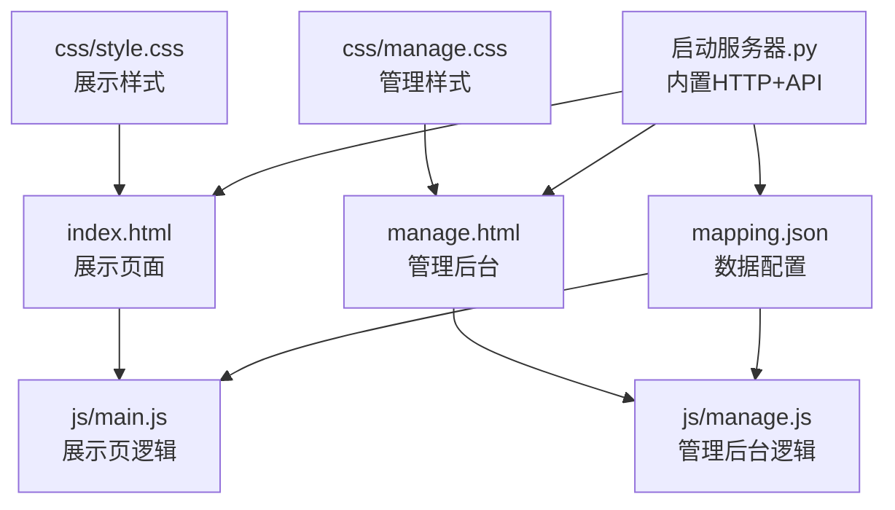
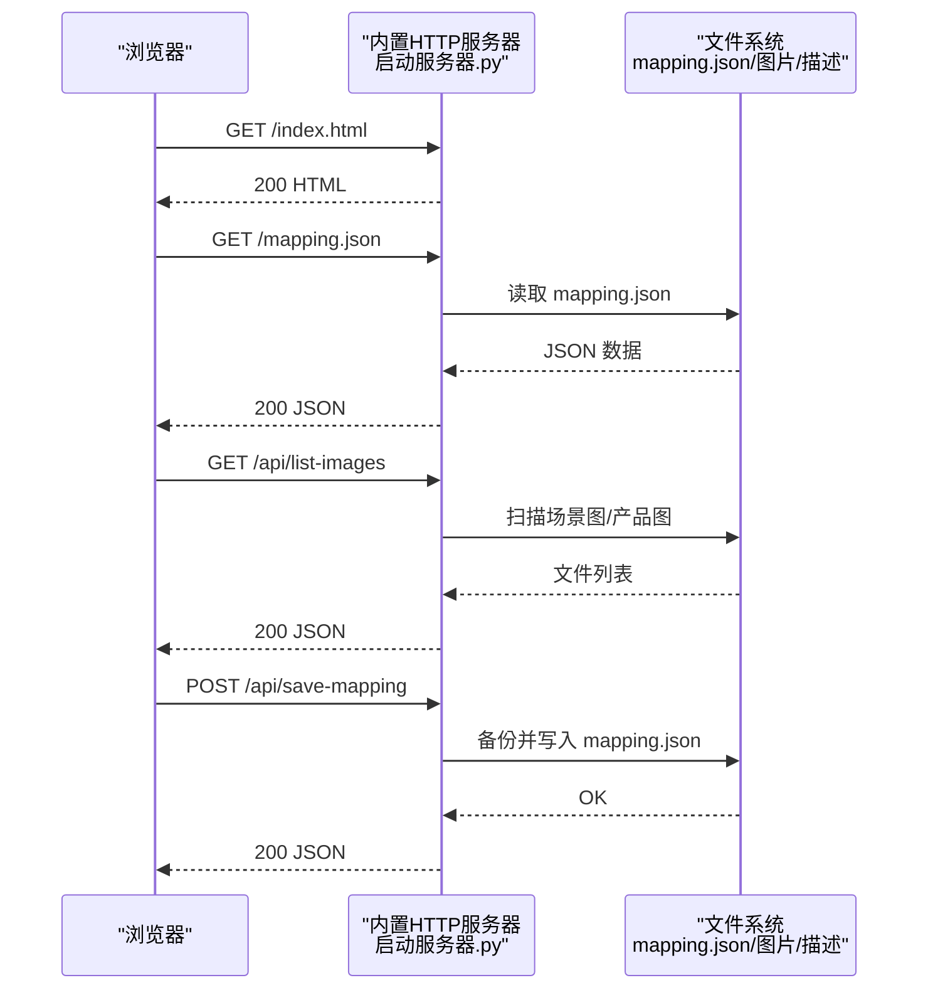
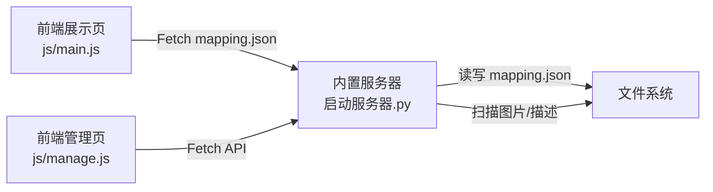

# 环境准备

<cite>
**本文引用的文件**
- [index.html](file://index.html)
- [manage.html](file://manage.html)
- [启动服务器.py](file://启动服务器.py)
- [mapping.json](file://mapping.json)
- [project_architecture.md](file://project_architecture.md)
- [js/main.js](file://js/main.js)
- [js/manage.js](file://js/manage.js)
- [css/style.css](file://css/style.css)
- [css/manage.css](file://css/manage.css)
</cite>

## 目录
1. [简介](#简介)
2. [项目结构](#项目结构)
3. [核心组件](#核心组件)
4. [架构总览](#架构总览)
5. [详细组件分析](#详细组件分析)
6. [依赖分析](#依赖分析)
7. [性能考虑](#性能考虑)
8. [故障排查指南](#故障排查指南)
9. [结论](#结论)
10. [附录](#附录)

## 简介
本指南面向“数字标牌产品展示”项目的环境准备与部署，帮助开发者与运维人员快速搭建开发与生产环境，理解系统要求、依赖条件、端口与网络配置、浏览器兼容性以及环境验证步骤。项目采用纯前端与内置 Python HTTP 服务器的方式，无需额外安装第三方库即可运行与管理。

## 项目结构
项目采用“静态资源 + 内置服务器 + JSON 配置”的轻量架构，主要文件与目录如下：
- 静态页面：index.html（展示页）、manage.html（管理后台）
- 样式：css/style.css（展示页样式）、css/manage.css（管理后台样式）
- 逻辑：js/main.js（展示页交互）、js/manage.js（管理后台交互）
- 配置：mapping.json（场景/产品/多语言数据）
- 服务器：启动服务器.py（内置 HTTP 服务器 + API 端点）
- 架构文档：project_architecture.md（技术栈、API、数据模型等）

图表来源
- [index.html](file://index.html)
- [manage.html](file://manage.html)
- [启动服务器.py](file://启动服务器.py)
- [mapping.json](file://mapping.json)
- [js/main.js](file://js/main.js)
- [js/manage.js](file://js/manage.js)
- [css/style.css](file://css/style.css)
- [css/manage.css](file://css/manage.css)

章节来源
- [project_architecture.md](file://project_architecture.md)
- [启动服务器.py](file://启动服务器.py)

## 核心组件
- 展示页面（index.html + js/main.js + css/style.css）：负责场景浏览、多语言切换、热点交互、产品详情弹窗等。
- 管理后台（manage.html + js/manage.js + css/manage.css）：提供可视化编辑场景、热点与产品配置，支持保存与图片上传。
- 内置服务器（启动服务器.py）：提供静态文件服务与 4 个 API 端点，支持 CORS，便于本地开发。
- 数据配置（mapping.json）：集中管理场景、热点、产品与多语言文案。

章节来源
- [index.html](file://index.html)
- [manage.html](file://manage.html)
- [启动服务器.py](file://启动服务器.py)
- [mapping.json](file://mapping.json)
- [js/main.js](file://js/main.js)
- [js/manage.js](file://js/manage.js)
- [css/style.css](file://css/style.css)
- [css/manage.css](file://css/manage.css)

## 架构总览
项目采用“浏览器直连静态资源 + 本地 Python 服务器 + JSON 配置”的架构，前端通过 Fetch API 与服务器交互，管理后台通过 API 保存配置与上传图片。

图表来源
- [启动服务器.py](file://启动服务器.py)
- [mapping.json](file://mapping.json)

章节来源
- [project_architecture.md](file://project_architecture.md)
- [启动服务器.py](file://启动服务器.py)

## 详细组件分析

### 系统要求与兼容性
- Python 版本
  - 推荐 Python 3.6+，项目使用内置标准库（http.server、socketserver、json、os、urllib.parse、cgi、shutil、webbrowser）。
- 操作系统
  - Windows、macOS、Linux 均可运行内置服务器。
- 硬件要求
  - 无特殊硬件要求，建议至少 2GB 内存以保证多图片加载顺畅。
- 浏览器兼容性
  - 展示页与管理后台均为原生 ES6+ 语法，使用 Fetch API 与 CORS，需现代浏览器支持。
  - 项目通过 CDN 引入 marked.js（Markdown 解析），确保在现代浏览器中正常工作。

章节来源
- [启动服务器.py](file://启动服务器.py)
- [index.html](file://index.html)
- [manage.html](file://manage.html)
- [project_architecture.md](file://project_architecture.md)

### 服务器与端口配置
- 默认端口：8082
- 自动端口探测：若 8082 被占用，服务器将尝试 8083~8181 范围内的可用端口。
- CORS 支持：服务器在所有响应头中设置 Access-Control-Allow-Origin:*，允许本地开发跨域。
- API 端点
  - GET /api/list-images：返回场景图与产品图列表
  - GET /api/list-descriptions：返回产品描述文件列表
  - POST /api/save-mapping：保存 mapping.json（自动备份）
  - POST /api/upload-image：上传图片至场景图/产品图目录

章节来源
- [启动服务器.py](file://启动服务器.py)
- [project_architecture.md](file://project_architecture.md)

### 网络与防火墙设置
- 开发环境
  - 本地回环访问：http://localhost:端口/index.html 与 http://localhost:端口/manage.html
  - 若端口被占用，服务器会自动选择下一个可用端口并在控制台输出服务地址
- 生产环境
  - 如需对外访问，需开放服务器所在主机的 8082 端口（或自动选择的端口）
  - 若部署在反向代理后端，需确保代理转发到本地端口并保留 CORS 头

章节来源
- [启动服务器.py](file://启动服务器.py)
- [project_architecture.md](file://project_architecture.md)

### 依赖与运行方式
- 无需额外安装第三方库
  - 服务器使用 Python 标准库 http.server 与 socketserver
  - 前端使用原生 ES6+ 语法与 Fetch API，无需构建工具
- 启动方式
  - 双击“启动服务器.py”运行，自动打开浏览器访问首页
  - 控制台输出服务地址与 API 端点说明

章节来源
- [启动服务器.py](file://启动服务器.py)
- [project_architecture.md](file://project_architecture.md)

### 数据与配置
- mapping.json
  - 包含版本号、场景数组、产品与热点映射、多语言字典
  - 展示页与管理后台均通过 Fetch 读取与写入
- 文件组织
  - 场景图：场景图/分类名/图片.webp
  - 产品图：产品图/图片.webp
  - 产品描述：产品描述/文件.md

章节来源
- [mapping.json](file://mapping.json)
- [project_architecture.md](file://project_architecture.md)

## 依赖分析
- 前端依赖
  - 原生 ES6+ 语法与 DOM API
  - Fetch API 与 CORS
  - marked.js（CDN 引入，用于 Markdown 渲染）
- 服务器依赖
  - Python 标准库：http.server、socketserver、json、os、urllib.parse、cgi、shutil、webbrowser
- 项目耦合
  - 前端通过 API 与服务器交互，数据集中在 mapping.json
  - 管理后台负责写入 mapping.json 与上传图片，展示页只读

图表来源
- [js/main.js](file://js/main.js)
- [js/manage.js](file://js/manage.js)
- [启动服务器.py](file://启动服务器.py)
- [mapping.json](file://mapping.json)

章节来源
- [js/main.js](file://js/main.js)
- [js/manage.js](file://js/manage.js)
- [启动服务器.py](file://启动服务器.py)
- [project_architecture.md](file://project_architecture.md)

## 性能考虑
- 图片加载策略
  - 首屏独占带宽：首屏图片加载完成后才启动其余图片预加载，避免慢网卡顿
  - 双层交叉淡入淡出：使用两层图片实现无黑屏切换
- 预加载与缓存
  - 预加载全场景图、产品图与描述文件，减少用户等待
  - 描述文件采用缓存，避免重复请求
- 动画与交互
  - CSS 过渡与关键帧动画在现代浏览器中流畅运行
  - 骨架屏与加载指示器提升弱网体验

章节来源
- [project_architecture.md](file://project_architecture.md)
- [js/main.js](file://js/main.js)

## 故障排查指南
- Python 环境检查
  - 确认已安装 Python 3.6+，可在命令行执行 python --version 验证
- 端口连通性测试
  - 启动服务器后，浏览器访问 http://localhost:端口/index.html 与 http://localhost:端口/manage.html
  - 若端口被占用，服务器会自动选择下一个可用端口并在控制台输出
- 基本功能验证
  - 展示页：应能加载 mapping.json，显示场景与热点，点击进入产品详情
  - 管理后台：应能列出场景、编辑分类名、上传图片、保存配置
  - API：浏览器访问 /api/list-images 与 /api/list-descriptions 应返回 JSON
- 常见问题
  - CORS 报错：确认服务器已设置 Access-Control-Allow-Origin:*（默认开启）
  - JSON 解析失败：检查 mapping.json 格式是否正确
  - 图片无法显示：确认图片路径与扩展名符合要求（.webp/.jpg/.png）

章节来源
- [启动服务器.py](file://启动服务器.py)
- [index.html](file://index.html)
- [manage.html](file://manage.html)
- [project_architecture.md](file://project_architecture.md)

## 结论
本项目以“零依赖”的方式实现了数字标牌产品展示与管理，开发与部署门槛低，适合快速迭代与演示。遵循本指南进行环境准备与验证，可确保在本地与生产环境中稳定运行。

## 附录
- 在线预览地址
  - 展示页面：http://localhost:8082/index.html
  - 管理后台：http://localhost:8082/manage.html
- API 端点
  - GET /api/list-images
  - GET /api/list-descriptions
  - POST /api/save-mapping
  - POST /api/upload-image

章节来源
- [project_architecture.md](file://project_architecture.md)
- [启动服务器.py](file://启动服务器.py)