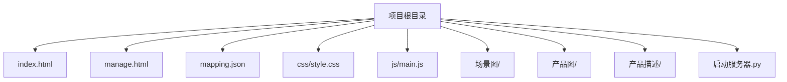
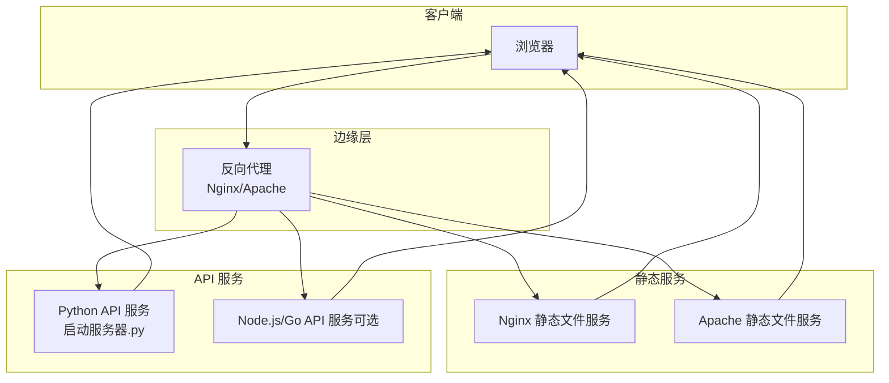
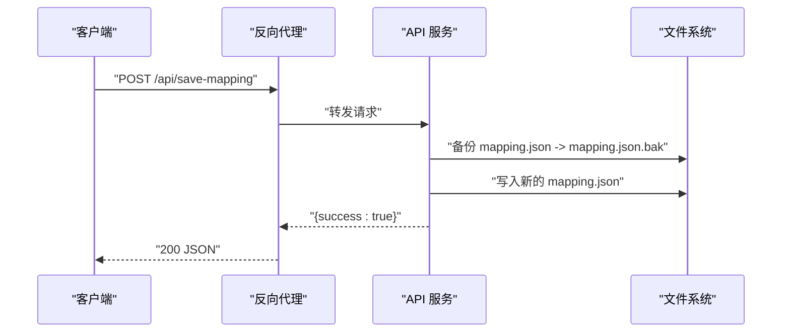
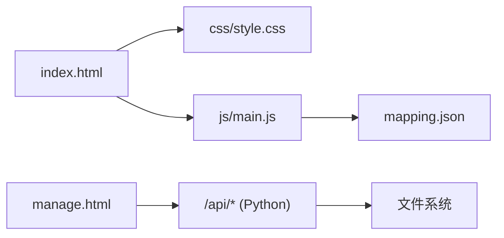

# 生产环境部署

<cite>
**本文引用的文件**
- [index.html](file://index.html)
- [manage.html](file://manage.html)
- [mapping.json](file://mapping.json)
- [project_architecture.md](file://project_architecture.md)
- [启动服务器.py](file://启动服务器.py)
- [style.css](file://css/style.css)
- [main.js](file://js/main.js)
</cite>

## 目录
1. [简介](#简介)
2. [项目结构](#项目结构)
3. [核心组件](#核心组件)
4. [架构总览](#架构总览)
5. [详细组件分析](#详细组件分析)
6. [依赖关系分析](#依赖关系分析)
7. [性能考虑](#性能考虑)
8. [故障排查指南](#故障排查指南)
9. [结论](#结论)
10. [附录](#附录)

## 简介
本指南面向数字标牌产品展示项目的生产环境部署，目标是在真实线上环境中稳定、安全地提供静态页面浏览与可视化管理能力。项目采用纯前端架构（HTML/CSS/JavaScript），通过独立的数据配置文件 mapping.json 驱动页面内容，并在本地开发阶段通过 Python HTTP 服务器提供静态文件服务与少量 API 端点（管理后台使用）。生产部署建议将静态资源与 API 服务分离，结合 Nginx/Apache 反向代理、缓存与安全加固，实现高性能与可维护性。

## 项目结构
项目采用扁平化的静态站点组织方式，核心文件与资源分布如下：
- 静态页面：index.html（展示页）、manage.html（管理后台）
- 数据配置：mapping.json（场景、热点、产品与多语言配置）
- 样式与脚本：css/style.css、js/main.js、js/manage.js（管理后台逻辑）
- 资源目录：场景图、产品图、产品描述 Markdown 文件
- 开发服务器：启动服务器.py（提供静态服务与 API）

图表来源
- [project_architecture.md:43-108](file://project_architecture.md#L43-L108)

章节来源
- [project_architecture.md:43-108](file://project_architecture.md#L43-L108)

## 核心组件
- 展示页面（index.html + main.js + style.css）
  - 通过 fetch 动态加载 mapping.json，渲染场景、热点与产品详情
  - 支持中日文切换与骨架屏/错误降级提示
- 管理后台（manage.html + 管理后台逻辑）
  - 提供可视化编辑界面，通过 API 读写 mapping.json 与上传图片
- 数据配置（mapping.json）
  - 统一存储场景、热点、产品与多语言文本
- 开发服务器（启动服务器.py）
  - 提供静态文件服务与四个 API 端点（保存配置、上传图片、列出图片、列出描述）

章节来源
- [index.html:1-83](file://index.html#L1-L83)
- [manage.html:1-113](file://manage.html#L1-L113)
- [mapping.json:1-232](file://mapping.json#L1-L232)
- [project_architecture.md:763-803](file://project_architecture.md#L763-L803)
- [启动服务器.py:25-252](file://启动服务器.py#L25-L252)

## 架构总览
生产部署推荐“静态文件服务 + API 服务”分离架构：
- 静态文件服务：Nginx/Apache 提供 index.html、manage.html、css、js、资源目录的静态分发
- API 服务：独立的 Python 服务（或 Node.js/Go）提供 /api/* 端点，负责读写 mapping.json 与文件上传
- 反向代理：Nginx 作为入口，将 /api/* 转发至 API 服务，静态资源由 Nginx 直接提供
- 安全与缓存：Nginx 配置 HTTPS、CORS、缓存头、Gzip/Brotli 压缩与健康检查

图表来源
- [project_architecture.md:763-803](file://project_architecture.md#L763-L803)
- [启动服务器.py:25-98](file://启动服务器.py#L25-L98)

## 详细组件分析

### 静态文件服务与缓存策略
- 资源类型与缓存建议
  - HTML/CSS/JS：较长缓存（如 1 年），变更时通过文件名指纹化
  - 图片（场景图/产品图）：较长缓存（如 1 年），开启 ETag/Last-Modified
  - mapping.json：短缓存或不缓存（或强制校验），确保数据实时性
- 压缩与传输
  - 启用 Gzip/Brotli 压缩，优先 Brotli
  - 启用 HTTP/2 或 HTTP/3，提升多路复用与连接效率
- 安全头
  - 配置 CSP、HSTS、X-Frame-Options、X-Content-Type-Options、Referrer-Policy
- 健康检查
  - Nginx/Apache 提供 /healthz 或 /status 端点，返回 200/503

章节来源
- [style.css:1-200](file://css/style.css#L1-L200)
- [index.html:1-83](file://index.html#L1-L83)
- [manage.html:1-113](file://manage.html#L1-L113)

### API 服务与端点
- 端点概览
  - POST /api/save-mapping：保存 mapping.json（先备份再写入）
  - POST /api/upload-image：上传图片到场景图/产品图目录
  - GET /api/list-images：返回场景图与产品图列表
  - GET /api/list-descriptions：返回产品描述文件列表
- CORS 与安全
  - 开发阶段使用宽松 CORS（*），生产需限制来源域名
  - 对上传接口进行文件类型与大小限制
- 错误处理
  - 请求体为空、JSON 解析失败、服务器异常等返回统一 JSON 错误格式

图表来源
- [启动服务器.py:101-127](file://启动服务器.py#L101-L127)

章节来源
- [启动服务器.py:75-98](file://启动服务器.py#L75-L98)
- [启动服务器.py:101-127](file://启动服务器.py#L101-L127)
- [启动服务器.py:129-202](file://启动服务器.py#L129-L202)
- [启动服务器.py:204-251](file://启动服务器.py#L204-L251)

### 反向代理与静态资源缓存（Nginx 示例思路）
- 代理规则
  - location /api/ { proxy_pass http://api_backend; }
  - location ~* \.(css|js|png|jpg|jpeg|webp|ico|svg)$ { expires 1y; add_header Cache-Control "..."; }
  - location = / { try_files /index.html @fallback; }
- 缓存与压缩
  - gzip_static on; 或 brotil_static on;
  - 静态资源缓存头与 ETag
- CORS
  - 在 /api/ 块中设置 Access-Control-Allow-Origin、Methods、Headers
- 健康检查
  - server_tokens off;（可选）
  - /healthz 返回 200/503

章节来源
- [启动服务器.py:28-53](file://启动服务器.py#L28-L53)

### Apache 配置方法（.htaccess 与虚拟主机）
- .htaccess 示例思路
  - 启用压缩：mod_deflate 或 mod_brotli
  - 静态资源缓存：ExpiresByType 与 Header set Cache-Control
  - CORS：SetEnvIf Origin ".*" Access-Control-Allow-Origin=$0$1
  - 重写：将 /api/* 转发至后端 API 服务
- 虚拟主机
  - DocumentRoot 指向项目根目录
  - Alias /static 与 /api/* 转发规则
  - SSL 与 HSTS 头部配置

章节来源
- [启动服务器.py:28-53](file://启动服务器.py#L28-L53)

### 负载均衡与多实例部署
- 多实例
  - 启动多个 Python API 进程（或使用 gunicorn/uwsgi），监听不同端口
  - Nginx upstream 配置多个后端节点，启用健康检查（fail_timeout、max_fails）
- 健康检查
  - Nginx：server_health_check 或外部探针
  - Apache：mod_proxy_hcheck（可选）
- 会话与共享
  - mapping.json 与资源文件建议放在共享存储（NFS/S3），确保多实例一致性

章节来源
- [启动服务器.py:254-264](file://启动服务器.py#L254-L264)

### Docker 容器化部署（思路）
- 静态服务镜像
  - 基于 nginx:alpine，复制构建产物，配置站点与缓存头
- API 服务镜像
  - 基于 python:3.11-alpine，安装依赖，暴露端口
- docker-compose
  - nginx 服务（静态 + 反代）
  - api 服务（Python API）
  - 共享卷：mapping.json 与资源目录
  - 环境变量：端口、CORS 来源、日志级别

章节来源
- [启动服务器.py:17-22](file://启动服务器.py#L17-L22)

### SSL/TLS 证书配置（Let’s Encrypt）
- Nginx
  - certbot 获取证书，自动续期；启用 http2/hsts
- Apache
  - acme-client 或 certbot 获取证书；配置 SSL 协议与 CipherSuites
- 生产建议
  - 仅允许 TLS1.2+，禁用弱套件
  - 配置 OCSP Stapling 与 HSTS

章节来源
- [启动服务器.py:28-53](file://启动服务器.py#L28-L53)

### 进程管理（PM2/Supervisor/systemd）
- PM2
  - 启动命令：pm2 start python --name "api" -- /path/to/启动服务器.py
  - 配置：日志、重启策略、环境变量
- Supervisor
  - 程序配置：autostart、autorestart、stdout/stderr 日志
- systemd
  - Service：ExecStart=/usr/bin/python3 /path/to/启动服务器.py
  - Socket/Target：随系统启动与监听端口

章节来源
- [启动服务器.py:266-295](file://启动服务器.py#L266-L295)

### 性能优化建议
- 静态资源
  - 启用 Gzip/Brotli 压缩
  - 图片格式优先 WebP，按场景/产品尺寸裁剪与压缩
  - 使用 CDN 与边缘缓存
- 缓存策略
  - mapping.json 短缓存或协商缓存（ETag/Last-Modified）
  - CSS/JS/图片长期缓存（文件名指纹化）
- 并发与连接
  - Nginx worker_connections、worker_processes 调优
  - TCP_NODELAY、keepalive_timeout 合理配置
- 前端优化
  - 骨架屏与懒加载，减少首屏阻塞
  - 图片懒加载与视口裁剪（object-fit: cover）

章节来源
- [style.css:1-200](file://css/style.css#L1-L200)
- [main.js:49-73](file://js/main.js#L49-L73)

## 依赖关系分析
- 前端依赖
  - index.html 依赖 css/style.css 与 js/main.js
  - main.js 依赖 mapping.json 与产品描述 Markdown
- 后端依赖
  - 管理后台依赖 Python API 服务提供的 /api/* 端点
- 部署依赖
  - Nginx/Apache 提供静态服务与反向代理
  - Python 服务提供 API 与文件读写

图表来源
- [index.html:1-83](file://index.html#L1-L83)
- [style.css:1-200](file://css/style.css#L1-L200)
- [main.js:1-200](file://js/main.js#L1-L200)
- [mapping.json:1-232](file://mapping.json#L1-L232)
- [manage.html:1-113](file://manage.html#L1-L113)
- [启动服务器.py:75-98](file://启动服务器.py#L75-L98)

章节来源
- [project_architecture.md:763-803](file://project_architecture.md#L763-L803)

## 性能考虑
- 静态资源
  - 启用压缩与缓存，合理设置过期头
  - 图片格式与尺寸优化，CDN 加速
- API 服务
  - 限流与超时配置，避免慢查询
  - 文件上传大小限制与类型校验
- 反向代理
  - 合理的 worker 与连接数配置
  - 健康检查与故障转移

## 故障排查指南
- mapping.json 加载失败
  - 检查 CORS 配置与网络连通性
  - 查看浏览器开发者工具 Network 面板与 Console
- API 端点错误
  - 确认请求体格式与 Content-Type
  - 查看服务器日志与错误响应 JSON
- 静态资源 404/缓存问题
  - 检查 Nginx/Apache 配置与缓存头
  - 确认资源路径与权限

章节来源
- [main.js:49-73](file://js/main.js#L49-L73)
- [启动服务器.py:44-47](file://启动服务器.py#L44-L47)
- [启动服务器.py:101-127](file://启动服务器.py#L101-L127)

## 结论
本指南提供了从架构设计到部署落地的完整方案：静态与 API 分离、反向代理与缓存、安全加固与健康检查、容器化与进程管理。按照该方案实施，可在保证用户体验的同时，获得更高的稳定性与可维护性。

## 附录
- 关键端点清单
  - POST /api/save-mapping：保存 mapping.json（先备份）
  - POST /api/upload-image：上传图片到场景图/产品图目录
  - GET /api/list-images：返回场景图与产品图列表
  - GET /api/list-descriptions：返回产品描述文件列表
- 建议的生产环境目录结构
  - /var/www/digital-signage/{index.html, manage.html, css/, js/, 场景图/, 产品图/, 产品描述/}
  - /etc/nginx/conf.d 或 /etc/apache2/sites-available 下配置站点与反代