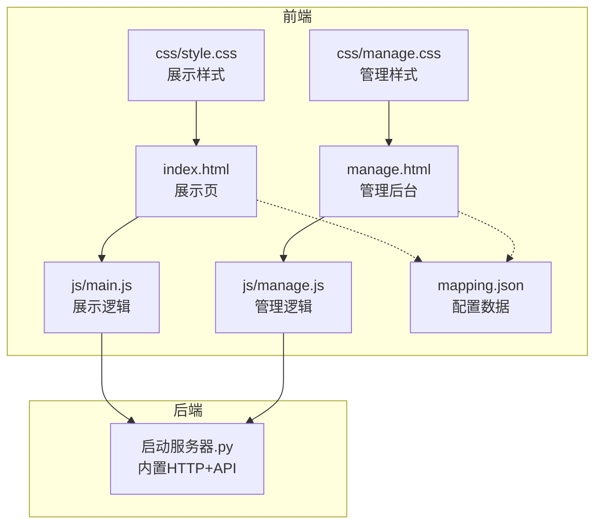
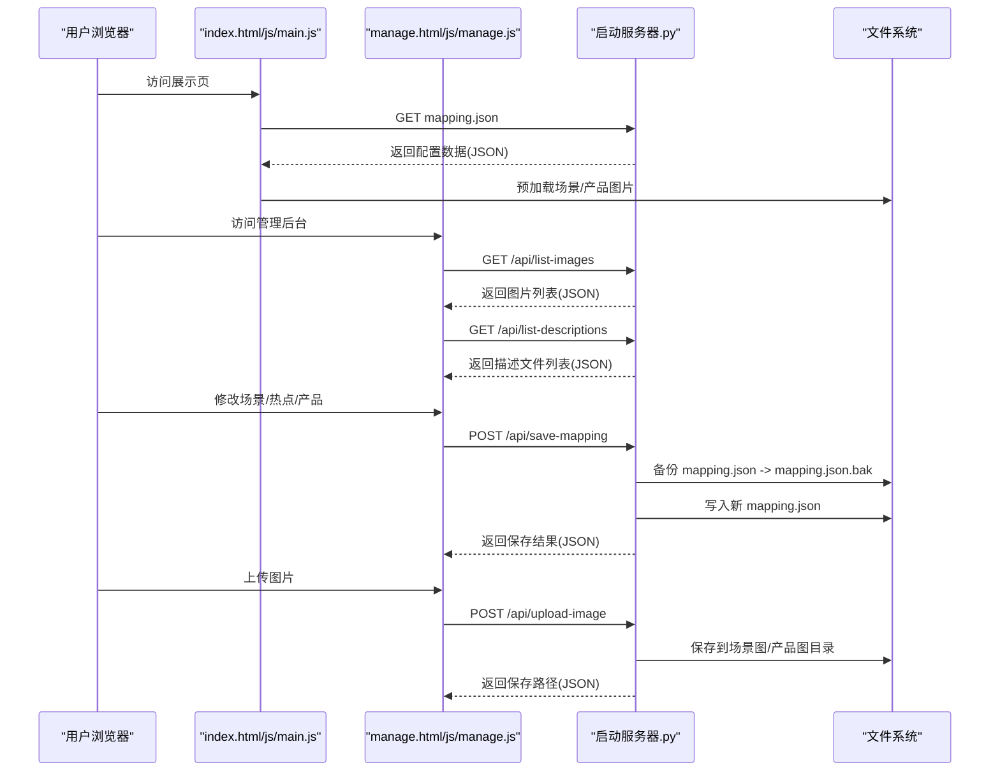
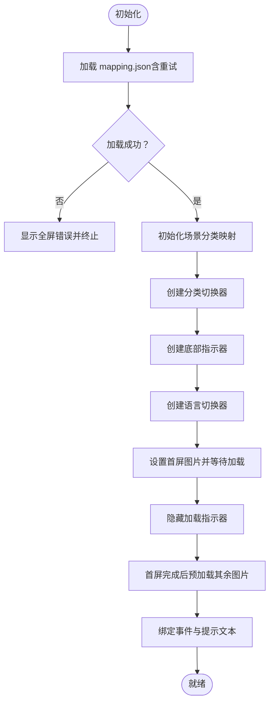
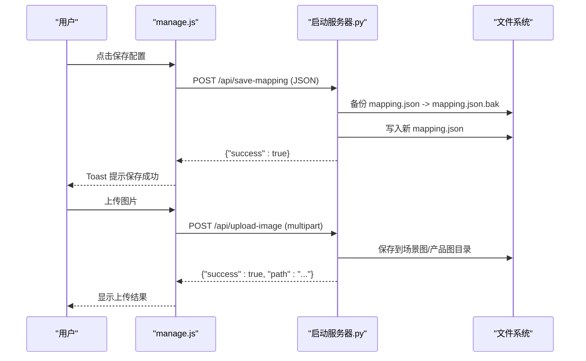
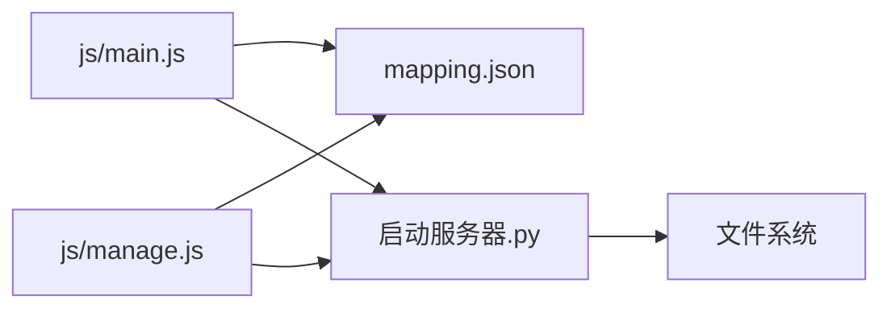

# 监控运维

<cite>
**本文引用的文件**
- [index.html](file://index.html)
- [manage.html](file://manage.html)
- [启动服务器.py](file://启动服务器.py)
- [project_architecture.md](file://project_architecture.md)
- [mapping.json](file://mapping.json)
- [js/main.js](file://js/main.js)
- [js/manage.js](file://js/manage.js)
- [css/style.css](file://css/style.css)
- [css/manage.css](file://css/manage.css)
- [产品描述/室内双面吊装标牌.md](file://产品描述/室内双面吊装标牌.md)
- [产品描述/自助点单机1.md](file://产品描述/自助点单机1.md)
</cite>

## 目录
1. [简介](#简介)
2. [项目结构](#项目结构)
3. [核心组件](#核心组件)
4. [架构总览](#架构总览)
5. [详细组件分析](#详细组件分析)
6. [依赖分析](#依赖分析)
7. [性能考虑](#性能考虑)
8. [故障排查指南](#故障排查指南)
9. [结论](#结论)
10. [附录](#附录)

## 简介
本指南面向数字标牌产品展示项目的运维与监控，结合仓库现有实现，给出服务器监控指标采集、日志管理、性能监控工具集成、告警机制、备份策略、故障排查流程、维护更新流程以及运维自动化方案。由于项目采用纯前端静态资源与本地开发服务器（Python HTTP 服务器）提供 API，运维关注点主要集中在本地开发环境与生产部署阶段的监控与可靠性保障。

## 项目结构
项目采用“静态页面 + 本地开发服务器 + API”的轻量架构：
- 前端页面：index.html（展示页）、manage.html（管理后台）
- 样式：css/style.css（展示页样式）、css/manage.css（管理后台样式）
- 逻辑：js/main.js（展示页交互）、js/manage.js（管理后台交互）
- 数据：mapping.json（场景/产品/多语言配置）
- 服务器：启动服务器.py（内置 HTTP 服务器 + API 端点）



图表来源
- [index.html](file://index.html)
- [manage.html](file://manage.html)
- [启动服务器.py](file://启动服务器.py)
- [js/main.js](file://js/main.js)
- [js/manage.js](file://js/manage.js)
- [css/style.css](file://css/style.css)
- [css/manage.css](file://css/manage.css)
- [mapping.json](file://mapping.json)

章节来源
- [project_architecture.md](file://project_architecture.md)
- [启动服务器.py](file://启动服务器.py)

## 核心组件
- 展示页面（index.html + js/main.js + css/style.css）：负责场景浏览、多语言切换、热点交互、产品详情弹窗、图片预加载与交叉淡入淡出等。
- 管理后台（manage.html + js/manage.js + css/manage.css）：提供可视化编辑场景、热点与产品配置，支持保存配置（POST /api/save-mapping）与图片上传（POST /api/upload-image）。
- 本地开发服务器（启动服务器.py）：提供静态文件服务与四个 API 端点，支持跨域、JSON 响应、文件上传与目录扫描。
- 配置数据（mapping.json）：集中管理场景、热点、产品与多语言文本，前端通过 fetch 动态加载，管理后台通过 API 读写。

章节来源
- [project_architecture.md](file://project_architecture.md)
- [启动服务器.py](file://启动服务器.py)
- [mapping.json](file://mapping.json)

## 架构总览
前端通过 fetch 与本地开发服务器交互，管理后台通过 API 保存配置与上传图片。服务器具备自动端口探测、CORS 支持与错误处理能力。



图表来源
- [js/main.js](file://js/main.js)
- [js/manage.js](file://js/manage.js)
- [启动服务器.py](file://启动服务器.py)
- [mapping.json](file://mapping.json)

## 详细组件分析

### 展示页面（index.html + js/main.js + css/style.css）
- 数据加载：通过 fetch 加载 mapping.json，含 3 次重试与递增延迟，失败时显示全屏错误提示。
- 多语言：支持日文/中文切换，UI 文本来自 mappingData.i18n。
- 图片预加载：遍历场景与产品图片进行预加载，首屏完成后启动其余图片预加载，避免慢网卡顿。
- 交互：场景切换采用双层图片交叉淡入淡出，热点渲染支持多热点，详情弹窗采用骨架屏与错误重试。
- 性能：使用 requestAnimationFrame 控制动画与渲染，减少主线程阻塞。



图表来源
- [js/main.js](file://js/main.js)
- [css/style.css](file://css/style.css)

章节来源
- [js/main.js](file://js/main.js)
- [css/style.css](file://css/style.css)
- [project_architecture.md](file://project_architecture.md)

### 管理后台（manage.html + js/manage.js + css/manage.css）
- 数据加载：分别加载 mapping.json、图片列表与描述文件列表。
- 场景编辑：支持添加/删除场景、更换场景图、添加/删除热点、拖拽热点调整坐标。
- 产品编辑：支持为热点添加/删除产品，编辑产品名称、图片与描述文件。
- 保存与上传：点击保存触发 POST /api/save-mapping，上传图片触发 POST /api/upload-image。
- 状态提示：保存状态通过 Toast 提示，支持成功/失败状态。



图表来源
- [js/manage.js](file://js/manage.js)
- [启动服务器.py](file://启动服务器.py)

章节来源
- [js/manage.js](file://js/manage.js)
- [css/manage.css](file://css/manage.css)
- [启动服务器.py](file://启动服务器.py)

### 本地开发服务器（启动服务器.py）
- 端口：默认 8082，若被占用则向上探测 100 个端口。
- CORS：对所有 API 响应设置 Access-Control-Allow-*，便于本地开发跨域。
- API：
  - GET /api/list-images：返回场景图与产品图列表。
  - GET /api/list-descriptions：返回产品描述文件列表。
  - POST /api/save-mapping：保存 mapping.json，先备份再写入。
  - POST /api/upload-image：上传图片到场景图或产品图目录。
- 错误处理：对无效请求体、JSON 解析失败、未知 API 路径等返回标准错误响应。

```mermaid
classDiagram
class APIHandler {
+_set_cors_headers()
+_send_json_response(data, status_code)
+_send_error_json(message, status_code)
+do_OPTIONS()
+do_GET()
+do_POST()
+_handle_api_get(path)
+_handle_api_post(path)
+_api_save_mapping()
+_api_upload_image()
+_api_list_images()
+_api_list_descriptions()
}
class find_available_port(start_port)
class main()
APIHandler <.. find_available_port : "使用"
APIHandler <.. main : "实例化"
```

图表来源
- [启动服务器.py](file://启动服务器.py)

章节来源
- [启动服务器.py](file://启动服务器.py)

## 依赖分析
- 前端依赖：无第三方框架，依赖浏览器原生 API 与 marked.js（CDN）解析 Markdown。
- 后端依赖：Python 标准库（http.server、socketserver、json、os、shutil、cgi、urllib）。
- 数据依赖：mapping.json 作为单一数据源，管理后台通过 API 读写；图片与描述文件位于对应目录。



图表来源
- [js/main.js](file://js/main.js)
- [js/manage.js](file://js/manage.js)
- [启动服务器.py](file://启动服务器.py)
- [mapping.json](file://mapping.json)

章节来源
- [project_architecture.md](file://project_architecture.md)
- [启动服务器.py](file://启动服务器.py)

## 性能考虑
- 图片加载与预加载：首屏独占带宽策略，避免其余图片抢占带宽导致首屏长时间无图；交叉淡入淡出减少切换卡顿。
- 重试机制：mapping.json 加载失败自动重试，提升弱网稳定性。
- 动画与渲染：使用 requestAnimationFrame 控制渲染节奏，降低主线程压力。
- 资源体积：纯静态资源，无打包工具，部署时建议启用 Gzip/Brotli 压缩与缓存策略。

章节来源
- [js/main.js](file://js/main.js)
- [project_architecture.md](file://project_architecture.md)

## 故障排查指南

### 常见问题与诊断
- 展示页无法加载数据
  - 现象：页面显示全屏错误提示。
  - 排查：确认 mapping.json 是否存在且格式正确；检查浏览器网络面板与控制台错误；确认服务器已启动并监听端口。
  - 参考：展示页初始化流程与错误提示逻辑。
- 管理后台保存失败
  - 现象：保存状态显示失败。
  - 排查：检查 /api/save-mapping 返回状态；确认 mapping.json.bak 是否生成；查看服务器错误日志。
  - 参考：保存配置流程与备份逻辑。
- 图片上传失败
  - 现象：上传后无响应或返回错误。
  - 排查：确认 multipart/form-data 格式；检查 type 与 category 参数；确认目标目录权限；查看服务器端错误响应。
  - 参考：图片上传 API 与目录创建逻辑。
- 端口冲突
  - 现象：服务器启动失败或端口非预期。
  - 排查：确认默认端口是否被占用；查看服务器输出的最终监听地址；必要时手动指定端口。
  - 参考：端口探测逻辑。

章节来源
- [js/main.js](file://js/main.js)
- [js/manage.js](file://js/manage.js)
- [启动服务器.py](file://启动服务器.py)

### 日志分析技巧
- 浏览器控制台：观察 fetch 请求与响应、错误堆栈与网络状态。
- 服务器输出：启动服务器打印的服务地址与 API 端点，以及请求处理过程中的错误信息。
- 文件系统：确认 mapping.json.bak 是否生成，图片是否写入目标目录。

章节来源
- [启动服务器.py](file://启动服务器.py)

### 性能瓶颈识别
- 首屏加载慢：检查图片体积与数量、网络状况；确认预加载策略是否生效。
- 场景切换卡顿：确认交叉淡入淡出动画是否正常；避免同时触发大量 DOM 操作。
- 重试过多：网络不稳定或 mapping.json 过大可能导致多次重试，建议优化资源大小与网络环境。

章节来源
- [js/main.js](file://js/main.js)
- [project_architecture.md](file://project_architecture.md)

## 结论
本项目以轻量架构实现数字标牌产品展示与管理，运维重点在于本地开发服务器的稳定性、配置数据的完整性与图片资源的可用性。通过合理的监控与告警策略、完善的备份与回滚机制、规范的故障排查流程与自动化运维手段，可有效保障系统在开发与生产阶段的可靠性与可维护性。

## 附录

### 服务器监控指标与采集建议
- CPU 使用率：在宿主机层面通过系统监控工具（如 top、htop、Windows 任务管理器）观察 Python 进程 CPU 占用。
- 内存占用：监控 Python 进程常驻内存与堆栈变化，关注长时间运行下的内存泄漏风险。
- 磁盘空间：监控项目目录所在分区剩余空间，尤其是图片与备份文件增长。
- 网络带宽：监控本地开发服务器的并发连接数与吞吐量，避免高并发导致响应延迟。
- 建议工具：Windows 上可使用任务管理器/性能监视器，Linux/macOS 可使用 htop/iostat/netstat/ss，或集成 Prometheus Node Exporter（如需远程监控）。

章节来源
- [启动服务器.py](file://启动服务器.py)

### 日志管理配置
- 访问日志：Python 内置 HTTP 服务器未内置访问日志记录，可在启动脚本中重定向 stdout/stderr 到文件，或使用系统日志工具捕获进程输出。
- 错误日志：服务器内部异常会通过标准错误输出，建议将 stderr 重定向至单独的日志文件。
- 应用日志：前端控制台日志仅限浏览器端，建议在生产部署时通过浏览器开发者工具或服务端代理记录关键错误。
- 存储与轮转：建议使用 logrotate（Linux）或 Windows 日志轮转工具，定期压缩与清理旧日志。

章节来源
- [启动服务器.py](file://启动服务器.py)

### 性能监控工具集成
- Prometheus：可使用 Node Exporter 暴露主机指标，结合自定义脚本采集 Python 进程指标（如进程 CPU/内存/FD 数）。
- Grafana：通过 Prometheus 数据源创建仪表盘，展示 CPU、内存、磁盘、网络与进程状态。
- APM：如需前端性能追踪，可在生产构建中引入性能监控 SDK（如浏览器性能 API 或第三方 APM）。

章节来源
- [启动服务器.py](file://启动服务器.py)

### 告警机制设置
- 阈值告警：CPU 使用率持续超过阈值、内存占用异常升高、磁盘空间低于阈值、请求错误率上升。
- 异常检测：进程退出、端口不可用、mapping.json 无法读取、图片上传失败率异常。
- 通知渠道：邮件、企业微信、钉钉机器人或 Slack Webhook，建议分级告警（预警/严重/致命）。

章节来源
- [启动服务器.py](file://启动服务器.py)

### 备份策略
- 数据备份：mapping.json.bak 为自动备份文件，建议定期校验与归档。
- 配置文件备份：项目根目录下的 mapping.json、图片与描述文件目录均属重要配置，建议纳入版本控制或独立备份。
- 自动备份脚本：可编写定时脚本对关键文件进行增量备份，并验证恢复流程。

章节来源
- [启动服务器.py](file://启动服务器.py)
- [mapping.json](file://mapping.json)

### 故障排查流程
- 快速定位：检查服务器启动日志、浏览器控制台错误、网络面板状态码。
- 配置核对：确认 mapping.json 格式与路径、图片与描述文件是否存在。
- 服务状态：确认端口占用、CORS 设置、API 响应内容。
- 回滚与恢复：若保存失败，优先回滚 mapping.json.bak；若图片上传失败，检查目录权限与磁盘空间。

章节来源
- [启动服务器.py](file://启动服务器.py)
- [js/main.js](file://js/main.js)
- [js/manage.js](file://js/manage.js)

### 维护更新流程
- 版本升级：更新前端资源与服务器脚本后，先在测试环境验证；确认 mapping.json 兼容性。
- 配置变更：通过管理后台修改场景/热点/产品配置，保存前做好备份；验证展示页与管理后台一致性。
- 紧急修复：若发现严重问题，立即回滚 mapping.json.bak；临时下线相关图片或禁用热点。

章节来源
- [启动服务器.py](file://启动服务器.py)
- [js/manage.js](file://js/manage.js)

### 运维自动化方案
- 部署脚本：编写一键启动脚本，自动探测端口、打开浏览器、输出服务地址。
- 监控脚本：编写指标采集脚本，周期性抓取进程指标并上报 Prometheus。
- 维护任务：定时备份 mapping.json 与图片目录，清理临时文件与过期日志。

章节来源
- [启动服务器.py](file://启动服务器.py)