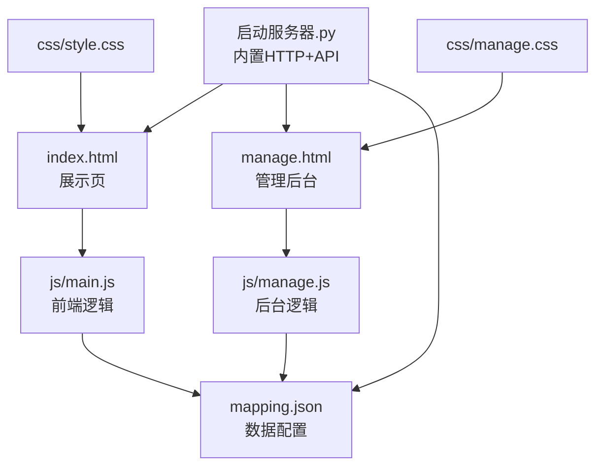
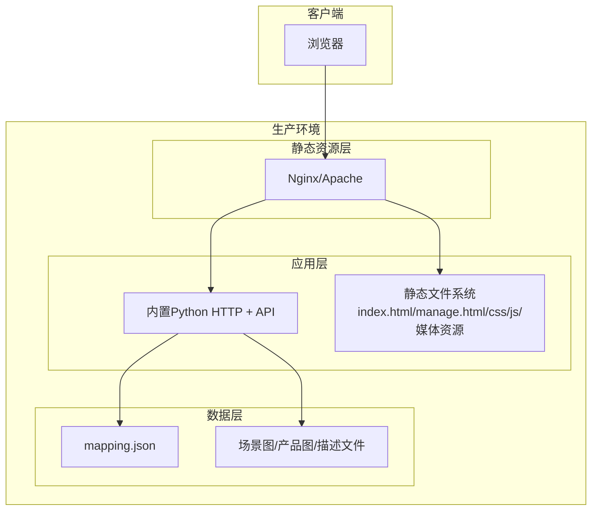
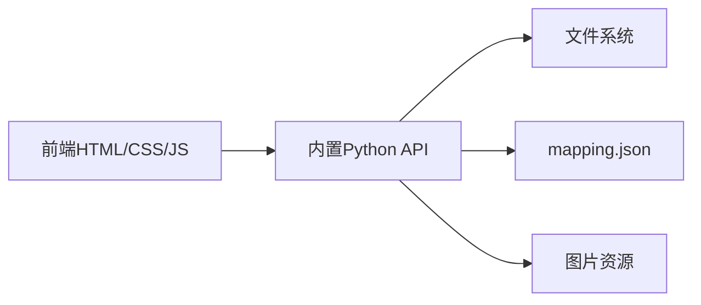

# 部署指南

<cite>
**本文引用的文件**
- [index.html](file://index.html)
- [manage.html](file://manage.html)
- [启动服务器.py](file://启动服务器.py)
- [mapping.json](file://mapping.json)
- [project_architecture.md](file://project_architecture.md)
- [js/main.js](file://js/main.js)
- [js/manage.js](file://js/manage.js)
- [css/style.css](file://css/style.css)
- [css/manage.css](file://css/manage.css)
</cite>

## 目录
1. [简介](#简介)
2. [项目结构](#项目结构)
3. [核心组件](#核心组件)
4. [架构总览](#架构总览)
5. [详细组件分析](#详细组件分析)
6. [依赖分析](#依赖分析)
7. [性能考虑](#性能考虑)
8. [故障排查指南](#故障排查指南)
9. [结论](#结论)
10. [附录](#附录)

## 简介
本指南面向生产环境部署“数字标牌产品展示”项目，涵盖服务器配置、操作系统兼容性、网络环境准备、多种部署方案（本地、云服务器、容器化）、静态文件服务配置（Nginx/Apache）、API 服务部署与配置（Python 环境、端口与防火墙）、安全配置（HTTPS、访问控制、数据保护）、高可用与负载均衡、监控与日志、备份与恢复、运维管理（更新、回滚、应急流程）等内容。项目基于纯前端与内置 Python HTTP 服务器，结合管理后台 API，实现静态资源与动态配置的统一发布。

## 项目结构
项目采用静态网站 + 内置 API 的混合模式：
- 前端页面：index.html（展示页）、manage.html（管理后台）
- 样式：css/style.css（展示页）、css/manage.css（管理后台）
- 逻辑：js/main.js（展示页交互）、js/manage.js（管理后台交互）
- 数据：mapping.json（场景/产品/多语言配置）
- 服务器：启动服务器.py（内置 HTTP + API）

图表来源
- [index.html](file://index.html)
- [manage.html](file://manage.html)
- [启动服务器.py](file://启动服务器.py)
- [mapping.json](file://mapping.json)
- [js/main.js](file://js/main.js)
- [js/manage.js](file://js/manage.js)
- [css/style.css](file://css/style.css)
- [css/manage.css](file://css/manage.css)

章节来源
- [project_architecture.md](file://project_architecture.md)
- [启动服务器.py](file://启动服务器.py)

## 核心组件
- 展示页面（index.html + js/main.js + css/style.css）：负责场景浏览、多语言切换、热点交互、产品详情弹窗、图片预加载与淡入淡出等。
- 管理后台（manage.html + js/manage.js + css/manage.css）：提供可视化编辑场景、热点、产品配置，支持保存与图片上传。
- 数据配置（mapping.json）：集中存储场景、热点、产品与多语言文案，前端通过 fetch 动态加载，管理后台通过 API 写入。
- 内置 API 服务器（启动服务器.py）：在静态文件服务基础上提供 4 个 API 端点，用于保存配置、上传图片、列举图片与描述文件。

章节来源
- [index.html](file://index.html)
- [manage.html](file://manage.html)
- [mapping.json](file://mapping.json)
- [启动服务器.py](file://启动服务器.py)
- [js/main.js](file://js/main.js)
- [js/manage.js](file://js/manage.js)
- [css/style.css](file://css/style.css)
- [css/manage.css](file://css/manage.css)

## 架构总览
生产部署可采用三种模式：
- 本地部署：直接使用内置 Python 服务器，适合小规模演示或开发测试。
- 云服务器部署：在云主机上安装 Nginx/Apache，静态资源由 Web 服务器提供，API 通过反向代理转发至内置服务器或替换为更健壮的后端。
- 容器化部署：将静态资源与 API 服务打包为容器镜像，使用 Docker Compose/Kubernetes 部署，便于弹性扩缩与高可用。

图表来源
- [启动服务器.py](file://启动服务器.py)
- [index.html](file://index.html)
- [manage.html](file://manage.html)
- [mapping.json](file://mapping.json)

## 详细组件分析

### 静态文件服务与 Web 服务器配置
- Nginx/Apache 建议：将项目根目录作为站点根目录，开启 gzip/缓存优化，配置跨域头（开发阶段已允许本地 CORS），生产环境建议限制来源域名。
- 媒体资源：场景图、产品图、描述文件需可公开访问，注意 .webp 格式支持与缓存策略。
- 路由：静态资源直接命中；管理后台 API 走 /api/*，需确保反向代理正确转发。

章节来源
- [启动服务器.py](file://启动服务器.py)
- [project_architecture.md](file://project_architecture.md)

### API 服务部署与配置
- 端口：内置服务器默认端口为 8082，可通过修改脚本或容器环境变量调整。
- 端点：
  - POST /api/save-mapping：保存 mapping.json（写入前自动备份）
  - POST /api/upload-image：上传图片到场景图/产品图目录
  - GET /api/list-images：返回场景图与产品图列表
  - GET /api/list-descriptions：返回产品描述文件列表
- Python 环境：Python 3.x，无需第三方依赖，内置 http.server 与 socketserver。
- 防火墙：开放 8082 端口，建议仅限内网或通过反向代理暴露。

章节来源
- [启动服务器.py](file://启动服务器.py)
- [project_architecture.md](file://project_architecture.md)

### 安全配置
- HTTPS：建议在反向代理层启用 TLS，证书由 ACME 或企业 CA 管理。
- 访问控制：限制 /api/save-mapping 与 /api/upload-image 的访问来源，结合身份认证（如 Basic/Digest 或 JWT）。
- 数据保护：敏感信息不放入前端，mapping.json 仅存放公开配置；图片与描述文件按最小权限访问。
- CORS：生产环境仅允许受信域名，避免通配符。

章节来源
- [启动服务器.py](file://启动服务器.py)
- [project_architecture.md](file://project_architecture.md)

### 高可用与负载均衡
- 多实例：将静态资源与 API 服务复制到多台服务器，使用 LVS/Nginx/Tengine 做四层/七层负载均衡。
- 会话：静态资源无状态，API 服务可共享文件系统或数据库（如需持久化）。
- 故障转移：健康检查失败自动摘除节点，流量切换至健康实例。
- 缓存：CDN 缓存静态资源，缩短边缘延迟。

章节来源
- [启动服务器.py](file://启动服务器.py)
- [project_architecture.md](file://project_architecture.md)

### 监控与日志
- 性能监控：Nginx/Apache 指标（QPS、响应时间、连接数、错误率）；Python 服务器进程监控。
- 错误日志：Web 服务器错误日志；Python 服务器标准输出/文件日志。
- 访问日志：Nginx/Apache 访问日志；聚合分析热点、图片加载失败、API 调用情况。
- 告警：阈值告警（错误率、响应时间、CPU/内存/磁盘）。

章节来源
- [启动服务器.py](file://启动服务器.py)
- [project_architecture.md](file://project_architecture.md)

### 备份与恢复
- mapping.json 备份：每次保存配置前自动备份为 mapping.json.bak，建议定期归档。
- 媒体资源备份：场景图/产品图/描述文件纳入统一备份策略。
- 恢复流程：停止服务 → 恢复 mapping.json.bak → 启动服务 → 验证页面与 API。

章节来源
- [启动服务器.py](file://启动服务器.py)
- [project_architecture.md](file://project_architecture.md)

### 运维管理
- 更新部署：构建新版本 → 预热测试 → 切换流量 → 回滚策略（保留上次稳定版本）。
- 版本回滚：恢复 mapping.json.bak 与静态资源快照。
- 应急流程：监控告警 → 快速定位 → 临时降级（只读 API）→ 修复上线 → 验证恢复。

章节来源
- [启动服务器.py](file://启动服务器.py)
- [project_architecture.md](file://project_architecture.md)

## 依赖分析
- 前端依赖：无第三方框架，依赖 marked.js（CDN）进行 Markdown 解析。
- 后端依赖：Python 标准库（http.server、socketserver、json、os、shutil、cgi、urllib）。
- 静态资源：HTML/CSS/JS、图片（.webp）、Markdown 描述文件。

图表来源
- [启动服务器.py](file://启动服务器.py)
- [index.html](file://index.html)
- [manage.html](file://manage.html)
- [mapping.json](file://mapping.json)

章节来源
- [启动服务器.py](file://启动服务器.py)
- [project_architecture.md](file://project_architecture.md)

## 性能考虑
- 图片优化：优先使用 .webp，按设备像素比与视口尺寸选择合适分辨率。
- 预加载策略：首屏独占带宽，完成后批量预加载，减少阻塞。
- 缓存策略：静态资源强缓存，API 增量缓存，合理设置 ETag/Last-Modified。
- 传输压缩：Gzip/Brotli 压缩 HTML/CSS/JS，降低带宽占用。
- 交叉淡入淡出：双层图片切换，避免闪烁与黑屏。

章节来源
- [js/main.js](file://js/main.js)
- [css/style.css](file://css/style.css)
- [project_architecture.md](file://project_architecture.md)

## 故障排查指南
- 页面无法加载 mapping.json：检查网络连通性与 CORS 配置；确认静态资源可访问。
- 管理后台保存失败：检查 /api/save-mapping 权限与反向代理配置；查看服务器错误日志。
- 图片上传失败：检查 /api/upload-image 的 multipart/form-data 解析与目录权限；确认目标目录存在。
- 语言切换异常：确认 mapping.json 中 i18n 字段完整；检查前端 t()/getText() 逻辑。
- 服务器端口冲突：内置服务器会自动寻找可用端口，若仍冲突，修改脚本或容器端口映射。

章节来源
- [启动服务器.py](file://启动服务器.py)
- [js/main.js](file://js/main.js)
- [js/manage.js](file://js/manage.js)
- [project_architecture.md](file://project_architecture.md)

## 结论
本项目以纯前端与内置 Python API 为核心，具备低门槛部署与良好的可维护性。生产环境建议采用 Nginx/Apache 作为静态资源入口，结合反向代理与 HTTPS，配合高可用与监控体系，实现稳定可靠的数字标牌产品展示服务。

## 附录

### 部署方案对比与实施要点
- 本地部署
  - 适用：演示、开发测试、小规模内部使用
  - 要点：双击启动服务器.py，浏览器访问本地地址；注意 CORS 仅限本地开发使用
- 云服务器部署
  - 适用：中小规模生产环境
  - 要点：Nginx/Apache 配置静态资源与反向代理；Python 服务器监听内网端口；开启 HTTPS 与访问控制
- 容器化部署
  - 适用：大规模弹性与高可用
  - 要点：Dockerfile 构建镜像；docker-compose 或 Kubernetes 编排；持久化 mapping.json 与媒体资源；Ingress/Service 配置

章节来源
- [启动服务器.py](file://启动服务器.py)
- [project_architecture.md](file://project_architecture.md)