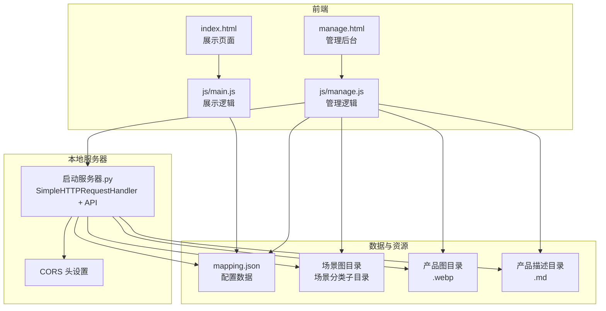
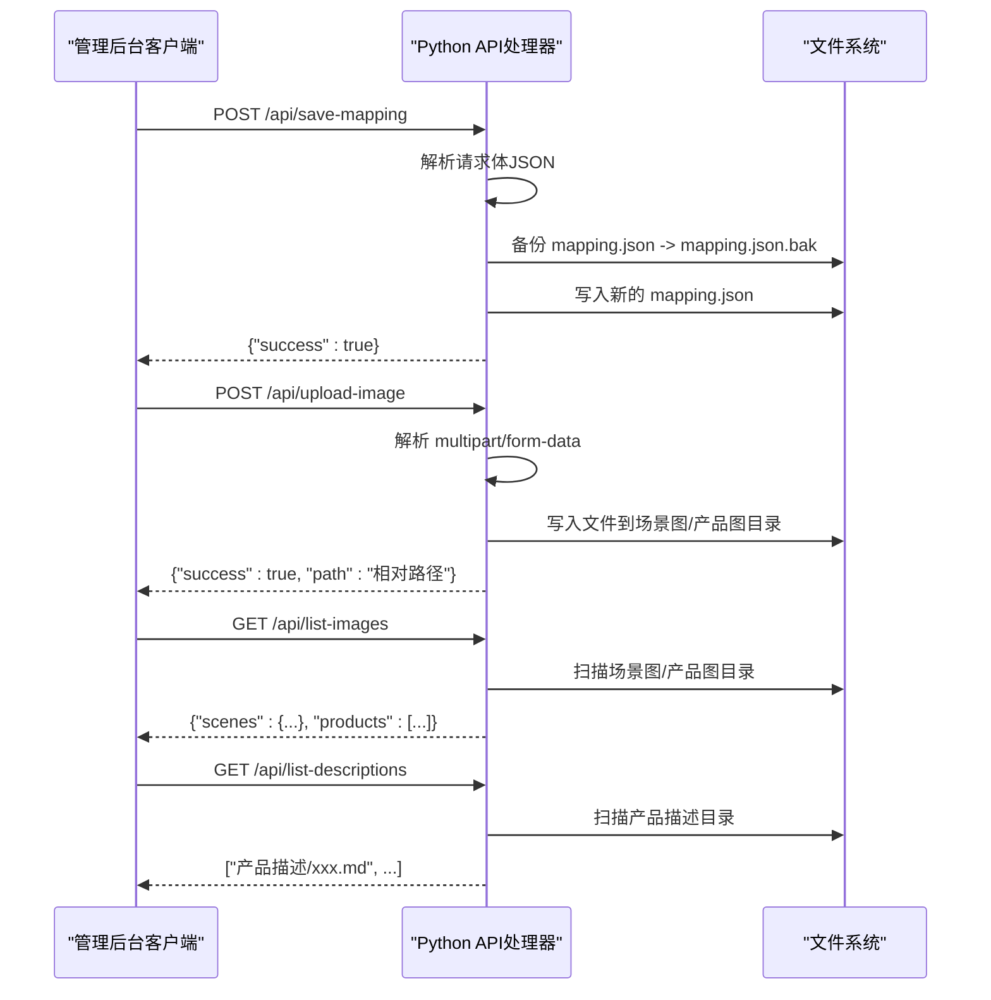
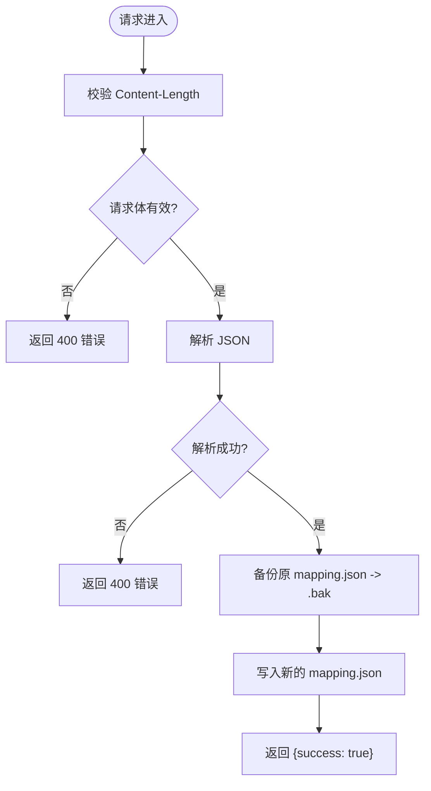
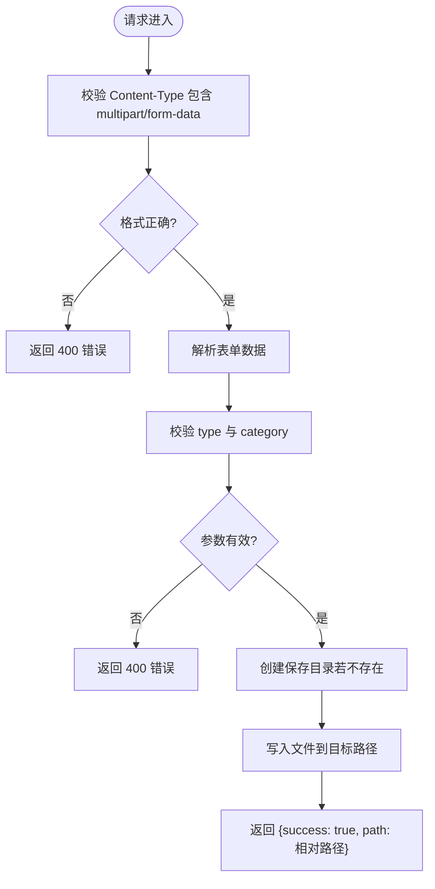
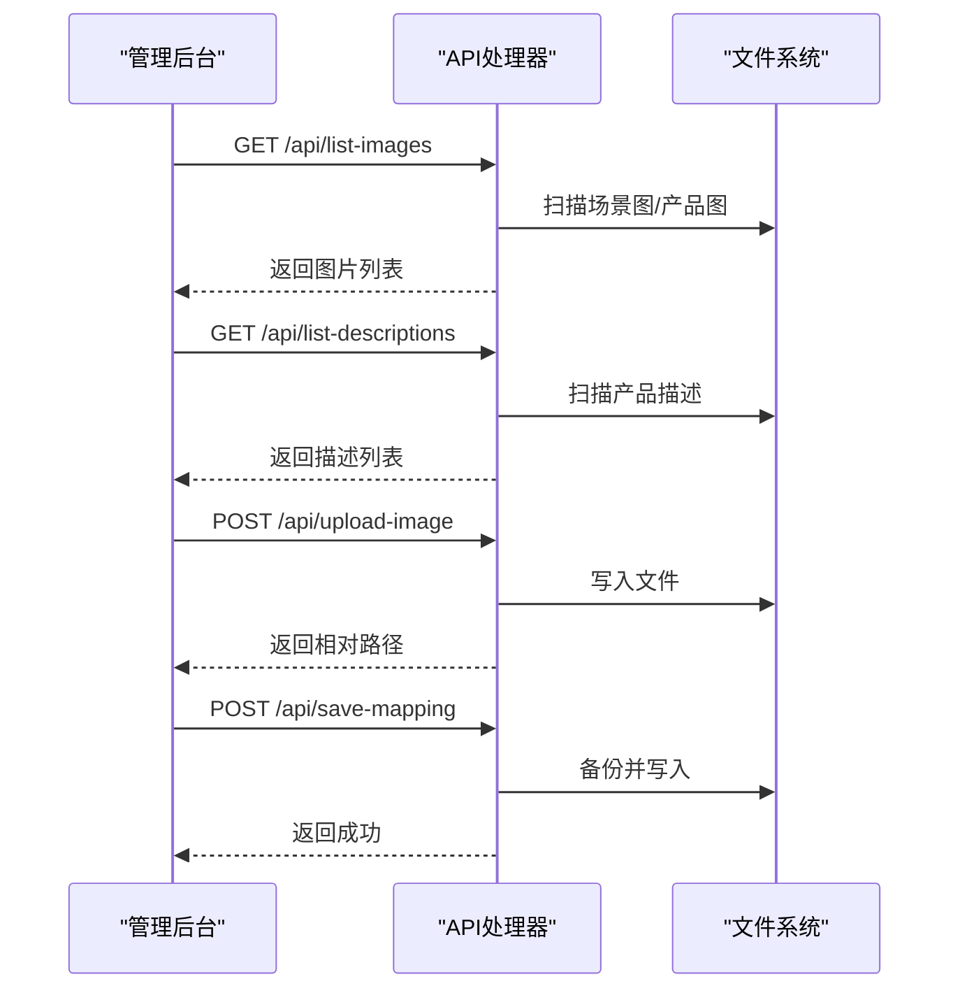
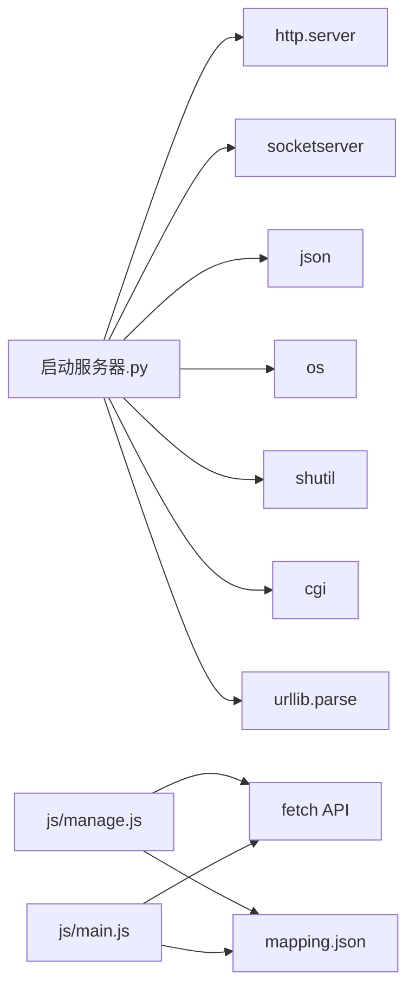

# API架构设计

<cite>
**本文档引用的文件**
- [启动服务器.py](file://启动服务器.py)
- [project_architecture.md](file://project_architecture.md)
- [mapping.json](file://mapping.json)
- [manage.html](file://manage.html)
- [index.html](file://index.html)
- [js/main.js](file://js/main.js)
- [js/manage.js](file://js/manage.js)
</cite>

## 目录
1. [简介](#简介)
2. [项目结构](#项目结构)
3. [核心组件](#核心组件)
4. [架构总览](#架构总览)
5. [详细组件分析](#详细组件分析)
6. [依赖分析](#依赖分析)
7. [性能考量](#性能考量)
8. [故障排查指南](#故障排查指南)
9. [结论](#结论)
10. [附录](#附录)

## 简介
本项目为数字标牌产品展示页面的本地开发服务器与前端交互系统。服务器基于Python内置HTTP服务器扩展，提供4个RESTful API端点，用于管理后台对场景、热点、产品配置的可视化编辑与持久化。前端通过静态页面与API交互，实现数据驱动的场景浏览与详情展示。本文档聚焦API架构设计，包括端点设计原则、实现方式、安全性考虑、版本管理与兼容性、响应格式与错误码设计，并提供架构图与接口调用流程图。

## 项目结构
项目采用“静态资源 + 本地API服务器”的轻量架构：
- 静态资源：HTML/CSS/JS文件，负责展示与交互
- 本地服务器：Python HTTP服务器，提供API端点与静态文件服务
- 配置数据：mapping.json集中存储场景、热点、产品与多语言配置

图表来源
- [启动服务器.py:25-298](file://启动服务器.py#L25-L298)
- [project_architecture.md:43-108](file://project_architecture.md#L43-L108)

章节来源
- [project_architecture.md:43-108](file://project_architecture.md#L43-L108)
- [启动服务器.py:17-298](file://启动服务器.py#L17-L298)

## 核心组件
- API处理器：继承自Python内置HTTP处理器，扩展CORS与JSON响应能力
- API端点：4个RESTful端点，分别负责配置保存、图片上传、图片列表查询、描述文件列表查询
- 前端交互：管理后台通过fetch调用API，展示页面通过静态资源加载数据

章节来源
- [启动服务器.py:25-98](file://启动服务器.py#L25-L98)
- [js/manage.js:35-72](file://js/manage.js#L35-L72)

## 架构总览
本地服务器在提供静态文件服务的同时，拦截以/api/开头的请求，路由到相应的API处理函数。所有API响应均设置CORS头，支持跨域访问。管理后台通过API实现配置持久化与资源上传，展示页面通过静态资源加载配置数据。

图表来源
- [启动服务器.py:75-251](file://启动服务器.py#L75-L251)
- [js/manage.js:81-108](file://js/manage.js#L81-L108)

## 详细组件分析

### API处理器与CORS
- CORS设置：统一设置允许跨域、允许的方法与请求头
- JSON响应：统一封装JSON响应与错误响应，保证前后端一致的契约
- 预检请求：处理OPTIONS请求，返回204

章节来源
- [启动服务器.py:28-46](file://启动服务器.py#L28-L46)
- [启动服务器.py:48-53](file://启动服务器.py#L48-L53)

### 端点路由与控制流
- GET路由：/api/list-images、/api/list-descriptions
- POST路由：/api/save-mapping、/api/upload-image
- 未知路径：返回404错误

章节来源
- [启动服务器.py:75-97](file://启动服务器.py#L75-L97)

### POST /api/save-mapping（保存配置）
- 请求体：完整的mapping.json数据（application/json）
- 处理流程：
  1) 校验请求体长度
  2) 解析JSON
  3) 备份原文件为.bak
  4) 写入新配置
- 错误处理：请求体为空（400）、JSON解析失败（400）、IO异常（500）

图表来源
- [启动服务器.py:101-127](file://启动服务器.py#L101-L127)

章节来源
- [启动服务器.py:101-127](file://启动服务器.py#L101-L127)
- [js/manage.js:81-108](file://js/manage.js#L81-L108)

### POST /api/upload-image（上传图片）
- 请求体：multipart/form-data
  - file：上传的图片文件
  - type：场景图(scene)或产品图(product)
  - category：场景分类名（type=scene时必填）
  - filename：指定文件名（可选）
- 处理流程：
  1) 校验Content-Type为multipart/form-data
  2) 解析表单数据
  3) 校验type与category
  4) 确定保存目录（场景图/分类名/ 或 产品图/）
  5) 目录不存在则创建
  6) 写入文件并返回相对路径
- 错误处理：缺少type（400）、缺少category（400）、无效type（400）、IO异常（500）

图表来源
- [启动服务器.py:129-202](file://启动服务器.py#L129-L202)

章节来源
- [启动服务器.py:129-202](file://启动服务器.py#L129-L202)
- [js/manage.js:762-781](file://js/manage.js#L762-L781)

### GET /api/list-images（图片列表查询）
- 处理流程：
  1) 扫描场景图目录，按分类聚合图片
  2) 扫描产品图目录
  3) 过滤支持的图片扩展名（.webp, .jpg, .png）
- 响应格式：包含scenes（按分类的图片数组）与products（产品图数组）

章节来源
- [启动服务器.py:204-236](file://启动服务器.py#L204-L236)
- [js/manage.js:48-59](file://js/manage.js#L48-L59)

### GET /api/list-descriptions（描述文件列表查询）
- 处理流程：扫描产品描述目录，过滤.md文件
- 响应格式：描述文件路径数组

章节来源
- [启动服务器.py:238-251](file://启动服务器.py#L238-L251)
- [js/manage.js:61-72](file://js/manage.js#L61-L72)

### 前端调用流程（管理后台）
- 数据加载：首次加载mapping.json、图片列表、描述列表
- 保存配置：POST /api/save-mapping
- 图片上传：POST /api/upload-image
- 列表查询：GET /api/list-images、GET /api/list-descriptions

图表来源
- [js/manage.js:35-72](file://js/manage.js#L35-L72)
- [js/manage.js:762-781](file://js/manage.js#L762-L781)
- [js/manage.js:81-108](file://js/manage.js#L81-L108)

## 依赖分析
- Python内置模块：http.server、socketserver、urllib.parse、os、json、shutil、cgi
- 前端依赖：marked.js（CDN引入，用于Markdown解析）
- 静态资源：CSS/JS文件与图片资源

图表来源
- [启动服务器.py:7-15](file://启动服务器.py#L7-L15)
- [js/manage.js:35-72](file://js/manage.js#L35-L72)
- [js/main.js:49-73](file://js/main.js#L49-L73)

章节来源
- [启动服务器.py:7-15](file://启动服务器.py#L7-L15)
- [js/manage.js:35-72](file://js/manage.js#L35-L72)
- [js/main.js:49-73](file://js/main.js#L49-L73)

## 性能考量
- 图片预加载：展示页面在首图加载完成后进行后台预加载，避免带宽竞争导致首图不显示
- 并行加载：管理后台在渲染产品详情时并行加载多个Markdown文件
- 超时与重试：数据加载与图片加载具备超时与重试机制，提升弱网环境下的稳定性

章节来源
- [js/main.js:257-327](file://js/main.js#L257-L327)
- [js/main.js:888-956](file://js/main.js#L888-L956)
- [js/main.js:623-640](file://js/main.js#L623-L640)

## 故障排查指南
- CORS问题：确认响应头包含Access-Control-Allow-Origin等字段
- 端口占用：服务器默认端口8082，若被占用会自动递增寻找可用端口
- JSON解析失败：检查请求体是否为合法JSON，Content-Type是否为application/json
- 文件上传失败：检查multipart/form-data格式、type与category参数、目标目录权限
- 文件列表为空：确认场景图/产品图/产品描述目录结构与文件扩展名符合预期

章节来源
- [启动服务器.py:28-46](file://启动服务器.py#L28-L46)
- [启动服务器.py:254-263](file://启动服务器.py#L254-L263)
- [启动服务器.py:110-114](file://启动服务器.py#L110-L114)
- [启动服务器.py:132-135](file://启动服务器.py#L132-L135)
- [启动服务器.py:168-182](file://启动服务器.py#L168-L182)

## 结论
本API架构以最小化依赖为核心，利用Python内置HTTP服务器扩展出4个关键端点，支撑管理后台的可视化编辑与持久化。通过CORS支持、统一JSON响应、严格的参数校验与错误处理，确保前后端交互的一致性与可靠性。结合前端的数据加载重试、图片预加载与并行加载机制，整体在弱网与复杂场景下具备良好的用户体验。

## 附录

### API端点一览
- POST /api/save-mapping：保存mapping.json（自动备份）
- POST /api/upload-image：上传图片到指定目录
- GET /api/list-images：获取所有图片文件列表
- GET /api/list-descriptions：获取所有产品描述文件列表

章节来源
- [project_architecture.md:769-776](file://project_architecture.md#L769-L776)

### 响应格式与错误码
- 成功响应：统一返回{"success": true}或具体数据结构
- 错误响应：统一返回{"success": false, "error": "错误信息"}
- 状态码：
  - 200：成功
  - 204：OPTIONS预检成功
  - 400：请求体为空、JSON解析失败、缺少参数、无效参数
  - 404：未知API路径
  - 500：服务器内部错误

章节来源
- [启动服务器.py:34-46](file://启动服务器.py#L34-L46)
- [启动服务器.py:48-53](file://启动服务器.py#L48-L53)
- [启动服务器.py:110-114](file://启动服务器.py#L110-L114)
- [启动服务器.py:132-135](file://启动服务器.py#L132-L135)
- [启动服务器.py:168-182](file://启动服务器.py#L168-L182)

### 版本管理与向后兼容
- 版本字段：mapping.json包含version字段，当前为4.0
- 向后兼容：管理后台通过API读写配置，前端通过静态资源加载数据，版本升级不影响API契约
- 建议：新增字段时保持默认值，避免破坏现有配置

章节来源
- [mapping.json:1-3](file://mapping.json#L1-L3)
- [project_architecture.md:919-932](file://project_architecture.md#L919-L932)