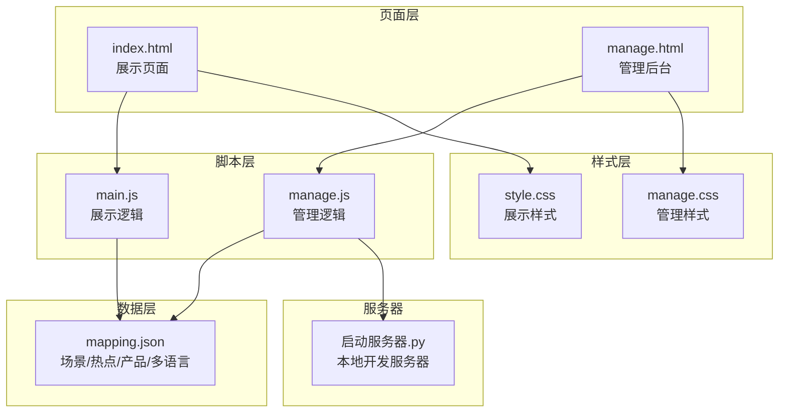
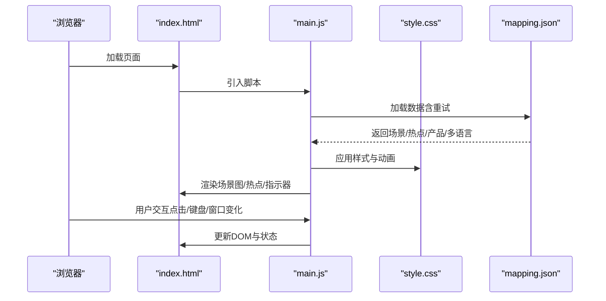
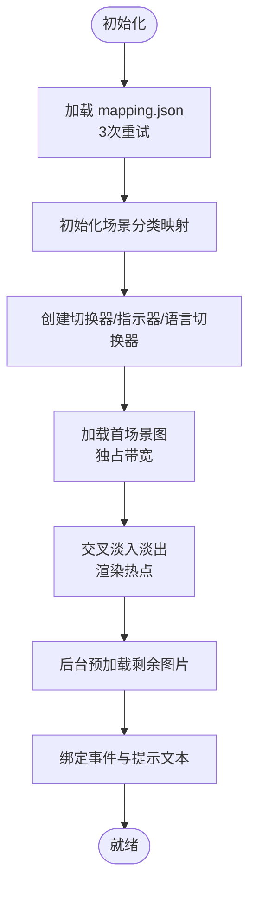
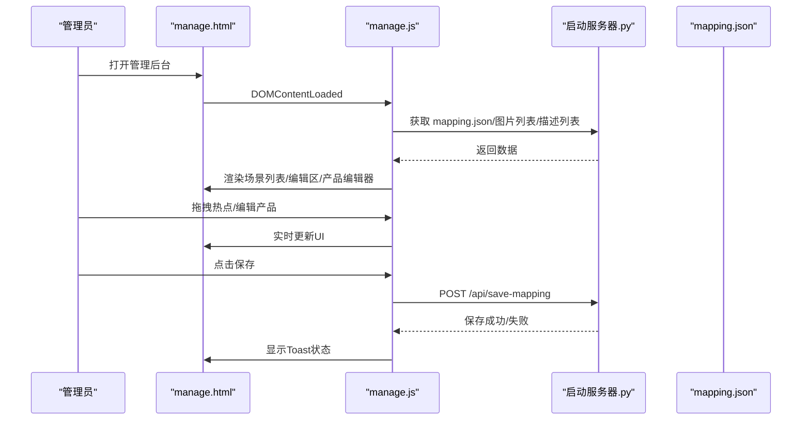
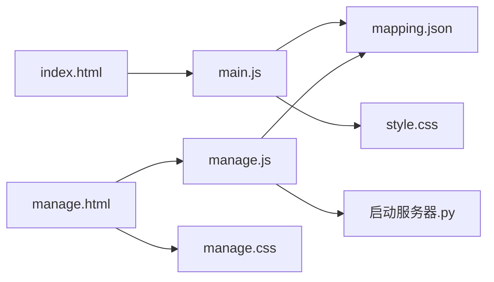

# 前端架构设计

<cite>
**本文档引用的文件**
- [index.html](file://index.html)
- [manage.html](file://manage.html)
- [main.js](file://js/main.js)
- [manage.js](file://js/manage.js)
- [style.css](file://css/style.css)
- [manage.css](file://css/manage.css)
- [mapping.json](file://mapping.json)
- [project_architecture.md](file://project_architecture.md)
- [启动服务器.py](file://启动服务器.py)
</cite>

## 目录
1. [简介](#简介)
2. [项目结构](#项目结构)
3. [核心组件](#核心组件)
4. [架构总览](#架构总览)
5. [详细组件分析](#详细组件分析)
6. [依赖关系分析](#依赖关系分析)
7. [性能考量](#性能考量)
8. [故障排查指南](#故障排查指南)
9. [结论](#结论)
10. [附录](#附录)

## 简介
本项目是一个基于HTML5、CSS3与原生JavaScript的数字标牌产品展示与管理平台，采用双页面架构：展示页面（index.html）与管理后台（manage.html）。系统通过独立的数据配置文件 mapping.json 实现数据与逻辑分离，支持中日文双语切换、响应式布局、事件驱动的交互模式以及完善的错误处理与加载反馈机制。前端采用纯原生实现，无第三方框架依赖，便于维护与扩展。

## 项目结构
项目采用清晰的文件组织方式，分为页面、样式、脚本与数据配置四个主要部分：
- 页面层：index.html（展示页面）、manage.html（管理后台）
- 样式层：css/style.css（展示页面样式）、css/manage.css（管理后台样式）
- 脚本层：js/main.js（展示页面逻辑）、js/manage.js（管理后台逻辑）
- 数据层：mapping.json（场景、热点、产品与多语言配置）

图表来源
- [index.html:1-83](file://index.html#L1-L83)
- [manage.html:1-113](file://manage.html#L1-L113)
- [main.js:1-1284](file://js/main.js#L1-L1284)
- [manage.js:1-811](file://js/manage.js#L1-L811)
- [style.css:1-997](file://css/style.css#L1-L997)
- [manage.css:1-824](file://css/manage.css#L1-L824)
- [mapping.json:1-232](file://mapping.json#L1-L232)
- [启动服务器.py:1-200](file://启动服务器.py#L1-L200)

章节来源
- [index.html:1-83](file://index.html#L1-L83)
- [manage.html:1-113](file://manage.html#L1-L113)
- [project_architecture.md:43-108](file://project_architecture.md#L43-L108)

## 核心组件
- 数据加载与缓存：通过 fetch 异步加载 mapping.json，内置重试机制；Markdown描述采用缓存策略，避免重复请求。
- 多语言引擎：提供 t() 与 getText() 函数，支持中日文切换与 UI 文本动态更新。
- 状态管理：集中管理当前场景索引、过渡状态、详情面板状态、当前语言与热点位置等。
- 图片预加载与懒加载：首屏独占带宽策略，确保在慢速网络下的首图显示；热点与产品图片统一预加载缓存。
- 事件驱动架构：基于 DOM 事件（点击、键盘、窗口大小变化）驱动页面交互，解耦业务逻辑与视图更新。
- 响应式与动画系统：使用 CSS3 动画与毛玻璃效果，结合媒体查询与弹性布局实现跨设备体验。
- 主题系统：展示页面采用深色主题与毛玻璃背景，管理后台采用浅色主题，两套主题风格明确区分。

章节来源
- [main.js:29-73](file://js/main.js#L29-L73)
- [main.js:87-162](file://js/main.js#L87-L162)
- [main.js:195-235](file://js/main.js#L195-L235)
- [main.js:257-407](file://js/main.js#L257-L407)
- [main.js:421-461](file://js/main.js#L421-L461)
- [style.css:1-997](file://css/style.css#L1-L997)
- [manage.css:1-824](file://css/manage.css#L1-L824)

## 架构总览
系统采用“页面-逻辑-样式-数据”四层架构，展示页面与管理后台分别拥有独立的初始化流程、事件绑定与状态管理，通过 mapping.json 实现数据共享与一致性。

图表来源
- [index.html:1-83](file://index.html#L1-L83)
- [main.js:1197-1281](file://js/main.js#L1197-L1281)
- [style.css:1-997](file://css/style.css#L1-L997)
- [mapping.json:1-232](file://mapping.json#L1-L232)

## 详细组件分析

### 展示页面（index.html + main.js）
- 页面结构：包含语言切换器、双层场景图容器、加载指示器、场景分类切换器、热点容器、导航按钮、场景指示器、产品详情弹窗与遮罩层。
- 初始化流程：先加载 mapping.json（含3次递增延迟重试），初始化场景分类映射，创建切换器与指示器，首图独占带宽显示，随后后台预加载剩余图片，绑定事件并添加提示文本。
- 场景切换：采用双层交叉淡入淡出，支持键盘左右箭头与遮罩点击关闭；切换过程中隐藏热点与导航，避免视觉干扰。
- 热点系统：支持单场景多热点，热点位置基于 object-fit: cover 的图片裁剪计算，窗口变化时自动重新定位。
- 详情弹窗：左图右文布局，产品名称与描述均支持多语言；描述加载采用并行策略与骨架屏反馈，失败时提供可点击重试。
- 语言切换：动态更新页面标题、按钮文字、分类切换器与弹窗内容，保持一致的用户体验。

图表来源
- [main.js:1197-1281](file://js/main.js#L1197-L1281)

章节来源
- [index.html:14-76](file://index.html#L14-L76)
- [main.js:1197-1281](file://js/main.js#L1197-L1281)
- [main.js:480-595](file://js/main.js#L480-L595)
- [main.js:716-847](file://js/main.js#L716-L847)
- [main.js:888-956](file://js/main.js#L888-L956)
- [main.js:1028-1094](file://js/main.js#L1028-L1094)

### 管理后台（manage.html + manage.js）
- 页面结构：采用三栏布局（左栏场景列表、中栏场景编辑区、右栏产品编辑器），顶部工具栏包含保存按钮与状态提示。
- 数据加载：通过本地开发服务器 API 获取 mapping.json、图片列表与描述文件列表，支持实时刷新。
- 场景管理：支持添加/删除场景、编辑分类名、更换场景图（含上传）、拖拽热点调整位置。
- 产品管理：支持为热点添加/删除产品，编辑产品名称（中日文）、选择产品图片与描述文件。
- 保存机制：点击保存后向服务器发送完整 mapping.json，服务器自动备份并写入新配置，提供成功/失败状态提示。
- 交互细节：Toast 提示、对话框、滚动条自定义与拖拽状态管理，确保编辑体验流畅。

图表来源
- [manage.html:1-113](file://manage.html#L1-L113)
- [manage.js:18-31](file://js/manage.js#L18-L31)
- [manage.js:35-72](file://js/manage.js#L35-L72)
- [manage.js:82-108](file://js/manage.js#L82-L108)
- [启动服务器.py:1-200](file://启动服务器.py#L1-L200)

章节来源
- [manage.html:10-80](file://manage.html#L10-L80)
- [manage.js:18-31](file://js/manage.js#L18-L31)
- [manage.js:112-185](file://js/manage.js#L112-L185)
- [manage.js:237-265](file://js/manage.js#L237-L265)
- [manage.js:350-385](file://js/manage.js#L350-L385)
- [manage.js:442-476](file://js/manage.js#L442-L476)
- [manage.js:762-781](file://js/manage.js#L762-L781)

### CSS架构与主题系统
- 展示页面样式（style.css）：采用深色主题与毛玻璃效果，重点突出脉冲热点动画、交叉淡入淡出与骨架屏加载反馈；提供错误状态样式与提示文本动画。
- 管理后台样式（manage.css）：采用浅色主题，三栏布局清晰，编辑器热点标记具备选中与拖拽态；Toast 提示与对话框样式完善。
- 动画系统：统一使用 CSS3 动画与贝塞尔曲线，保证流畅的过渡与交互反馈；骨架屏与错误状态动画增强用户体验。
- 响应式设计：通过弹性布局与媒体查询适配不同屏幕尺寸，确保在桌面与移动设备上的良好体验。

章节来源
- [style.css:1-997](file://css/style.css#L1-L997)
- [manage.css:1-824](file://css/manage.css#L1-L824)

### 数据模型与映射
- mapping.json 定义了场景、热点与产品之间的关系，以及多语言文本字典。系统通过 getText() 与 t() 函数实现多语言渲染与 UI 文本切换。
- 场景分类映射（sceneCategories）基于 mappingData.scenes 动态计算，支持语言切换时自动更新分类标签。

章节来源
- [mapping.json:1-232](file://mapping.json#L1-L232)
- [main.js:217-229](file://js/main.js#L217-L229)
- [main.js:102-106](file://js/main.js#L102-L106)

## 依赖关系分析
- 展示页面依赖 main.js 与 style.css，通过 DOM 事件与状态管理实现交互；依赖 mapping.json 提供数据源。
- 管理后台依赖 manage.js、manage.css 与本地开发服务器 API，负责数据的可视化编辑与持久化。
- 两个页面共享 mapping.json 作为数据契约，确保前后端数据一致性。

图表来源
- [index.html:1-83](file://index.html#L1-L83)
- [manage.html:1-113](file://manage.html#L1-L113)
- [main.js:1-1284](file://js/main.js#L1-L1284)
- [manage.js:1-811](file://js/manage.js#L1-L811)
- [style.css:1-997](file://css/style.css#L1-L997)
- [manage.css:1-824](file://css/manage.css#L1-L824)
- [mapping.json:1-232](file://mapping.json#L1-L232)
- [启动服务器.py:1-200](file://启动服务器.py#L1-L200)

章节来源
- [project_architecture.md:43-108](file://project_architecture.md#L43-L108)

## 性能考量
- 首屏独占带宽策略：首场景图加载完成后才启动后台预加载，避免慢速网络下的带宽竞争，确保首图稳定显示。
- 图片加载优化：使用 removeAttribute('src') 清除旧 src 以重置 complete 状态，结合 waitForImageLoad 与超时保护，提升加载稳定性。
- 并行加载：产品描述采用 Promise.all 并行加载，显著缩短详情面板渲染时间。
- 防抖与状态锁：窗口变化与场景切换过程加入防抖与状态锁，减少不必要的重排与重绘。
- 骨架屏与加载反馈：详情面板采用骨架屏与加载提示，改善感知性能与用户体验。

章节来源
- [main.js:1260-1267](file://js/main.js#L1260-L1267)
- [main.js:354-395](file://js/main.js#L354-L395)
- [main.js:931-956](file://js/main.js#L931-L956)
- [main.js:1140-1148](file://js/main.js#L1140-L1148)
- [style.css:831-863](file://css/style.css#L831-L863)

## 故障排查指南
- mapping.json 加载失败：展示页面会在全屏显示错误提示，包含重试按钮；检查网络与文件路径。
- 图片加载失败：详情面板提供可点击重试的失败提示，点击后清除缓存并重新加载。
- 热点定位异常：确保图片已完全加载后再进行热点定位；窗口变化时会自动重新定位。
- 管理后台保存失败：检查服务器 API 端点与权限，确认 mapping.json 写入成功并存在备份文件。

章节来源
- [main.js:1173-1178](file://js/main.js#L1173-L1178)
- [main.js:937-955](file://js/main.js#L937-L955)
- [main.js:826-847](file://js/main.js#L826-L847)
- [manage.js:82-108](file://js/manage.js#L82-L108)

## 结论
本项目通过清晰的模块化设计与事件驱动架构，实现了展示页面与管理后台的高效协同。数据与逻辑分离、多语言支持、响应式与动画系统以及完善的错误处理与性能优化，共同构建了一个易于维护与扩展的前端架构。建议后续可进一步引入模块化打包与测试体系，以提升开发效率与质量保障。

## 附录
- 在线预览地址：展示页面与管理后台分别提供本地访问入口，便于快速验证与演示。
- 服务器 API：本地开发服务器提供保存配置、上传图片与文件列表接口，满足管理后台的运行需求。

章节来源
- [project_architecture.md:23-26](file://project_architecture.md#L23-L26)
- [启动服务器.py:1-200](file://启动服务器.py#L1-L200)