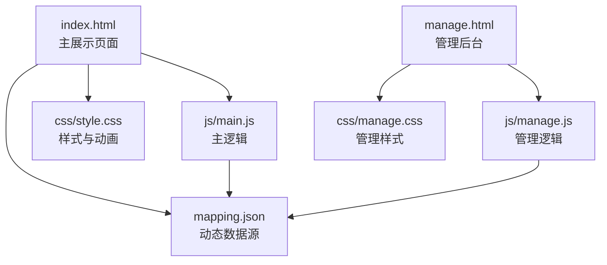
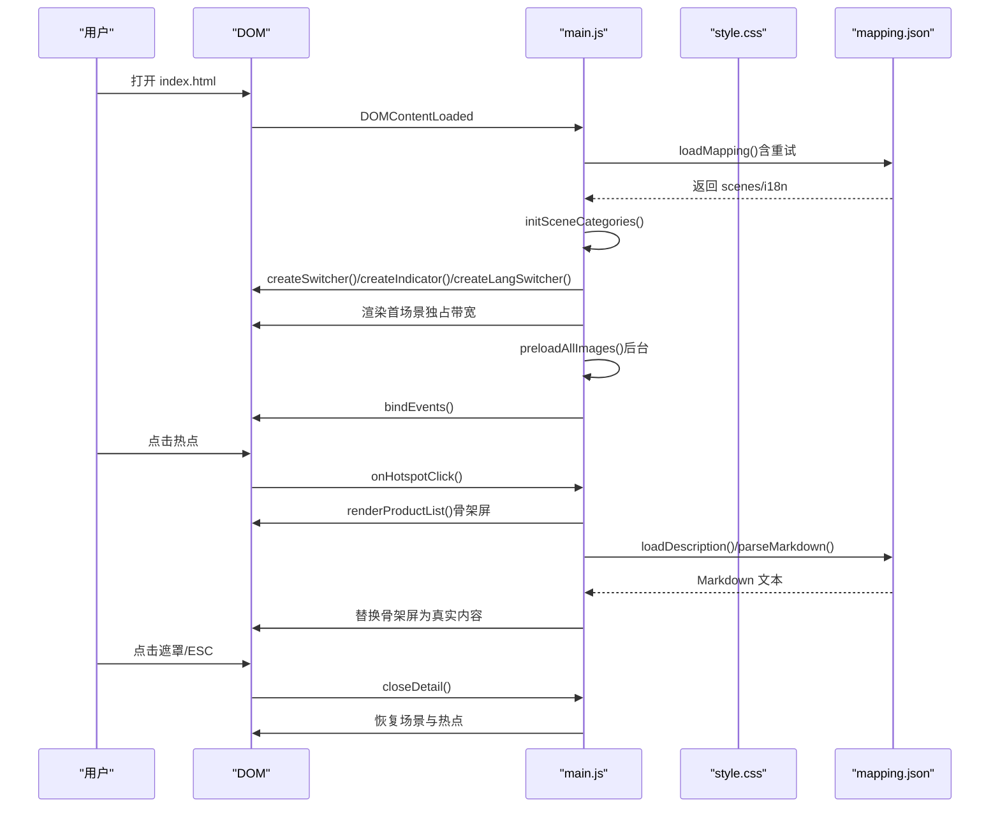
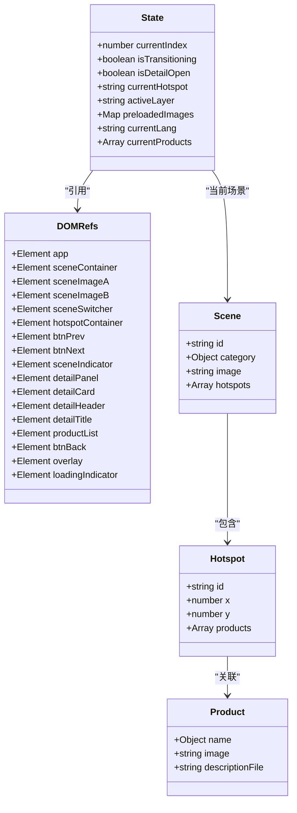
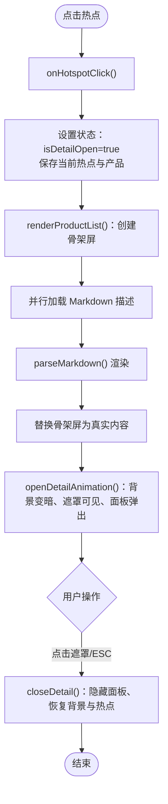
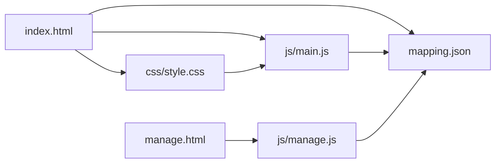

# 展示页面架构

<cite>
**本文档引用的文件**
- [index.html](file://index.html)
- [main.js](file://js/main.js)
- [style.css](file://css/style.css)
- [mapping.json](file://mapping.json)
- [manage.html](file://manage.html)
- [manage.js](file://js/manage.js)
</cite>

## 目录
1. [简介](#简介)
2. [项目结构](#项目结构)
3. [核心组件](#核心组件)
4. [架构总览](#架构总览)
5. [详细组件分析](#详细组件分析)
6. [依赖关系分析](#依赖关系分析)
7. [性能考量](#性能考量)
8. [故障排查指南](#故障排查指南)
9. [结论](#结论)
10. [附录](#附录)

## 简介
本文件面向“展示页面”的前端架构，围绕以下目标展开：
- HTML 结构设计：双层图片容器、热点容器、详情弹窗等核心 DOM 结构
- 模块化设计：数据加载、多语言引擎、图片预加载、场景渲染等核心功能模块
- CSS 架构：动画系统、骨架屏、错误处理等样式实现
- 事件驱动架构：DOM 事件绑定、状态管理、生命周期管理
- 组件关系图与交互流程图：帮助理解模块间协作与用户交互

## 项目结构
该仓库包含展示页面与管理后台两个主要页面，以及共享的样式与数据文件：
- 展示页面：index.html + js/main.js + css/style.css + mapping.json
- 管理后台：manage.html + js/manage.js + css/manage.css（样式文件在仓库中存在但未在本文档重点分析）
- 场景与产品资源：场景图目录、产品图目录、产品描述 Markdown 文件

图表来源
- [index.html:1-83](file://index.html#L1-L83)
- [main.js:1197-1284](file://js/main.js#L1197-L1284)
- [mapping.json:1-232](file://mapping.json#L1-L232)
- [manage.html:1-113](file://manage.html#L1-L113)
- [manage.js:18-31](file://js/manage.js#L18-L31)

章节来源
- [index.html:1-83](file://index.html#L1-L83)
- [main.js:1197-1284](file://js/main.js#L1197-L1284)
- [mapping.json:1-232](file://mapping.json#L1-L232)
- [manage.html:1-113](file://manage.html#L1-L113)
- [manage.js:18-31](file://js/manage.js#L18-L31)

## 核心组件
- 数据加载与缓存：从 mapping.json 动态加载场景、多语言与产品描述；对 Markdown 与图片进行缓存与重试
- 多语言引擎：基于 mappingData.i18n 的 t()/getText()/switchLanguage() 体系
- 图片系统：双层交叉淡入淡出、预加载、缓存检测、加载等待与超时保护
- 场景渲染：指示器、分类切换器、导航按钮、热点渲染与重定位
- 详情弹窗：左图右文布局、Markdown 渲染、骨架屏、错误重试
- 事件驱动：键盘、鼠标、窗口变化、语言切换、遮罩点击等

章节来源
- [main.js:49-73](file://js/main.js#L49-L73)
- [main.js:87-162](file://js/main.js#L87-L162)
- [main.js:257-327](file://js/main.js#L257-L327)
- [main.js:480-595](file://js/main.js#L480-L595)
- [main.js:716-759](file://js/main.js#L716-L759)
- [main.js:888-956](file://js/main.js#L888-L956)
- [main.js:1104-1149](file://js/main.js#L1104-L1149)

## 架构总览
展示页面采用“模块化 + 事件驱动”的前端架构：
- 模块划分清晰：数据加载、多语言、DOM 引用、状态管理、图片预加载、Markdown、场景渲染、热点交互、详情弹窗、语言切换器、事件绑定与初始化
- 生命周期：init() -> 加载 mapping.json -> 创建 UI -> 首图独占带宽渲染 -> 后台预加载 -> 绑定事件 -> 添加提示
- 事件驱动：按键、点击、窗口变化、语言切换等事件统一在 bindEvents() 中注册

图表来源
- [main.js:1197-1284](file://js/main.js#L1197-L1284)
- [main.js:49-73](file://js/main.js#L49-L73)
- [main.js:888-956](file://js/main.js#L888-L956)
- [main.js:856-870](file://js/main.js#L856-L870)
- [main.js:992-1025](file://js/main.js#L992-L1025)

## 详细组件分析

### HTML 结构设计
- 主容器 app：承载所有 UI 组件
- 双层图片容器 scene-container：包含 scene-image-a 与 scene-image-b，用于交叉淡入淡出
- 加载指示器 loading-indicator：网络延迟时的用户反馈
- 场景分类切换器 scene-switcher：顶部居中，点击跳转到分类首个场景
- 热点容器 hotspot-container：动态绘制脉冲热点
- 导航按钮 btn-prev/btn-next：左右切换场景
- 场景指示器 scene-indicator：底部圆点
- 详情弹窗 detail-panel：左图右文布局，支持多产品
- 背景遮罩 overlay：点击关闭详情弹窗

章节来源
- [index.html:14-77](file://index.html#L14-L77)

### 模块化设计（main.js）
- 数据加载：loadMapping() 支持最多 3 次重试，递增延迟
- 多语言引擎：t()/getText()/switchLanguage()，动态更新 UI 文本与弹窗内容
- DOM 引用：集中管理所有关键节点，避免全局查询
- 状态管理：currentIndex、isTransitioning、isDetailOpen、activeLayer、preloadedImages、currentLang、currentProducts
- 图片预加载：收集场景与产品图片，去重后并行预加载，失败重试
- 图片等待：waitForImageLoad() 使用 addEventListener + { once: true } 避免内存泄漏，支持超时
- Markdown 缓存：descriptionCache 防止重复请求，失败时返回可点击重试的 HTML
- 场景渲染：renderScene() 支持动画与无动画模式，交叉淡入淡出，热点渲染时机严格控制
- 热点系统：renderHotspots()/calcHotspotPixelPosition()/repositionHotspots()，支持 object-fit: cover 的精确计算
- 详情弹窗：renderProductList() 骨架屏 + 并行加载 + 错误重试；openDetailAnimation()/closeDetail() 控制动画序列
- 语言切换器：createLangSwitcher()/updateLangSwitcherState()，动态更新按钮状态
- 事件绑定与初始化：bindEvents()/init()，包含首屏独占带宽策略

章节来源
- [main.js:49-73](file://js/main.js#L49-L73)
- [main.js:87-162](file://js/main.js#L87-L162)
- [main.js:169-188](file://js/main.js#L169-L188)
- [main.js:195-204](file://js/main.js#L195-L204)
- [main.js:257-327](file://js/main.js#L257-L327)
- [main.js:354-395](file://js/main.js#L354-L395)
- [main.js:421-442](file://js/main.js#L421-L442)
- [main.js:480-595](file://js/main.js#L480-L595)
- [main.js:716-759](file://js/main.js#L716-L759)
- [main.js:774-817](file://js/main.js#L774-L817)
- [main.js:826-847](file://js/main.js#L826-L847)
- [main.js:888-956](file://js/main.js#L888-L956)
- [main.js:962-1025](file://js/main.js#L962-L1025)
- [main.js:1036-1094](file://js/main.js#L1036-L1094)
- [main.js:1104-1149](file://js/main.js#L1104-L1149)
- [main.js:1197-1284](file://js/main.js#L1197-L1284)

### CSS 架构设计
- 全局 Reset 与基础样式：字体、背景、滚动禁用、用户选择禁用
- 语言切换器：毛玻璃背景、圆角、阴影、渐变强调
- 场景图片层：双层容器，object-fit: cover，交叉淡入淡出过渡
- 场景分类切换器：居中、圆角、渐变、hover 效果、激活态强调
- 导航按钮：毛玻璃、发光、悬停放大、按下缩放
- 场景指示器：圆点、hover 放大、激活发光
- 热点系统：脉冲核心、两层波纹、延迟动画、hover 强化
- 背景遮罩：半透明、点击穿透、可见态过渡
- 详情弹窗：毛玻璃卡片、装饰条、缩放动画、可见态过渡
- 产品列表：左图右文、偶数行浅色背景、滚动条美化
- Markdown 渲染：列表、表格、强字、表格 hover
- 加载指示器：旋转 spinner、可见态过渡
- 骨架屏：线性渐变 shimmer、宽度变化
- 错误状态：全屏遮罩、动画图标、重试按钮
- 提示文本：底部淡入淡出、动画闪烁
- 场景过渡：过渡期间隐藏相关 UI
- 工具类：hidden

章节来源
- [style.css:6-22](file://css/style.css#L6-L22)
- [style.css:36-81](file://css/style.css#L36-L81)
- [style.css:86-128](file://css/style.css#L86-L128)
- [style.css:134-188](file://css/style.css#L134-L188)
- [style.css:194-237](file://css/style.css#L194-L237)
- [style.css:244-282](file://css/style.css#L244-L282)
- [style.css:288-434](file://css/style.css#L288-L434)
- [style.css:440-456](file://css/style.css#L440-L456)
- [style.css:462-525](file://css/style.css#L462-L525)
- [style.css:531-582](file://css/style.css#L531-L582)
- [style.css:588-676](file://css/style.css#L588-L676)
- [style.css:705-789](file://css/style.css#L705-L789)
- [style.css:795-827](file://css/style.css#L795-L827)
- [style.css:832-864](file://css/style.css#L832-L864)
- [style.css:869-935](file://css/style.css#L869-L935)
- [style.css:957-975](file://css/style.css#L957-L975)
- [style.css:980-997](file://css/style.css#L980-L997)

### 事件驱动架构
- DOMContentLoaded：init() 初始化
- 键盘事件：ArrowLeft/ArrowRight 切换场景，Escape 关闭详情
- 点击事件：导航按钮、返回按钮、遮罩、语言切换按钮
- 窗口变化：resize 防抖后重定位热点
- 语言切换：切换器按钮触发 switchLanguage()，更新页面标题、按钮文字、分类切换器、导航按钮 aria-label、弹窗内容与按钮状态

章节来源
- [main.js:1104-1149](file://js/main.js#L1104-L1149)
- [main.js:1197-1284](file://js/main.js#L1197-L1284)
- [main.js:120-162](file://js/main.js#L120-L162)

### 组件关系图

图表来源
- [main.js:195-204](file://js/main.js#L195-L204)
- [main.js:169-188](file://js/main.js#L169-L188)
- [mapping.json:3-204](file://mapping.json#L3-L204)

### 交互流程图（详情弹窗）

图表来源
- [main.js:856-870](file://js/main.js#L856-L870)
- [main.js:888-956](file://js/main.js#L888-L956)
- [main.js:962-1025](file://js/main.js#L962-L1025)

## 依赖关系分析
- index.html 依赖 main.js 与 style.css，并通过 CDN 引入 marked.js 用于 Markdown 解析
- main.js 依赖 mapping.json 提供的动态数据，依赖 DOM 引用与状态管理
- style.css 为所有 UI 提供样式与动画，与 main.js 的状态切换配合实现视觉反馈
- manage.html 与 manage.js 为管理后台，与展示页面共享 mapping.json 数据结构

图表来源
- [index.html:8,10:8-10](file://index.html#L8-L10)
- [main.js:1197-1284](file://js/main.js#L1197-L1284)
- [style.css:1-5](file://css/style.css#L1-L5)
- [mapping.json:1-232](file://mapping.json#L1-L232)
- [manage.html:1-113](file://manage.html#L1-L113)
- [manage.js:18-31](file://js/manage.js#L18-L31)

章节来源
- [index.html:8,10:8-10](file://index.html#L8-L10)
- [main.js:1197-1284](file://js/main.js#L1197-L1284)
- [style.css:1-5](file://css/style.css#L1-L5)
- [mapping.json:1-232](file://mapping.json#L1-L232)
- [manage.html:1-113](file://manage.html#L1-L113)
- [manage.js:18-31](file://js/manage.js#L18-L31)

## 性能考量
- 首屏独占带宽策略：首场景完全显示后再启动后台预加载，避免慢速网络下带宽竞争导致首图超时
- 图片预加载：去重 + 并行 + 失败重试，提升切换流畅度
- 图片等待：使用 addEventListener + { once: true } 避免监听器泄漏，超时保护减少阻塞
- 骨架屏：详情弹窗使用骨架屏提升感知速度，随后并行加载 Markdown
- 防抖：窗口 resize 事件 200ms 防抖，降低频繁重定位带来的性能损耗
- 动画优化：交叉淡入淡出与 UI 过渡使用 CSS 动画，减少 JS 循环计算

[本节为通用性能建议，不直接分析具体文件]

## 故障排查指南
- mapping.json 加载失败：init() 捕获异常并显示全屏错误提示
- 图片加载失败/超时：renderScene() 中根据返回值决定是否渲染热点，避免黑屏上出现孤立热点
- Markdown 加载失败：loadDescription() 返回可点击重试的 HTML，点击后清除缓存并重新加载
- 语言切换无效：switchLanguage() 会校验语言是否存在并更新 UI，若未生效检查 DOM 引用与事件绑定
- 热点位置不准确：calcHotspotPixelPosition() 要求图片已完全加载，否则返回屏幕中央临时位置

章节来源
- [main.js:1197-1284](file://js/main.js#L1197-L1284)
- [main.js:480-595](file://js/main.js#L480-L595)
- [main.js:421-442](file://js/main.js#L421-L442)
- [main.js:120-162](file://js/main.js#L120-L162)
- [main.js:774-817](file://js/main.js#L774-L817)

## 结论
该展示页面通过模块化与事件驱动的方式，实现了高性能、可维护的数字标牌产品介绍体验。其核心优势包括：
- 动态数据驱动的场景与产品展示
- 多语言无缝切换与本地化文案管理
- 图片与 Markdown 的高效加载与缓存策略
- 丰富的动画与骨架屏提升用户体验
- 清晰的事件绑定与生命周期管理

[本节为总结性内容，不直接分析具体文件]

## 附录
- 数据结构概览：mapping.json 包含 scenes 数组与 i18n 对象，每个场景包含分类、图片与热点数组，热点包含产品数组
- 管理后台：manage.html 与 manage.js 提供场景与热点的可视化编辑能力，支持图片上传与数据保存

章节来源
- [mapping.json:1-232](file://mapping.json#L1-L232)
- [manage.html:1-113](file://manage.html#L1-L113)
- [manage.js:18-31](file://js/manage.js#L18-L31)