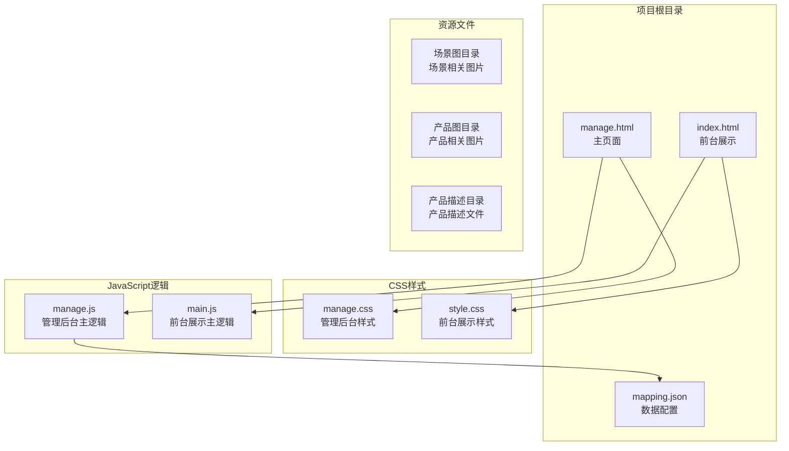
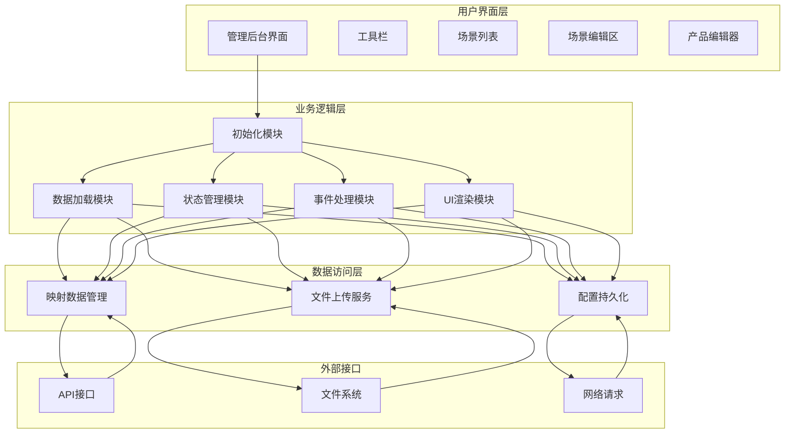
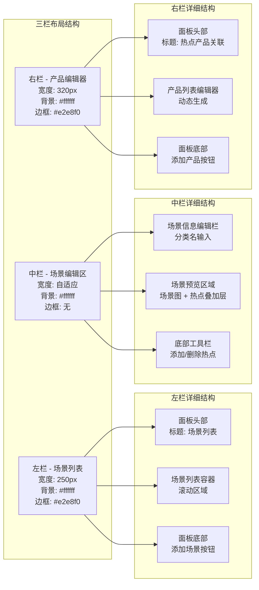
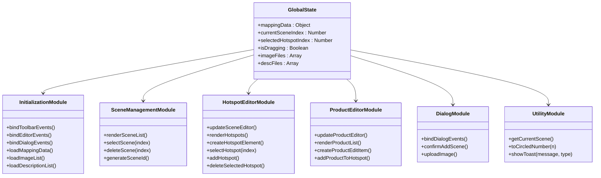
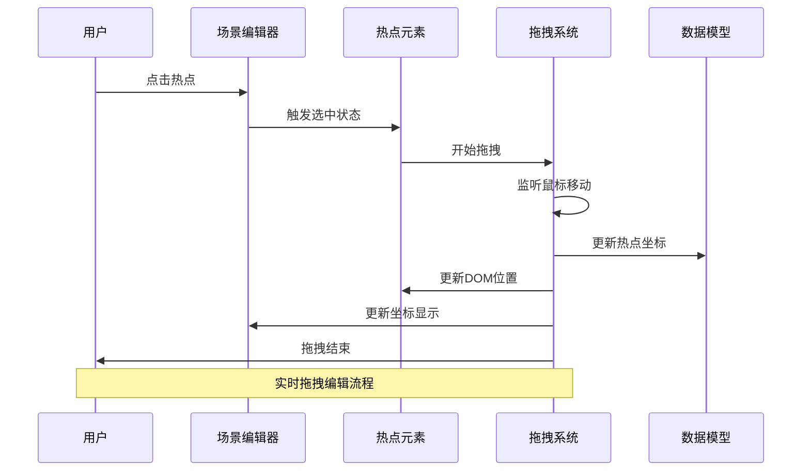
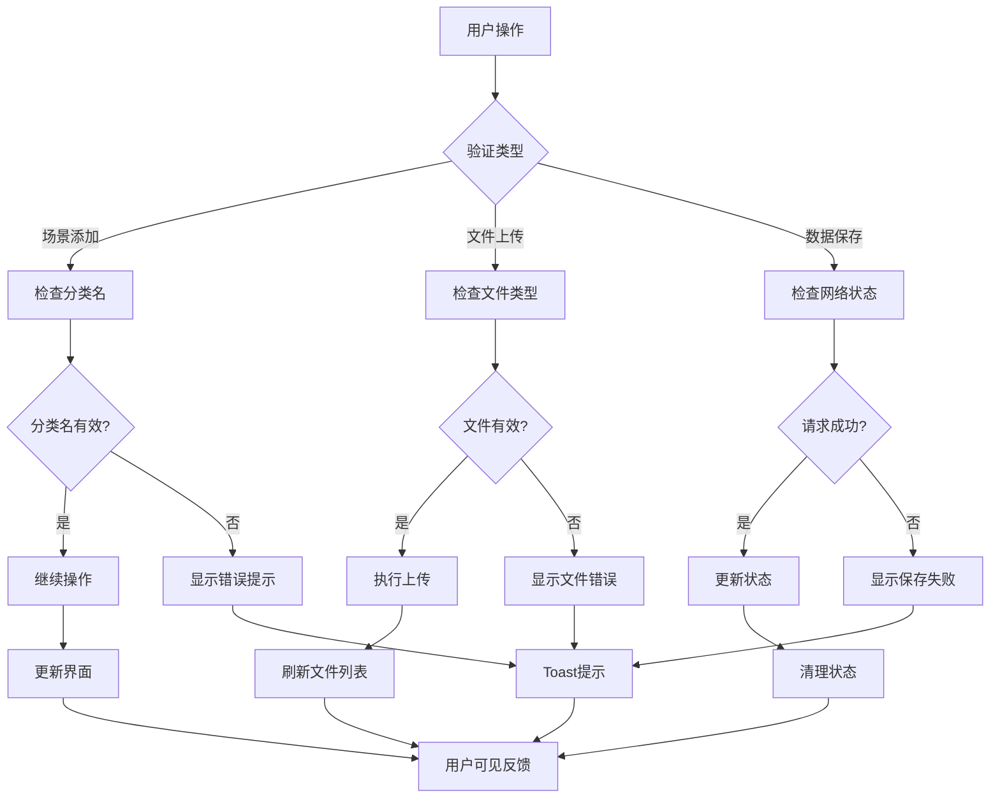
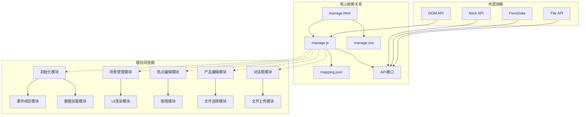

# 管理后台架构

<cite>
**本文档引用的文件**
- [manage.html](file://manage.html)
- [manage.js](file://js/manage.js)
- [manage.css](file://css/manage.css)
- [index.html](file://index.html)
- [mapping.json](file://mapping.json)
</cite>

## 目录
1. [简介](#简介)
2. [项目结构](#项目结构)
3. [核心组件](#核心组件)
4. [架构概览](#架构概览)
5. [详细组件分析](#详细组件分析)
6. [依赖关系分析](#依赖关系分析)
7. [性能考虑](#性能考虑)
8. [故障排除指南](#故障排除指南)
9. [结论](#结论)

## 简介

本项目是一个基于纯原生JavaScript的数字标牌管理后台系统，采用三栏布局设计，为用户提供场景管理和产品关联编辑功能。该系统支持场景的增删改查、热点的可视化编辑、产品信息的关联管理，以及完整的文件上传和数据持久化功能。

系统采用模块化设计，通过单一入口文件管理所有功能模块，实现了良好的代码组织和维护性。界面采用现代化的浅色主题设计，提供流畅的用户体验和直观的操作流程。

## 项目结构

项目采用清晰的文件组织结构，主要包含以下核心文件：

**图表来源**
- [manage.html:1-113](file://manage.html#L1-L113)
- [manage.js:1-811](file://js/manage.js#L1-L811)
- [mapping.json:1-232](file://mapping.json#L1-L232)

**章节来源**
- [manage.html:1-113](file://manage.html#L1-L113)
- [manage.js:1-811](file://js/manage.js#L1-L811)
- [mapping.json:1-232](file://mapping.json#L1-L232)

## 核心组件

管理后台系统由三个主要组件构成，每个组件都有明确的职责和功能边界：

### 1. 场景列表面板
- **职责**：管理所有场景的展示、选择和操作
- **功能**：场景列表渲染、场景选择、场景删除、新增场景
- **交互**：支持鼠标悬停显示删除按钮、点击选择场景

### 2. 场景编辑面板  
- **职责**：场景的可视化编辑和热点管理
- **功能**：场景信息编辑、场景图预览、热点添加删除、热点拖拽定位
- **特性**：实时坐标显示、热点选中高亮、拖拽动画效果

### 3. 产品编辑面板
- **职责**：管理热点与产品的关联关系
- **功能**：产品信息编辑、产品图片选择、描述文件关联、产品删除
- **特性**：动态字段生成、文件列表自动填充、实时预览更新

**章节来源**
- [manage.html:21-79](file://manage.html#L21-L79)
- [manage.css:123-487](file://css/manage.css#L123-L487)

## 架构概览

系统采用模块化的前端架构设计，通过单一入口文件统一管理所有功能模块：

**图表来源**
- [manage.js:18-31](file://js/manage.js#L18-L31)
- [manage.js:35-72](file://js/manage.js#L35-L72)
- [manage.js:76-108](file://js/manage.js#L76-L108)

系统的核心架构特点：
- **模块化设计**：功能按职责划分到独立模块
- **事件驱动**：基于DOM事件的响应式交互
- **数据驱动**：以JSON数据为核心的数据模型
- **异步处理**：文件上传和数据持久化采用Promise模式

**章节来源**
- [manage.js:1-16](file://js/manage.js#L1-L16)
- [manage.js:18-31](file://js/manage.js#L18-L31)

## 详细组件分析

### 三栏布局设计

系统采用经典的三栏布局，每栏都有明确的功能定位和视觉设计：

**图表来源**
- [manage.html:20-79](file://manage.html#L20-L79)
- [manage.css:93-487](file://css/manage.css#L93-L487)

#### 左栏场景列表面板
- **尺寸规格**：固定宽度250px，支持垂直滚动
- **交互设计**：鼠标悬停显示删除按钮，选中状态高亮显示
- **数据展示**：场景缩略图 + 分类名称 + 删除按钮
- **功能特性**：懒加载缩略图，加载失败时显示占位符

#### 中栏场景编辑区
- **布局结构**：垂直分层设计，信息栏 + 预览区 + 工具栏
- **预览功能**：场景图全屏预览，支持热点叠加显示
- **编辑能力**：实时场景信息编辑，热点可视化拖拽
- **状态反馈**：坐标实时显示，选中热点动画效果

#### 右栏产品编辑器
- **动态布局**：根据选中热点动态显示产品列表
- **编辑字段**：产品名称（日文/中文）、产品图片、描述文件
- **文件管理**：自动填充可用文件列表，支持实时预览
- **操作控制**：添加产品、删除产品、批量操作

**章节来源**
- [manage.html:21-79](file://manage.html#L21-L79)
- [manage.css:123-487](file://css/manage.css#L123-L487)

### 模块化设计分析

系统采用高度模块化的JavaScript设计，将复杂功能分解为独立的功能模块：

**图表来源**
- [manage.js:6-16](file://js/manage.js#L6-L16)
- [manage.js:76-108](file://js/manage.js#L76-L108)
- [manage.js:112-185](file://js/manage.js#L112-L185)
- [manage.js:237-385](file://js/manage.js#L237-L385)
- [manage.js:442-617](file://js/manage.js#L442-L617)
- [manage.js:649-728](file://js/manage.js#L649-L728)

#### 状态管理模块
- **全局状态**：集中管理所有应用状态变量
- **数据结构**：映射数据、文件列表、选中状态
- **状态同步**：UI更新与数据状态保持一致

#### 数据绑定模块
- **实时绑定**：输入框变化直接更新数据模型
- **双向同步**：场景列表与编辑区状态同步
- **延迟更新**：避免频繁DOM操作影响性能

#### 可视化编辑模块
- **热点渲染**：动态创建热点DOM元素
- **拖拽实现**：基于鼠标事件的拖拽逻辑
- **坐标计算**：百分比坐标系统，适配不同分辨率

#### 文件上传模块
- **上传流程**：文件选择 → 上传 → 路径更新 → 列表刷新
- **错误处理**：上传失败的用户反馈
- **进度提示**：上传过程的状态指示

**章节来源**
- [manage.js:6-16](file://js/manage.js#L6-L16)
- [manage.js:112-185](file://js/manage.js#L112-L185)
- [manage.js:237-385](file://js/manage.js#L237-L385)
- [manage.js:442-617](file://js/manage.js#L442-L617)
- [manage.js:649-728](file://js/manage.js#L649-L728)

### 交互设计分析

系统提供了丰富的交互体验，涵盖拖拽编辑、实时预览、对话框管理等多个方面：

**图表来源**
- [manage.js:389-438](file://js/manage.js#L389-L438)
- [manage.js:320-347](file://js/manage.js#L320-L347)

#### 拖拽编辑交互
- **触发机制**：鼠标按下热点元素开始拖拽
- **坐标计算**：基于容器边界计算百分比坐标
- **范围限制**：确保热点在场景范围内移动
- **视觉反馈**：拖拽过程中热点放大和高亮

#### 实时预览机制
- **数据同步**：编辑操作立即反映到UI
- **坐标更新**：热点位置变化实时显示
- **图片预览**：场景图和产品图即时更新
- **状态反馈**：操作结果通过Toast提示

#### 对话框管理系统
- **模态显示**：遮罩层覆盖整个界面
- **表单验证**：添加场景前的必填项检查
- **文件处理**：图片上传和路径选择
- **确认流程**：二次确认防止误操作

**章节来源**
- [manage.js:389-438](file://js/manage.js#L389-L438)
- [manage.js:649-728](file://js/manage.js#L649-L728)

### 表单验证与错误处理

系统实现了完善的表单验证和错误处理机制，确保数据完整性和用户体验：

**图表来源**
- [manage.js:690-728](file://js/manage.js#L690-L728)
- [manage.js:762-781](file://js/manage.js#L762-L781)
- [manage.js:82-108](file://js/manage.js#L82-L108)

#### 表单验证策略
- **必填检查**：场景添加时的分类名验证
- **格式验证**：文件类型和大小检查
- **业务验证**：场景删除的确认流程
- **实时验证**：输入框的即时反馈

#### 错误处理机制
- **网络错误**：API调用失败的降级处理
- **文件错误**：图片上传异常的用户提示
- **数据错误**：JSON解析失败的默认值设置
- **用户错误**：无效操作的友好提示

#### 用户反馈系统
- **Toast通知**：不同类型的成功/失败提示
- **状态指示**：保存状态的实时显示
- **视觉反馈**：按钮状态和颜色变化
- **操作确认**：重要操作的二次确认

**章节来源**
- [manage.js:690-728](file://js/manage.js#L690-L728)
- [manage.js:762-781](file://js/manage.js#L762-L781)
- [manage.js:82-108](file://js/manage.js#L82-L108)

## 依赖关系分析

系统各模块之间的依赖关系清晰明确，形成了稳定的层次化架构：

**图表来源**
- [manage.html:10-113](file://manage.html#L10-L113)
- [manage.js:18-31](file://js/manage.js#L18-L31)
- [manage.js:35-72](file://js/manage.js#L35-L72)

系统的关键依赖特点：
- **单向依赖**：模块间遵循单向数据流原则
- **松耦合**：模块间通过接口而非具体实现交互
- **可测试性**：模块独立便于单元测试
- **可扩展性**：新增功能不影响现有模块

**章节来源**
- [manage.html:10-113](file://manage.html#L10-L113)
- [manage.js:18-31](file://js/manage.js#L18-L31)

## 性能考虑

系统在设计时充分考虑了性能优化，采用了多种策略提升用户体验：

### 内存管理
- **DOM复用**：热点元素动态创建和销毁，避免内存泄漏
- **事件委托**：使用事件冒泡减少事件监听器数量
- **懒加载**：场景缩略图和产品图片的懒加载机制

### 网络优化
- **缓存策略**：文件列表的本地缓存避免重复请求
- **异步处理**：所有网络请求采用异步模式不阻塞UI
- **错误恢复**：网络失败时的自动重试机制

### 渲染优化
- **批量更新**：多个状态变更合并到一次DOM更新
- **防抖处理**：窗口大小改变时的防抖优化
- **虚拟滚动**：场景列表的虚拟滚动提升大数据量性能

## 故障排除指南

### 常见问题诊断

#### 数据加载失败
**症状**：页面空白或显示错误信息
**原因分析**：
- mapping.json文件不存在或格式错误
- 服务器API接口不可用
- 网络连接问题

**解决方案**：
- 检查mapping.json文件完整性
- 验证API接口的可用性
- 确认网络连接稳定

#### 图片上传失败
**症状**：上传按钮无响应或显示错误
**原因分析**：
- 文件格式不支持
- 文件大小超出限制
- 服务器存储权限问题

**解决方案**：
- 检查文件格式是否为图片类型
- 确认文件大小符合要求
- 验证服务器存储空间和权限

#### 热点拖拽异常
**症状**：热点无法拖拽或坐标不准确
**原因分析**：
- 容器尺寸计算错误
- 事件监听器冲突
- 坐标转换算法问题

**解决方案**：
- 检查容器的CSS样式
- 确认事件监听器正确绑定
- 验证坐标计算逻辑

**章节来源**
- [manage.js:35-46](file://js/manage.js#L35-L46)
- [manage.js:762-781](file://js/manage.js#L762-L781)
- [manage.js:389-438](file://js/manage.js#L389-L438)

### 调试技巧

#### 开发者工具使用
- **网络面板**：监控API请求和响应
- **控制台**：查看JavaScript错误和警告
- **元素检查**：分析DOM结构和样式应用

#### 日志记录
- **关键节点**：在重要函数入口添加日志
- **状态变化**：记录全局状态的修改
- **错误捕获**：统一的错误处理和记录

## 结论

数字标牌管理后台系统展现了优秀的前端架构设计，通过模块化、事件驱动和数据驱动的设计理念，实现了功能丰富且用户体验良好的管理界面。

系统的主要优势包括：
- **清晰的架构**：模块化设计便于维护和扩展
- **流畅的交互**：拖拽编辑和实时预览提供优秀的用户体验
- **完善的错误处理**：全面的验证和反馈机制确保系统稳定性
- **性能优化**：多项优化策略确保在大数据量下的良好表现

未来可以考虑的改进方向：
- **状态管理重构**：引入更专业的状态管理库
- **组件化升级**：将功能模块封装为可复用组件
- **测试体系完善**：建立完整的单元测试和集成测试
- **国际化支持**：增强多语言环境的适配能力

该系统为数字标牌内容管理提供了一个坚实的技术基础，能够满足当前和未来的业务需求。