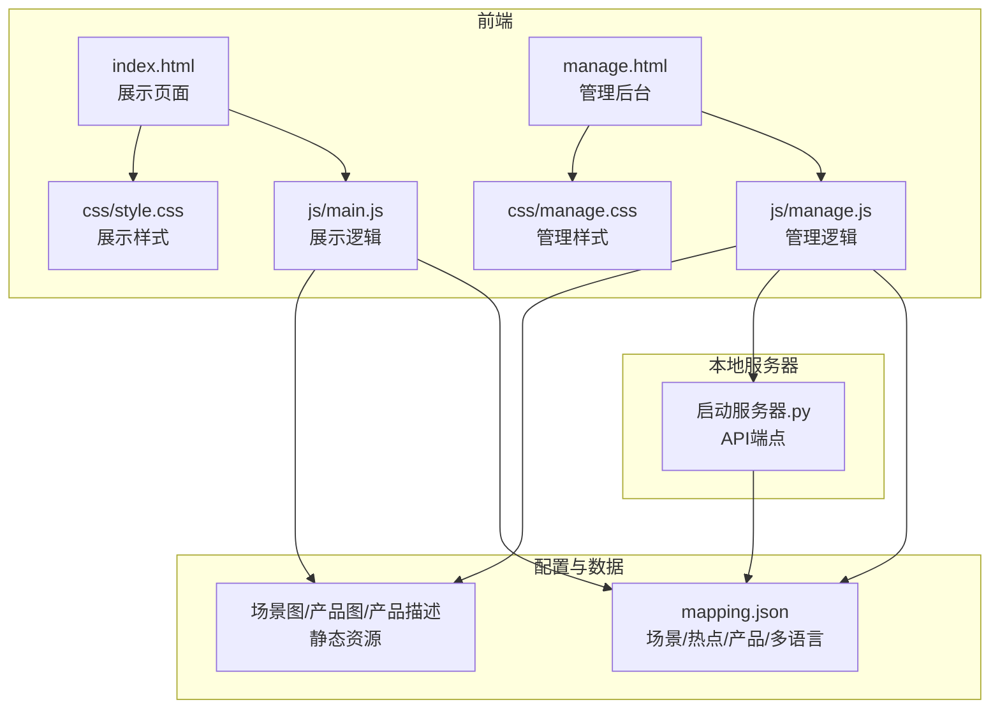
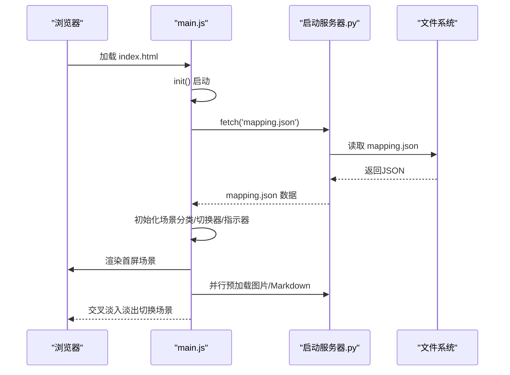
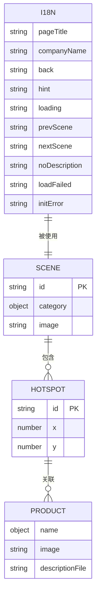
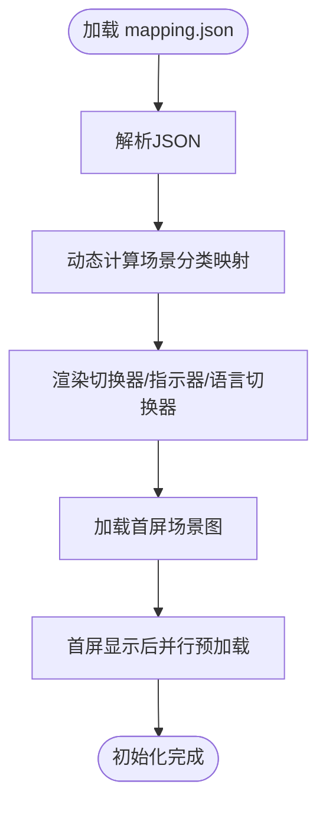
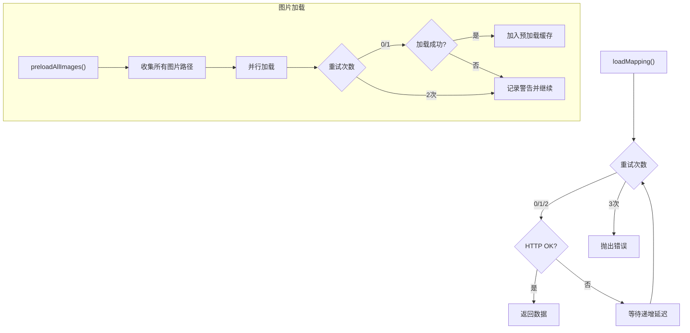
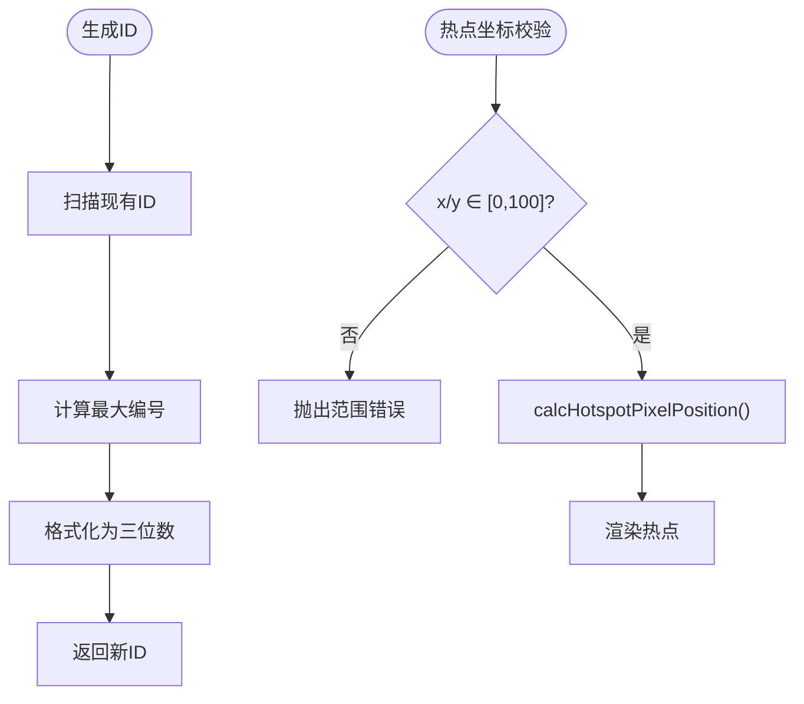
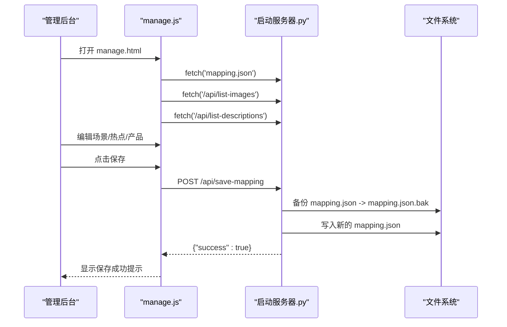
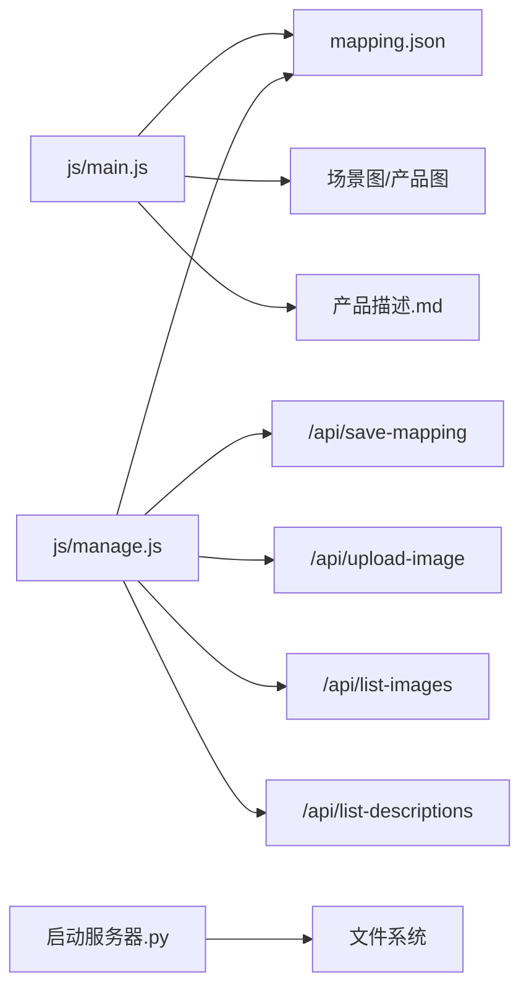

# 数据架构设计

<cite>
**本文档引用的文件**
- [mapping.json](file://mapping.json)
- [index.html](file://index.html)
- [manage.html](file://manage.html)
- [project_architecture.md](file://project_architecture.md)
- [启动服务器.py](file://启动服务器.py)
- [js/main.js](file://js/main.js)
- [js/manage.js](file://js/manage.js)
</cite>

## 目录
1. [简介](#简介)
2. [项目结构](#项目结构)
3. [核心组件](#核心组件)
4. [架构总览](#架构总览)
5. [详细组件分析](#详细组件分析)
6. [依赖关系分析](#依赖关系分析)
7. [性能考量](#性能考量)
8. [故障排查指南](#故障排查指南)
9. [结论](#结论)
10. [附录](#附录)

## 简介
本项目为数字标牌产品展示页面，采用“数据驱动”的架构设计，通过独立的配置文件 mapping.json 实现数据与逻辑分离。系统支持中日双语，提供可视化管理后台，具备完善的异步加载、缓存与重试机制，以及清晰的数据模型与业务规则。

## 项目结构
项目采用前后端一体化的静态资源结构，核心文件如下：
- 配置文件：mapping.json（场景、热点、产品、多语言字典）
- 前端页面：index.html（展示页）、manage.html（管理后台）
- 样式文件：css/style.css、css/manage.css
- 逻辑文件：js/main.js（展示页逻辑）、js/manage.js（管理后台逻辑）
- 本地服务器：启动服务器.py（提供API端点）

图表来源
- [index.html:1-83](file://index.html#L1-L83)
- [manage.html:1-113](file://manage.html#L1-L113)
- [mapping.json:1-232](file://mapping.json#L1-L232)
- [启动服务器.py:1-298](file://启动服务器.py#L1-L298)

章节来源
- [index.html:1-83](file://index.html#L1-L83)
- [manage.html:1-113](file://manage.html#L1-L113)
- [project_architecture.md:43-108](file://project_architecture.md#L43-L108)

## 核心组件
- 数据配置层：mapping.json，包含版本号、场景数组、热点数组、产品数组、多语言字典。
- 展示层：index.html + js/main.js，负责场景渲染、热点交互、产品详情弹窗、多语言切换、图片与Markdown加载。
- 管理层：manage.html + js/manage.js + 启动服务器.py，负责可视化编辑、ID生成、文件上传、配置保存与备份。
- 样式层：css/style.css、css/manage.css，提供UI样式与动画。

章节来源
- [project_architecture.md:112-254](file://project_architecture.md#L112-L254)
- [js/main.js:1-200](file://js/main.js#L1-L200)
- [js/manage.js:1-200](file://js/manage.js#L1-L200)

## 架构总览
系统采用“配置驱动 + 异步加载 + 缓存优化”的架构模式：
- 数据驱动：所有场景、热点、产品、文案均由 mapping.json 驱动，前端通过 fetch 动态加载。
- 异步加载：图片与Markdown采用异步加载，支持重试与超时保护。
- 缓存策略：图片预加载缓存、Markdown内容缓存，提升用户体验。
- 重试机制：mapping.json 加载最多3次，图片加载最多2次，递增延迟。
- 多语言：统一的 i18n 字典与 getText() 机制，支持运行时切换。

图表来源
- [js/main.js:1197-1277](file://js/main.js#L1197-L1277)
- [启动服务器.py:54-98](file://启动服务器.py#L54-L98)

章节来源
- [project_architecture.md:521-607](file://project_architecture.md#L521-L607)
- [js/main.js:49-73](file://js/main.js#L49-L73)

## 详细组件分析

### 数据模型设计

#### mapping.json 数据模型
- 根对象字段
  - version：字符串，版本号
  - scenes：数组，场景对象集合
  - i18n：对象，多语言字典
- 场景对象（scene）
  - id：字符串，唯一标识，格式 scene_NNN
  - category：对象，多语言分类名 { ja: "...", zh: "..." }
  - image：字符串，场景图路径（相对项目根目录）
  - hotspots：数组，热点对象集合
- 热点对象（hotspot）
  - id：字符串，唯一标识，格式 hs_NNN
  - x：数值，水平百分比（0-100）
  - y：数值，垂直百分比（0-100）
  - products：数组，产品对象集合
- 产品对象（product）
  - name：对象，多语言产品名 { ja: "...", zh: "..." }
  - image：字符串，产品图路径
  - descriptionFile：字符串，产品描述Markdown文件路径
- 多语言字典（i18n）
  - 键：语言代码（如 ja、zh）
  - 值：键值对，涵盖页面标题、按钮文本、提示文案等

图表来源
- [mapping.json:1-232](file://mapping.json#L1-L232)

章节来源
- [project_architecture.md:118-206](file://project_architecture.md#L118-L206)
- [mapping.json:1-232](file://mapping.json#L1-L232)

#### 多语言数据结构
- 多语言字段采用对象形式：{ ja: "...", zh: "..." }
- 支持的字段：场景分类名（category）、产品名称（name）
- 文本字段（如 image、descriptionFile）不参与多语言
- i18n 字典包含页面标题、公司名、按钮文本、提示文案等键值

章节来源
- [project_architecture.md:168-206](file://project_architecture.md#L168-L206)
- [mapping.json:205-230](file://mapping.json#L205-L230)

### 数据驱动架构实现原理
- 数据与逻辑分离：将原本硬编码在 js/main.js 中的 scenes 数组迁移到 mapping.json，前端通过 fetch 动态加载。
- 动态计算：场景分类映射（sceneCategories）不再硬编码，而是从 mappingData.scenes 动态生成。
- 管理后台：通过 /api/save-mapping 将完整 mapping.json 写回文件，实现可视化编辑与持久化。

图表来源
- [js/main.js:1197-1277](file://js/main.js#L1197-L1277)
- [project_architecture.md:237-251](file://project_architecture.md#L237-L251)

章节来源
- [project_architecture.md:114-117](file://project_architecture.md#L114-L117)
- [js/main.js:241-250](file://js/main.js#L241-L250)

### 数据加载机制
- mapping.json 加载：含3次重试，递增延迟（500ms/1000ms/2000ms），失败时显示全屏错误提示。
- 图片加载：全场景与产品图片预加载，支持最多2次重试，递增延迟；使用 waitForImageLoad 超时保护。
- Markdown加载：descriptionCache 缓存已加载内容，失败时返回可点击重试的HTML。
- 首屏独占带宽：首屏图片完全显示后再启动其余图片预加载，避免慢速网络下首屏不显示。

图表来源
- [js/main.js:49-73](file://js/main.js#L49-L73)
- [js/main.js:257-327](file://js/main.js#L257-L327)
- [js/main.js:354-395](file://js/main.js#L354-L395)

章节来源
- [project_architecture.md:619-647](file://project_architecture.md#L619-L647)
- [js/main.js:234-235](file://js/main.js#L234-L235)
- [js/main.js:421-447](file://js/main.js#L421-L447)

### 数据验证与业务规则
- ID生成规则
  - 场景ID：scene_NNN（三位数字，从最大编号+1）
  - 热点ID：hs_NNN（三位数字，从最大编号+1）
- 热点坐标规则
  - x、y 为百分比坐标（0-100），通过 calcHotspotPixelPosition 转换为像素坐标
  - 图片未加载完成时不进行热点计算，避免位置偏移
- 文件路径规则
  - image、descriptionFile 为相对项目根目录的路径
  - 管理后台上传图片时根据 type 决定保存目录（场景图/分类名/ 或 产品图/）
- 多语言回退规则
  - getText(obj)：obj[state.currentLang] → obj['ja'] → Object.values(obj)[0] → ''
  - t(key)：未找到时回退为 key 本身

图表来源
- [js/manage.js:732-758](file://js/manage.js#L732-L758)
- [js/main.js:774-817](file://js/main.js#L774-L817)

章节来源
- [js/manage.js:732-758](file://js/manage.js#L732-L758)
- [js/main.js:774-817](file://js/main.js#L774-L817)
- [project_architecture.md:617-617](file://project_architecture.md#L617-L617)

### 管理后台数据流
- 数据加载：loadMappingData() 从 mapping.json 读取；loadImageList()/loadDescriptionList() 通过 /api/list-images 与 /api/list-descriptions 获取可用文件列表。
- 可视化编辑：场景列表、场景编辑区、热点渲染与拖拽、产品编辑器。
- 保存与备份：saveMapping() 通过 /api/save-mapping 保存，服务器先备份再写入。

图表来源
- [js/manage.js:35-108](file://js/manage.js#L35-L108)
- [启动服务器.py:101-127](file://启动服务器.py#L101-L127)
- [启动服务器.py:204-251](file://启动服务器.py#L204-L251)

章节来源
- [project_architecture.md:712-760](file://project_architecture.md#L712-L760)
- [js/manage.js:35-108](file://js/manage.js#L35-L108)
- [启动服务器.py:75-98](file://启动服务器.py#L75-L98)

## 依赖关系分析
- 前端依赖
  - js/main.js 依赖 mapping.json、图片资源、Markdown资源
  - js/manage.js 依赖 mapping.json、/api/save-mapping、/api/upload-image、/api/list-images、/api/list-descriptions
- 服务器依赖
  - 启动服务器.py 提供静态文件服务与API端点，依赖文件系统进行读写与备份

图表来源
- [js/main.js:1-200](file://js/main.js#L1-L200)
- [js/manage.js:1-200](file://js/manage.js#L1-L200)
- [启动服务器.py:1-298](file://启动服务器.py#L1-L298)

章节来源
- [project_architecture.md:763-801](file://project_architecture.md#L763-L801)
- [启动服务器.py:75-98](file://启动服务器.py#L75-L98)

## 性能考量
- 图片加载优化
  - 预加载策略：首屏独占带宽，首屏显示后再预加载其余图片
  - 缓存策略：state.preloadedImages 与 descriptionCache 避免重复请求
  - 重试策略：图片加载最多2次，递增延迟
- Markdown加载优化
  - 并行加载：renderProductList() 中 Promise.all 并行加载多个Markdown
  - 骨架屏：加载中显示占位符，提升感知速度
- 重试与超时
  - mapping.json 加载最多3次，递增延迟
  - waitForImageLoad 超时保护（默认8秒），避免长时间阻塞
- 动画与渲染
  - 交叉淡入淡出（1.2s）减少视觉闪烁
  - 热点脉冲动画错峰，避免视觉拥挤

章节来源
- [project_architecture.md:619-647](file://project_architecture.md#L619-L647)
- [js/main.js:257-327](file://js/main.js#L257-L327)
- [js/main.js:354-395](file://js/main.js#L354-L395)
- [js/main.js:888-950](file://js/main.js#L888-L950)

## 故障排查指南
- mapping.json 加载失败
  - 现象：初始化失败，显示全屏错误提示
  - 处理：检查网络、权限、文件完整性；确认重试机制是否触发
- 图片加载失败
  - 现象：场景切换时出现加载指示器或空白
  - 处理：检查路径是否正确、服务器是否可达、缓存是否生效
- Markdown加载失败
  - 现象：产品描述显示“加载失败，点击重试”
  - 处理：点击重试清除缓存后重新加载；检查文件是否存在
- 管理后台保存失败
  - 现象：保存状态显示失败
  - 处理：检查 /api/save-mapping 返回错误、服务器权限、JSON格式

章节来源
- [js/main.js:1200-1206](file://js/main.js#L1200-L1206)
- [js/main.js:421-447](file://js/main.js#L421-L447)
- [js/manage.js:81-108](file://js/manage.js#L81-L108)
- [启动服务器.py:101-127](file://启动服务器.py#L101-L127)

## 结论
本项目通过 mapping.json 实现了数据与逻辑的彻底分离，结合异步加载、缓存与重试机制，提供了稳定、可维护、可扩展的数字标牌展示系统。管理后台进一步降低了维护门槛，实现了可视化编辑与持久化。整体架构简洁清晰，适合长期演进与团队协作。

## 附录
- API端点概览
  - POST /api/save-mapping：保存 mapping.json（自动备份）
  - POST /api/upload-image：上传图片到指定目录
  - GET /api/list-images：获取所有图片文件列表
  - GET /api/list-descriptions：获取所有产品描述文件列表

章节来源
- [project_architecture.md:769-777](file://project_architecture.md#L769-L777)
- [启动服务器.py:75-98](file://启动服务器.py#L75-L98)