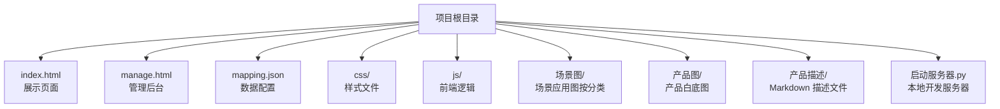
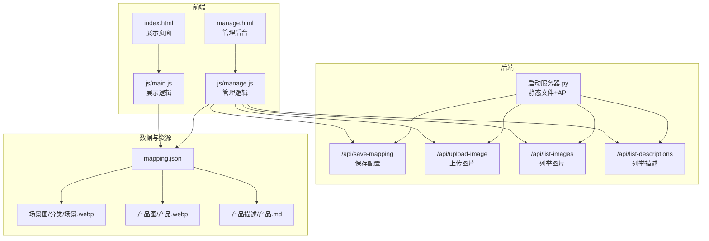
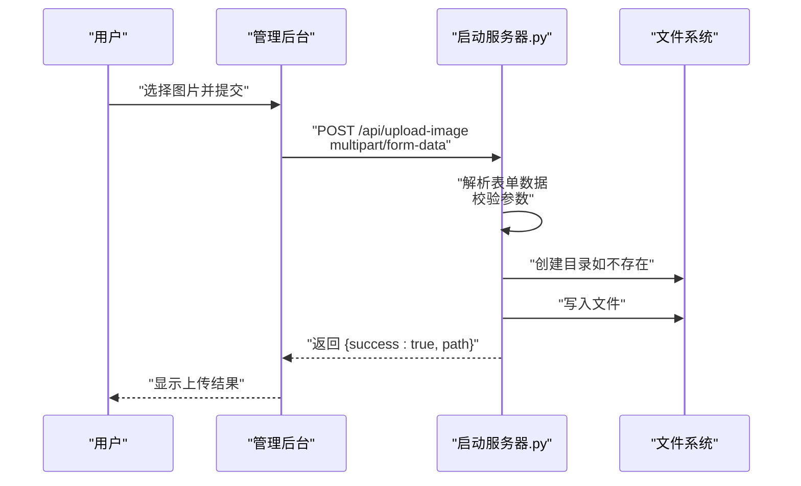
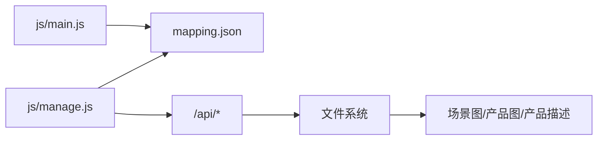

# 文件系统架构

<cite>
**本文引用的文件**
- [index.html](file://index.html)
- [manage.html](file://manage.html)
- [mapping.json](file://mapping.json)
- [启动服务器.py](file://启动服务器.py)
- [project_architecture.md](file://project_architecture.md)
- [js/main.js](file://js/main.js)
- [js/manage.js](file://js/manage.js)
- [产品描述/室内双面吊装标牌.md](file://产品描述/室内双面吊装标牌.md)
- [产品描述/电子水牌.md](file://产品描述/电子水牌.md)
</cite>

## 目录
1. [简介](#简介)
2. [项目结构](#项目结构)
3. [核心组件](#核心组件)
4. [架构总览](#架构总览)
5. [详细组件分析](#详细组件分析)
6. [依赖分析](#依赖分析)
7. [性能考量](#性能考量)
8. [故障排查指南](#故障排查指南)
9. [结论](#结论)
10. [附录](#附录)

## 简介
本文件系统架构文档聚焦数字标牌项目的文件组织与管理策略，围绕场景图、产品图、产品描述三类文件的目录结构、命名规范、类型分类进行系统化说明；同时阐述文件上传机制、安全防护、缓存与性能优化方案，并提供结构图与文件流转图，帮助开发者与运营人员高效维护与扩展。

## 项目结构
项目采用“数据与展示分离”的目录组织方式：
- 展示页面与管理后台：index.html、manage.html
- 数据配置：mapping.json（集中管理场景、热点、产品与多语言）
- 资源目录：
  - 场景图：按场景分类存放，WebP 格式
  - 产品图：统一存放，WebP 格式
  - 产品描述：Markdown 格式
- 本地开发服务器：启动服务器.py（提供静态文件服务与 API）

图表来源
- [project_architecture.md:43-108](file://project_architecture.md#L43-L108)

章节来源
- [project_architecture.md:43-108](file://project_architecture.md#L43-L108)

## 核心组件
- 数据配置中心：mapping.json
  - 存储场景、热点、产品与多语言字典
  - 前端通过 fetch 动态加载，管理后台通过 API 读写
- 资源目录
  - 场景图：按场景分类（如“便利店场景”、“快餐店场景”等）组织
  - 产品图：统一存放各类产品白底图
  - 产品描述：Markdown 文件，与产品图一一对应
- 本地开发服务器：启动服务器.py
  - 提供静态资源服务与 API 端点（保存配置、上传图片、列举资源）

章节来源
- [mapping.json:1-232](file://mapping.json#L1-L232)
- [启动服务器.py:25-252](file://启动服务器.py#L25-L252)

## 架构总览
前端通过 mapping.json 驱动展示页面与管理后台，本地服务器负责资源分发与 API 交互。管理后台支持可视化编辑场景、热点与产品，并通过 API 将配置持久化到 mapping.json。

图表来源
- [启动服务器.py:75-252](file://启动服务器.py#L75-L252)
- [mapping.json:1-232](file://mapping.json#L1-L232)

## 详细组件分析

### 数据配置中心：mapping.json
- 设计原则
  - 数据与逻辑分离：将原本硬编码的 scenes 数组迁移到独立 JSON 文件
  - 多语言字典：统一管理 UI 文本与场景/产品名称
  - 结构清晰：场景对象包含 id、category、image、hotspots；热点包含 id、x、y、products
- 关键字段
  - version：版本标识
  - scenes：场景数组
  - i18n：多语言字典（ja、zh）
- 管理方式
  - 展示页面：启动时异步加载，含重试机制
  - 管理后台：通过 API 读取与保存，保存前自动备份

章节来源
- [project_architecture.md:112-229](file://project_architecture.md#L112-L229)
- [mapping.json:1-232](file://mapping.json#L1-L232)

### 场景图管理策略
- 目录组织
  - 一级分类：便利店场景、快餐店场景、超市场景、酒店场景、集会场景、其他场景
  - 文件命名：场景名+数字序号，统一 WebP 格式
- 路径管理
  - mapping.json 中 image 字段指向相对路径（相对于项目根目录）
  - 服务器 API 提供列举接口，便于管理后台选择可用场景图
- 上传机制
  - 管理后台支持更换场景图，上传时需提供分类参数
  - 服务器根据分类创建对应目录并保存文件，返回相对路径

章节来源
- [启动服务器.py:172-182](file://启动服务器.py#L172-L182)
- [启动服务器.py:204-236](file://启动服务器.py#L204-L236)
- [mapping.json:7-203](file://mapping.json#L7-L203)

### 产品图管理策略
- 目录组织
  - 统一存放于产品图目录，文件名为产品名称（中文或日文）
- 路径管理
  - mapping.json 中 products[].image 指向相对路径
- 上传机制
  - 管理后台支持为热点添加产品，上传时 type=product
  - 服务器保存至产品图目录，返回相对路径

章节来源
- [启动服务器.py:178-182](file://启动服务器.py#L178-L182)
- [启动服务器.py:227-235](file://启动服务器.py#L227-L235)
- [mapping.json:14-201](file://mapping.json#L14-L201)

### 产品描述管理策略
- 文件类型与命名
  - Markdown 文件，文件名为产品名称+.md
- 路径管理
  - mapping.json 中 products[].descriptionFile 指向相对路径
- 加载与缓存
  - 展示页面通过 fetch 加载 Markdown，使用 marked.js 渲染
  - 采用描述缓存，避免重复加载
  - 失败时提供可点击重试提示

章节来源
- [启动服务器.py:238-251](file://启动服务器.py#L238-L251)
- [js/main.js:409-461](file://js/main.js#L409-L461)
- [产品描述/室内双面吊装标牌.md:1-13](file://产品描述/室内双面吊装标牌.md#L1-L13)
- [产品描述/电子水牌.md:1-10](file://产品描述/电子水牌.md#L1-L10)

### 文件上传机制实现
- API 端点
  - POST /api/upload-image：上传图片到指定目录
- 参数与校验
  - Content-Type 必须为 multipart/form-data
  - type 参数必须为 scene 或 product
  - 上传场景图时必须提供 category 参数
  - 支持指定 filename 参数，否则使用原始文件名
- 目录结构维护
  - 场景图：场景图/分类名/
  - 产品图：产品图/
  - 目录不存在时自动创建
- 路径管理
  - 保存后返回相对路径（使用正斜杠，跨平台兼容）

图表来源
- [启动服务器.py:129-202](file://启动服务器.py#L129-L202)

章节来源
- [启动服务器.py:129-202](file://启动服务器.py#L129-L202)

### 文件类型验证与扩展名限制
- 支持的图片扩展名：webp、jpg、png
- 服务器端扫描图片时仅接受上述扩展名
- 上传接口对 Content-Type 与参数进行严格校验

章节来源
- [启动服务器.py:21-22](file://启动服务器.py#L21-L22)
- [启动服务器.py:218-234](file://启动服务器.py#L218-L234)

### 目录结构维护与路径管理
- 自动创建目录：上传时若目标目录不存在，服务器自动创建
- 路径规范化：返回相对路径并统一使用正斜杠，保证跨平台一致性
- 资源列举：提供 API 列举场景图与产品图、产品描述文件，便于前端选择

章节来源
- [启动服务器.py:184-185](file://启动服务器.py#L184-L185)
- [启动服务器.py:197-201](file://启动服务器.py#L197-L201)
- [启动服务器.py:204-251](file://启动服务器.py#L204-L251)

### 安全性考虑
- CORS 配置：允许本地开发跨域访问，生产环境建议收紧
- 参数校验：严格校验 multipart/form-data 与必需参数
- 路径处理：返回相对路径，避免绝对路径泄露
- 访问控制：本地开发服务器未内置访问控制，部署时建议结合反向代理或网关进行鉴权与限流

章节来源
- [启动服务器.py:28-32](file://启动服务器.py#L28-L32)
- [启动服务器.py:132-135](file://启动服务器.py#L132-L135)
- [启动服务器.py:168-182](file://启动服务器.py#L168-L182)

### 缓存策略与性能优化
- 图片预加载
  - 遍历 mapping.json 中所有场景、热点、产品图片，统一预加载
  - 首屏优先加载，其余图片在首屏完成后异步预加载
  - 使用缓存字典避免重复加载
- Markdown 描述缓存
  - descriptionCache 缓存已加载的描述文件，失败时提供可点击重试
- 骨架屏与加载反馈
  - 描述加载时显示骨架屏，提升感知速度
  - 图片加载中显示旋转指示器
- 性能细节
  - 交叉淡入淡出使用双层图片，避免黑屏
  - 首屏独占带宽策略，确保首屏图片优先加载

章节来源
- [js/main.js:238-407](file://js/main.js#L238-L407)
- [js/main.js:409-461](file://js/main.js#L409-L461)
- [project_architecture.md:304-442](file://project_architecture.md#L304-L442)

## 依赖分析
- 前端依赖
  - mapping.json：数据来源
  - 场景图/产品图/产品描述：静态资源
  - marked.js：Markdown 渲染（CDN 引入）
- 后端依赖
  - Python 内置 HTTP 服务器与 CGI 解析
  - 本地文件系统：读写 mapping.json 与资源文件

图表来源
- [js/main.js:49-73](file://js/main.js#L49-L73)
- [js/manage.js:35-72](file://js/manage.js#L35-L72)
- [启动服务器.py:75-252](file://启动服务器.py#L75-L252)

章节来源
- [js/main.js:49-73](file://js/main.js#L49-L73)
- [js/manage.js:35-72](file://js/manage.js#L35-L72)
- [启动服务器.py:75-252](file://启动服务器.py#L75-L252)

## 性能考量
- 预加载策略
  - 首屏图片优先加载，其余图片异步预加载，减少阻塞
  - 使用缓存字典与 isImageCached 判断，避免重复下载
- 渲染优化
  - 交叉淡入淡出使用双层图片，提升视觉连续性
  - 骨架屏与加载指示器改善感知性能
- 网络容错
  - mapping.json 加载失败时提供全屏错误提示与重试
  - Markdown 加载失败时提供可点击重试提示

章节来源
- [project_architecture.md:519-608](file://project_architecture.md#L519-L608)
- [js/main.js:409-461](file://js/main.js#L409-L461)

## 故障排查指南
- mapping.json 加载失败
  - 现象：展示页面显示全屏错误提示
  - 处理：检查网络连接、文件权限、JSON 格式；管理后台可重新保存
- 图片加载失败
  - 现象：场景图或产品图显示占位
  - 处理：确认路径正确、文件存在、扩展名受支持
- Markdown 描述加载失败
  - 现象：产品详情显示“加载失败，点击重试”
  - 处理：检查描述文件路径与权限，点击重试或修复文件
- 上传失败
  - 现象：上传接口返回错误
  - 处理：检查 Content-Type、type 与 category 参数，确认服务器可写

章节来源
- [js/main.js:521-542](file://js/main.js#L521-L542)
- [js/main.js:642-648](file://js/main.js#L642-L648)
- [启动服务器.py:129-202](file://启动服务器.py#L129-L202)

## 结论
本项目通过 mapping.json 实现数据与展示的解耦，配合清晰的资源目录结构与完善的上传、列举 API，构建了易于维护与扩展的文件系统架构。前端采用预加载、缓存与骨架屏等策略保障性能与体验；后端通过严格的参数校验与路径处理确保安全与稳定。建议在生产环境中进一步强化访问控制与监控能力，持续优化资源加载策略。

## 附录
- 文件类型与扩展名
  - 图片：webp、jpg、png
  - 描述：md
- 目录命名规范
  - 场景图：场景图/分类名/场景名.webp
  - 产品图：产品图/产品名.webp
  - 产品描述：产品描述/产品名.md
- API 端点一览
  - POST /api/save-mapping：保存 mapping.json（自动备份）
  - POST /api/upload-image：上传图片到指定目录
  - GET /api/list-images：列举场景图与产品图
  - GET /api/list-descriptions：列举产品描述文件

章节来源
- [启动服务器.py:769-777](file://启动服务器.py#L769-L777)
- [启动服务器.py:21-22](file://启动服务器.py#L21-L22)