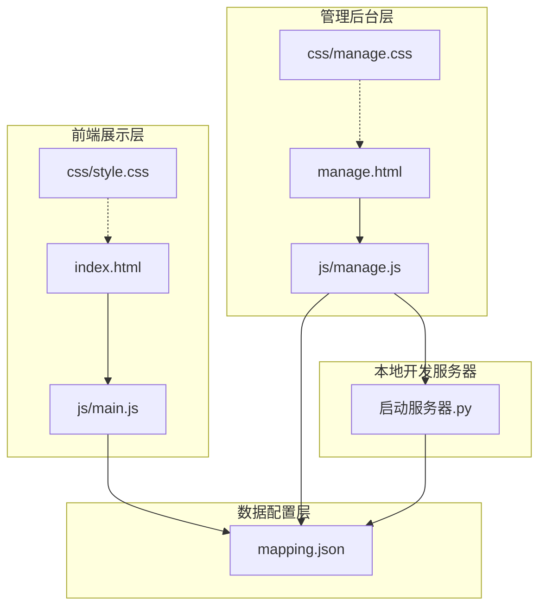
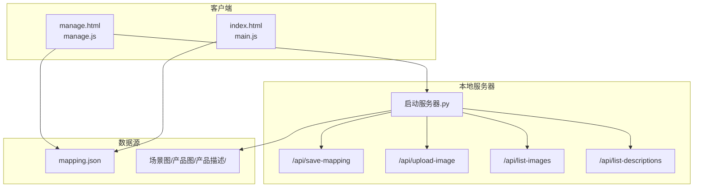
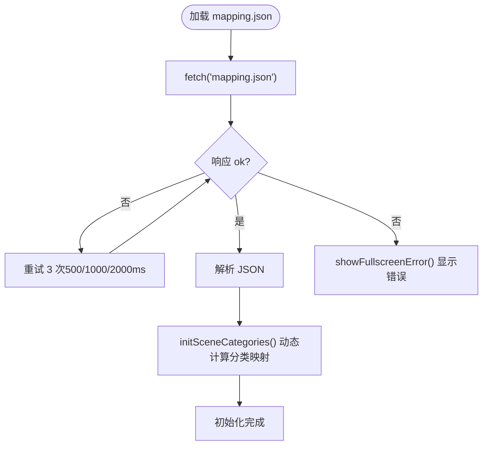
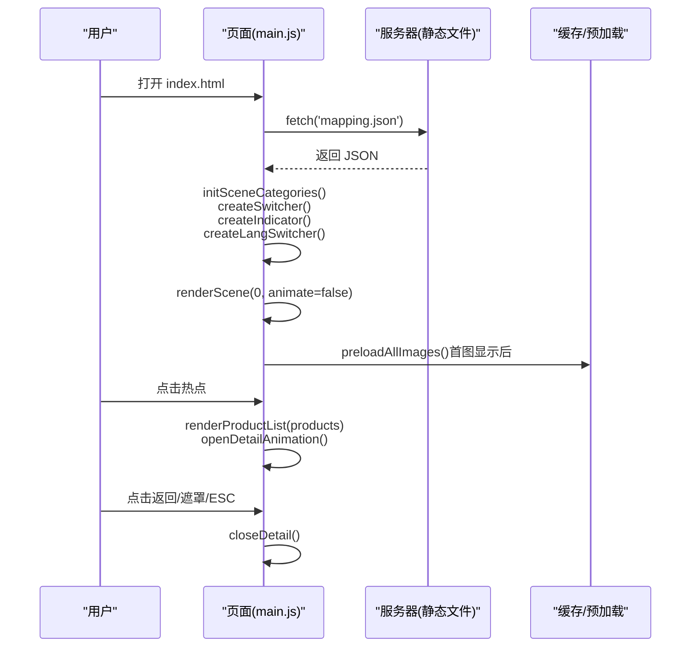
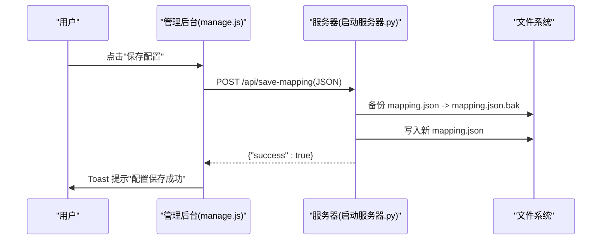
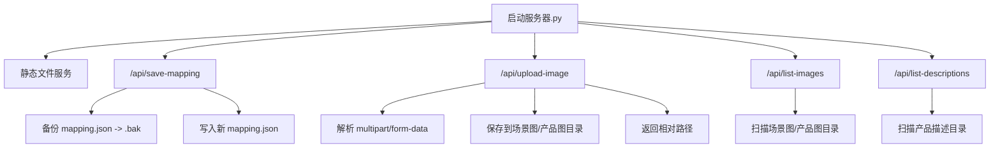
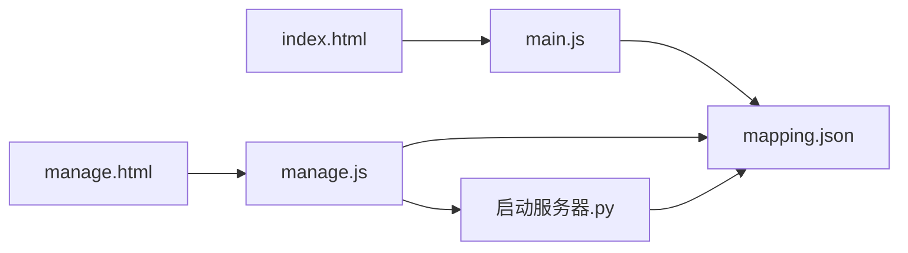

# 项目架构

<cite>
**本文引用的文件**
- [index.html](file://index.html)
- [manage.html](file://manage.html)
- [mapping.json](file://mapping.json)
- [启动服务器.py](file://启动服务器.py)
- [js/main.js](file://js/main.js)
- [js/manage.js](file://js/manage.js)
- [project_architecture.md](file://project_architecture.md)
</cite>

## 目录
1. [简介](#简介)
2. [项目结构](#项目结构)
3. [核心组件](#核心组件)
4. [架构总览](#架构总览)
5. [详细组件分析](#详细组件分析)
6. [依赖关系分析](#依赖关系分析)
7. [性能考量](#性能考量)
8. [故障排查指南](#故障排查指南)
9. [结论](#结论)
10. [附录](#附录)

## 简介
本项目是一个数字标牌产品展示页面，采用数据驱动与模块化设计，分为前端展示页面、管理后台、数据配置系统与本地开发服务器四层。通过 mapping.json 实现配置与逻辑分离，前端使用 HTML5/CSS3/原生 JavaScript 实现交互与动画，管理后台提供可视化编辑能力，本地服务器提供 API 端点支持配置保存与资源上传。

## 项目结构
项目采用“按功能分层 + 按职责分模块”的组织方式：
- 展示页面：index.html + js/main.js + css/style.css
- 管理后台：manage.html + js/manage.js + css/manage.css
- 数据配置：mapping.json（集中式配置）
- 本地开发服务器：启动服务器.py（静态文件 + API）

图表来源
- [index.html:1-83](file://index.html#L1-L83)
- [manage.html:1-113](file://manage.html#L1-L113)
- [js/main.js:1197-1284](file://js/main.js#L1197-L1284)
- [js/manage.js:17-31](file://js/manage.js#L17-L31)
- [启动服务器.py:25-98](file://启动服务器.py#L25-L98)

章节来源
- [project_architecture.md:43-108](file://project_architecture.md#L43-L108)

## 核心组件
- 数据配置系统（mapping.json）：集中存储场景、热点、产品与多语言文本，前端通过 fetch 动态加载，管理后台通过 API 读写。
- 展示页面（index.html + main.js）：负责场景渲染、多语言切换、热点交互、详情弹窗、图片预加载与 Markdown 加载。
- 管理后台（manage.html + manage.js）：提供三栏布局的可视化编辑界面，支持场景/热点/产品编辑、拖拽定位、图片上传、配置保存。
- 本地开发服务器（启动服务器.py）：提供静态文件服务与四个 API 端点，支持跨域、备份保存、文件上传与列表查询。

章节来源
- [mapping.json:1-232](file://mapping.json#L1-L232)
- [js/main.js:1197-1284](file://js/main.js#L1197-L1284)
- [js/manage.js:17-31](file://js/manage.js#L17-L31)
- [启动服务器.py:25-98](file://启动服务器.py#L25-L98)

## 架构总览
系统采用“前端纯原生 + 本地服务器 API”的轻量架构，前端与后端通过 JSON 配置与 HTTP API 交互，实现零依赖、易维护、可扩展的目标。

图表来源
- [启动服务器.py:75-98](file://启动服务器.py#L75-L98)
- [启动服务器.py:101-127](file://启动服务器.py#L101-L127)
- [启动服务器.py:129-202](file://启动服务器.py#L129-L202)
- [启动服务器.py:204-251](file://启动服务器.py#L204-L251)

## 详细组件分析

### 数据驱动架构与 mapping.json
- 配置结构：包含版本号、场景数组、多语言字典。场景包含 id、分类名、场景图路径、热点数组；热点包含 id、百分比坐标、产品数组；产品包含名称、图片路径、描述文件路径。
- 动态加载：前端通过 fetch 从 mapping.json 加载数据，失败时重试三次，最终失败则显示全屏错误提示。
- 多语言：所有面向用户的文本统一存储在 i18n 中，前端通过 t() 与 getText() 获取当前语言文本。
- 场景分类映射：从 scenes 动态计算，按键为分类名，值为该分类第一个场景索引，支持语言切换时自动更新。

图表来源
- [js/main.js:49-73](file://js/main.js#L49-L73)
- [js/main.js:1197-1206](file://js/main.js#L1197-L1206)
- [js/main.js:1208-1214](file://js/main.js#L1208-L1214)

章节来源
- [mapping.json:1-232](file://mapping.json#L1-L232)
- [js/main.js:1197-1284](file://js/main.js#L1197-L1284)

### 展示页面模块化设计（main.js）
- 模块划分：数据加载、多语言引擎、DOM 引用、状态管理、图片预加载、Markdown 加载、场景渲染与切换、多热点渲染与交互、详情弹窗与动画、语言切换器、事件绑定与初始化。
- 关键机制：
  - 首屏独占带宽策略：首图加载完成后才启动预加载，避免慢速网络下首屏不显示。
  - 交叉淡入淡出：双层图片图层交替，无黑屏过渡。
  - 热点定位：根据 object-fit: cover 的裁剪偏移，将百分比坐标转换为像素坐标。
  - 并行加载：详情面板产品描述采用 Promise.all 并行加载，提升体验。
  - 错误可重试：Markdown 加载失败时显示可点击重试提示。
  - 事件驱动：键盘、鼠标、窗口 resize 等事件统一绑定与解绑，避免内存泄漏。

图表来源
- [js/main.js:1197-1284](file://js/main.js#L1197-L1284)
- [js/main.js:480-595](file://js/main.js#L480-L595)
- [js/main.js:888-956](file://js/main.js#L888-L956)
- [js/main.js:962-1025](file://js/main.js#L962-L1025)

章节来源
- [js/main.js:1197-1284](file://js/main.js#L1197-L1284)

### 管理后台模块化设计（manage.js）
- 三栏布局：左栏场景列表、中栏场景编辑区、右栏产品编辑器。
- 核心功能：
  - 场景管理：添加/删除场景、编辑分类名、更换场景图（上传）。
  - 热点管理：添加/删除热点、拖拽定位、坐标实时更新。
  - 产品管理：编辑产品名称（日/中）、选择产品图片与描述文件、添加/删除产品。
  - 保存与备份：点击保存后，服务器先备份 mapping.json 再写入新数据。
- 事件与交互：统一事件绑定、拖拽状态管理、Toast 提示、对话框交互。

图表来源
- [js/manage.js:81-108](file://js/manage.js#L81-L108)
- [启动服务器.py:101-127](file://启动服务器.py#L101-L127)

章节来源
- [js/manage.js:17-31](file://js/manage.js#L17-L31)
- [js/manage.js:110-168](file://js/manage.js#L110-L168)
- [js/manage.js:187-265](file://js/manage.js#L187-L265)
- [js/manage.js:267-385](file://js/manage.js#L267-L385)
- [js/manage.js:440-617](file://js/manage.js#L440-L617)
- [js/manage.js:619-647](file://js/manage.js#L619-L647)
- [js/manage.js:649-728](file://js/manage.js#L649-L728)
- [js/manage.js:760-781](file://js/manage.js#L760-L781)
- [js/manage.js:783-803](file://js/manage.js#L783-L803)

### 本地开发服务器（启动服务器.py）
- 静态文件服务：默认根目录提供静态资源访问。
- API 端点：
  - POST /api/save-mapping：保存 mapping.json，先备份再写入。
  - POST /api/upload-image：上传图片到场景图或产品图目录，返回相对路径。
  - GET /api/list-images：返回场景图与产品图的文件列表。
  - GET /api/list-descriptions：返回产品描述文件列表。
- CORS 支持：所有 API 响应包含跨域头，支持本地开发调试。
- 端口策略：默认 8082，若被占用自动递增查找可用端口。

图表来源
- [启动服务器.py:25-98](file://启动服务器.py#L25-L98)
- [启动服务器.py:101-127](file://启动服务器.py#L101-L127)
- [启动服务器.py:129-202](file://启动服务器.py#L129-L202)
- [启动服务器.py:204-251](file://启动服务器.py#L204-L251)

章节来源
- [启动服务器.py:25-98](file://启动服务器.py#L25-L98)
- [启动服务器.py:254-263](file://启动服务器.py#L254-L263)
- [启动服务器.py:266-295](file://启动服务器.py#L266-L295)

### 技术栈选择与设计原则
- HTML5/CSS3/原生 JavaScript：零依赖、易维护、便于新手上手与长期演进。
- marked.js：CDN 引入，用于 Markdown 解析，未加载时提供降级处理。
- Python 本地开发服务器：内置 http.server，扩展 API 端点，满足本地开发与演示需求。
- 数据驱动：mapping.json 集中式配置，前端动态加载，管理后台可视化编辑，实现配置与逻辑分离。

章节来源
- [project_architecture.md:29-41](file://project_architecture.md#L29-L41)

## 依赖关系分析
- 前端依赖：index.html 依赖 main.js；manage.html 依赖 manage.js；两者均依赖 mapping.json。
- 服务器依赖：manage.js 通过 fetch 调用 /api/* 端点；启动服务器.py 提供静态文件与 API。
- 数据依赖：main.js 与 manage.js 共享 mapping.json；服务器负责持久化与备份。

图表来源
- [index.html:79-80](file://index.html#L79-L80)
- [manage.html:110-111](file://manage.html#L110-L111)
- [js/main.js:1197-1206](file://js/main.js#L1197-L1206)
- [js/manage.js:24-28](file://js/manage.js#L24-L28)
- [启动服务器.py:116-127](file://启动服务器.py#L116-L127)

章节来源
- [js/main.js:1197-1284](file://js/main.js#L1197-L1284)
- [js/manage.js:17-31](file://js/manage.js#L17-L31)

## 性能考量
- 图片加载与预加载：
  - 首图独占带宽策略：首屏图片加载完成后才启动预加载，避免慢速网络下首屏不显示。
  - 图片加载等待：waitForImageLoad 使用 addEventListener + { once: true }，避免内存泄漏；超时保护与二次检查确保稳定性。
  - 预加载重试：preloadOne 支持多次重试，提升网络不稳定环境下的成功率。
- Markdown 加载：
  - 缓存策略：descriptionCache 避免重复请求。
  - 并行加载：renderProductList 使用 Promise.all 并行加载，显著缩短等待时间。
- 事件与动画：
  - 防抖：resize 事件 200ms 防抖，减少频繁计算。
  - 交叉淡入淡出：CSS 过渡与 requestAnimationFrame 协作，保证流畅度。
- 语言切换：
  - 动态重建分类切换器与指示器，避免硬编码带来的维护成本。

章节来源
- [js/main.js:257-327](file://js/main.js#L257-L327)
- [js/main.js:354-395](file://js/main.js#L354-L395)
- [js/main.js:888-956](file://js/main.js#L888-L956)
- [js/main.js:1139-1148](file://js/main.js#L1139-L1148)

## 故障排查指南
- mapping.json 加载失败：
  - 现象：页面显示全屏错误提示。
  - 处理：检查 mapping.json 格式与路径；确认本地服务器正常运行；重试或刷新页面。
- Markdown 加载失败：
  - 现象：产品描述区域显示可点击重试提示。
  - 处理：点击重试；检查描述文件是否存在且可访问。
- 图片加载失败：
  - 现象：场景图或产品图加载失败或显示占位。
  - 处理：检查图片路径与权限；确认服务器 API 可用；必要时重新上传。
- 管理后台保存失败：
  - 现象：保存状态显示失败。
  - 处理：检查服务器端口与 CORS；确认 mapping.json.bak 是否生成；查看控制台错误信息。

章节来源
- [js/main.js:1173-1178](file://js/main.js#L1173-L1178)
- [js/main.js:421-442](file://js/main.js#L421-L442)
- [js/manage.js:81-108](file://js/manage.js#L81-L108)
- [启动服务器.py:101-127](file://启动服务器.py#L101-L127)

## 结论
本项目通过数据驱动与模块化设计，实现了配置与逻辑分离、前后端清晰边界与良好的可维护性。前端采用原生技术栈，管理后台提供可视化编辑能力，本地服务器提供必要的 API 支持。整体架构简洁、性能稳定、易于扩展与二次开发。

## 附录
- 在线预览：展示页面访问 http://localhost:8082/index.html；管理后台访问 http://localhost:8082/manage.html。
- 常见修改：通过管理后台修改配置为推荐方式；如需手动修改 mapping.json，请遵循项目文档中的结构与规范。

章节来源
- [project_architecture.md:23-26](file://project_architecture.md#L23-L26)
- [project_architecture.md:853-900](file://project_architecture.md#L853-L900)