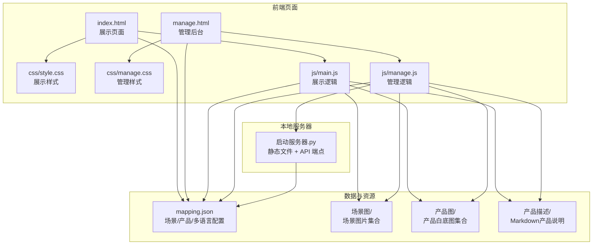
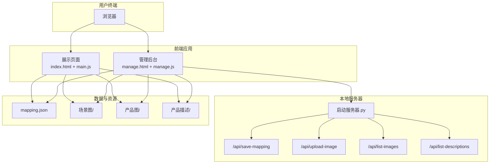
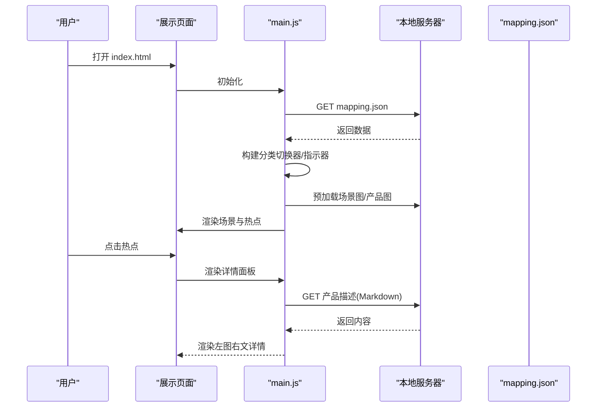
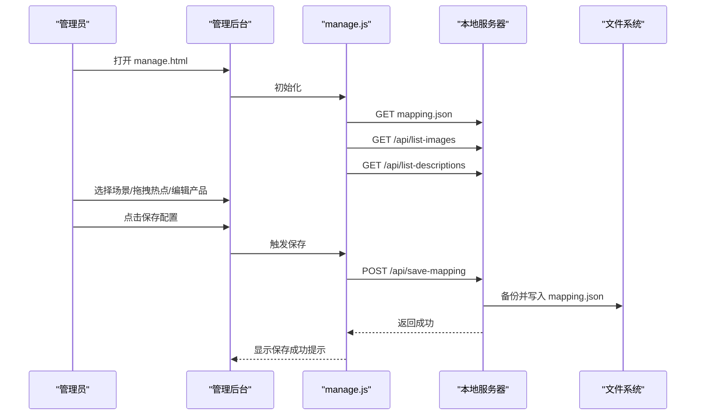
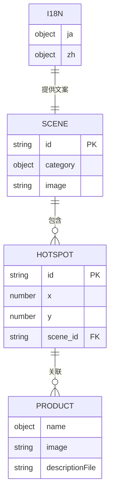
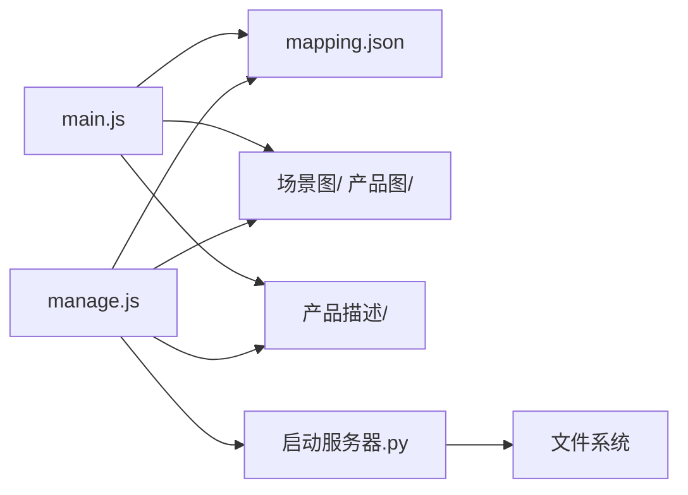

# 项目概述

<cite>
**本文引用的文件**
- [index.html](file://index.html)
- [manage.html](file://manage.html)
- [mapping.json](file://mapping.json)
- [project_architecture.md](file://project_architecture.md)
- [启动服务器.py](file://启动服务器.py)
- [js/main.js](file://js/main.js)
- [js/manage.js](file://js/manage.js)
- [css/style.css](file://css/style.css)
- [css/manage.css](file://css/manage.css)
- [产品描述/室内双面吊装标牌.md](file://产品描述/室内双面吊装标牌.md)
- [产品描述/自助点单机1.md](file://产品描述/自助点单机1.md)
</cite>

## 目录
1. [简介](#简介)
2. [项目结构](#项目结构)
3. [核心组件](#核心组件)
4. [架构总览](#架构总览)
5. [详细组件分析](#详细组件分析)
6. [依赖关系分析](#依赖关系分析)
7. [性能考虑](#性能考虑)
8. [故障排查指南](#故障排查指南)
9. [结论](#结论)
10. [附录](#附录)

## 简介
本项目是专为数字标牌产品打造的场景化展示与管理平台，旨在帮助广告商与装修公司客户直观了解产品在真实商业环境中的应用效果。项目通过“场景图 + 热点 + 产品详情”的交互模式，实现从宏观场景到微观产品的逐层探索；同时提供管理后台，支持可视化编辑场景、热点与产品配置，无需手工维护数据文件。

- **核心定位**：数字标牌产品场景化展示与配置管理
- **主要功能特性**：
  - 场景化浏览：按场景分类快速跳转，脉冲热点引导点击
  - 多产品详情：单热点可关联多个产品，左图右文呈现
  - 双语支持：中日文无缝切换，覆盖界面文案与产品名称
  - 零依赖前端：纯原生实现，易于维护与二次开发
  - 管理后台：可视化编辑场景、热点与产品，支持图片上传与配置保存
- **技术价值**：
  - 数据与逻辑分离：mapping.json 驱动，便于非技术人员维护
  - 体验优化：交叉淡入淡出、骨架屏、错误可重试、首屏独占带宽等
  - 国际化：统一的多语言字典与回退策略，支持未来扩展
- **适用场景**：广告公司方案演示、装修公司方案讲解、产品目录展示、销售培训材料

## 项目结构
项目采用前后端一体化的静态资源组织方式，结合本地开发服务器提供 API 能力，形成“静态页面 + 本地 API”的轻量架构。

**图表来源**
- [index.html](file://index.html)
- [manage.html](file://manage.html)
- [mapping.json](file://mapping.json)
- [启动服务器.py](file://启动服务器.py)

**章节来源**
- [project_architecture.md](file://project_architecture.md)
- [index.html](file://index.html)
- [manage.html](file://manage.html)

## 核心组件
- 展示页面（index.html + main.js + style.css）
  - 场景浏览：双层图片交叉淡入淡出、分类切换器、底部指示器
  - 热点交互：脉冲热点、点击弹窗、多产品详情
  - 多语言：右上语言切换器、UI 文案与产品名称双语
  - 加载体验：骨架屏、加载指示器、错误可重试
- 管理后台（manage.html + manage.js + manage.css）
  - 三栏布局：左栏场景列表、中栏场景编辑、右栏产品编辑
  - 可视化操作：添加/删除场景、拖拽热点、选择图片/描述文件
  - 保存与上传：保存配置、图片上传、文件列表获取
- 数据与资源（mapping.json + 场景图/ + 产品图/ + 产品描述/）
  - mapping.json：版本号、场景数组、热点数组、产品数组、多语言字典
  - 场景图/：按场景分类存放 WebP 图片
  - 产品图/：产品白底图（WebP）
  - 产品描述/：Markdown 文件，用于产品详情渲染
- 本地开发服务器（启动服务器.py）
  - 提供静态文件服务与四个 API 端点：保存配置、上传图片、列出图片、列出描述

**章节来源**
- [index.html](file://index.html)
- [manage.html](file://manage.html)
- [mapping.json](file://mapping.json)
- [启动服务器.py](file://启动服务器.py)
- [css/style.css](file://css/style.css)
- [css/manage.css](file://css/manage.css)
- [js/main.js](file://js/main.js)
- [js/manage.js](file://js/manage.js)

## 架构总览
项目采用“静态页面 + 本地 API + JSON 配置”的轻量架构，前端通过 fetch 与本地服务器通信，实现零依赖、易部署、易维护的目标。

**图表来源**
- [启动服务器.py](file://启动服务器.py)
- [js/main.js](file://js/main.js)
- [js/manage.js](file://js/manage.js)
- [index.html](file://index.html)
- [manage.html](file://manage.html)
- [mapping.json](file://mapping.json)

## 详细组件分析

### 展示页面（index.html + main.js + style.css）
- 页面结构
  - 语言切换器：右上角中日文按钮，支持即时切换
  - 场景容器：双层图片实现交叉淡入淡出
  - 热点容器：脉冲热点，点击弹出产品详情
  - 导航与指示器：左右切换按钮与底部圆点指示器
  - 详情面板：左图右文，支持 Markdown 渲染与骨架屏
- 交互流程
  - 初始化：加载 mapping.json，构建分类切换器与指示器，首屏独占带宽策略
  - 场景切换：淡出热点与切换器，加载新图，交叉淡入淡出，恢复 UI
  - 热点点击：弹出详情面板，加载产品描述 Markdown，支持错误可重试
  - 语言切换：更新标题、按钮、切换器与弹窗内容，保持一致性
- 样式与动画
  - 毛玻璃背景、脉冲热点、骨架屏、加载旋转、错误抖动等动画
  - 对象填充覆盖、首屏优先加载、防抖与状态锁等交互细节

**图表来源**
- [js/main.js](file://js/main.js)
- [启动服务器.py](file://启动服务器.py)
- [index.html](file://index.html)

**章节来源**
- [index.html](file://index.html)
- [css/style.css](file://css/style.css)
- [js/main.js](file://js/main.js)
- [project_architecture.md](file://project_architecture.md)

### 管理后台（manage.html + manage.js + manage.css）
- 页面结构
  - 顶部工具栏：标题、保存按钮、保存状态提示
  - 左栏：场景列表（缩略图 + 分类名 + 删除按钮）
  - 中栏：场景编辑区（分类名输入、场景图更换、热点叠加层）
  - 右栏：产品编辑器（名称/图片/描述字段）
- 交互流程
  - 加载：获取 mapping.json、图片列表、描述列表
  - 编辑：输入分类名、更换场景图、添加/删除热点、拖拽热点
  - 产品：为热点添加多个产品，选择图片与描述文件
  - 保存：POST 保存配置，服务器自动备份并写入新文件
- API 能力
  - 保存配置：/api/save-mapping
  - 上传图片：/api/upload-image（支持场景图与产品图）
  - 列出图片：/api/list-images
  - 列出描述：/api/list-descriptions

**图表来源**
- [js/manage.js](file://js/manage.js)
- [启动服务器.py](file://启动服务器.py)
- [manage.html](file://manage.html)

**章节来源**
- [manage.html](file://manage.html)
- [css/manage.css](file://css/manage.css)
- [js/manage.js](file://js/manage.js)
- [启动服务器.py](file://启动服务器.py)

### 数据模型与配置（mapping.json）
- 版本与结构
  - version：项目版本号（v4.0）
  - scenes：场景数组，每个场景包含 id、category、image、hotspots
  - i18n：多语言字典，包含页面标题、公司名、提示文案等
- 场景与热点
  - 场景：包含分类名（双语）、场景图路径、热点数组
  - 热点：包含 x/y 百分比坐标、产品数组
  - 产品：包含名称（双语）、产品图路径、描述文件路径
- 动态计算
  - 场景分类映射：从 mappingData.scenes 动态计算，支持语言切换
  - 产品名称与描述：getText() 与 t() 统一处理多语言

**图表来源**
- [mapping.json](file://mapping.json)
- [project_architecture.md](file://project_architecture.md)

**章节来源**
- [mapping.json](file://mapping.json)
- [project_architecture.md](file://project_architecture.md)

### 本地开发服务器（启动服务器.py）
- 服务职责
  - 静态文件服务：提供 HTML/CSS/JS/图片/描述等资源
  - API 端点：
    - POST /api/save-mapping：保存 mapping.json（自动备份）
    - POST /api/upload-image：上传图片到指定目录
    - GET /api/list-images：返回场景图与产品图列表
    - GET /api/list-descriptions：返回所有产品描述文件列表
- CORS 与错误处理
  - 设置 CORS 响应头，支持本地开发跨域
  - 对请求体为空、JSON 解析失败、服务器错误等情况返回标准错误响应

**章节来源**
- [启动服务器.py](file://启动服务器.py)

## 依赖关系分析
- 前端依赖
  - 展示页面依赖 mapping.json 与图片资源，通过 fetch 与本地服务器通信
  - 管理后台依赖本地 API，提供可视化编辑能力
- 后端依赖
  - 本地服务器基于 Python 标准库实现，无第三方依赖
- 数据依赖
  - mapping.json 是唯一数据源，管理后台负责写入与备份

**图表来源**
- [js/main.js](file://js/main.js)
- [js/manage.js](file://js/manage.js)
- [启动服务器.py](file://启动服务器.py)
- [mapping.json](file://mapping.json)

**章节来源**
- [js/main.js](file://js/main.js)
- [js/manage.js](file://js/manage.js)
- [启动服务器.py](file://启动服务器.py)

## 性能考虑
- 图片加载策略
  - 首屏独占带宽：首屏图片加载完成后才启动其余图片预加载，避免慢网卡顿
  - 双层交叉淡入淡出：无黑屏过渡，提升视觉连续性
  - 预加载与缓存：统一缓存已加载图片，减少重复请求
- 用户体验
  - 骨架屏：Markdown 加载前显示占位，降低感知延迟
  - 错误可重试：加载失败时显示可点击重试提示
  - 防抖与状态锁：场景切换与弹窗开关过程互斥，避免并发问题
- 动画与渲染
  - CSS 过渡与关键帧动画，尽量使用 GPU 加速属性
  - 脉冲热点动画采用延迟分散，避免视觉拥挤

**章节来源**
- [js/main.js](file://js/main.js)
- [css/style.css](file://css/style.css)
- [project_architecture.md](file://project_architecture.md)

## 故障排查指南
- mapping.json 加载失败
  - 现象：全屏错误遮罩 + 提示“数据加载失败，请刷新页面重试”
  - 处理：检查 mapping.json 语法与路径，确认本地服务器正常运行
- 图片加载失败
  - 现象：场景图或产品图空白或占位
  - 处理：确认图片路径正确，检查本地服务器是否可访问对应资源
- Markdown 描述加载失败
  - 现象：产品详情显示“加载失败，点击重试”
  - 处理：点击重试或检查描述文件是否存在与可访问
- 管理后台保存失败
  - 现象：保存状态显示“保存失败”
  - 处理：检查 /api/save-mapping 返回的错误信息，确认服务器权限与磁盘空间
- 本地服务器无法启动
  - 现象：端口被占用或浏览器无法访问
  - 处理：查看控制台输出的可用端口，确认防火墙与杀毒软件未拦截

**章节来源**
- [js/main.js](file://js/main.js)
- [js/manage.js](file://js/manage.js)
- [启动服务器.py](file://启动服务器.py)

## 结论
本项目通过“场景化展示 + 可视化管理 + 零依赖前端”的组合，实现了数字标牌产品在真实商业环境中的直观呈现与高效配置。v4.0 版本将数据与逻辑分离、引入多语言系统、增强加载与错误处理体验，并提供管理后台以降低维护门槛。项目具备良好的可扩展性与国际化基础，适合在销售演示、方案讲解与产品目录等场景中广泛应用。

## 附录

### 在线预览与基本使用
- 在线预览地址
  - 展示页面：启动本地服务器后访问 http://localhost:8082/index.html
  - 管理后台：http://localhost:8082/manage.html
- 基本使用指南
  - 展示页面：点击脉冲热点查看产品详情，左右切换浏览场景，右上角切换中日文
  - 管理后台：在左栏选择场景，中栏编辑分类名与场景图，右栏为热点添加产品，点击保存配置

**章节来源**
- [project_architecture.md](file://project_architecture.md)

### 版本信息与更新历史
- 项目版本：v4.0
- 更新要点
  - 数据与逻辑分离：mapping.json 替代硬编码 scenes 数组
  - 多语言系统：支持中日文双语切换与统一字典
  - 多热点支持：单场景可配置多个热点与产品
  - 加载与错误处理：重试机制、骨架屏、错误可重试、全屏错误提示
  - 管理后台：可视化编辑、图片上传、文件列表、配置保存

**章节来源**
- [mapping.json](file://mapping.json)
- [project_architecture.md](file://project_architecture.md)

### 技术团队信息
- 项目所有者：杭州海拓商通国际贸易有限公司
- 项目文档与架构说明：project_architecture.md

**章节来源**
- [project_architecture.md](file://project_architecture.md)